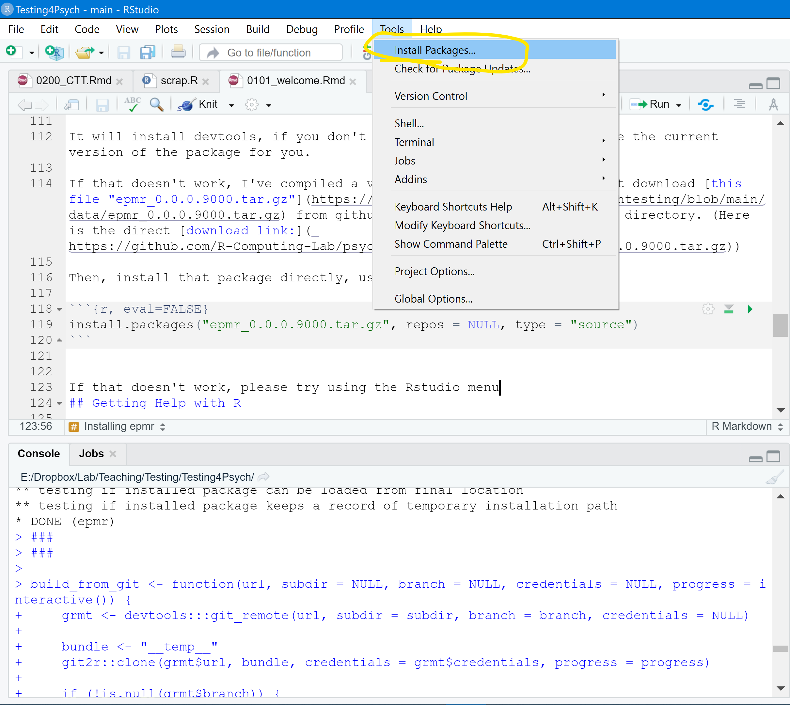
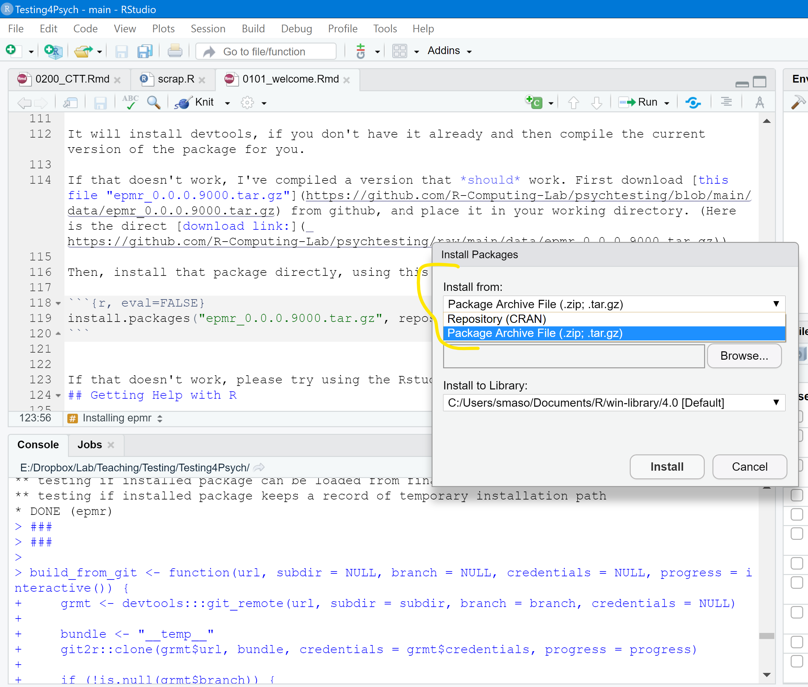
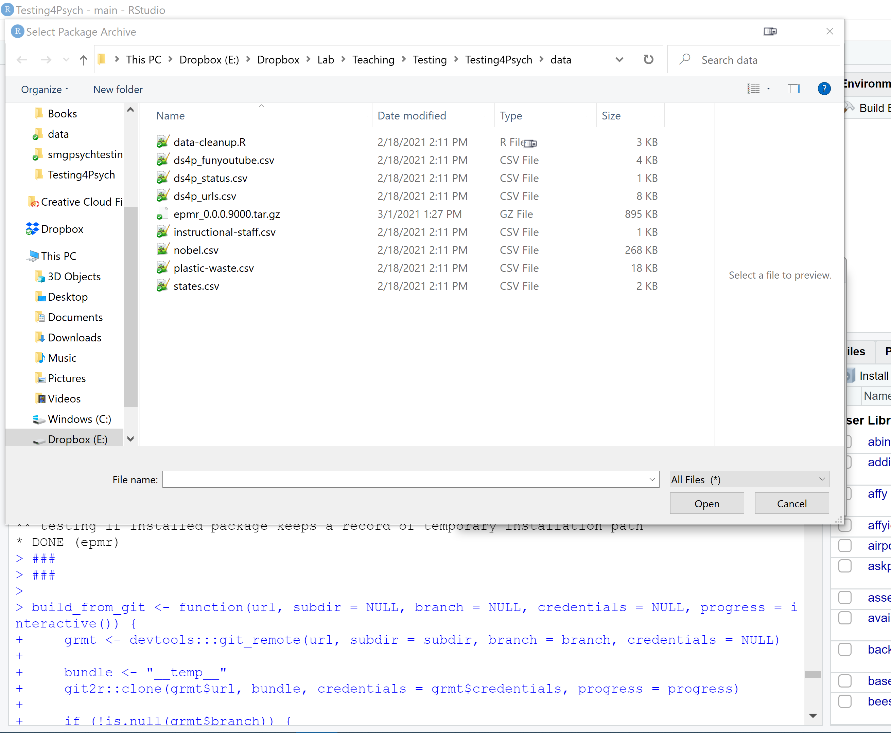
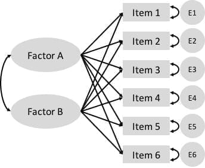

--- 
title: "Psychological Testing"
subtitle: "Course Notes"
author: 
- S. Mason Garrison
date: "2021-05-12"
knit: "bookdown::render_book"
site: bookdown::bookdown_site
url: 'https\://r-computing-lab.github.io/psychtesting'
github-repo: R-Computing-Lab/psychtesting
twitter-handle: smasongarrison
cover-image: assets/logo.png
documentclass: book
bibliography: [book.bib, packages.bib,intro-measurement.bib]
biblio-style: apalike
link-citations: yes
description: "PSY 362: Psychological Testing"
favicon: assets/favicon.ico

---


# (PART\*) Front Matter {-}

# Welcome to PSY 362 {-}


Welcome to class! This website is designed to accompany Mason Garrison's Psychological Testing (Psych Testing). Psych Testing is a undergraduate-level quantitative methods course at Wake Forest University. This website hosts the course notes.  I'm glad you found me and the notes!  They only cover the R aspects of this class. Why are the notes over here? And not on canvas?
Well, that is a good question! Frankly, because this is much much easier for me to create. 
Moreover, if I'm teaching you about R, you might as well learn it using R. What does that mean? 
Well, these notes are written in R (and RMarkdown)! Indeed, this entire website is written in R! 

You can find the current version of the course syllabus [here](https://github.com/smasongarrison/Syllabi/blob/master/syllabus_testing.pdf), along with all of the [other syllabi for my classes]( https://github.com/smasongarrison/Syllabi). You can find the youtube playlist [here](https://www.youtube.com/playlist?list=PLKrrdtYgOUYYgag4erySD7L0jDcZGMlS_)


```{=html}
<div class="vembedr" align="center">
<div>
<iframe src="https://www.youtube.com/embed/UBB34FqGjxU" width="533" height="300" frameborder="0" allowfullscreen=""></iframe>
</div>
</div>
```


# How to use these notes  {-}


<!--DS4P Links-->
[pt4p-web]: https://datascience4psych.github.io/DataScience4Psych
[pt4p-git]: https://github.com/DataScience4Psych/DataScience4Psych
[pt4p-slides]: https://github.com/DataScience4Psych/slides

[pt4p-pl-all]: https://www.youtube.com/playlist?list=PLKrrdtYgOUYbWGmSnbLIYwdLOnGm6une6
[pt4p-pl-00]: https://www.youtube.com/playlist?list=PLKrrdtYgOUYaEAnJX20Ryy4OSie375rVY
[pt4p-pl-01]: https://www.youtube.com/playlist?list=PLKrrdtYgOUYao_7t5ycK4KDXNKaY-ECup
[pt4p-pl-02]: https://www.youtube.com/playlist?list=PLKrrdtYgOUYZmr_T3PnuxjVIlj0C0kUNI
[pt4p-pl-03]: https://www.youtube.com/playlist?list=PLKrrdtYgOUYaHmjzdRvfg0yhOIYQnfjwE
[pt4p-pl-05]: https://www.youtube.com/playlist?list=PLKrrdtYgOUYbfBd4s0i3TzwtHXUxwyswA


<!--R Links-->
[cran]: https://cloud.r-project.org
[cran-faq]: https://cran.r-project.org/faqs.html
[cran-R-admin]: http://cran.r-project.org/doc/manuals/R-admin.html
[cran-add-ons]: https://cran.r-project.org/doc/manuals/R-admin.html#Add_002don-packages
[r-proj]: https://www.r-project.org
[stat-545]: https://stat545.com
[software-carpentry]: https://software-carpentry.org
[cran-r-extensions]: https://cran.r-project.org/doc/manuals/r-release/R-exts.html

<!--RStudio Links-->
[rstudio-preview]: https://www.rstudio.com/products/rstudio/download/preview/
[rstudio-official]: https://www.rstudio.com/products/rstudio/#Desktop
[rstudio-workbench]: https://www.rstudio.com/wp-content/uploads/2014/04/rstudio-workbench.png
[rstudio-support]: https://support.rstudio.com/hc/en-us
[rstudio-R-help]: https://support.rstudio.com/hc/en-us/articles/200552336-Getting-Help-with-R
[rstudio-customizing]: https://support.rstudio.com/hc/en-us/articles/200549016-Customizing-RStudio
[rstudio-key-shortcuts]: https://support.rstudio.com/hc/en-us/articles/200711853-Keyboard-Shortcuts
[rstudio-command-history]: https://support.rstudio.com/hc/en-us/articles/200526217-Command-History
[rstudio-using-projects]: https://support.rstudio.com/hc/en-us/articles/200526207-Using-Projects
[rstudio-code-snippets]: https://support.rstudio.com/hc/en-us/articles/204463668-Code-Snippets
[rstudio-dplyr-cheatsheet-download]: https://github.com/rstudio/cheatsheets/raw/master/data-transformation.pdf
[rstudio-regex-cheatsheet]: https://www.rstudio.com/wp-content/uploads/2016/09/RegExCheatsheet.pdf
[rstudio-devtools]: https://www.rstudio.com/products/rpackages/devtools/

<!--HappyGitWithR Links-->
[happy-git]: https://happygitwithr.com
[hg-install-git]: https://happygitwithr.com/install-git.html
[hg-git-client]: https://happygitwithr.com/git-client.html
[hg-github-account]: https://happygitwithr.com/github-acct.html
[hg-install-r-rstudio]: https://happygitwithr.com/install-r-rstudio.html
[hg-connect-intro]: https://happygitwithr.com/connect-intro.html
[hg-browsability]: https://happygitwithr.com/workflows-browsability.html
[hg-shell]: https://happygitwithr.com/shell.html

<!--Package Links-->
[rmarkdown]: https://rmarkdown.rstudio.com
[knitr-faq]: https://yihui.name/knitr/faq/

[tidyverse-main-page]: https://www.tidyverse.org
[tidyverse-web]: https://tidyverse.tidyverse.org
[tidyverse-github]: https://github.com/hadley/tidyverse

[dplyr-web]: https://dplyr.tidyverse.org
[dplyr-cran]: https://CRAN.R-project.org/package=dplyr
[dplyr-github]: https://github.com/hadley/dplyr
[dplyr-vignette-intro]: https://cran.r-project.org/web/packages/dplyr/vignettes/dplyr.html
[dplyr-vignette-window-fxns]: https://cran.r-project.org/web/packages/dplyr/vignettes/window-functions.html
[dplyr-vignette-two-table]: https://dplyr.tidyverse.org/articles/two-table.html

[lubridate-web]: https://lubridate.tidyverse.org
[lubridate-cran]: https://CRAN.R-project.org/package=lubridate
[lubridate-github]: https://github.com/tidyverse/lubridate
[lubridate-vignette]: https://cran.r-project.org/web/packages/lubridate/vignettes/lubridate.html

[tidyr-web]: https://tidyr.tidyverse.org
[tidyr-cran]: https://CRAN.R-project.org/package=tidyr 

[readr-web]: https://readr.tidyverse.org
[readr-vignette-intro]: https://cran.r-project.org/web/packages/readr/vignettes/readr.html

[stringr-web]: https://stringr.tidyverse.org
[stringr-cran]: https://CRAN.R-project.org/package=stringr

[ggplot2-web]: https://ggplot2.tidyverse.org
[ggplot2-tutorial]: https://github.com/jennybc/ggplot2-tutorial
[ggplot2-reference]: https://docs.ggplot2.org/current/
[ggplot2-cran]: https://CRAN.R-project.org/package=ggplot2
[ggplot2-github]: https://github.com/tidyverse/ggplot2
[ggplot2-theme-args]: https://ggplot2.tidyverse.org/reference/ggtheme.html#arguments

[gapminder-web]: https://www.gapminder.org
[gapminder-cran]: https://CRAN.R-project.org/package=gapminder

[assertthat-cran]: https://CRAN.R-project.org/package=assertthat
[assertthat-github]: https://github.com/hadley/assertthat

[ensurer-cran]: https://CRAN.R-project.org/package=ensurer
[ensurer-github]: https://github.com/smbache/ensurer

[assertr-cran]: https://CRAN.R-project.org/package=assertr
[assertr-github]: https://github.com/ropensci/assertr

[assertive-cran]: https://CRAN.R-project.org/package=assertive
[assertive-bitbucket]: https://bitbucket.org/richierocks/assertive/src/master/

[testthat-cran]: https://CRAN.R-project.org/package=testthat
[testthat-github]: https://github.com/r-lib/testthat
[testthat-web]: https://testthat.r-lib.org

[viridis-cran]: https://CRAN.R-project.org/package=viridis
[viridis-github]: https://github.com/sjmgarnier/viridis
[viridis-vignette]: https://cran.r-project.org/web/packages/viridis/vignettes/intro-to-viridis.html

[colorspace-cran]: https://CRAN.R-project.org/package=colorspace
[colorspace-vignette]: https://cran.r-project.org/web/packages/colorspace/vignettes/hcl-colors.pdf

[cowplot-cran]: https://CRAN.R-project.org/package=cowplot
[cowplot-github]: https://github.com/wilkelab/cowplot
[cowplot-vignette]: https://cran.r-project.org/web/packages/cowplot/vignettes/introduction.html

[devtools-cran]: https://CRAN.R-project.org/package=devtools
[devtools-github]: https://github.com/r-lib/devtools
[devtools-web]: https://devtools.r-lib.org
[devtools-cheatsheet]: https://www.rstudio.com/wp-content/uploads/2015/03/devtools-cheatsheet.pdf
[devtools-cheatsheet-old]: https://rawgit.com/rstudio/cheatsheets/master/package-development.pdf
[devtools-1-6]: https://blog.rstudio.com/2014/10/02/devtools-1-6/
[devtools-1-8]: https://blog.rstudio.com/2015/05/11/devtools-1-9-0/
[devtools-1-9-1]: https://blog.rstudio.com/2015/09/13/devtools-1-9-1/

[googlesheets-cran]: https://CRAN.R-project.org/package=googlesheets
[googlesheets-github]: https://github.com/jennybc/googlesheets

[tidycensus-cran]: https://CRAN.R-project.org/package=tidycensus
[tidycensus-github]: https://github.com/walkerke/tidycensus
[tidycensus-web]: https://walkerke.github.io/tidycensus/index.html

[fs-web]: https://fs.r-lib.org/index.html
[fs-cran]: https://CRAN.R-project.org/package=fs
[fs-github]: https://github.com/r-lib/fs

[plumber-web]: https://www.rplumber.io
[plumber-docs]: https://www.rplumber.io/docs/
[plumber-github]: https://github.com/trestletech/plumber
[plumber-cran]: https://CRAN.R-project.org/package=plumber

[plyr-web]: http://plyr.had.co.nz

[magrittr-web]: https://magrittr.tidyverse.org
[forcats-web]: https://forcats.tidyverse.org
[glue-web]: https://glue.tidyverse.org
[stringi-cran]: https://CRAN.R-project.org/package=stringi
[rex-github]: https://github.com/kevinushey/rex
[rcolorbrewer-cran]: https://CRAN.R-project.org/package=RColorBrewer
[dichromat-cran]: https://CRAN.R-project.org/package=dichromat

[rdryad-web]: https://docs.ropensci.org/rdryad/
[rdryad-cran]: https://CRAN.R-project.org/package=rdryad
[rdryad-github]: https://github.com/ropensci/rdryad

[roxygen2-cran]: https://CRAN.R-project.org/package=roxygen2
[roxygen2-vignette]: https://cran.r-project.org/web/packages/roxygen2/vignettes/rd.html

[shinythemes-web]: https://rstudio.github.io/shinythemes/
[shinythemes-cran]: https://CRAN.R-project.org/package=shinythemes

[shinyjs-web]: https://deanattali.com/shinyjs/
[shinyjs-cran]: https://CRAN.R-project.org/package=shinyjs
[shinyjs-github]: https://github.com/daattali/shinyjs

[leaflet-web]: https://rstudio.github.io/leaflet/
[leaflet-cran]: https://CRAN.R-project.org/package=leaflet
[leaflet-github]: https://github.com/rstudio/leaflet

[ggvis-web]: https://ggvis.rstudio.com
[ggvis-cran]: https://CRAN.R-project.org/package=ggvis
 
[usethis-web]: https://usethis.r-lib.org
[usethis-cran]: https://CRAN.R-project.org/package=usethis
[usethis-github]: https://github.com/r-lib/usethis

[pkgdown-web]: https://pkgdown.r-lib.org
[gh-github]: https://github.com/r-lib/gh

[httr-web]: https://httr.r-lib.org
[httr-cran]: https://CRAN.R-project.org/package=httr
[httr-github]: https://github.com/r-lib/httr

[gistr-web]: https://docs.ropensci.org/gistr
[gistr-cran]: https://CRAN.R-project.org/package=gistr
[gistr-github]: https://github.com/ropensci/gistr

[rvest-web]: https://rvest.tidyverse.org
[rvest-cran]: https://CRAN.R-project.org/package=rvest
[rvest-github]: https://github.com/tidyverse/rvest

[xml2-web]: https://xml2.r-lib.org
[xml2-cran]: https://CRAN.R-project.org/package=xml2
[xml2-github]: https://github.com/r-lib/xml2

[jsonlite-paper]: https://arxiv.org/abs/1403.2805
[jsonlite-cran]: https://CRAN.R-project.org/package=jsonlite
[jsonlite-github]: https://github.com/jeroen/jsonlite

[readxl-web]: https://readxl.tidyverse.org
[readxl-github]: https://github.com/tidyverse/readxl
[readxl-cran]: https://CRAN.R-project.org/package=readxl

[janitor-web]: http://sfirke.github.io/janitor/
[janitor-cran]: https://CRAN.R-project.org/package=janitor
[janitor-github]: https://github.com/sfirke/janitor

[purrr-web]: https://purrr.tidyverse.org
[curl-cran]: https://CRAN.R-project.org/package=curl

<!--Shiny links-->
[shinydashboard-web]: https://rstudio.github.io/shinydashboard/
[shinydashboard-cran]: https://CRAN.R-project.org/package=shinydashboard
[shinydashboard-github]: https://github.com/rstudio/shinydashboard


[shiny-official-web]: https://shiny.rstudio.com
[shiny-official-tutorial]: https://shiny.rstudio.com/tutorial/
[shiny-cheatsheet]: https://shiny.rstudio.com/images/shiny-cheatsheet.pdf
[shiny-articles]: https://shiny.rstudio.com/articles/
[shiny-bookdown]: https://bookdown.org/yihui/rmarkdown/shiny-documents.html
[shiny-google-groups]: https://groups.google.com/forum/#!forum/shiny-discuss
[shiny-stack-overflow]: https://stackoverflow.com/questions/tagged/shiny
[shinyapps-web]: https://www.shinyapps.io
[shiny-server-setup]: https://deanattali.com/2015/05/09/setup-rstudio-shiny-server-digital-ocean/
[shiny-reactivity]: https://shiny.rstudio.com/articles/understanding-reactivity.html
[shiny-debugging]: https://shiny.rstudio.com/articles/debugging.html
[shiny-server]: https://www.rstudio.com/products/shiny/shiny-server/

<!--Publications--> 
[adv-r]: http://adv-r.had.co.nz
[adv-r-fxns]: http://adv-r.had.co.nz/Functions.html
[adv-r-dsl]: http://adv-r.had.co.nz/dsl.html
[adv-r-defensive-programming]: http://adv-r.had.co.nz/Exceptions-Debugging.html#defensive-programming
[adv-r-fxn-args]: http://adv-r.had.co.nz/Functions.html#function-arguments
[adv-r-return-values]: http://adv-r.had.co.nz/Functions.html#return-values
[adv-r-closures]: http://adv-r.had.co.nz/Functional-programming.html#closures

[r4ds]: https://r4ds.had.co.nz
[r4ds-transform]: https://r4ds.had.co.nz/transform.html
[r4ds-strings]: https://r4ds.had.co.nz/strings.html
[r4ds-readr-strings]: https://r4ds.had.co.nz/data-import.html#readr-strings
[r4ds-dates-times]: https://r4ds.had.co.nz/dates-and-times.html
[r4ds-data-import]: http://r4ds.had.co.nz/data-import.html
[r4ds-relational-data]: https://r4ds.had.co.nz/relational-data.html
[r4ds-pepper-shaker]: https://r4ds.had.co.nz/vectors.html#lists-of-condiments

[r-pkgs2]: https://r-pkgs.org/index.html
[r-pkgs2-whole-game]: https://r-pkgs.org/whole-game.html
[r-pkgs2-description]: https://r-pkgs.org/description.html
[r-pkgs2-man]: https://r-pkgs.org/man.htm
[r-pkgs2-tests]: https://r-pkgs.org/tests.html
[r-pkgs2-namespace]: https://r-pkgs.org/namespace.html
[r-pkgs2-vignettes]: https://r-pkgs.org/vignettes.html
[r-pkgs2-release]: https://r-pkgs.org/release.html
[r-pkgs2-r-code]: https://r-pkgs.org/r.html#r

[r-graphics-cookbook]: http://shop.oreilly.com/product/0636920023135.do

[cookbook-for-r]: http://www.cookbook-r.com 
[cookbook-for-r-graphs]: http://www.cookbook-r.com/Graphs/
[cookbook-for-r-multigraphs]: http://www.cookbook-r.com/Graphs/Multiple_graphs_on_one_page_(ggplot2)/

[elegant-graphics-springer]: https://www.springer.com/gp/book/9780387981413

[testthat-article]: https://journal.r-project.org/archive/2011-1/RJournal_2011-1_Wickham.pdf
[worry-about-color]: https://github.com/DataScience4Psych/DataScience4Psych/blob/master/admin/pdfs/Why%20Should%20Engineers%20and%20Scientists%20Be%20Worried%20About%20Color.pdf
[escaping-rgbland-pdf]: https://eeecon.uibk.ac.at/~zeileis/papers/Zeileis+Hornik+Murrell-2009.pdf
[escaping-rgbland-doi]: https://doi.org/10.1016/j.csda.2008.11.033


<!--R Documentation-->
[rdocs-extremes]: https://rdrr.io/r/base/Extremes.html
[rdocs-range]: https://rdrr.io/r/base/range.html
[rdocs-quantile]: https://rdrr.io/r/stats/quantile.html
[rdocs-c]: https://rdrr.io/r/base/c.html
[rdocs-list]: https://rdrr.io/r/base/list.html
[rdocs-lm]: https://rdrr.io/r/stats/lm.html
[rdocs-coef]: https://rdrr.io/r/stats/coef.html
[rdocs-devices]: https://rdrr.io/r/grDevices/Devices.html
[rdocs-ggsave]: https://rdrr.io/cran/ggplot2/man/ggsave.html
[rdocs-dev]: https://rdrr.io/r/grDevices/dev.html


<!--Wikipedia Links-->
[wiki-snake-case]: https://en.wikipedia.org/wiki/Snake_case
[wiki-hello-world]: https://en.wikipedia.org/wiki/%22Hello,_world!%22_program
[wiki-janus]: https://en.wikipedia.org/wiki/Janus
[wiki-nesting-dolls]: https://en.wikipedia.org/wiki/Matryoshka_doll
[wiki-pure-fxns]: https://en.wikipedia.org/wiki/Pure_function
[wiki-camel-case]: https://en.wikipedia.org/wiki/Camel_case
[wiki-mojibake]: https://en.wikipedia.org/wiki/Mojibake
[wiki-row-col-major-order]: https://en.wikipedia.org/wiki/Row-_and_column-major_order
[wiki-boxplot]: https://en.wikipedia.org/wiki/Box_plot
[wiki-brewer]: https://en.wikipedia.org/wiki/Cynthia_Brewer
[wiki-vector-graphics]: https://en.wikipedia.org/wiki/Vector_graphics
[wiki-raster-graphics]: https://en.wikipedia.org/wiki/Raster_graphics
[wiki-dry]: https://en.wikipedia.org/wiki/Don%27t_repeat_yourself
[wiki-web-scraping]: https://en.wikipedia.org/wiki/Web_scraping
[wiki-xpath]: https://en.wikipedia.org/wiki/XPath
[wiki-css-selector]: https://en.wikipedia.org/wiki/Cascading_Style_Sheets#Selector


<!--Misc. Links-->
[split-apply-combine]: https://www.jstatsoft.org/article/view/v040i01
[useR-2014-dropbox]: https://www.dropbox.com/sh/i8qnluwmuieicxc/AAAgt9tIKoIm7WZKIyK25lh6a
[gh-pages]: https://pages.github.com
[html-preview]: http://htmlpreview.github.io
[tj-mahr-slides]: https://github.com/tjmahr/MadR_Pipelines
[dataschool-dplyr]: https://www.dataschool.io/dplyr-tutorial-for-faster-data-manipulation-in-r/
[xckd-randall-munroe]: https://fivethirtyeight.com/features/xkcd-randall-munroe-qanda-what-if/
[athena-zeus-forehead]: https://tinyurl.com/athenaforehead
[tidydata-lotr]: https://github.com/jennybc/lotr-tidy#readme
[minimal-make]: https://kbroman.org/minimal_make/
[write-data-tweet]: https://twitter.com/vsbuffalo/statuses/358699162679787521
[belt-and-suspenders]: https://www.wisegeek.com/what-does-it-mean-to-wear-belt-and-suspenders.htm
[research-workflow]: https://www.carlboettiger.info/2012/05/06/research-workflow.html
[yak-shaving]: https://seths.blog/2005/03/dont_shave_that/
[yaml-with-csv]: https://blog.datacite.org/using-yaml-frontmatter-with-csv/
[reproducible-examples]: https://stackoverflow.com/questions/5963269/how-to-make-a-great-r-reproducible-example
[blog-strings-as-factors]: https://notstatschat.tumblr.com/post/124987394001/stringsasfactors-sigh
[bio-strings-as-factors]: https://simplystatistics.org/2015/07/24/stringsasfactors-an-unauthorized-biography
[stackexchange-outage]: https://stackstatus.net/post/147710624694/outage-postmortem-july-20-2016
[email-regex]: https://emailregex.com
[fix-atom-bug]: https://davidvgalbraith.com/how-i-fixed-atom/
[icu-regex]: http://userguide.icu-project.org/strings/regexp
[regex101]: https://regex101.com
[regexr]: https://regexr.com
[utf8-debug]: http://www.i18nqa.com/debug/utf8-debug.html
[unicode-no-excuses]: https://www.joelonsoftware.com/2003/10/08/the-absolute-minimum-every-software-developer-absolutely-positively-must-know-about-unicode-and-character-sets-no-excuses/
[programmers-encoding]: http://kunststube.net/encoding/
[encoding-probs-ruby]: https://www.justinweiss.com/articles/3-steps-to-fix-encoding-problems-in-ruby/
[theyre-to-theyre]: https://www.justinweiss.com/articles/how-to-get-from-theyre-to-theyre/
[lubridate-ex1]: https://www.r-exercises.com/2016/08/15/dates-and-times-simple-and-easy-with-lubridate-part-1/
[lubridate-ex2]: https://www.r-exercises.com/2016/08/29/dates-and-times-simple-and-easy-with-lubridate-exercises-part-2/
[lubridate-ex3]: https://www.r-exercises.com/2016/10/04/dates-and-times-simple-and-easy-with-lubridate-exercises-part-3/
[google-sql-join]: https://www.google.com/search?q=sql+join&tbm=isch
[min-viable-product]: https://blog.fastmonkeys.com/
[telescope-rule]: http://c2.com/cgi/wiki?TelescopeRule
[unix-philosophy]: http://www.faqs.org/docs/artu/ch01s06.html
[twitter-wrathematics]: https://twitter.com/wrathematics
[robbins-effective-graphs]: https://www.amazon.com/Creating-Effective-Graphs-Naomi-Robbins/dp/0985911123
[r-graph-catalog-github]: https://github.com/jennybc/r-graph-catalog
[google-pie-charts]: https://www.google.com/search?q=pie+charts+suck
[why-pie-charts-suck]: https://www.richardhollins.com/blog/why-pie-charts-suck/
[worst-figure]: https://robjhyndman.com/hyndsight/worst-figure/
[naomi-robbins]: http://www.nbr-graphs.com
[hadley-github-index]: https://hadley.github.io
[scipy-2015-matplotlib-colors]: https://www.youtube.com/watch?v=xAoljeRJ3lU
[winston-chang-github]: https://github.com/wch
[favorite-rgb-color]: https://manyworldstheory.com/2013/01/15/my-favorite-rgb-color/
[stowers-color-chart]: https://web.archive.org/web/20121022044903/http://research.stowers-institute.org/efg/R/Color/Chart/
[stowers-using-color-in-R]: https://www.uv.es/conesa/CursoR/material/UsingColorInR.pdf
[zombie-project]: https://imgur.com/ewmBeQG
[tweet-project-resurfacing]: https://twitter.com/JohnDCook/status/522377493417033728
[rgraphics-looks-tips]: https://blog.revolutionanalytics.com/2009/01/10-tips-for-making-your-r-graphics-look-their-best.html
[rgraphics-svg-tips]: https://blog.revolutionanalytics.com/2011/07/r-svg-graphics.html
[zev-ross-cheatsheet]: http://zevross.com/blog/2014/08/04/beautiful-plotting-in-r-a-ggplot2-cheatsheet-3/
[parker-writing-r-packages]: https://hilaryparker.com/2014/04/29/writing-an-r-package-from-scratch/
[broman-r-packages]: https://kbroman.org/pkg_primer/
[broman-tools4rr]: https://kbroman.org/Tools4RR/
[leeks-r-packages]: https://github.com/jtleek/rpackages
[build-maintain-r-packages]: https://thepoliticalmethodologist.com/2014/08/14/building-and-maintaining-r-packages-with-devtools-and-roxygen2/
[murdoch-package-vignette-slides]: https://web.archive.org/web/20160824010213/http://www.stats.uwo.ca/faculty/murdoch/ism2013/5Vignettes.pdf
[how-r-searches]: http://blog.obeautifulcode.com/R/How-R-Searches-And-Finds-Stuff/


This document is broken down into multiple chapters. Use the table of contents on the left side of the screen to navigate, and use the hamburger icon (horizontal bars) at the top of the document to open or close the table of contents. At the top of the document, you'll see additional icons which you can click to search the document, change the size, font or color scheme of the page. The document will be updated (unpredictably) throughout the semester.

Every module corresponds to a weeks worth of material. Most modules are dedicated to improving a specific skill or at the very least dedicated to a specific theme. Within each module, there are embedded videos, slides, activities, labs, and tutorials. The skills developed in each module build upon skills you've developed in previous modules. 

Although these notes share some of the features of a textbook, they are neither comprehensive nor completely original. The main purpose is to give you all a set of common materials on which to draw during the course. In class, we will sometimes do things outside the notes. The idea here is that you will read the materials and try to learn from them, just as you will attend classes and try to learn from them.

<!--chapter:end:index.Rmd-->


<!--DS4P Links-->
[pt4p-web]: https://datascience4psych.github.io/DataScience4Psych
[pt4p-git]: https://github.com/DataScience4Psych/DataScience4Psych
[pt4p-slides]: https://github.com/DataScience4Psych/slides

[pt4p-pl-all]: https://www.youtube.com/playlist?list=PLKrrdtYgOUYbWGmSnbLIYwdLOnGm6une6
[pt4p-pl-00]: https://www.youtube.com/playlist?list=PLKrrdtYgOUYaEAnJX20Ryy4OSie375rVY
[pt4p-pl-01]: https://www.youtube.com/playlist?list=PLKrrdtYgOUYao_7t5ycK4KDXNKaY-ECup
[pt4p-pl-02]: https://www.youtube.com/playlist?list=PLKrrdtYgOUYZmr_T3PnuxjVIlj0C0kUNI
[pt4p-pl-03]: https://www.youtube.com/playlist?list=PLKrrdtYgOUYaHmjzdRvfg0yhOIYQnfjwE
[pt4p-pl-05]: https://www.youtube.com/playlist?list=PLKrrdtYgOUYbfBd4s0i3TzwtHXUxwyswA


<!--R Links-->
[cran]: https://cloud.r-project.org
[cran-faq]: https://cran.r-project.org/faqs.html
[cran-R-admin]: http://cran.r-project.org/doc/manuals/R-admin.html
[cran-add-ons]: https://cran.r-project.org/doc/manuals/R-admin.html#Add_002don-packages
[r-proj]: https://www.r-project.org
[stat-545]: https://stat545.com
[software-carpentry]: https://software-carpentry.org
[cran-r-extensions]: https://cran.r-project.org/doc/manuals/r-release/R-exts.html

<!--RStudio Links-->
[rstudio-preview]: https://www.rstudio.com/products/rstudio/download/preview/
[rstudio-official]: https://www.rstudio.com/products/rstudio/#Desktop
[rstudio-workbench]: https://www.rstudio.com/wp-content/uploads/2014/04/rstudio-workbench.png
[rstudio-support]: https://support.rstudio.com/hc/en-us
[rstudio-R-help]: https://support.rstudio.com/hc/en-us/articles/200552336-Getting-Help-with-R
[rstudio-customizing]: https://support.rstudio.com/hc/en-us/articles/200549016-Customizing-RStudio
[rstudio-key-shortcuts]: https://support.rstudio.com/hc/en-us/articles/200711853-Keyboard-Shortcuts
[rstudio-command-history]: https://support.rstudio.com/hc/en-us/articles/200526217-Command-History
[rstudio-using-projects]: https://support.rstudio.com/hc/en-us/articles/200526207-Using-Projects
[rstudio-code-snippets]: https://support.rstudio.com/hc/en-us/articles/204463668-Code-Snippets
[rstudio-dplyr-cheatsheet-download]: https://github.com/rstudio/cheatsheets/raw/master/data-transformation.pdf
[rstudio-regex-cheatsheet]: https://www.rstudio.com/wp-content/uploads/2016/09/RegExCheatsheet.pdf
[rstudio-devtools]: https://www.rstudio.com/products/rpackages/devtools/

<!--HappyGitWithR Links-->
[happy-git]: https://happygitwithr.com
[hg-install-git]: https://happygitwithr.com/install-git.html
[hg-git-client]: https://happygitwithr.com/git-client.html
[hg-github-account]: https://happygitwithr.com/github-acct.html
[hg-install-r-rstudio]: https://happygitwithr.com/install-r-rstudio.html
[hg-connect-intro]: https://happygitwithr.com/connect-intro.html
[hg-browsability]: https://happygitwithr.com/workflows-browsability.html
[hg-shell]: https://happygitwithr.com/shell.html

<!--Package Links-->
[rmarkdown]: https://rmarkdown.rstudio.com
[knitr-faq]: https://yihui.name/knitr/faq/

[tidyverse-main-page]: https://www.tidyverse.org
[tidyverse-web]: https://tidyverse.tidyverse.org
[tidyverse-github]: https://github.com/hadley/tidyverse

[dplyr-web]: https://dplyr.tidyverse.org
[dplyr-cran]: https://CRAN.R-project.org/package=dplyr
[dplyr-github]: https://github.com/hadley/dplyr
[dplyr-vignette-intro]: https://cran.r-project.org/web/packages/dplyr/vignettes/dplyr.html
[dplyr-vignette-window-fxns]: https://cran.r-project.org/web/packages/dplyr/vignettes/window-functions.html
[dplyr-vignette-two-table]: https://dplyr.tidyverse.org/articles/two-table.html

[lubridate-web]: https://lubridate.tidyverse.org
[lubridate-cran]: https://CRAN.R-project.org/package=lubridate
[lubridate-github]: https://github.com/tidyverse/lubridate
[lubridate-vignette]: https://cran.r-project.org/web/packages/lubridate/vignettes/lubridate.html

[tidyr-web]: https://tidyr.tidyverse.org
[tidyr-cran]: https://CRAN.R-project.org/package=tidyr 

[readr-web]: https://readr.tidyverse.org
[readr-vignette-intro]: https://cran.r-project.org/web/packages/readr/vignettes/readr.html

[stringr-web]: https://stringr.tidyverse.org
[stringr-cran]: https://CRAN.R-project.org/package=stringr

[ggplot2-web]: https://ggplot2.tidyverse.org
[ggplot2-tutorial]: https://github.com/jennybc/ggplot2-tutorial
[ggplot2-reference]: https://docs.ggplot2.org/current/
[ggplot2-cran]: https://CRAN.R-project.org/package=ggplot2
[ggplot2-github]: https://github.com/tidyverse/ggplot2
[ggplot2-theme-args]: https://ggplot2.tidyverse.org/reference/ggtheme.html#arguments

[gapminder-web]: https://www.gapminder.org
[gapminder-cran]: https://CRAN.R-project.org/package=gapminder

[assertthat-cran]: https://CRAN.R-project.org/package=assertthat
[assertthat-github]: https://github.com/hadley/assertthat

[ensurer-cran]: https://CRAN.R-project.org/package=ensurer
[ensurer-github]: https://github.com/smbache/ensurer

[assertr-cran]: https://CRAN.R-project.org/package=assertr
[assertr-github]: https://github.com/ropensci/assertr

[assertive-cran]: https://CRAN.R-project.org/package=assertive
[assertive-bitbucket]: https://bitbucket.org/richierocks/assertive/src/master/

[testthat-cran]: https://CRAN.R-project.org/package=testthat
[testthat-github]: https://github.com/r-lib/testthat
[testthat-web]: https://testthat.r-lib.org

[viridis-cran]: https://CRAN.R-project.org/package=viridis
[viridis-github]: https://github.com/sjmgarnier/viridis
[viridis-vignette]: https://cran.r-project.org/web/packages/viridis/vignettes/intro-to-viridis.html

[colorspace-cran]: https://CRAN.R-project.org/package=colorspace
[colorspace-vignette]: https://cran.r-project.org/web/packages/colorspace/vignettes/hcl-colors.pdf

[cowplot-cran]: https://CRAN.R-project.org/package=cowplot
[cowplot-github]: https://github.com/wilkelab/cowplot
[cowplot-vignette]: https://cran.r-project.org/web/packages/cowplot/vignettes/introduction.html

[devtools-cran]: https://CRAN.R-project.org/package=devtools
[devtools-github]: https://github.com/r-lib/devtools
[devtools-web]: https://devtools.r-lib.org
[devtools-cheatsheet]: https://www.rstudio.com/wp-content/uploads/2015/03/devtools-cheatsheet.pdf
[devtools-cheatsheet-old]: https://rawgit.com/rstudio/cheatsheets/master/package-development.pdf
[devtools-1-6]: https://blog.rstudio.com/2014/10/02/devtools-1-6/
[devtools-1-8]: https://blog.rstudio.com/2015/05/11/devtools-1-9-0/
[devtools-1-9-1]: https://blog.rstudio.com/2015/09/13/devtools-1-9-1/

[googlesheets-cran]: https://CRAN.R-project.org/package=googlesheets
[googlesheets-github]: https://github.com/jennybc/googlesheets

[tidycensus-cran]: https://CRAN.R-project.org/package=tidycensus
[tidycensus-github]: https://github.com/walkerke/tidycensus
[tidycensus-web]: https://walkerke.github.io/tidycensus/index.html

[fs-web]: https://fs.r-lib.org/index.html
[fs-cran]: https://CRAN.R-project.org/package=fs
[fs-github]: https://github.com/r-lib/fs

[plumber-web]: https://www.rplumber.io
[plumber-docs]: https://www.rplumber.io/docs/
[plumber-github]: https://github.com/trestletech/plumber
[plumber-cran]: https://CRAN.R-project.org/package=plumber

[plyr-web]: http://plyr.had.co.nz

[magrittr-web]: https://magrittr.tidyverse.org
[forcats-web]: https://forcats.tidyverse.org
[glue-web]: https://glue.tidyverse.org
[stringi-cran]: https://CRAN.R-project.org/package=stringi
[rex-github]: https://github.com/kevinushey/rex
[rcolorbrewer-cran]: https://CRAN.R-project.org/package=RColorBrewer
[dichromat-cran]: https://CRAN.R-project.org/package=dichromat

[rdryad-web]: https://docs.ropensci.org/rdryad/
[rdryad-cran]: https://CRAN.R-project.org/package=rdryad
[rdryad-github]: https://github.com/ropensci/rdryad

[roxygen2-cran]: https://CRAN.R-project.org/package=roxygen2
[roxygen2-vignette]: https://cran.r-project.org/web/packages/roxygen2/vignettes/rd.html

[shinythemes-web]: https://rstudio.github.io/shinythemes/
[shinythemes-cran]: https://CRAN.R-project.org/package=shinythemes

[shinyjs-web]: https://deanattali.com/shinyjs/
[shinyjs-cran]: https://CRAN.R-project.org/package=shinyjs
[shinyjs-github]: https://github.com/daattali/shinyjs

[leaflet-web]: https://rstudio.github.io/leaflet/
[leaflet-cran]: https://CRAN.R-project.org/package=leaflet
[leaflet-github]: https://github.com/rstudio/leaflet

[ggvis-web]: https://ggvis.rstudio.com
[ggvis-cran]: https://CRAN.R-project.org/package=ggvis
 
[usethis-web]: https://usethis.r-lib.org
[usethis-cran]: https://CRAN.R-project.org/package=usethis
[usethis-github]: https://github.com/r-lib/usethis

[pkgdown-web]: https://pkgdown.r-lib.org
[gh-github]: https://github.com/r-lib/gh

[httr-web]: https://httr.r-lib.org
[httr-cran]: https://CRAN.R-project.org/package=httr
[httr-github]: https://github.com/r-lib/httr

[gistr-web]: https://docs.ropensci.org/gistr
[gistr-cran]: https://CRAN.R-project.org/package=gistr
[gistr-github]: https://github.com/ropensci/gistr

[rvest-web]: https://rvest.tidyverse.org
[rvest-cran]: https://CRAN.R-project.org/package=rvest
[rvest-github]: https://github.com/tidyverse/rvest

[xml2-web]: https://xml2.r-lib.org
[xml2-cran]: https://CRAN.R-project.org/package=xml2
[xml2-github]: https://github.com/r-lib/xml2

[jsonlite-paper]: https://arxiv.org/abs/1403.2805
[jsonlite-cran]: https://CRAN.R-project.org/package=jsonlite
[jsonlite-github]: https://github.com/jeroen/jsonlite

[readxl-web]: https://readxl.tidyverse.org
[readxl-github]: https://github.com/tidyverse/readxl
[readxl-cran]: https://CRAN.R-project.org/package=readxl

[janitor-web]: http://sfirke.github.io/janitor/
[janitor-cran]: https://CRAN.R-project.org/package=janitor
[janitor-github]: https://github.com/sfirke/janitor

[purrr-web]: https://purrr.tidyverse.org
[curl-cran]: https://CRAN.R-project.org/package=curl

<!--Shiny links-->
[shinydashboard-web]: https://rstudio.github.io/shinydashboard/
[shinydashboard-cran]: https://CRAN.R-project.org/package=shinydashboard
[shinydashboard-github]: https://github.com/rstudio/shinydashboard


[shiny-official-web]: https://shiny.rstudio.com
[shiny-official-tutorial]: https://shiny.rstudio.com/tutorial/
[shiny-cheatsheet]: https://shiny.rstudio.com/images/shiny-cheatsheet.pdf
[shiny-articles]: https://shiny.rstudio.com/articles/
[shiny-bookdown]: https://bookdown.org/yihui/rmarkdown/shiny-documents.html
[shiny-google-groups]: https://groups.google.com/forum/#!forum/shiny-discuss
[shiny-stack-overflow]: https://stackoverflow.com/questions/tagged/shiny
[shinyapps-web]: https://www.shinyapps.io
[shiny-server-setup]: https://deanattali.com/2015/05/09/setup-rstudio-shiny-server-digital-ocean/
[shiny-reactivity]: https://shiny.rstudio.com/articles/understanding-reactivity.html
[shiny-debugging]: https://shiny.rstudio.com/articles/debugging.html
[shiny-server]: https://www.rstudio.com/products/shiny/shiny-server/

<!--Publications--> 
[adv-r]: http://adv-r.had.co.nz
[adv-r-fxns]: http://adv-r.had.co.nz/Functions.html
[adv-r-dsl]: http://adv-r.had.co.nz/dsl.html
[adv-r-defensive-programming]: http://adv-r.had.co.nz/Exceptions-Debugging.html#defensive-programming
[adv-r-fxn-args]: http://adv-r.had.co.nz/Functions.html#function-arguments
[adv-r-return-values]: http://adv-r.had.co.nz/Functions.html#return-values
[adv-r-closures]: http://adv-r.had.co.nz/Functional-programming.html#closures

[r4ds]: https://r4ds.had.co.nz
[r4ds-transform]: https://r4ds.had.co.nz/transform.html
[r4ds-strings]: https://r4ds.had.co.nz/strings.html
[r4ds-readr-strings]: https://r4ds.had.co.nz/data-import.html#readr-strings
[r4ds-dates-times]: https://r4ds.had.co.nz/dates-and-times.html
[r4ds-data-import]: http://r4ds.had.co.nz/data-import.html
[r4ds-relational-data]: https://r4ds.had.co.nz/relational-data.html
[r4ds-pepper-shaker]: https://r4ds.had.co.nz/vectors.html#lists-of-condiments

[r-pkgs2]: https://r-pkgs.org/index.html
[r-pkgs2-whole-game]: https://r-pkgs.org/whole-game.html
[r-pkgs2-description]: https://r-pkgs.org/description.html
[r-pkgs2-man]: https://r-pkgs.org/man.htm
[r-pkgs2-tests]: https://r-pkgs.org/tests.html
[r-pkgs2-namespace]: https://r-pkgs.org/namespace.html
[r-pkgs2-vignettes]: https://r-pkgs.org/vignettes.html
[r-pkgs2-release]: https://r-pkgs.org/release.html
[r-pkgs2-r-code]: https://r-pkgs.org/r.html#r

[r-graphics-cookbook]: http://shop.oreilly.com/product/0636920023135.do

[cookbook-for-r]: http://www.cookbook-r.com 
[cookbook-for-r-graphs]: http://www.cookbook-r.com/Graphs/
[cookbook-for-r-multigraphs]: http://www.cookbook-r.com/Graphs/Multiple_graphs_on_one_page_(ggplot2)/

[elegant-graphics-springer]: https://www.springer.com/gp/book/9780387981413

[testthat-article]: https://journal.r-project.org/archive/2011-1/RJournal_2011-1_Wickham.pdf
[worry-about-color]: https://github.com/DataScience4Psych/DataScience4Psych/blob/master/admin/pdfs/Why%20Should%20Engineers%20and%20Scientists%20Be%20Worried%20About%20Color.pdf
[escaping-rgbland-pdf]: https://eeecon.uibk.ac.at/~zeileis/papers/Zeileis+Hornik+Murrell-2009.pdf
[escaping-rgbland-doi]: https://doi.org/10.1016/j.csda.2008.11.033


<!--R Documentation-->
[rdocs-extremes]: https://rdrr.io/r/base/Extremes.html
[rdocs-range]: https://rdrr.io/r/base/range.html
[rdocs-quantile]: https://rdrr.io/r/stats/quantile.html
[rdocs-c]: https://rdrr.io/r/base/c.html
[rdocs-list]: https://rdrr.io/r/base/list.html
[rdocs-lm]: https://rdrr.io/r/stats/lm.html
[rdocs-coef]: https://rdrr.io/r/stats/coef.html
[rdocs-devices]: https://rdrr.io/r/grDevices/Devices.html
[rdocs-ggsave]: https://rdrr.io/cran/ggplot2/man/ggsave.html
[rdocs-dev]: https://rdrr.io/r/grDevices/dev.html


<!--Wikipedia Links-->
[wiki-snake-case]: https://en.wikipedia.org/wiki/Snake_case
[wiki-hello-world]: https://en.wikipedia.org/wiki/%22Hello,_world!%22_program
[wiki-janus]: https://en.wikipedia.org/wiki/Janus
[wiki-nesting-dolls]: https://en.wikipedia.org/wiki/Matryoshka_doll
[wiki-pure-fxns]: https://en.wikipedia.org/wiki/Pure_function
[wiki-camel-case]: https://en.wikipedia.org/wiki/Camel_case
[wiki-mojibake]: https://en.wikipedia.org/wiki/Mojibake
[wiki-row-col-major-order]: https://en.wikipedia.org/wiki/Row-_and_column-major_order
[wiki-boxplot]: https://en.wikipedia.org/wiki/Box_plot
[wiki-brewer]: https://en.wikipedia.org/wiki/Cynthia_Brewer
[wiki-vector-graphics]: https://en.wikipedia.org/wiki/Vector_graphics
[wiki-raster-graphics]: https://en.wikipedia.org/wiki/Raster_graphics
[wiki-dry]: https://en.wikipedia.org/wiki/Don%27t_repeat_yourself
[wiki-web-scraping]: https://en.wikipedia.org/wiki/Web_scraping
[wiki-xpath]: https://en.wikipedia.org/wiki/XPath
[wiki-css-selector]: https://en.wikipedia.org/wiki/Cascading_Style_Sheets#Selector


<!--Misc. Links-->
[split-apply-combine]: https://www.jstatsoft.org/article/view/v040i01
[useR-2014-dropbox]: https://www.dropbox.com/sh/i8qnluwmuieicxc/AAAgt9tIKoIm7WZKIyK25lh6a
[gh-pages]: https://pages.github.com
[html-preview]: http://htmlpreview.github.io
[tj-mahr-slides]: https://github.com/tjmahr/MadR_Pipelines
[dataschool-dplyr]: https://www.dataschool.io/dplyr-tutorial-for-faster-data-manipulation-in-r/
[xckd-randall-munroe]: https://fivethirtyeight.com/features/xkcd-randall-munroe-qanda-what-if/
[athena-zeus-forehead]: https://tinyurl.com/athenaforehead
[tidydata-lotr]: https://github.com/jennybc/lotr-tidy#readme
[minimal-make]: https://kbroman.org/minimal_make/
[write-data-tweet]: https://twitter.com/vsbuffalo/statuses/358699162679787521
[belt-and-suspenders]: https://www.wisegeek.com/what-does-it-mean-to-wear-belt-and-suspenders.htm
[research-workflow]: https://www.carlboettiger.info/2012/05/06/research-workflow.html
[yak-shaving]: https://seths.blog/2005/03/dont_shave_that/
[yaml-with-csv]: https://blog.datacite.org/using-yaml-frontmatter-with-csv/
[reproducible-examples]: https://stackoverflow.com/questions/5963269/how-to-make-a-great-r-reproducible-example
[blog-strings-as-factors]: https://notstatschat.tumblr.com/post/124987394001/stringsasfactors-sigh
[bio-strings-as-factors]: https://simplystatistics.org/2015/07/24/stringsasfactors-an-unauthorized-biography
[stackexchange-outage]: https://stackstatus.net/post/147710624694/outage-postmortem-july-20-2016
[email-regex]: https://emailregex.com
[fix-atom-bug]: https://davidvgalbraith.com/how-i-fixed-atom/
[icu-regex]: http://userguide.icu-project.org/strings/regexp
[regex101]: https://regex101.com
[regexr]: https://regexr.com
[utf8-debug]: http://www.i18nqa.com/debug/utf8-debug.html
[unicode-no-excuses]: https://www.joelonsoftware.com/2003/10/08/the-absolute-minimum-every-software-developer-absolutely-positively-must-know-about-unicode-and-character-sets-no-excuses/
[programmers-encoding]: http://kunststube.net/encoding/
[encoding-probs-ruby]: https://www.justinweiss.com/articles/3-steps-to-fix-encoding-problems-in-ruby/
[theyre-to-theyre]: https://www.justinweiss.com/articles/how-to-get-from-theyre-to-theyre/
[lubridate-ex1]: https://www.r-exercises.com/2016/08/15/dates-and-times-simple-and-easy-with-lubridate-part-1/
[lubridate-ex2]: https://www.r-exercises.com/2016/08/29/dates-and-times-simple-and-easy-with-lubridate-exercises-part-2/
[lubridate-ex3]: https://www.r-exercises.com/2016/10/04/dates-and-times-simple-and-easy-with-lubridate-exercises-part-3/
[google-sql-join]: https://www.google.com/search?q=sql+join&tbm=isch
[min-viable-product]: https://blog.fastmonkeys.com/
[telescope-rule]: http://c2.com/cgi/wiki?TelescopeRule
[unix-philosophy]: http://www.faqs.org/docs/artu/ch01s06.html
[twitter-wrathematics]: https://twitter.com/wrathematics
[robbins-effective-graphs]: https://www.amazon.com/Creating-Effective-Graphs-Naomi-Robbins/dp/0985911123
[r-graph-catalog-github]: https://github.com/jennybc/r-graph-catalog
[google-pie-charts]: https://www.google.com/search?q=pie+charts+suck
[why-pie-charts-suck]: https://www.richardhollins.com/blog/why-pie-charts-suck/
[worst-figure]: https://robjhyndman.com/hyndsight/worst-figure/
[naomi-robbins]: http://www.nbr-graphs.com
[hadley-github-index]: https://hadley.github.io
[scipy-2015-matplotlib-colors]: https://www.youtube.com/watch?v=xAoljeRJ3lU
[winston-chang-github]: https://github.com/wch
[favorite-rgb-color]: https://manyworldstheory.com/2013/01/15/my-favorite-rgb-color/
[stowers-color-chart]: https://web.archive.org/web/20121022044903/http://research.stowers-institute.org/efg/R/Color/Chart/
[stowers-using-color-in-R]: https://www.uv.es/conesa/CursoR/material/UsingColorInR.pdf
[zombie-project]: https://imgur.com/ewmBeQG
[tweet-project-resurfacing]: https://twitter.com/JohnDCook/status/522377493417033728
[rgraphics-looks-tips]: https://blog.revolutionanalytics.com/2009/01/10-tips-for-making-your-r-graphics-look-their-best.html
[rgraphics-svg-tips]: https://blog.revolutionanalytics.com/2011/07/r-svg-graphics.html
[zev-ross-cheatsheet]: http://zevross.com/blog/2014/08/04/beautiful-plotting-in-r-a-ggplot2-cheatsheet-3/
[parker-writing-r-packages]: https://hilaryparker.com/2014/04/29/writing-an-r-package-from-scratch/
[broman-r-packages]: https://kbroman.org/pkg_primer/
[broman-tools4rr]: https://kbroman.org/Tools4RR/
[leeks-r-packages]: https://github.com/jtleek/rpackages
[build-maintain-r-packages]: https://thepoliticalmethodologist.com/2014/08/14/building-and-maintaining-r-packages-with-devtools-and-roxygen2/
[murdoch-package-vignette-slides]: https://web.archive.org/web/20160824010213/http://www.stats.uwo.ca/faculty/murdoch/ism2013/5Vignettes.pdf
[how-r-searches]: http://blog.obeautifulcode.com/R/How-R-Searches-And-Finds-Stuff/


# Attribution {-}
This class leans heavily on other peoples' materials and ideas. I have done my best to document the origin of the materials and ideas. In particular, I have noted those people whose work has been a major contribution as well as those who have additional contributions. You can see specific changes by examining the [edit history on the git repo](https://github.com/R-Computing-Lab/psychtesting/commits/main)

## Major & Additional Attributions  {-}


* Jenny Bryan's ([jennybryan.org](https://jennybryan.org)) [STAT 545][stat-545].
* Anthony Albano's [Course Notes on "Introduction to Educational and Psychological Measurement"](https://www.thetaminusb.com/intro-measurement-r/)
* Bill Revelle's ["An introduction to psychometric theory with applications in R"](https://www.personality-project.org/r/book/)

# License {-#license}

This work is licensed under a [Creative Commons Attribution-ShareAlike 4.0 International License](https://creativecommons.org/licenses/by-sa/4.0/).

<center>
<i class="fab fa-creative-commons fa-2x"></i><i class="fab fa-creative-commons-by fa-2x"></i><i class="fab fa-creative-commons-sa fa-2x"></i>
</center>

*This is a human-readable summary of (and not a substitute for) the license.
Please see <https://creativecommons.org/licenses/by-sa/4.0/legalcode> for the full legal text.*

**You are free to:**

- **Share**---copy and redistribute the material in any medium or
  format

- **Remix**---remix, transform, and build upon the material for any
  purpose, even commercially.

The licensor cannot revoke these freedoms as long as you follow the
license terms.

**Under the following terms:**

- **Attribution**---You must give appropriate credit, provide a link
  to the license, and indicate if changes were made. You may do so in
  any reasonable manner, but not in any way that suggests the licensor
  endorses you or your use.
  
- **ShareAlike**---If you remix, transform, or build upon the material, you must distribute your contributions under the same license as the original. 

- **No additional restrictions**---You may not apply legal terms or
  technological measures that legally restrict others from doing
  anything the license permits.

**Notices:**

You do not have to comply with the license for elements of the
material in the public domain or where your use is permitted by an
applicable exception or limitation.

No warranties are given. The license may not give you all of the
permissions necessary for your intended use. For example, other rights
such as publicity, privacy, or moral rights may limit how you use the
material.


# Colophon {-}

This book was written in [bookdown](http://bookdown.org/) inside [RStudio](http://www.rstudio.com/ide/). The [website](https://r-computing-lab.github.io/psychtesting/) is hosted with [github](https://www.github.com), The complete source is available from [GitHub](https://github.com/R-Computing-Lab/psychtesting).

The book style was designed by [Desirée De Leon](https://desiree.rbind.io/).

This version of the book was built with:


```
#> Finding R package dependencies ... Done!
#>  setting  value                       
#>  version  R version 4.0.5 (2021-03-31)
#>  os       Windows 10 x64              
#>  system   x86_64, mingw32             
#>  ui       RTerm                       
#>  language (EN)                        
#>  collate  English_United States.1252  
#>  ctype    English_United States.1252  
#>  tz       America/New_York            
#>  date     2021-05-12
```

Along with these packages:


```{=html}
<div id="htmlwidget-0d29532fb821c29079a9" style="width:100%;height:auto;" class="datatables html-widget"></div>
<script type="application/json" data-for="htmlwidget-0d29532fb821c29079a9">{"x":{"filter":"top","filterHTML":"<tr>\n  <td data-type=\"character\" style=\"vertical-align: top;\">\n    <div class=\"form-group has-feedback\" style=\"margin-bottom: auto;\">\n      <input type=\"search\" placeholder=\"All\" class=\"form-control\" style=\"width: 100%;\"/>\n      <span class=\"glyphicon glyphicon-remove-circle form-control-feedback\"><\/span>\n    <\/div>\n  <\/td>\n  <td data-type=\"character\" style=\"vertical-align: top;\">\n    <div class=\"form-group has-feedback\" style=\"margin-bottom: auto;\">\n      <input type=\"search\" placeholder=\"All\" class=\"form-control\" style=\"width: 100%;\"/>\n      <span class=\"glyphicon glyphicon-remove-circle form-control-feedback\"><\/span>\n    <\/div>\n  <\/td>\n  <td data-type=\"character\" style=\"vertical-align: top;\">\n    <div class=\"form-group has-feedback\" style=\"margin-bottom: auto;\">\n      <input type=\"search\" placeholder=\"All\" class=\"form-control\" style=\"width: 100%;\"/>\n      <span class=\"glyphicon glyphicon-remove-circle form-control-feedback\"><\/span>\n    <\/div>\n  <\/td>\n  <td data-type=\"character\" style=\"vertical-align: top;\">\n    <div class=\"form-group has-feedback\" style=\"margin-bottom: auto;\">\n      <input type=\"search\" placeholder=\"All\" class=\"form-control\" style=\"width: 100%;\"/>\n      <span class=\"glyphicon glyphicon-remove-circle form-control-feedback\"><\/span>\n    <\/div>\n  <\/td>\n<\/tr>","data":[["askpass","assertthat","backports","base64enc","BH","blob","bookdown","brew","brio","broom","cachem","callr","cellranger","checkmate","cli","clipr","colorspace","commonmark","conflicted","cpp11","crayon","credentials","crosstalk","crul","curl","data.table","DBI","dbplyr","desc","devtools","dichromat","diffobj","digest","dplyr","DT","dtplyr","ellipsis","evaluate","fansi","farver","fastmap","forcats","fs","gapminder","gargle","gender","genderdata","generics","geonames","gert","ggplot2","gh","gitcreds","glue","googledrive","googlesheets4","gridExtra","gt","gtable","haven","highr","hms","htmltools","htmlwidgets","httpcode","httr","ids","ini","isoband","jsonlite","knitr","labeling","later","lattice","lazyeval","lifecycle","lubridate","magrittr","markdown","MASS","Matrix","memoise","mgcv","mime","modelr","munsell","nlme","openssl","pillar","pkgbuild","pkgconfig","pkgload","plyr","praise","prettyunits","processx","progress","promises","ps","purrr","R6","rappdirs","rcmdcheck","RColorBrewer","Rcpp","readr","readxl","rebird","rematch","rematch2","remotes","reprex","reshape2","rjson","rlang","rmarkdown","roxygen2","rplos","rprojroot","rstudioapi","rversions","rvest","sass","scales","selectr","sessioninfo","solrium","stringi","stringr","sys","testthat","tibble","tidyr","tidyselect","tidyverse","tinytex","triebeard","urltools","usethis","utf8","uuid","vctrs","viridis","viridisLite","waldo","whisker","withr","xfun","xml2","xopen","yaml","zip"],[null,"0.2.1","1.2.1",null,null,null,"0.22",null,null,"0.7.6","1.0.4","3.7.0","1.1.0",null,"2.5.0",null,"2.0-0",null,null,null,"1.4.1",null,null,null,null,null,"1.1.1","2.1.1","1.3.0","2.4.1",null,null,"0.6.27","1.0.5","0.18",null,"0.3.2","0.14","0.4.2",null,"1.1.0","0.5.1","1.5.0",null,null,null,null,"0.1.0",null,null,"3.3.3",null,null,"1.4.2",null,null,null,null,"0.3.0","2.4.1",null,"1.0.0","0.5.1.1","1.5.3",null,"1.4.2",null,null,null,"1.7.2","1.33",null,null,null,null,"1.0.0","1.7.10","2.0.1",null,null,null,"2.0.0",null,null,"0.1.8","0.5.0",null,null,"1.6.0","1.2.0","2.0.3","1.2.1",null,null,"1.1.1","3.5.2",null,null,"1.6.0","0.3.4","2.5.0",null,null,null,"1.0.6","1.4.0","1.3.1",null,null,null,"2.3.0","2.0.0",null,null,"0.4.10","2.8",null,null,"2.0.2","0.13",null,"1.0.0","0.3.1","1.1.1",null,"1.1.1",null,"1.5.3","1.4.0",null,"3.0.2","3.1.1","1.1.3","1.1.1","1.3.1",null,null,null,"2.0.1","1.2.1",null,"0.3.8",null,null,null,null,"2.4.2","0.22","1.3.2",null,"2.2.1",null],["2019-01-13","2019-03-21","2020-12-09","2015-07-28","2021-01-11","2020-01-20","2021-04-22","2011-04-13","2021-04-23","2021-04-05","2021-02-13","2021-04-20","2016-07-27","2020-02-06","2021-04-26","2020-10-08","2020-11-11","2018-12-01","2019-06-21","2021-03-29","2021-02-08","2020-07-21","2021-01-12","2021-02-15","2021-04-30","2021-02-21","2021-01-15","2021-04-06","2021-03-05","2021-05-05","2013-01-24","2021-03-22","2020-10-24","2021-03-05","2021-04-14","2021-02-20","2021-04-29","2019-05-28","2021-01-15","2021-02-28","2021-01-25","2021-01-27","2020-07-31","2017-10-31","2021-04-02","2020-05-15","2020-11-17","2020-10-31","2019-02-19","2021-03-29","2020-12-30","2021-04-30","2020-12-04","2020-08-27","2020-05-05","2021-03-04","2017-09-09","2020-08-05","2019-03-25","2021-04-23","2021-04-16","2021-01-13","2021-01-22","2020-12-10","2020-04-10","2020-07-20","2017-05-31","2018-05-20","2021-03-03","2020-12-09","2021-04-24","2020-10-20","2021-04-23","2020-04-02","2019-03-15","2021-02-15","2021-02-26","2020-11-17","2019-08-07","2021-02-12","2021-01-06","2021-01-26","2021-02-16","2021-02-13","2020-05-19","2018-06-12","2021-02-04","2021-04-30","2021-04-13","2020-12-15","2019-09-22","2021-04-06","2020-03-03","2015-08-11","2020-01-24","2021-04-30","2019-05-16","2021-02-11","2021-02-28","2020-04-17","2020-10-28","2021-01-31","2019-05-07","2014-12-07","2021-01-15","2020-10-05","2019-03-13","2021-01-27","2016-04-21","2020-05-01","2021-04-01","2021-04-02","2020-04-09","2018-06-08","2020-12-30","2021-05-07","2020-06-27","2021-02-23","2020-11-15","2020-11-12","2020-05-25","2021-03-09","2021-01-24","2020-05-11","2019-11-20","2018-11-05","2019-11-02","2020-09-09","2019-02-10","2020-07-23","2021-02-14","2021-04-18","2021-03-03","2021-04-30","2021-04-15","2021-03-30","2016-08-04","2019-04-14","2021-02-10","2021-03-12","2020-02-26","2021-04-29","2021-04-15","2021-04-13","2021-03-08","2019-08-28","2021-04-18","2021-03-11","2020-04-23","2018-09-17","2020-02-01","2020-08-27"],["CRAN (R 4.0.0)","CRAN (R 4.0.0)","CRAN (R 4.0.3)","CRAN (R 4.0.0)","CRAN (R 4.0.3)","CRAN (R 4.0.2)","CRAN (R 4.0.5)","CRAN (R 4.0.0)","CRAN (R 4.0.5)","CRAN (R 4.0.5)","CRAN (R 4.0.3)","CRAN (R 4.0.5)","CRAN (R 4.0.0)","CRAN (R 4.0.2)","CRAN (R 4.0.5)","CRAN (R 4.0.3)","CRAN (R 4.0.5)","CRAN (R 4.0.0)","CRAN (R 4.0.3)","CRAN (R 4.0.4)","CRAN (R 4.0.3)","CRAN (R 4.0.3)","CRAN (R 4.0.3)","CRAN (R 4.0.4)","CRAN (R 4.0.5)","CRAN (R 4.0.4)","CRAN (R 4.0.3)","CRAN (R 4.0.5)","CRAN (R 4.0.4)","CRAN (R 4.0.5)","CRAN (R 4.0.3)","CRAN (R 4.0.4)","CRAN (R 4.0.3)","CRAN (R 4.0.5)","CRAN (R 4.0.5)","CRAN (R 4.0.5)","CRAN (R 4.0.5)","CRAN (R 4.0.0)","CRAN (R 4.0.3)","CRAN (R 4.0.4)","CRAN (R 4.0.3)","CRAN (R 4.0.3)","CRAN (R 4.0.2)","CRAN (R 4.0.3)","CRAN (R 4.0.5)","CRAN (R 4.0.3)","local","CRAN (R 4.0.3)","CRAN (R 4.0.3)","CRAN (R 4.0.4)","CRAN (R 4.0.3)","CRAN (R 4.0.5)","CRAN (R 4.0.3)","CRAN (R 4.0.2)","CRAN (R 4.0.5)","CRAN (R 4.0.5)","CRAN (R 4.0.3)","CRAN (R 4.0.3)","CRAN (R 4.0.0)","CRAN (R 4.0.5)","CRAN (R 4.0.5)","CRAN (R 4.0.3)","CRAN (R 4.0.3)","CRAN (R 4.0.3)","CRAN (R 4.0.3)","CRAN (R 4.0.3)","CRAN (R 4.0.5)","CRAN (R 4.0.2)","CRAN (R 4.0.4)","CRAN (R 4.0.3)","CRAN (R 4.0.5)","CRAN (R 4.0.3)","CRAN (R 4.0.5)","CRAN (R 4.0.5)","CRAN (R 4.0.2)","CRAN (R 4.0.4)","CRAN (R 4.0.4)","CRAN (R 4.0.3)","CRAN (R 4.0.0)","CRAN (R 4.0.5)","CRAN (R 4.0.5)","CRAN (R 4.0.3)","CRAN (R 4.0.5)","CRAN (R 4.0.3)","CRAN (R 4.0.2)","CRAN (R 4.0.0)","CRAN (R 4.0.5)","CRAN (R 4.0.5)","CRAN (R 4.0.5)","CRAN (R 4.0.3)","CRAN (R 4.0.0)","CRAN (R 4.0.5)","CRAN (R 4.0.0)","CRAN (R 4.0.0)","CRAN (R 4.0.0)","CRAN (R 4.0.5)","CRAN (R 4.0.0)","CRAN (R 4.0.3)","CRAN (R 4.0.4)","CRAN (R 4.0.0)","CRAN (R 4.0.3)","CRAN (R 4.0.3)","CRAN (R 4.0.2)","CRAN (R 4.0.3)","CRAN (R 4.0.3)","CRAN (R 4.0.3)","CRAN (R 4.0.0)","CRAN (R 4.0.3)","CRAN (R 4.0.0)","CRAN (R 4.0.2)","CRAN (R 4.0.5)","CRAN (R 4.0.5)","CRAN (R 4.0.3)","CRAN (R 4.0.3)","CRAN (R 4.0.3)","CRAN (R 4.0.5)","CRAN (R 4.0.2)","CRAN (R 4.0.4)","CRAN (R 4.0.3)","CRAN (R 4.0.3)","CRAN (R 4.0.2)","CRAN (R 4.0.4)","CRAN (R 4.0.3)","CRAN (R 4.0.0)","CRAN (R 4.0.0)","CRAN (R 4.0.2)","CRAN (R 4.0.3)","CRAN (R 4.0.2)","CRAN (R 4.0.0)","CRAN (R 4.0.2)","CRAN (R 4.0.4)","CRAN (R 4.0.5)","CRAN (R 4.0.4)","CRAN (R 4.0.5)","CRAN (R 4.0.5)","CRAN (R 4.0.4)","CRAN (R 4.0.3)","CRAN (R 4.0.3)","CRAN (R 4.0.3)","CRAN (R 4.0.4)","CRAN (R 4.0.3)","CRAN (R 4.0.5)","CRAN (R 4.0.5)","CRAN (R 4.0.5)","CRAN (R 4.0.4)","CRAN (R 4.0.0)","CRAN (R 4.0.5)","CRAN (R 4.0.4)","CRAN (R 4.0.3)","CRAN (R 4.0.2)","CRAN (R 4.0.0)","CRAN (R 4.0.3)"]],"container":"<table class=\"cell-border stripe\">\n  <thead>\n    <tr>\n      <th>package<\/th>\n      <th>loadedversion<\/th>\n      <th>date<\/th>\n      <th>source<\/th>\n    <\/tr>\n  <\/thead>\n<\/table>","options":{"pageLength":152,"autoWidth":true,"bInfo":false,"paging":false,"order":[],"orderClasses":false,"orderCellsTop":true,"lengthMenu":[10,25,50,100,152]}},"evals":[],"jsHooks":[]}</script>
```


<!--chapter:end:0000a_front.Rmd-->


# Public Health Dashboards {-}

Ok, so I know that this class is about testing, measurement, and R... However, I figured that it might be helpful for us all to have some public health dashboards in one easy place. If you want, we can pretend that this section is course content related...

## Wake Forest {-}

The embedded dashboards are maintained by Wake Forest University and are made using [Microsoft Power BI](https://powerbi.microsoft.com/en-us/what-is-power-bi/). More info about the dashboard can be found here [here](https://ourwayforward.wfu.edu/covid-19-dashboard)

<br>

<iframe src="https://ourwayforward.wfu.edu/covid-19-dashboard/#powerbi-embedded-1946"  scrolling="no" style="width: 100%; height:775px"></iframe>


##  Forsyth County {-}

The embedded maps are maintained by Forsyth County's department of public health. More info [here]( https://www.co.forsyth.nc.us/covidupdate/)

### Vaccinations {-}

<iframe src="https://mapf.maps.arcgis.com/apps/opsdashboard/index.html#/80838562a4c64050abf201c0e8beb441" style="width:100%;height:600px"></iframe>

### Case Counts {-}

<iframe src="https://mapf.maps.arcgis.com/apps/opsdashboard/index.html#/2a7cc9a3b6a842228f489c080c48ccc6" style="width:100%;height:600px"></iframe>


## North Carolina {-}

<iframe src="https://mapf.maps.arcgis.com/apps/opsdashboard/index.html#/926f40a0fb9d43729fbc0f42f0f5a940" style="width:100%;height:600px"></iframe>


<br>

<iframe title="covid-19 nc county alert system" aria-label="Map" id="datawrapper-chart-rc1kL" src="https://datawrapper.dwcdn.net/rc1kL/2/" scrolling="no" frameborder="0" style="width: 0px; border: none; min-width: 100% !important; height: 408px;" height="437"></iframe>

<!--chapter:end:0000b_publichealth.Rmd-->

# (PART) Module 05 {-}


<!--DS4P Links-->
[pt4p-web]: https://datascience4psych.github.io/DataScience4Psych
[pt4p-git]: https://github.com/DataScience4Psych/DataScience4Psych
[pt4p-slides]: https://github.com/DataScience4Psych/slides

[pt4p-pl-all]: https://www.youtube.com/playlist?list=PLKrrdtYgOUYbWGmSnbLIYwdLOnGm6une6
[pt4p-pl-00]: https://www.youtube.com/playlist?list=PLKrrdtYgOUYaEAnJX20Ryy4OSie375rVY
[pt4p-pl-01]: https://www.youtube.com/playlist?list=PLKrrdtYgOUYao_7t5ycK4KDXNKaY-ECup
[pt4p-pl-02]: https://www.youtube.com/playlist?list=PLKrrdtYgOUYZmr_T3PnuxjVIlj0C0kUNI
[pt4p-pl-03]: https://www.youtube.com/playlist?list=PLKrrdtYgOUYaHmjzdRvfg0yhOIYQnfjwE
[pt4p-pl-05]: https://www.youtube.com/playlist?list=PLKrrdtYgOUYbfBd4s0i3TzwtHXUxwyswA


<!--R Links-->
[cran]: https://cloud.r-project.org
[cran-faq]: https://cran.r-project.org/faqs.html
[cran-R-admin]: http://cran.r-project.org/doc/manuals/R-admin.html
[cran-add-ons]: https://cran.r-project.org/doc/manuals/R-admin.html#Add_002don-packages
[r-proj]: https://www.r-project.org
[stat-545]: https://stat545.com
[software-carpentry]: https://software-carpentry.org
[cran-r-extensions]: https://cran.r-project.org/doc/manuals/r-release/R-exts.html

<!--RStudio Links-->
[rstudio-preview]: https://www.rstudio.com/products/rstudio/download/preview/
[rstudio-official]: https://www.rstudio.com/products/rstudio/#Desktop
[rstudio-workbench]: https://www.rstudio.com/wp-content/uploads/2014/04/rstudio-workbench.png
[rstudio-support]: https://support.rstudio.com/hc/en-us
[rstudio-R-help]: https://support.rstudio.com/hc/en-us/articles/200552336-Getting-Help-with-R
[rstudio-customizing]: https://support.rstudio.com/hc/en-us/articles/200549016-Customizing-RStudio
[rstudio-key-shortcuts]: https://support.rstudio.com/hc/en-us/articles/200711853-Keyboard-Shortcuts
[rstudio-command-history]: https://support.rstudio.com/hc/en-us/articles/200526217-Command-History
[rstudio-using-projects]: https://support.rstudio.com/hc/en-us/articles/200526207-Using-Projects
[rstudio-code-snippets]: https://support.rstudio.com/hc/en-us/articles/204463668-Code-Snippets
[rstudio-dplyr-cheatsheet-download]: https://github.com/rstudio/cheatsheets/raw/master/data-transformation.pdf
[rstudio-regex-cheatsheet]: https://www.rstudio.com/wp-content/uploads/2016/09/RegExCheatsheet.pdf
[rstudio-devtools]: https://www.rstudio.com/products/rpackages/devtools/

<!--HappyGitWithR Links-->
[happy-git]: https://happygitwithr.com
[hg-install-git]: https://happygitwithr.com/install-git.html
[hg-git-client]: https://happygitwithr.com/git-client.html
[hg-github-account]: https://happygitwithr.com/github-acct.html
[hg-install-r-rstudio]: https://happygitwithr.com/install-r-rstudio.html
[hg-connect-intro]: https://happygitwithr.com/connect-intro.html
[hg-browsability]: https://happygitwithr.com/workflows-browsability.html
[hg-shell]: https://happygitwithr.com/shell.html

<!--Package Links-->
[rmarkdown]: https://rmarkdown.rstudio.com
[knitr-faq]: https://yihui.name/knitr/faq/

[tidyverse-main-page]: https://www.tidyverse.org
[tidyverse-web]: https://tidyverse.tidyverse.org
[tidyverse-github]: https://github.com/hadley/tidyverse

[dplyr-web]: https://dplyr.tidyverse.org
[dplyr-cran]: https://CRAN.R-project.org/package=dplyr
[dplyr-github]: https://github.com/hadley/dplyr
[dplyr-vignette-intro]: https://cran.r-project.org/web/packages/dplyr/vignettes/dplyr.html
[dplyr-vignette-window-fxns]: https://cran.r-project.org/web/packages/dplyr/vignettes/window-functions.html
[dplyr-vignette-two-table]: https://dplyr.tidyverse.org/articles/two-table.html

[lubridate-web]: https://lubridate.tidyverse.org
[lubridate-cran]: https://CRAN.R-project.org/package=lubridate
[lubridate-github]: https://github.com/tidyverse/lubridate
[lubridate-vignette]: https://cran.r-project.org/web/packages/lubridate/vignettes/lubridate.html

[tidyr-web]: https://tidyr.tidyverse.org
[tidyr-cran]: https://CRAN.R-project.org/package=tidyr 

[readr-web]: https://readr.tidyverse.org
[readr-vignette-intro]: https://cran.r-project.org/web/packages/readr/vignettes/readr.html

[stringr-web]: https://stringr.tidyverse.org
[stringr-cran]: https://CRAN.R-project.org/package=stringr

[ggplot2-web]: https://ggplot2.tidyverse.org
[ggplot2-tutorial]: https://github.com/jennybc/ggplot2-tutorial
[ggplot2-reference]: https://docs.ggplot2.org/current/
[ggplot2-cran]: https://CRAN.R-project.org/package=ggplot2
[ggplot2-github]: https://github.com/tidyverse/ggplot2
[ggplot2-theme-args]: https://ggplot2.tidyverse.org/reference/ggtheme.html#arguments

[gapminder-web]: https://www.gapminder.org
[gapminder-cran]: https://CRAN.R-project.org/package=gapminder

[assertthat-cran]: https://CRAN.R-project.org/package=assertthat
[assertthat-github]: https://github.com/hadley/assertthat

[ensurer-cran]: https://CRAN.R-project.org/package=ensurer
[ensurer-github]: https://github.com/smbache/ensurer

[assertr-cran]: https://CRAN.R-project.org/package=assertr
[assertr-github]: https://github.com/ropensci/assertr

[assertive-cran]: https://CRAN.R-project.org/package=assertive
[assertive-bitbucket]: https://bitbucket.org/richierocks/assertive/src/master/

[testthat-cran]: https://CRAN.R-project.org/package=testthat
[testthat-github]: https://github.com/r-lib/testthat
[testthat-web]: https://testthat.r-lib.org

[viridis-cran]: https://CRAN.R-project.org/package=viridis
[viridis-github]: https://github.com/sjmgarnier/viridis
[viridis-vignette]: https://cran.r-project.org/web/packages/viridis/vignettes/intro-to-viridis.html

[colorspace-cran]: https://CRAN.R-project.org/package=colorspace
[colorspace-vignette]: https://cran.r-project.org/web/packages/colorspace/vignettes/hcl-colors.pdf

[cowplot-cran]: https://CRAN.R-project.org/package=cowplot
[cowplot-github]: https://github.com/wilkelab/cowplot
[cowplot-vignette]: https://cran.r-project.org/web/packages/cowplot/vignettes/introduction.html

[devtools-cran]: https://CRAN.R-project.org/package=devtools
[devtools-github]: https://github.com/r-lib/devtools
[devtools-web]: https://devtools.r-lib.org
[devtools-cheatsheet]: https://www.rstudio.com/wp-content/uploads/2015/03/devtools-cheatsheet.pdf
[devtools-cheatsheet-old]: https://rawgit.com/rstudio/cheatsheets/master/package-development.pdf
[devtools-1-6]: https://blog.rstudio.com/2014/10/02/devtools-1-6/
[devtools-1-8]: https://blog.rstudio.com/2015/05/11/devtools-1-9-0/
[devtools-1-9-1]: https://blog.rstudio.com/2015/09/13/devtools-1-9-1/

[googlesheets-cran]: https://CRAN.R-project.org/package=googlesheets
[googlesheets-github]: https://github.com/jennybc/googlesheets

[tidycensus-cran]: https://CRAN.R-project.org/package=tidycensus
[tidycensus-github]: https://github.com/walkerke/tidycensus
[tidycensus-web]: https://walkerke.github.io/tidycensus/index.html

[fs-web]: https://fs.r-lib.org/index.html
[fs-cran]: https://CRAN.R-project.org/package=fs
[fs-github]: https://github.com/r-lib/fs

[plumber-web]: https://www.rplumber.io
[plumber-docs]: https://www.rplumber.io/docs/
[plumber-github]: https://github.com/trestletech/plumber
[plumber-cran]: https://CRAN.R-project.org/package=plumber

[plyr-web]: http://plyr.had.co.nz

[magrittr-web]: https://magrittr.tidyverse.org
[forcats-web]: https://forcats.tidyverse.org
[glue-web]: https://glue.tidyverse.org
[stringi-cran]: https://CRAN.R-project.org/package=stringi
[rex-github]: https://github.com/kevinushey/rex
[rcolorbrewer-cran]: https://CRAN.R-project.org/package=RColorBrewer
[dichromat-cran]: https://CRAN.R-project.org/package=dichromat

[rdryad-web]: https://docs.ropensci.org/rdryad/
[rdryad-cran]: https://CRAN.R-project.org/package=rdryad
[rdryad-github]: https://github.com/ropensci/rdryad

[roxygen2-cran]: https://CRAN.R-project.org/package=roxygen2
[roxygen2-vignette]: https://cran.r-project.org/web/packages/roxygen2/vignettes/rd.html

[shinythemes-web]: https://rstudio.github.io/shinythemes/
[shinythemes-cran]: https://CRAN.R-project.org/package=shinythemes

[shinyjs-web]: https://deanattali.com/shinyjs/
[shinyjs-cran]: https://CRAN.R-project.org/package=shinyjs
[shinyjs-github]: https://github.com/daattali/shinyjs

[leaflet-web]: https://rstudio.github.io/leaflet/
[leaflet-cran]: https://CRAN.R-project.org/package=leaflet
[leaflet-github]: https://github.com/rstudio/leaflet

[ggvis-web]: https://ggvis.rstudio.com
[ggvis-cran]: https://CRAN.R-project.org/package=ggvis
 
[usethis-web]: https://usethis.r-lib.org
[usethis-cran]: https://CRAN.R-project.org/package=usethis
[usethis-github]: https://github.com/r-lib/usethis

[pkgdown-web]: https://pkgdown.r-lib.org
[gh-github]: https://github.com/r-lib/gh

[httr-web]: https://httr.r-lib.org
[httr-cran]: https://CRAN.R-project.org/package=httr
[httr-github]: https://github.com/r-lib/httr

[gistr-web]: https://docs.ropensci.org/gistr
[gistr-cran]: https://CRAN.R-project.org/package=gistr
[gistr-github]: https://github.com/ropensci/gistr

[rvest-web]: https://rvest.tidyverse.org
[rvest-cran]: https://CRAN.R-project.org/package=rvest
[rvest-github]: https://github.com/tidyverse/rvest

[xml2-web]: https://xml2.r-lib.org
[xml2-cran]: https://CRAN.R-project.org/package=xml2
[xml2-github]: https://github.com/r-lib/xml2

[jsonlite-paper]: https://arxiv.org/abs/1403.2805
[jsonlite-cran]: https://CRAN.R-project.org/package=jsonlite
[jsonlite-github]: https://github.com/jeroen/jsonlite

[readxl-web]: https://readxl.tidyverse.org
[readxl-github]: https://github.com/tidyverse/readxl
[readxl-cran]: https://CRAN.R-project.org/package=readxl

[janitor-web]: http://sfirke.github.io/janitor/
[janitor-cran]: https://CRAN.R-project.org/package=janitor
[janitor-github]: https://github.com/sfirke/janitor

[purrr-web]: https://purrr.tidyverse.org
[curl-cran]: https://CRAN.R-project.org/package=curl

<!--Shiny links-->
[shinydashboard-web]: https://rstudio.github.io/shinydashboard/
[shinydashboard-cran]: https://CRAN.R-project.org/package=shinydashboard
[shinydashboard-github]: https://github.com/rstudio/shinydashboard


[shiny-official-web]: https://shiny.rstudio.com
[shiny-official-tutorial]: https://shiny.rstudio.com/tutorial/
[shiny-cheatsheet]: https://shiny.rstudio.com/images/shiny-cheatsheet.pdf
[shiny-articles]: https://shiny.rstudio.com/articles/
[shiny-bookdown]: https://bookdown.org/yihui/rmarkdown/shiny-documents.html
[shiny-google-groups]: https://groups.google.com/forum/#!forum/shiny-discuss
[shiny-stack-overflow]: https://stackoverflow.com/questions/tagged/shiny
[shinyapps-web]: https://www.shinyapps.io
[shiny-server-setup]: https://deanattali.com/2015/05/09/setup-rstudio-shiny-server-digital-ocean/
[shiny-reactivity]: https://shiny.rstudio.com/articles/understanding-reactivity.html
[shiny-debugging]: https://shiny.rstudio.com/articles/debugging.html
[shiny-server]: https://www.rstudio.com/products/shiny/shiny-server/

<!--Publications--> 
[adv-r]: http://adv-r.had.co.nz
[adv-r-fxns]: http://adv-r.had.co.nz/Functions.html
[adv-r-dsl]: http://adv-r.had.co.nz/dsl.html
[adv-r-defensive-programming]: http://adv-r.had.co.nz/Exceptions-Debugging.html#defensive-programming
[adv-r-fxn-args]: http://adv-r.had.co.nz/Functions.html#function-arguments
[adv-r-return-values]: http://adv-r.had.co.nz/Functions.html#return-values
[adv-r-closures]: http://adv-r.had.co.nz/Functional-programming.html#closures

[r4ds]: https://r4ds.had.co.nz
[r4ds-transform]: https://r4ds.had.co.nz/transform.html
[r4ds-strings]: https://r4ds.had.co.nz/strings.html
[r4ds-readr-strings]: https://r4ds.had.co.nz/data-import.html#readr-strings
[r4ds-dates-times]: https://r4ds.had.co.nz/dates-and-times.html
[r4ds-data-import]: http://r4ds.had.co.nz/data-import.html
[r4ds-relational-data]: https://r4ds.had.co.nz/relational-data.html
[r4ds-pepper-shaker]: https://r4ds.had.co.nz/vectors.html#lists-of-condiments

[r-pkgs2]: https://r-pkgs.org/index.html
[r-pkgs2-whole-game]: https://r-pkgs.org/whole-game.html
[r-pkgs2-description]: https://r-pkgs.org/description.html
[r-pkgs2-man]: https://r-pkgs.org/man.htm
[r-pkgs2-tests]: https://r-pkgs.org/tests.html
[r-pkgs2-namespace]: https://r-pkgs.org/namespace.html
[r-pkgs2-vignettes]: https://r-pkgs.org/vignettes.html
[r-pkgs2-release]: https://r-pkgs.org/release.html
[r-pkgs2-r-code]: https://r-pkgs.org/r.html#r

[r-graphics-cookbook]: http://shop.oreilly.com/product/0636920023135.do

[cookbook-for-r]: http://www.cookbook-r.com 
[cookbook-for-r-graphs]: http://www.cookbook-r.com/Graphs/
[cookbook-for-r-multigraphs]: http://www.cookbook-r.com/Graphs/Multiple_graphs_on_one_page_(ggplot2)/

[elegant-graphics-springer]: https://www.springer.com/gp/book/9780387981413

[testthat-article]: https://journal.r-project.org/archive/2011-1/RJournal_2011-1_Wickham.pdf
[worry-about-color]: https://github.com/DataScience4Psych/DataScience4Psych/blob/master/admin/pdfs/Why%20Should%20Engineers%20and%20Scientists%20Be%20Worried%20About%20Color.pdf
[escaping-rgbland-pdf]: https://eeecon.uibk.ac.at/~zeileis/papers/Zeileis+Hornik+Murrell-2009.pdf
[escaping-rgbland-doi]: https://doi.org/10.1016/j.csda.2008.11.033


<!--R Documentation-->
[rdocs-extremes]: https://rdrr.io/r/base/Extremes.html
[rdocs-range]: https://rdrr.io/r/base/range.html
[rdocs-quantile]: https://rdrr.io/r/stats/quantile.html
[rdocs-c]: https://rdrr.io/r/base/c.html
[rdocs-list]: https://rdrr.io/r/base/list.html
[rdocs-lm]: https://rdrr.io/r/stats/lm.html
[rdocs-coef]: https://rdrr.io/r/stats/coef.html
[rdocs-devices]: https://rdrr.io/r/grDevices/Devices.html
[rdocs-ggsave]: https://rdrr.io/cran/ggplot2/man/ggsave.html
[rdocs-dev]: https://rdrr.io/r/grDevices/dev.html


<!--Wikipedia Links-->
[wiki-snake-case]: https://en.wikipedia.org/wiki/Snake_case
[wiki-hello-world]: https://en.wikipedia.org/wiki/%22Hello,_world!%22_program
[wiki-janus]: https://en.wikipedia.org/wiki/Janus
[wiki-nesting-dolls]: https://en.wikipedia.org/wiki/Matryoshka_doll
[wiki-pure-fxns]: https://en.wikipedia.org/wiki/Pure_function
[wiki-camel-case]: https://en.wikipedia.org/wiki/Camel_case
[wiki-mojibake]: https://en.wikipedia.org/wiki/Mojibake
[wiki-row-col-major-order]: https://en.wikipedia.org/wiki/Row-_and_column-major_order
[wiki-boxplot]: https://en.wikipedia.org/wiki/Box_plot
[wiki-brewer]: https://en.wikipedia.org/wiki/Cynthia_Brewer
[wiki-vector-graphics]: https://en.wikipedia.org/wiki/Vector_graphics
[wiki-raster-graphics]: https://en.wikipedia.org/wiki/Raster_graphics
[wiki-dry]: https://en.wikipedia.org/wiki/Don%27t_repeat_yourself
[wiki-web-scraping]: https://en.wikipedia.org/wiki/Web_scraping
[wiki-xpath]: https://en.wikipedia.org/wiki/XPath
[wiki-css-selector]: https://en.wikipedia.org/wiki/Cascading_Style_Sheets#Selector


<!--Misc. Links-->
[split-apply-combine]: https://www.jstatsoft.org/article/view/v040i01
[useR-2014-dropbox]: https://www.dropbox.com/sh/i8qnluwmuieicxc/AAAgt9tIKoIm7WZKIyK25lh6a
[gh-pages]: https://pages.github.com
[html-preview]: http://htmlpreview.github.io
[tj-mahr-slides]: https://github.com/tjmahr/MadR_Pipelines
[dataschool-dplyr]: https://www.dataschool.io/dplyr-tutorial-for-faster-data-manipulation-in-r/
[xckd-randall-munroe]: https://fivethirtyeight.com/features/xkcd-randall-munroe-qanda-what-if/
[athena-zeus-forehead]: https://tinyurl.com/athenaforehead
[tidydata-lotr]: https://github.com/jennybc/lotr-tidy#readme
[minimal-make]: https://kbroman.org/minimal_make/
[write-data-tweet]: https://twitter.com/vsbuffalo/statuses/358699162679787521
[belt-and-suspenders]: https://www.wisegeek.com/what-does-it-mean-to-wear-belt-and-suspenders.htm
[research-workflow]: https://www.carlboettiger.info/2012/05/06/research-workflow.html
[yak-shaving]: https://seths.blog/2005/03/dont_shave_that/
[yaml-with-csv]: https://blog.datacite.org/using-yaml-frontmatter-with-csv/
[reproducible-examples]: https://stackoverflow.com/questions/5963269/how-to-make-a-great-r-reproducible-example
[blog-strings-as-factors]: https://notstatschat.tumblr.com/post/124987394001/stringsasfactors-sigh
[bio-strings-as-factors]: https://simplystatistics.org/2015/07/24/stringsasfactors-an-unauthorized-biography
[stackexchange-outage]: https://stackstatus.net/post/147710624694/outage-postmortem-july-20-2016
[email-regex]: https://emailregex.com
[fix-atom-bug]: https://davidvgalbraith.com/how-i-fixed-atom/
[icu-regex]: http://userguide.icu-project.org/strings/regexp
[regex101]: https://regex101.com
[regexr]: https://regexr.com
[utf8-debug]: http://www.i18nqa.com/debug/utf8-debug.html
[unicode-no-excuses]: https://www.joelonsoftware.com/2003/10/08/the-absolute-minimum-every-software-developer-absolutely-positively-must-know-about-unicode-and-character-sets-no-excuses/
[programmers-encoding]: http://kunststube.net/encoding/
[encoding-probs-ruby]: https://www.justinweiss.com/articles/3-steps-to-fix-encoding-problems-in-ruby/
[theyre-to-theyre]: https://www.justinweiss.com/articles/how-to-get-from-theyre-to-theyre/
[lubridate-ex1]: https://www.r-exercises.com/2016/08/15/dates-and-times-simple-and-easy-with-lubridate-part-1/
[lubridate-ex2]: https://www.r-exercises.com/2016/08/29/dates-and-times-simple-and-easy-with-lubridate-exercises-part-2/
[lubridate-ex3]: https://www.r-exercises.com/2016/10/04/dates-and-times-simple-and-easy-with-lubridate-exercises-part-3/
[google-sql-join]: https://www.google.com/search?q=sql+join&tbm=isch
[min-viable-product]: https://blog.fastmonkeys.com/
[telescope-rule]: http://c2.com/cgi/wiki?TelescopeRule
[unix-philosophy]: http://www.faqs.org/docs/artu/ch01s06.html
[twitter-wrathematics]: https://twitter.com/wrathematics
[robbins-effective-graphs]: https://www.amazon.com/Creating-Effective-Graphs-Naomi-Robbins/dp/0985911123
[r-graph-catalog-github]: https://github.com/jennybc/r-graph-catalog
[google-pie-charts]: https://www.google.com/search?q=pie+charts+suck
[why-pie-charts-suck]: https://www.richardhollins.com/blog/why-pie-charts-suck/
[worst-figure]: https://robjhyndman.com/hyndsight/worst-figure/
[naomi-robbins]: http://www.nbr-graphs.com
[hadley-github-index]: https://hadley.github.io
[scipy-2015-matplotlib-colors]: https://www.youtube.com/watch?v=xAoljeRJ3lU
[winston-chang-github]: https://github.com/wch
[favorite-rgb-color]: https://manyworldstheory.com/2013/01/15/my-favorite-rgb-color/
[stowers-color-chart]: https://web.archive.org/web/20121022044903/http://research.stowers-institute.org/efg/R/Color/Chart/
[stowers-using-color-in-R]: https://www.uv.es/conesa/CursoR/material/UsingColorInR.pdf
[zombie-project]: https://imgur.com/ewmBeQG
[tweet-project-resurfacing]: https://twitter.com/JohnDCook/status/522377493417033728
[rgraphics-looks-tips]: https://blog.revolutionanalytics.com/2009/01/10-tips-for-making-your-r-graphics-look-their-best.html
[rgraphics-svg-tips]: https://blog.revolutionanalytics.com/2011/07/r-svg-graphics.html
[zev-ross-cheatsheet]: http://zevross.com/blog/2014/08/04/beautiful-plotting-in-r-a-ggplot2-cheatsheet-3/
[parker-writing-r-packages]: https://hilaryparker.com/2014/04/29/writing-an-r-package-from-scratch/
[broman-r-packages]: https://kbroman.org/pkg_primer/
[broman-tools4rr]: https://kbroman.org/Tools4RR/
[leeks-r-packages]: https://github.com/jtleek/rpackages
[build-maintain-r-packages]: https://thepoliticalmethodologist.com/2014/08/14/building-and-maintaining-r-packages-with-devtools-and-roxygen2/
[murdoch-package-vignette-slides]: https://web.archive.org/web/20160824010213/http://www.stats.uwo.ca/faculty/murdoch/ism2013/5Vignettes.pdf
[how-r-searches]: http://blog.obeautifulcode.com/R/How-R-Searches-And-Finds-Stuff/


# Meet our toolbox!


```{=html}
<div class="vembedr" align="center">
<div>
<iframe src="https://www.youtube.com/embed/Kub5COELXzs" width="533" height="300" frameborder="0" allowfullscreen=""></iframe>
</div>
</div>
```

You can follow along with the slides [here](https://r-computing-lab.github.io/testing_slides//meetr/meet_r.html) if they do not appear below.

<iframe src="https://r-computing-lab.github.io/testing_slides//meetr/meet_r.html#1" width="672" height="400px"></iframe>

## R

R is both a programming language and software environment for statistical analysis. It differs from other software like SPSS in three key ways.

* First, R is free, no strings (or warranties) attached. Download it at [cran.r-project.org](https://cran.r-project.org/). The popular editor RStudio is also available for free at [rstudio.com](https://www.rstudio.com/). 
* Second, R is open-source, with thousands of active contributors sharing add-on packages. See the full list at [cran.r-project.org/web/packages](https://cran.r-project.org/web/packages/) (there are currently over 8,000 packages). 

* Third, R is accessed primarily through code, rather than by pointing and clicking through drop-down menus and dialog windows. This third point is a road block to some, but it ends up being a strength in the long run.

Note we'll be using two pieces of software. R is the software that runs all your analyses. RStudio is an _Integrated Development Environment_ or IDE that simplifies your interaction with R. RStudio isn't essential, but it gives you nice features for saving your R code, organizing the output of your analyses, and managing your add-on packages.

### Install R and RStudio {#install}

At this point you should download and install R and RStudio using the links below. The internet abounds with helpful tips on installation and getting started. I made a video walking windows-folks through the process.


```r
library(vembedr)
embed_url("https://www.youtube.com/watch?v=kVIZGCT5p9U") %>%
  use_align("center")
```

```{=html}
<div class="vembedr" align="center">
<div>
<iframe src="https://www.youtube.com/embed/kVIZGCT5p9U" width="533" height="300" frameborder="0" allowfullscreen=""></iframe>
</div>
</div>
```

* Install [R, a free software environment for statistical computing and graphics][r-proj] from [CRAN][cran], the Comprehensive R Archive Network. I __highly recommend__ you install a precompiled binary distribution for your operating system -- use the links up at the top of the CRAN page linked above!

* Install RStudio's IDE (stands for _integrated development environment_), a powerful user interface for R. Get the Open Source Edition of RStudio Desktop.

  - You can run either the [Preview version][rstudio-preview] or the official releases available [here][rstudio-official].
  - RStudio comes with a __text editor__, so there is no immediate need to install a separate stand-alone editor.

    
If you have a pre-existing installation of R and/or RStudio, I __highly recommend__ that you reinstall both and get as current as possible. It can be considerably harder to run old software than new.

* If you upgrade R, you will need to update any packages you have installed. The command below should get you started, though you may need to specify more arguments if, e.g., you have been using a non-default library for your packages.

``` r
update.packages(ask = FALSE, checkBuilt = TRUE)
```

__Note:__ this  code will only look for updates on CRAN. So if you use a package that lives *only* on GitHub or if you want a development version from GitHub, you will need to  update manually, e.g. via `devtools::install_github()`.


### Testing testing

* Do whatever is appropriate for your OS to launch RStudio. You should get a window similar to the screenshot you see [here][rstudio-workbench], but yours will be more boring because you haven't written any code or made any figures yet!

* Put your cursor in the pane labeled Console, which is where you interact with the live R process. Create a simple object with code like `x <- 3 * 4` (followed by enter or return). Then inspect the `x` object by typing `x` followed by enter or return. You should see the value 12 print to screen. If yes, you've succeeded in installing R and RStudio.

* As noted above, R is accessed via code, primarily in the form of commands that you'll type or paste in the R console. The R console is simply the window where your R code goes, and where output will appear. Note that RStudio will present you with multiple windows, one of which will be the R console. That said, when instructions here say to run code in R, this applies to R via RStudio as well.


### Add-on packages

R is an extensible system and many people share useful code they have developed as a _package_ via CRAN and GitHub. To install a package from CRAN, for example the [dplyr][dplyr-cran] package for data manipulation, here is one way to do it in the R console (there are others).

```r
install.packages("dplyr", dependencies = TRUE)
```

By including `dependencies = TRUE`, we are being explicit and extra-careful to install any additional packages the target package, dplyr in the example above, needs to have around.

You could use the above method to install the following packages, all of which we will use:

* tidyr, [package webpage][tidyr-web]
* ggplot2, [package webpage][ggplot2-web]
* psych, [package webpage](http://personality-project.org/r/psych/)


## Getting Help with R


```{=html}
<div class="vembedr" align="center">
<div>
<iframe src="https://www.youtube.com/embed/lo67SSJRScw" width="533" height="300" frameborder="0" allowfullscreen=""></iframe>
</div>
</div>
```

You can follow along with the slides [here](https://r-computing-lab.github.io/testing_slides//meetr/meet_r.html) if they do not appear below.

<iframe src="https://r-computing-lab.github.io/testing_slides//meetr/meet_r.html#16" width="672" height="400px"></iframe>

Help files in R are easily accessed by entering a function name preceded by a question mark, for example, `?c`, `?mean`, or `?devtools::install_github`. Parentheses aren't necessary. The question mark approach is a shortcut for the `help()` function, where, for example, `?mean` is the same as `help("mean")`. Either approach provides direct access to the R documentation for a function.

The documentation for a function should at least give you a brief description of the function, definitions for the arguments that the function accepts, and examples of how the function can be used.

At the console, you can also perform a search through all of the available R documentation using two question marks. For example, `??"regression"` will search the R documentation for the term "regression." This is a shortcut for the function `help.search()`. Finally, you can browse through the R documentation with `help.start()`. This will open a web browser with links to manuals and other resources.

If you're unsatisfied with the documentation internal to R, an online search can be surprisingly effective for finding function names or instructions on running a certain procedure or analysis in R.


### Further resources

The above will get your basic setup ready but here are some links if you are interested in reading a bit further.

* [How to Use RStudio][rstudio-support]
* [RStudio's leads for learning R][rstudio-R-help]
* [R FAQ][cran-faq]
* [R Installation and Administration][cran-R-admin]
* [More about add-on packages in the R Installation and Administration Manual][cran-add-ons]


<!--chapter:end:0101_welcome.Rmd-->

# R basics and workflows {#r_basics}


<!--DS4P Links-->
[pt4p-web]: https://datascience4psych.github.io/DataScience4Psych
[pt4p-git]: https://github.com/DataScience4Psych/DataScience4Psych
[pt4p-slides]: https://github.com/DataScience4Psych/slides

[pt4p-pl-all]: https://www.youtube.com/playlist?list=PLKrrdtYgOUYbWGmSnbLIYwdLOnGm6une6
[pt4p-pl-00]: https://www.youtube.com/playlist?list=PLKrrdtYgOUYaEAnJX20Ryy4OSie375rVY
[pt4p-pl-01]: https://www.youtube.com/playlist?list=PLKrrdtYgOUYao_7t5ycK4KDXNKaY-ECup
[pt4p-pl-02]: https://www.youtube.com/playlist?list=PLKrrdtYgOUYZmr_T3PnuxjVIlj0C0kUNI
[pt4p-pl-03]: https://www.youtube.com/playlist?list=PLKrrdtYgOUYaHmjzdRvfg0yhOIYQnfjwE
[pt4p-pl-05]: https://www.youtube.com/playlist?list=PLKrrdtYgOUYbfBd4s0i3TzwtHXUxwyswA


<!--R Links-->
[cran]: https://cloud.r-project.org
[cran-faq]: https://cran.r-project.org/faqs.html
[cran-R-admin]: http://cran.r-project.org/doc/manuals/R-admin.html
[cran-add-ons]: https://cran.r-project.org/doc/manuals/R-admin.html#Add_002don-packages
[r-proj]: https://www.r-project.org
[stat-545]: https://stat545.com
[software-carpentry]: https://software-carpentry.org
[cran-r-extensions]: https://cran.r-project.org/doc/manuals/r-release/R-exts.html

<!--RStudio Links-->
[rstudio-preview]: https://www.rstudio.com/products/rstudio/download/preview/
[rstudio-official]: https://www.rstudio.com/products/rstudio/#Desktop
[rstudio-workbench]: https://www.rstudio.com/wp-content/uploads/2014/04/rstudio-workbench.png
[rstudio-support]: https://support.rstudio.com/hc/en-us
[rstudio-R-help]: https://support.rstudio.com/hc/en-us/articles/200552336-Getting-Help-with-R
[rstudio-customizing]: https://support.rstudio.com/hc/en-us/articles/200549016-Customizing-RStudio
[rstudio-key-shortcuts]: https://support.rstudio.com/hc/en-us/articles/200711853-Keyboard-Shortcuts
[rstudio-command-history]: https://support.rstudio.com/hc/en-us/articles/200526217-Command-History
[rstudio-using-projects]: https://support.rstudio.com/hc/en-us/articles/200526207-Using-Projects
[rstudio-code-snippets]: https://support.rstudio.com/hc/en-us/articles/204463668-Code-Snippets
[rstudio-dplyr-cheatsheet-download]: https://github.com/rstudio/cheatsheets/raw/master/data-transformation.pdf
[rstudio-regex-cheatsheet]: https://www.rstudio.com/wp-content/uploads/2016/09/RegExCheatsheet.pdf
[rstudio-devtools]: https://www.rstudio.com/products/rpackages/devtools/

<!--HappyGitWithR Links-->
[happy-git]: https://happygitwithr.com
[hg-install-git]: https://happygitwithr.com/install-git.html
[hg-git-client]: https://happygitwithr.com/git-client.html
[hg-github-account]: https://happygitwithr.com/github-acct.html
[hg-install-r-rstudio]: https://happygitwithr.com/install-r-rstudio.html
[hg-connect-intro]: https://happygitwithr.com/connect-intro.html
[hg-browsability]: https://happygitwithr.com/workflows-browsability.html
[hg-shell]: https://happygitwithr.com/shell.html

<!--Package Links-->
[rmarkdown]: https://rmarkdown.rstudio.com
[knitr-faq]: https://yihui.name/knitr/faq/

[tidyverse-main-page]: https://www.tidyverse.org
[tidyverse-web]: https://tidyverse.tidyverse.org
[tidyverse-github]: https://github.com/hadley/tidyverse

[dplyr-web]: https://dplyr.tidyverse.org
[dplyr-cran]: https://CRAN.R-project.org/package=dplyr
[dplyr-github]: https://github.com/hadley/dplyr
[dplyr-vignette-intro]: https://cran.r-project.org/web/packages/dplyr/vignettes/dplyr.html
[dplyr-vignette-window-fxns]: https://cran.r-project.org/web/packages/dplyr/vignettes/window-functions.html
[dplyr-vignette-two-table]: https://dplyr.tidyverse.org/articles/two-table.html

[lubridate-web]: https://lubridate.tidyverse.org
[lubridate-cran]: https://CRAN.R-project.org/package=lubridate
[lubridate-github]: https://github.com/tidyverse/lubridate
[lubridate-vignette]: https://cran.r-project.org/web/packages/lubridate/vignettes/lubridate.html

[tidyr-web]: https://tidyr.tidyverse.org
[tidyr-cran]: https://CRAN.R-project.org/package=tidyr 

[readr-web]: https://readr.tidyverse.org
[readr-vignette-intro]: https://cran.r-project.org/web/packages/readr/vignettes/readr.html

[stringr-web]: https://stringr.tidyverse.org
[stringr-cran]: https://CRAN.R-project.org/package=stringr

[ggplot2-web]: https://ggplot2.tidyverse.org
[ggplot2-tutorial]: https://github.com/jennybc/ggplot2-tutorial
[ggplot2-reference]: https://docs.ggplot2.org/current/
[ggplot2-cran]: https://CRAN.R-project.org/package=ggplot2
[ggplot2-github]: https://github.com/tidyverse/ggplot2
[ggplot2-theme-args]: https://ggplot2.tidyverse.org/reference/ggtheme.html#arguments

[gapminder-web]: https://www.gapminder.org
[gapminder-cran]: https://CRAN.R-project.org/package=gapminder

[assertthat-cran]: https://CRAN.R-project.org/package=assertthat
[assertthat-github]: https://github.com/hadley/assertthat

[ensurer-cran]: https://CRAN.R-project.org/package=ensurer
[ensurer-github]: https://github.com/smbache/ensurer

[assertr-cran]: https://CRAN.R-project.org/package=assertr
[assertr-github]: https://github.com/ropensci/assertr

[assertive-cran]: https://CRAN.R-project.org/package=assertive
[assertive-bitbucket]: https://bitbucket.org/richierocks/assertive/src/master/

[testthat-cran]: https://CRAN.R-project.org/package=testthat
[testthat-github]: https://github.com/r-lib/testthat
[testthat-web]: https://testthat.r-lib.org

[viridis-cran]: https://CRAN.R-project.org/package=viridis
[viridis-github]: https://github.com/sjmgarnier/viridis
[viridis-vignette]: https://cran.r-project.org/web/packages/viridis/vignettes/intro-to-viridis.html

[colorspace-cran]: https://CRAN.R-project.org/package=colorspace
[colorspace-vignette]: https://cran.r-project.org/web/packages/colorspace/vignettes/hcl-colors.pdf

[cowplot-cran]: https://CRAN.R-project.org/package=cowplot
[cowplot-github]: https://github.com/wilkelab/cowplot
[cowplot-vignette]: https://cran.r-project.org/web/packages/cowplot/vignettes/introduction.html

[devtools-cran]: https://CRAN.R-project.org/package=devtools
[devtools-github]: https://github.com/r-lib/devtools
[devtools-web]: https://devtools.r-lib.org
[devtools-cheatsheet]: https://www.rstudio.com/wp-content/uploads/2015/03/devtools-cheatsheet.pdf
[devtools-cheatsheet-old]: https://rawgit.com/rstudio/cheatsheets/master/package-development.pdf
[devtools-1-6]: https://blog.rstudio.com/2014/10/02/devtools-1-6/
[devtools-1-8]: https://blog.rstudio.com/2015/05/11/devtools-1-9-0/
[devtools-1-9-1]: https://blog.rstudio.com/2015/09/13/devtools-1-9-1/

[googlesheets-cran]: https://CRAN.R-project.org/package=googlesheets
[googlesheets-github]: https://github.com/jennybc/googlesheets

[tidycensus-cran]: https://CRAN.R-project.org/package=tidycensus
[tidycensus-github]: https://github.com/walkerke/tidycensus
[tidycensus-web]: https://walkerke.github.io/tidycensus/index.html

[fs-web]: https://fs.r-lib.org/index.html
[fs-cran]: https://CRAN.R-project.org/package=fs
[fs-github]: https://github.com/r-lib/fs

[plumber-web]: https://www.rplumber.io
[plumber-docs]: https://www.rplumber.io/docs/
[plumber-github]: https://github.com/trestletech/plumber
[plumber-cran]: https://CRAN.R-project.org/package=plumber

[plyr-web]: http://plyr.had.co.nz

[magrittr-web]: https://magrittr.tidyverse.org
[forcats-web]: https://forcats.tidyverse.org
[glue-web]: https://glue.tidyverse.org
[stringi-cran]: https://CRAN.R-project.org/package=stringi
[rex-github]: https://github.com/kevinushey/rex
[rcolorbrewer-cran]: https://CRAN.R-project.org/package=RColorBrewer
[dichromat-cran]: https://CRAN.R-project.org/package=dichromat

[rdryad-web]: https://docs.ropensci.org/rdryad/
[rdryad-cran]: https://CRAN.R-project.org/package=rdryad
[rdryad-github]: https://github.com/ropensci/rdryad

[roxygen2-cran]: https://CRAN.R-project.org/package=roxygen2
[roxygen2-vignette]: https://cran.r-project.org/web/packages/roxygen2/vignettes/rd.html

[shinythemes-web]: https://rstudio.github.io/shinythemes/
[shinythemes-cran]: https://CRAN.R-project.org/package=shinythemes

[shinyjs-web]: https://deanattali.com/shinyjs/
[shinyjs-cran]: https://CRAN.R-project.org/package=shinyjs
[shinyjs-github]: https://github.com/daattali/shinyjs

[leaflet-web]: https://rstudio.github.io/leaflet/
[leaflet-cran]: https://CRAN.R-project.org/package=leaflet
[leaflet-github]: https://github.com/rstudio/leaflet

[ggvis-web]: https://ggvis.rstudio.com
[ggvis-cran]: https://CRAN.R-project.org/package=ggvis
 
[usethis-web]: https://usethis.r-lib.org
[usethis-cran]: https://CRAN.R-project.org/package=usethis
[usethis-github]: https://github.com/r-lib/usethis

[pkgdown-web]: https://pkgdown.r-lib.org
[gh-github]: https://github.com/r-lib/gh

[httr-web]: https://httr.r-lib.org
[httr-cran]: https://CRAN.R-project.org/package=httr
[httr-github]: https://github.com/r-lib/httr

[gistr-web]: https://docs.ropensci.org/gistr
[gistr-cran]: https://CRAN.R-project.org/package=gistr
[gistr-github]: https://github.com/ropensci/gistr

[rvest-web]: https://rvest.tidyverse.org
[rvest-cran]: https://CRAN.R-project.org/package=rvest
[rvest-github]: https://github.com/tidyverse/rvest

[xml2-web]: https://xml2.r-lib.org
[xml2-cran]: https://CRAN.R-project.org/package=xml2
[xml2-github]: https://github.com/r-lib/xml2

[jsonlite-paper]: https://arxiv.org/abs/1403.2805
[jsonlite-cran]: https://CRAN.R-project.org/package=jsonlite
[jsonlite-github]: https://github.com/jeroen/jsonlite

[readxl-web]: https://readxl.tidyverse.org
[readxl-github]: https://github.com/tidyverse/readxl
[readxl-cran]: https://CRAN.R-project.org/package=readxl

[janitor-web]: http://sfirke.github.io/janitor/
[janitor-cran]: https://CRAN.R-project.org/package=janitor
[janitor-github]: https://github.com/sfirke/janitor

[purrr-web]: https://purrr.tidyverse.org
[curl-cran]: https://CRAN.R-project.org/package=curl

<!--Shiny links-->
[shinydashboard-web]: https://rstudio.github.io/shinydashboard/
[shinydashboard-cran]: https://CRAN.R-project.org/package=shinydashboard
[shinydashboard-github]: https://github.com/rstudio/shinydashboard


[shiny-official-web]: https://shiny.rstudio.com
[shiny-official-tutorial]: https://shiny.rstudio.com/tutorial/
[shiny-cheatsheet]: https://shiny.rstudio.com/images/shiny-cheatsheet.pdf
[shiny-articles]: https://shiny.rstudio.com/articles/
[shiny-bookdown]: https://bookdown.org/yihui/rmarkdown/shiny-documents.html
[shiny-google-groups]: https://groups.google.com/forum/#!forum/shiny-discuss
[shiny-stack-overflow]: https://stackoverflow.com/questions/tagged/shiny
[shinyapps-web]: https://www.shinyapps.io
[shiny-server-setup]: https://deanattali.com/2015/05/09/setup-rstudio-shiny-server-digital-ocean/
[shiny-reactivity]: https://shiny.rstudio.com/articles/understanding-reactivity.html
[shiny-debugging]: https://shiny.rstudio.com/articles/debugging.html
[shiny-server]: https://www.rstudio.com/products/shiny/shiny-server/

<!--Publications--> 
[adv-r]: http://adv-r.had.co.nz
[adv-r-fxns]: http://adv-r.had.co.nz/Functions.html
[adv-r-dsl]: http://adv-r.had.co.nz/dsl.html
[adv-r-defensive-programming]: http://adv-r.had.co.nz/Exceptions-Debugging.html#defensive-programming
[adv-r-fxn-args]: http://adv-r.had.co.nz/Functions.html#function-arguments
[adv-r-return-values]: http://adv-r.had.co.nz/Functions.html#return-values
[adv-r-closures]: http://adv-r.had.co.nz/Functional-programming.html#closures

[r4ds]: https://r4ds.had.co.nz
[r4ds-transform]: https://r4ds.had.co.nz/transform.html
[r4ds-strings]: https://r4ds.had.co.nz/strings.html
[r4ds-readr-strings]: https://r4ds.had.co.nz/data-import.html#readr-strings
[r4ds-dates-times]: https://r4ds.had.co.nz/dates-and-times.html
[r4ds-data-import]: http://r4ds.had.co.nz/data-import.html
[r4ds-relational-data]: https://r4ds.had.co.nz/relational-data.html
[r4ds-pepper-shaker]: https://r4ds.had.co.nz/vectors.html#lists-of-condiments

[r-pkgs2]: https://r-pkgs.org/index.html
[r-pkgs2-whole-game]: https://r-pkgs.org/whole-game.html
[r-pkgs2-description]: https://r-pkgs.org/description.html
[r-pkgs2-man]: https://r-pkgs.org/man.htm
[r-pkgs2-tests]: https://r-pkgs.org/tests.html
[r-pkgs2-namespace]: https://r-pkgs.org/namespace.html
[r-pkgs2-vignettes]: https://r-pkgs.org/vignettes.html
[r-pkgs2-release]: https://r-pkgs.org/release.html
[r-pkgs2-r-code]: https://r-pkgs.org/r.html#r

[r-graphics-cookbook]: http://shop.oreilly.com/product/0636920023135.do

[cookbook-for-r]: http://www.cookbook-r.com 
[cookbook-for-r-graphs]: http://www.cookbook-r.com/Graphs/
[cookbook-for-r-multigraphs]: http://www.cookbook-r.com/Graphs/Multiple_graphs_on_one_page_(ggplot2)/

[elegant-graphics-springer]: https://www.springer.com/gp/book/9780387981413

[testthat-article]: https://journal.r-project.org/archive/2011-1/RJournal_2011-1_Wickham.pdf
[worry-about-color]: https://github.com/DataScience4Psych/DataScience4Psych/blob/master/admin/pdfs/Why%20Should%20Engineers%20and%20Scientists%20Be%20Worried%20About%20Color.pdf
[escaping-rgbland-pdf]: https://eeecon.uibk.ac.at/~zeileis/papers/Zeileis+Hornik+Murrell-2009.pdf
[escaping-rgbland-doi]: https://doi.org/10.1016/j.csda.2008.11.033


<!--R Documentation-->
[rdocs-extremes]: https://rdrr.io/r/base/Extremes.html
[rdocs-range]: https://rdrr.io/r/base/range.html
[rdocs-quantile]: https://rdrr.io/r/stats/quantile.html
[rdocs-c]: https://rdrr.io/r/base/c.html
[rdocs-list]: https://rdrr.io/r/base/list.html
[rdocs-lm]: https://rdrr.io/r/stats/lm.html
[rdocs-coef]: https://rdrr.io/r/stats/coef.html
[rdocs-devices]: https://rdrr.io/r/grDevices/Devices.html
[rdocs-ggsave]: https://rdrr.io/cran/ggplot2/man/ggsave.html
[rdocs-dev]: https://rdrr.io/r/grDevices/dev.html


<!--Wikipedia Links-->
[wiki-snake-case]: https://en.wikipedia.org/wiki/Snake_case
[wiki-hello-world]: https://en.wikipedia.org/wiki/%22Hello,_world!%22_program
[wiki-janus]: https://en.wikipedia.org/wiki/Janus
[wiki-nesting-dolls]: https://en.wikipedia.org/wiki/Matryoshka_doll
[wiki-pure-fxns]: https://en.wikipedia.org/wiki/Pure_function
[wiki-camel-case]: https://en.wikipedia.org/wiki/Camel_case
[wiki-mojibake]: https://en.wikipedia.org/wiki/Mojibake
[wiki-row-col-major-order]: https://en.wikipedia.org/wiki/Row-_and_column-major_order
[wiki-boxplot]: https://en.wikipedia.org/wiki/Box_plot
[wiki-brewer]: https://en.wikipedia.org/wiki/Cynthia_Brewer
[wiki-vector-graphics]: https://en.wikipedia.org/wiki/Vector_graphics
[wiki-raster-graphics]: https://en.wikipedia.org/wiki/Raster_graphics
[wiki-dry]: https://en.wikipedia.org/wiki/Don%27t_repeat_yourself
[wiki-web-scraping]: https://en.wikipedia.org/wiki/Web_scraping
[wiki-xpath]: https://en.wikipedia.org/wiki/XPath
[wiki-css-selector]: https://en.wikipedia.org/wiki/Cascading_Style_Sheets#Selector


<!--Misc. Links-->
[split-apply-combine]: https://www.jstatsoft.org/article/view/v040i01
[useR-2014-dropbox]: https://www.dropbox.com/sh/i8qnluwmuieicxc/AAAgt9tIKoIm7WZKIyK25lh6a
[gh-pages]: https://pages.github.com
[html-preview]: http://htmlpreview.github.io
[tj-mahr-slides]: https://github.com/tjmahr/MadR_Pipelines
[dataschool-dplyr]: https://www.dataschool.io/dplyr-tutorial-for-faster-data-manipulation-in-r/
[xckd-randall-munroe]: https://fivethirtyeight.com/features/xkcd-randall-munroe-qanda-what-if/
[athena-zeus-forehead]: https://tinyurl.com/athenaforehead
[tidydata-lotr]: https://github.com/jennybc/lotr-tidy#readme
[minimal-make]: https://kbroman.org/minimal_make/
[write-data-tweet]: https://twitter.com/vsbuffalo/statuses/358699162679787521
[belt-and-suspenders]: https://www.wisegeek.com/what-does-it-mean-to-wear-belt-and-suspenders.htm
[research-workflow]: https://www.carlboettiger.info/2012/05/06/research-workflow.html
[yak-shaving]: https://seths.blog/2005/03/dont_shave_that/
[yaml-with-csv]: https://blog.datacite.org/using-yaml-frontmatter-with-csv/
[reproducible-examples]: https://stackoverflow.com/questions/5963269/how-to-make-a-great-r-reproducible-example
[blog-strings-as-factors]: https://notstatschat.tumblr.com/post/124987394001/stringsasfactors-sigh
[bio-strings-as-factors]: https://simplystatistics.org/2015/07/24/stringsasfactors-an-unauthorized-biography
[stackexchange-outage]: https://stackstatus.net/post/147710624694/outage-postmortem-july-20-2016
[email-regex]: https://emailregex.com
[fix-atom-bug]: https://davidvgalbraith.com/how-i-fixed-atom/
[icu-regex]: http://userguide.icu-project.org/strings/regexp
[regex101]: https://regex101.com
[regexr]: https://regexr.com
[utf8-debug]: http://www.i18nqa.com/debug/utf8-debug.html
[unicode-no-excuses]: https://www.joelonsoftware.com/2003/10/08/the-absolute-minimum-every-software-developer-absolutely-positively-must-know-about-unicode-and-character-sets-no-excuses/
[programmers-encoding]: http://kunststube.net/encoding/
[encoding-probs-ruby]: https://www.justinweiss.com/articles/3-steps-to-fix-encoding-problems-in-ruby/
[theyre-to-theyre]: https://www.justinweiss.com/articles/how-to-get-from-theyre-to-theyre/
[lubridate-ex1]: https://www.r-exercises.com/2016/08/15/dates-and-times-simple-and-easy-with-lubridate-part-1/
[lubridate-ex2]: https://www.r-exercises.com/2016/08/29/dates-and-times-simple-and-easy-with-lubridate-exercises-part-2/
[lubridate-ex3]: https://www.r-exercises.com/2016/10/04/dates-and-times-simple-and-easy-with-lubridate-exercises-part-3/
[google-sql-join]: https://www.google.com/search?q=sql+join&tbm=isch
[min-viable-product]: https://blog.fastmonkeys.com/
[telescope-rule]: http://c2.com/cgi/wiki?TelescopeRule
[unix-philosophy]: http://www.faqs.org/docs/artu/ch01s06.html
[twitter-wrathematics]: https://twitter.com/wrathematics
[robbins-effective-graphs]: https://www.amazon.com/Creating-Effective-Graphs-Naomi-Robbins/dp/0985911123
[r-graph-catalog-github]: https://github.com/jennybc/r-graph-catalog
[google-pie-charts]: https://www.google.com/search?q=pie+charts+suck
[why-pie-charts-suck]: https://www.richardhollins.com/blog/why-pie-charts-suck/
[worst-figure]: https://robjhyndman.com/hyndsight/worst-figure/
[naomi-robbins]: http://www.nbr-graphs.com
[hadley-github-index]: https://hadley.github.io
[scipy-2015-matplotlib-colors]: https://www.youtube.com/watch?v=xAoljeRJ3lU
[winston-chang-github]: https://github.com/wch
[favorite-rgb-color]: https://manyworldstheory.com/2013/01/15/my-favorite-rgb-color/
[stowers-color-chart]: https://web.archive.org/web/20121022044903/http://research.stowers-institute.org/efg/R/Color/Chart/
[stowers-using-color-in-R]: https://www.uv.es/conesa/CursoR/material/UsingColorInR.pdf
[zombie-project]: https://imgur.com/ewmBeQG
[tweet-project-resurfacing]: https://twitter.com/JohnDCook/status/522377493417033728
[rgraphics-looks-tips]: https://blog.revolutionanalytics.com/2009/01/10-tips-for-making-your-r-graphics-look-their-best.html
[rgraphics-svg-tips]: https://blog.revolutionanalytics.com/2011/07/r-svg-graphics.html
[zev-ross-cheatsheet]: http://zevross.com/blog/2014/08/04/beautiful-plotting-in-r-a-ggplot2-cheatsheet-3/
[parker-writing-r-packages]: https://hilaryparker.com/2014/04/29/writing-an-r-package-from-scratch/
[broman-r-packages]: https://kbroman.org/pkg_primer/
[broman-tools4rr]: https://kbroman.org/Tools4RR/
[leeks-r-packages]: https://github.com/jtleek/rpackages
[build-maintain-r-packages]: https://thepoliticalmethodologist.com/2014/08/14/building-and-maintaining-r-packages-with-devtools-and-roxygen2/
[murdoch-package-vignette-slides]: https://web.archive.org/web/20160824010213/http://www.stats.uwo.ca/faculty/murdoch/ism2013/5Vignettes.pdf
[how-r-searches]: http://blog.obeautifulcode.com/R/How-R-Searches-And-Finds-Stuff/


```{=html}
<blockquote class="twitter-tweet" data-width="550" data-lang="en" data-dnt="true" data-theme="light"><p lang="en" dir="ltr">Who is R? Why is R troubling PhD students?<a href="https://twitter.com/AcademicChatter?ref_src=twsrc%5Etfw">@AcademicChatter</a> <a href="https://twitter.com/hashtag/AcademicTwitter?src=hash&amp;ref_src=twsrc%5Etfw">#AcademicTwitter</a></p>&mdash; Dr. Marie Curie (@CurieDr) <a href="https://twitter.com/CurieDr/status/1355911682585931777?ref_src=twsrc%5Etfw">January 31, 2021</a></blockquote>

```


<!--Original content: https://stat545.com/block002_hello-r-workspace-wd-project.html-->


We'll start our tour of R with a summary of how R code is used to interact with R via the console. In these notes, blocks of example R code are offset from the main text as shown below. Comments within code blocks start with a single hash `#`, the code itself has nothing consistent preceding it, and output from my R console is preceded by a double hash `##`. You can copy and paste example code directly into your R console. Anything after the `#` will be ignored.


```r
# This is a comment within a block of R code. Comments 
# start with the hash sign and are ignored by R. The code 
# below will be interpreted by R once you paste or type it
# into the console.
x <- c(4, 8, 15, 16, 23, 42)
mean(x)  # Only code after the hash is ignored
#> [1] 18
sd(x)
#> [1] 13.5
```

In the code above, we're creating a short vector of scores in `x` and calculating its mean and standard deviation. 

Ok, if you haven't opened up R/RStudio, do that now....

Notice the default panes:

* Console (entire left)
* Environment/History (tabbed in upper right)
* Files/Plots/Packages/Help (tabbed in lower right)

FYI: you can change the default location of the panes, among many other things: [Customizing RStudio][rstudio-customizing].

Go into the Console, where we interact with the live R process. You should paste that example code in the console and verify that you get the same results. Note that code you enter at the console is preceded by the R prompt `>`, whereas output printed in your console is not.


## Introducing Functions


```r

x <- c(4, 8, 15, 16, 23, 42)
mean(x) 
#> [1] 18
sd(x)
#> [1] 13.5
```

In the example code above (and in the previous section), the functions that get things done in R have names. To use them, we summon by name with parentheses enclosing any required information or instructions for how the functions should work. 

For example, we used the function `c()` to combine a set of numbers into a "vector" of scores. The information supplied to `c()` consisted of the scores themselves, separated by commas. `mean()` and `sd()` are functions for obtaining the mean and standard deviation of vectors of scores, like the ones in `x`.

## Introduction to Objects


```r
x <- c(4, 8, 15, 16, 23, 42)
mean(x) 
#> [1] 18
sd(x)
#> [1] 13.5
```

The second thing to notice in the example above is that data and results are saved to "objects" in R using the assignment operator `<-`. We used the concatenate function to stick our numbers together in a set, `c(4, 8, 15, 16, 23, 42)`, and then we assigned the result to have the name `x`. Objects created in this way can be accessed later on by their assigned name, for example, to find a mean or standard deviation. If we wanted to access it later, we could also save the mean of `x` to a new object.

#### Now you try!


Make an assignment and then inspect the object you just created:


```r
x <- 3 * 4
x
#> [1] 12
```

All R statements where you create objects -- "assignments" -- have this form:


```r
objectName <- value
```
and in my head I hear, e.g., "x gets 12".


Object names cannot start with a digit and cannot contain certain other characters such as a comma or a space. You will be wise to adopt a [convention for demarcating words][wiki-snake-case] in names.

```
i_use_snake_case
other.people.use.periods
evenOthersUseCamelCase
```

Make another assignment:


```r
this_is_a_really_long_name <- 2.5
```

To inspect this, try out RStudio's completion facility: type the first few characters, press TAB, add characters until you disambiguate, then press return.

Make another assignment:


```r
mason_rocks <- 2 ^ 3
```

Let's try to inspect:

```r
masonrocks
#> Error in eval(expr, envir, enclos): object 'masonrocks' not found
masn_rocks
#> Error in eval(expr, envir, enclos): object 'masn_rocks' not found
```

Implicit contract with the computer / scripting language: Computer will do tedious computation for you. In return, you will be completely precise in your instructions. Typos matter. Case matters.


```r
mason_rocks
#> [1] 8
```

R has a mind-blowing collection of built-in functions that are accessed like so:


```r
functionName(arg1 = val1, arg2 = val2, and so on)
```

Let's try using `seq()` which makes regular sequences of numbers and, while we're at it, demo more helpful features of RStudio.

Type `se` and hit TAB. A pop up shows you possible completions. Specify `seq()` by typing more to disambiguate or using the up/down arrows to select. Notice the floating tool-tip-type help that pops up, reminding you of a function's arguments. If you want even more help, press F1 as directed to get the full documentation in the help tab of the lower right pane. Now open the parentheses and notice the automatic addition of the closing parenthesis and the placement of cursor in the middle.  Type the arguments `1, 10` and hit return. RStudio also exits the parenthetical expression for you.  IDEs are great.


```r
seq(1, 10)
#>  [1]  1  2  3  4  5  6  7  8  9 10
```

The above also demonstrates something about how R resolves function arguments. You can always specify in `name = value` form. But if you do not, R attempts to resolve by position. So above, it is assumed that we want a sequence `from = 1` that goes `to = 10`. Since we didn't specify step size, the default value of `by` in the function definition is used, which ends up being 1 in this case. For functions I call often, I might use this resolve by position for the first argument or maybe the first two. After that, I always use `name = value`.


Make this assignment and notice similar help with quotation marks.

```r
yo <- "hello world"
```

If you just make an assignment, you don't get to see the value, so then you're tempted to immediately inspect.


```r
y <- seq(1, 10)
y
#>  [1]  1  2  3  4  5  6  7  8  9 10
```

This common action can be shortened by surrounding the assignment with parentheses, which causes assignment and "print to screen" to happen.


```r
(y <- seq(1, 10))
#>  [1]  1  2  3  4  5  6  7  8  9 10
```

Not all functions have (or require) arguments:

```r
date()
#> [1] "Wed May 12 15:38:26 2021"
```

Now look at your workspace -- in the upper right pane. The workspace is where user-defined objects accumulate. You can also get a listing of these objects with commands:


```r
objects()
#>  [1] "check_quietly"              "ds4p_urls"                 
#>  [3] "install_quietly"            "mason_rocks"               
#>  [5] "pretty_install"             "sample_no_surprises"       
#>  [7] "shhh_check"                 "slide_url"                 
#>  [9] "this_is_a_really_long_name" "x"                         
#> [11] "y"                          "yo"
ls()
#>  [1] "check_quietly"              "ds4p_urls"                 
#>  [3] "install_quietly"            "mason_rocks"               
#>  [5] "pretty_install"             "sample_no_surprises"       
#>  [7] "shhh_check"                 "slide_url"                 
#>  [9] "this_is_a_really_long_name" "x"                         
#> [11] "y"                          "yo"
```

If you want to remove the object named `y`, you can do this:


```r
rm(y)
```

To remove everything:


```r
rm(list = ls())
```

or click the broom in RStudio's Environment pane.

## Workspace and working directory

One day you will need to quit R, go do something else and return to your analysis later.

One day you will have multiple analyses going that use R and you want to keep them separate.

One day you will need to bring data from the outside world into R and send numerical results and figures from R back out into the world.

To handle these real life situations, you need to make two decisions:

* What about your analysis is "real", i.e. will you save it as your lasting record of what happened?
* Where does your analysis "live"?

### Workspace, `.RData`

As a beginning R user, it's OK to consider your workspace "real". _Very soon_, I urge you to evolve to the next level, where you consider your saved R scripts as "real". (In either case, of course the input data is very much real and requires preservation!) With the input data and the R code you used, you can reproduce
_everything_. You can make your analysis fancier. You can get to the bottom of puzzling results and discover and fix bugs in your code. You can reuse the code to conduct similar analyses in new projects. You can remake a figure with different aspect ratio or save is as TIFF instead of PDF. You are ready to take questions. You are ready for the future.

If you regard your workspace as "real" (saving and reloading all the time), if you need to redo analysis ... you're going to either redo a lot of typing (making mistakes all the way) or will have to mine your R history for the commands you used. Rather than [becoming an expert on managing the R history][rstudio-command-history], a better use of your time and energy is to keep your "good" R code in a script for future reuse.

Because it can be useful sometimes, note the commands you've recently run appear in the History pane.

But you don't have to choose right now and the two strategies are not incompatible. Let's demo the save / reload the workspace approach.

Upon quitting R, you have to decide if you want to save your workspace, for potential restoration the next time you launch R. Depending on your set up, R or your IDE, e.g. RStudio, will probably prompt you to make this decision.

Quit R/RStudio, either from the menu, using a keyboard shortcut, or by typing `q()` in the Console. You'll get a prompt like this:

> Save workspace image to ~/.Rdata?

_Note where the workspace image is to be saved_ and then click "Save".

Using your favorite method, visit the directory where image was saved and verify there is a file named `.RData`. You will also see a file `.Rhistory`, holding the commands submitted in your recent session.

Restart RStudio. In the Console you will see a line like this:

```
[Workspace loaded from ~/.RData]
```

indicating that your workspace has been restored. Look in the Workspace pane and you'll see the same objects as before. In the History tab of the same pane, you should also see your command history. You're back in business. This way of starting and stopping analytical work will not serve you well for long but it's a start.

### Working directory

Any process running on your computer has a notion of its "working directory". In R, this is where R will look, by default, for files you ask it to load. It also where, by default, any files you write to disk will go. Chances are your current working directory is the directory we inspected above, i.e. the one where RStudio wanted to save the workspace.

You can explicitly check your working directory with:


```r
getwd()
```

It is also displayed at the top of the RStudio console.

As a beginning R user, it's OK let your home directory or any other weird directory on your computer be R's working directory. _Very soon_, I urge you to evolve to the next level, where you organize your projects into directories and, when working on project A, set R's working directory to the associated directory.

__Although I do not recommend it__, in case you're curious, you can set R's working directory at the command line like so:


```r
setwd("~/myCoolProject")
```

__Although I do not recommend it__, you can also use RStudio's Files pane to navigate to a directory and then set it as working directory from the menu: *Session > Set Working Directory > To Files Pane Location*. (You'll see even more options there). Or within the Files pane, choose "More" and "Set As Working Directory".

But there's a better way. A way that also puts you on the path to managing your R work like an expert.

## RStudio projects {#rprojs}

Keeping all the files associated with a project organized together -- input data, R scripts, results, figures -- is such a wise and common practice that RStudio has built-in support for this via its [_projects_][rstudio-using-projects].

Let's make one to use for the rest of this class. Do this: *File > New Project...*. The directory name you choose here will be the project name. Call it whatever you want (or follow me for convenience).

I created a directory and, therefore RStudio project, called `swc` in my `tmp` directory, FYI.

<!--JB: https://github.com/yihui/knitr/issues/277 -->

```r
setwd("~/tmp/swc")
```

Now check that the "home" directory for your project is the working directory of our current R process:

```r
getwd()
```
_I can't print my output here because this document itself does not reside in the RStudio Project we just created._

Let's enter a few commands in the Console, as if we are just beginning a project:


```r
a <- 2
b <- -3
sig_sq <- 0.5
x <- runif(40)
y <- a + b * x + rnorm(40, sd = sqrt(sig_sq))
(avg_x <- mean(x))
#> [1] 0.505
write(avg_x, "avg_x.txt")
plot(x, y)
abline(a, b, col = "purple")
```


```r
dev.print(pdf, "toy_line_plot.pdf")
#> png 
#>   2
```

Let's say this is a good start of an analysis and your ready to start preserving the logic and code. Visit the History tab of the upper right pane. Select these commands. Click "To Source". Now you have a new pane containing a nascent R script. Click on the floppy disk to save. Give it a name ending in `.R` or `.r`, I used `toy-line.r` and note that, by default, it will go in the directory associated with your project.

Quit RStudio. Inspect the folder associated with your project if you wish. Maybe view the PDF in an external viewer.

Restart RStudio. Notice that things, by default, restore to where we were earlier, e.g. objects in the workspace, the command history, which files are open for editing, where we are in the file system browser, the working directory for the R process, etc. These are all Good Things.

Change some things about your code. Top priority would be to set a sample size `n` at the top, e.g. `n <- 40`, and then replace all the hard-wired 40s with `n`. Change some other minor-but-detectable stuff, e.g. alter the sample size `n`, the slope of the line `b`,the color of the line ... whatever. Practice the different ways to re-run the code:

* Walk through line by line by keyboard shortcut (Command+Enter) or mouse (click "Run" in the upper right corner of editor pane).
  
* Source the entire document -- equivalent to entering `source('toy-line.r')` in the Console -- by keyboard shortcut (Shift+Command+S) or mouse (click "Source" in the upper right corner of editor pane or select from the mini-menu accessible from the associated down triangle).
  
* Source with echo from the Source mini-menu.
  
Visit your figure in an external viewer to verify that the PDF is changing as you expect.

In your favorite OS-specific way, search your files for `toy_line_plot.pdf` and presumably you will find the PDF itself (no surprise) but _also the script that created it (`toy-line.r`)_. This latter phenomenon is a huge win. One day you will want to remake a figure or just simply understand where it came from. If you rigorously save figures to file __with R code and not ever ever ever the mouse or the clipboard__, you will sing my praises one day. Trust me.

## Saving Files and Protips


```{=html}
<div class="vembedr" align="center">
<div>
<iframe src="https://www.youtube.com/embed/gRdfX7ut8gw" width="533" height="300" frameborder="0" allowfullscreen=""></iframe>
</div>
</div>
```

It is traditional to save R scripts with a `.R` or `.r` suffix. Follow this convention unless you have some extraordinary reason not to. 

Comments start with one or more `#` symbols. Use them. RStudio helps you (de)comment selected lines with Ctrl+Shift+C (Windows and Linux) or Command+Shift+C (Mac).

Clean out the workspace, i.e. pretend like you've just revisited this project after a long absence.  The broom icon or `rm(list = ls())`. Good idea to do this, restart R (available from the Session menu), re-run your analysis to truly check that the code you're saving is complete and correct (or at least rule out obvious problems!).

This workflow will serve you well in the future:

* Create an RStudio project for an analytical project
* Keep inputs there (we'll soon talk about importing)
* Keep scripts there; edit them, run them in bits or as a whole from there
* Keep outputs there (like the PDF written above)

Avoid using the mouse for pieces of your analytical workflow, such as loading a dataset or saving a figure. Terribly important for reproducibility and for making it possible to retrospectively determine how a numerical table or PDF was actually produced (searching on local disk on filename, among `.R` files, will lead to the relevant script).

Many long-time users never save the workspace, never save `.RData` files (I'm one of them), never save or consult the history. Once/if you get to that point, there are options available in RStudio to disable the loading of `.RData` and permanently suppress the prompt on exit to save the workspace (go to *Tools > Options > General*).

For the record, when loading data into R and/or writing outputs to file, you can always specify the absolute path and thereby insulate yourself from the current working directory. This method is rarely necessary when using RStudio projects.


<!--chapter:end:0102_rbasics.Rmd-->

# Refreshers and Examples


<!--DS4P Links-->
[pt4p-web]: https://datascience4psych.github.io/DataScience4Psych
[pt4p-git]: https://github.com/DataScience4Psych/DataScience4Psych
[pt4p-slides]: https://github.com/DataScience4Psych/slides

[pt4p-pl-all]: https://www.youtube.com/playlist?list=PLKrrdtYgOUYbWGmSnbLIYwdLOnGm6une6
[pt4p-pl-00]: https://www.youtube.com/playlist?list=PLKrrdtYgOUYaEAnJX20Ryy4OSie375rVY
[pt4p-pl-01]: https://www.youtube.com/playlist?list=PLKrrdtYgOUYao_7t5ycK4KDXNKaY-ECup
[pt4p-pl-02]: https://www.youtube.com/playlist?list=PLKrrdtYgOUYZmr_T3PnuxjVIlj0C0kUNI
[pt4p-pl-03]: https://www.youtube.com/playlist?list=PLKrrdtYgOUYaHmjzdRvfg0yhOIYQnfjwE
[pt4p-pl-05]: https://www.youtube.com/playlist?list=PLKrrdtYgOUYbfBd4s0i3TzwtHXUxwyswA


<!--R Links-->
[cran]: https://cloud.r-project.org
[cran-faq]: https://cran.r-project.org/faqs.html
[cran-R-admin]: http://cran.r-project.org/doc/manuals/R-admin.html
[cran-add-ons]: https://cran.r-project.org/doc/manuals/R-admin.html#Add_002don-packages
[r-proj]: https://www.r-project.org
[stat-545]: https://stat545.com
[software-carpentry]: https://software-carpentry.org
[cran-r-extensions]: https://cran.r-project.org/doc/manuals/r-release/R-exts.html

<!--RStudio Links-->
[rstudio-preview]: https://www.rstudio.com/products/rstudio/download/preview/
[rstudio-official]: https://www.rstudio.com/products/rstudio/#Desktop
[rstudio-workbench]: https://www.rstudio.com/wp-content/uploads/2014/04/rstudio-workbench.png
[rstudio-support]: https://support.rstudio.com/hc/en-us
[rstudio-R-help]: https://support.rstudio.com/hc/en-us/articles/200552336-Getting-Help-with-R
[rstudio-customizing]: https://support.rstudio.com/hc/en-us/articles/200549016-Customizing-RStudio
[rstudio-key-shortcuts]: https://support.rstudio.com/hc/en-us/articles/200711853-Keyboard-Shortcuts
[rstudio-command-history]: https://support.rstudio.com/hc/en-us/articles/200526217-Command-History
[rstudio-using-projects]: https://support.rstudio.com/hc/en-us/articles/200526207-Using-Projects
[rstudio-code-snippets]: https://support.rstudio.com/hc/en-us/articles/204463668-Code-Snippets
[rstudio-dplyr-cheatsheet-download]: https://github.com/rstudio/cheatsheets/raw/master/data-transformation.pdf
[rstudio-regex-cheatsheet]: https://www.rstudio.com/wp-content/uploads/2016/09/RegExCheatsheet.pdf
[rstudio-devtools]: https://www.rstudio.com/products/rpackages/devtools/

<!--HappyGitWithR Links-->
[happy-git]: https://happygitwithr.com
[hg-install-git]: https://happygitwithr.com/install-git.html
[hg-git-client]: https://happygitwithr.com/git-client.html
[hg-github-account]: https://happygitwithr.com/github-acct.html
[hg-install-r-rstudio]: https://happygitwithr.com/install-r-rstudio.html
[hg-connect-intro]: https://happygitwithr.com/connect-intro.html
[hg-browsability]: https://happygitwithr.com/workflows-browsability.html
[hg-shell]: https://happygitwithr.com/shell.html

<!--Package Links-->
[rmarkdown]: https://rmarkdown.rstudio.com
[knitr-faq]: https://yihui.name/knitr/faq/

[tidyverse-main-page]: https://www.tidyverse.org
[tidyverse-web]: https://tidyverse.tidyverse.org
[tidyverse-github]: https://github.com/hadley/tidyverse

[dplyr-web]: https://dplyr.tidyverse.org
[dplyr-cran]: https://CRAN.R-project.org/package=dplyr
[dplyr-github]: https://github.com/hadley/dplyr
[dplyr-vignette-intro]: https://cran.r-project.org/web/packages/dplyr/vignettes/dplyr.html
[dplyr-vignette-window-fxns]: https://cran.r-project.org/web/packages/dplyr/vignettes/window-functions.html
[dplyr-vignette-two-table]: https://dplyr.tidyverse.org/articles/two-table.html

[lubridate-web]: https://lubridate.tidyverse.org
[lubridate-cran]: https://CRAN.R-project.org/package=lubridate
[lubridate-github]: https://github.com/tidyverse/lubridate
[lubridate-vignette]: https://cran.r-project.org/web/packages/lubridate/vignettes/lubridate.html

[tidyr-web]: https://tidyr.tidyverse.org
[tidyr-cran]: https://CRAN.R-project.org/package=tidyr 

[readr-web]: https://readr.tidyverse.org
[readr-vignette-intro]: https://cran.r-project.org/web/packages/readr/vignettes/readr.html

[stringr-web]: https://stringr.tidyverse.org
[stringr-cran]: https://CRAN.R-project.org/package=stringr

[ggplot2-web]: https://ggplot2.tidyverse.org
[ggplot2-tutorial]: https://github.com/jennybc/ggplot2-tutorial
[ggplot2-reference]: https://docs.ggplot2.org/current/
[ggplot2-cran]: https://CRAN.R-project.org/package=ggplot2
[ggplot2-github]: https://github.com/tidyverse/ggplot2
[ggplot2-theme-args]: https://ggplot2.tidyverse.org/reference/ggtheme.html#arguments

[gapminder-web]: https://www.gapminder.org
[gapminder-cran]: https://CRAN.R-project.org/package=gapminder

[assertthat-cran]: https://CRAN.R-project.org/package=assertthat
[assertthat-github]: https://github.com/hadley/assertthat

[ensurer-cran]: https://CRAN.R-project.org/package=ensurer
[ensurer-github]: https://github.com/smbache/ensurer

[assertr-cran]: https://CRAN.R-project.org/package=assertr
[assertr-github]: https://github.com/ropensci/assertr

[assertive-cran]: https://CRAN.R-project.org/package=assertive
[assertive-bitbucket]: https://bitbucket.org/richierocks/assertive/src/master/

[testthat-cran]: https://CRAN.R-project.org/package=testthat
[testthat-github]: https://github.com/r-lib/testthat
[testthat-web]: https://testthat.r-lib.org

[viridis-cran]: https://CRAN.R-project.org/package=viridis
[viridis-github]: https://github.com/sjmgarnier/viridis
[viridis-vignette]: https://cran.r-project.org/web/packages/viridis/vignettes/intro-to-viridis.html

[colorspace-cran]: https://CRAN.R-project.org/package=colorspace
[colorspace-vignette]: https://cran.r-project.org/web/packages/colorspace/vignettes/hcl-colors.pdf

[cowplot-cran]: https://CRAN.R-project.org/package=cowplot
[cowplot-github]: https://github.com/wilkelab/cowplot
[cowplot-vignette]: https://cran.r-project.org/web/packages/cowplot/vignettes/introduction.html

[devtools-cran]: https://CRAN.R-project.org/package=devtools
[devtools-github]: https://github.com/r-lib/devtools
[devtools-web]: https://devtools.r-lib.org
[devtools-cheatsheet]: https://www.rstudio.com/wp-content/uploads/2015/03/devtools-cheatsheet.pdf
[devtools-cheatsheet-old]: https://rawgit.com/rstudio/cheatsheets/master/package-development.pdf
[devtools-1-6]: https://blog.rstudio.com/2014/10/02/devtools-1-6/
[devtools-1-8]: https://blog.rstudio.com/2015/05/11/devtools-1-9-0/
[devtools-1-9-1]: https://blog.rstudio.com/2015/09/13/devtools-1-9-1/

[googlesheets-cran]: https://CRAN.R-project.org/package=googlesheets
[googlesheets-github]: https://github.com/jennybc/googlesheets

[tidycensus-cran]: https://CRAN.R-project.org/package=tidycensus
[tidycensus-github]: https://github.com/walkerke/tidycensus
[tidycensus-web]: https://walkerke.github.io/tidycensus/index.html

[fs-web]: https://fs.r-lib.org/index.html
[fs-cran]: https://CRAN.R-project.org/package=fs
[fs-github]: https://github.com/r-lib/fs

[plumber-web]: https://www.rplumber.io
[plumber-docs]: https://www.rplumber.io/docs/
[plumber-github]: https://github.com/trestletech/plumber
[plumber-cran]: https://CRAN.R-project.org/package=plumber

[plyr-web]: http://plyr.had.co.nz

[magrittr-web]: https://magrittr.tidyverse.org
[forcats-web]: https://forcats.tidyverse.org
[glue-web]: https://glue.tidyverse.org
[stringi-cran]: https://CRAN.R-project.org/package=stringi
[rex-github]: https://github.com/kevinushey/rex
[rcolorbrewer-cran]: https://CRAN.R-project.org/package=RColorBrewer
[dichromat-cran]: https://CRAN.R-project.org/package=dichromat

[rdryad-web]: https://docs.ropensci.org/rdryad/
[rdryad-cran]: https://CRAN.R-project.org/package=rdryad
[rdryad-github]: https://github.com/ropensci/rdryad

[roxygen2-cran]: https://CRAN.R-project.org/package=roxygen2
[roxygen2-vignette]: https://cran.r-project.org/web/packages/roxygen2/vignettes/rd.html

[shinythemes-web]: https://rstudio.github.io/shinythemes/
[shinythemes-cran]: https://CRAN.R-project.org/package=shinythemes

[shinyjs-web]: https://deanattali.com/shinyjs/
[shinyjs-cran]: https://CRAN.R-project.org/package=shinyjs
[shinyjs-github]: https://github.com/daattali/shinyjs

[leaflet-web]: https://rstudio.github.io/leaflet/
[leaflet-cran]: https://CRAN.R-project.org/package=leaflet
[leaflet-github]: https://github.com/rstudio/leaflet

[ggvis-web]: https://ggvis.rstudio.com
[ggvis-cran]: https://CRAN.R-project.org/package=ggvis
 
[usethis-web]: https://usethis.r-lib.org
[usethis-cran]: https://CRAN.R-project.org/package=usethis
[usethis-github]: https://github.com/r-lib/usethis

[pkgdown-web]: https://pkgdown.r-lib.org
[gh-github]: https://github.com/r-lib/gh

[httr-web]: https://httr.r-lib.org
[httr-cran]: https://CRAN.R-project.org/package=httr
[httr-github]: https://github.com/r-lib/httr

[gistr-web]: https://docs.ropensci.org/gistr
[gistr-cran]: https://CRAN.R-project.org/package=gistr
[gistr-github]: https://github.com/ropensci/gistr

[rvest-web]: https://rvest.tidyverse.org
[rvest-cran]: https://CRAN.R-project.org/package=rvest
[rvest-github]: https://github.com/tidyverse/rvest

[xml2-web]: https://xml2.r-lib.org
[xml2-cran]: https://CRAN.R-project.org/package=xml2
[xml2-github]: https://github.com/r-lib/xml2

[jsonlite-paper]: https://arxiv.org/abs/1403.2805
[jsonlite-cran]: https://CRAN.R-project.org/package=jsonlite
[jsonlite-github]: https://github.com/jeroen/jsonlite

[readxl-web]: https://readxl.tidyverse.org
[readxl-github]: https://github.com/tidyverse/readxl
[readxl-cran]: https://CRAN.R-project.org/package=readxl

[janitor-web]: http://sfirke.github.io/janitor/
[janitor-cran]: https://CRAN.R-project.org/package=janitor
[janitor-github]: https://github.com/sfirke/janitor

[purrr-web]: https://purrr.tidyverse.org
[curl-cran]: https://CRAN.R-project.org/package=curl

<!--Shiny links-->
[shinydashboard-web]: https://rstudio.github.io/shinydashboard/
[shinydashboard-cran]: https://CRAN.R-project.org/package=shinydashboard
[shinydashboard-github]: https://github.com/rstudio/shinydashboard


[shiny-official-web]: https://shiny.rstudio.com
[shiny-official-tutorial]: https://shiny.rstudio.com/tutorial/
[shiny-cheatsheet]: https://shiny.rstudio.com/images/shiny-cheatsheet.pdf
[shiny-articles]: https://shiny.rstudio.com/articles/
[shiny-bookdown]: https://bookdown.org/yihui/rmarkdown/shiny-documents.html
[shiny-google-groups]: https://groups.google.com/forum/#!forum/shiny-discuss
[shiny-stack-overflow]: https://stackoverflow.com/questions/tagged/shiny
[shinyapps-web]: https://www.shinyapps.io
[shiny-server-setup]: https://deanattali.com/2015/05/09/setup-rstudio-shiny-server-digital-ocean/
[shiny-reactivity]: https://shiny.rstudio.com/articles/understanding-reactivity.html
[shiny-debugging]: https://shiny.rstudio.com/articles/debugging.html
[shiny-server]: https://www.rstudio.com/products/shiny/shiny-server/

<!--Publications--> 
[adv-r]: http://adv-r.had.co.nz
[adv-r-fxns]: http://adv-r.had.co.nz/Functions.html
[adv-r-dsl]: http://adv-r.had.co.nz/dsl.html
[adv-r-defensive-programming]: http://adv-r.had.co.nz/Exceptions-Debugging.html#defensive-programming
[adv-r-fxn-args]: http://adv-r.had.co.nz/Functions.html#function-arguments
[adv-r-return-values]: http://adv-r.had.co.nz/Functions.html#return-values
[adv-r-closures]: http://adv-r.had.co.nz/Functional-programming.html#closures

[r4ds]: https://r4ds.had.co.nz
[r4ds-transform]: https://r4ds.had.co.nz/transform.html
[r4ds-strings]: https://r4ds.had.co.nz/strings.html
[r4ds-readr-strings]: https://r4ds.had.co.nz/data-import.html#readr-strings
[r4ds-dates-times]: https://r4ds.had.co.nz/dates-and-times.html
[r4ds-data-import]: http://r4ds.had.co.nz/data-import.html
[r4ds-relational-data]: https://r4ds.had.co.nz/relational-data.html
[r4ds-pepper-shaker]: https://r4ds.had.co.nz/vectors.html#lists-of-condiments

[r-pkgs2]: https://r-pkgs.org/index.html
[r-pkgs2-whole-game]: https://r-pkgs.org/whole-game.html
[r-pkgs2-description]: https://r-pkgs.org/description.html
[r-pkgs2-man]: https://r-pkgs.org/man.htm
[r-pkgs2-tests]: https://r-pkgs.org/tests.html
[r-pkgs2-namespace]: https://r-pkgs.org/namespace.html
[r-pkgs2-vignettes]: https://r-pkgs.org/vignettes.html
[r-pkgs2-release]: https://r-pkgs.org/release.html
[r-pkgs2-r-code]: https://r-pkgs.org/r.html#r

[r-graphics-cookbook]: http://shop.oreilly.com/product/0636920023135.do

[cookbook-for-r]: http://www.cookbook-r.com 
[cookbook-for-r-graphs]: http://www.cookbook-r.com/Graphs/
[cookbook-for-r-multigraphs]: http://www.cookbook-r.com/Graphs/Multiple_graphs_on_one_page_(ggplot2)/

[elegant-graphics-springer]: https://www.springer.com/gp/book/9780387981413

[testthat-article]: https://journal.r-project.org/archive/2011-1/RJournal_2011-1_Wickham.pdf
[worry-about-color]: https://github.com/DataScience4Psych/DataScience4Psych/blob/master/admin/pdfs/Why%20Should%20Engineers%20and%20Scientists%20Be%20Worried%20About%20Color.pdf
[escaping-rgbland-pdf]: https://eeecon.uibk.ac.at/~zeileis/papers/Zeileis+Hornik+Murrell-2009.pdf
[escaping-rgbland-doi]: https://doi.org/10.1016/j.csda.2008.11.033


<!--R Documentation-->
[rdocs-extremes]: https://rdrr.io/r/base/Extremes.html
[rdocs-range]: https://rdrr.io/r/base/range.html
[rdocs-quantile]: https://rdrr.io/r/stats/quantile.html
[rdocs-c]: https://rdrr.io/r/base/c.html
[rdocs-list]: https://rdrr.io/r/base/list.html
[rdocs-lm]: https://rdrr.io/r/stats/lm.html
[rdocs-coef]: https://rdrr.io/r/stats/coef.html
[rdocs-devices]: https://rdrr.io/r/grDevices/Devices.html
[rdocs-ggsave]: https://rdrr.io/cran/ggplot2/man/ggsave.html
[rdocs-dev]: https://rdrr.io/r/grDevices/dev.html


<!--Wikipedia Links-->
[wiki-snake-case]: https://en.wikipedia.org/wiki/Snake_case
[wiki-hello-world]: https://en.wikipedia.org/wiki/%22Hello,_world!%22_program
[wiki-janus]: https://en.wikipedia.org/wiki/Janus
[wiki-nesting-dolls]: https://en.wikipedia.org/wiki/Matryoshka_doll
[wiki-pure-fxns]: https://en.wikipedia.org/wiki/Pure_function
[wiki-camel-case]: https://en.wikipedia.org/wiki/Camel_case
[wiki-mojibake]: https://en.wikipedia.org/wiki/Mojibake
[wiki-row-col-major-order]: https://en.wikipedia.org/wiki/Row-_and_column-major_order
[wiki-boxplot]: https://en.wikipedia.org/wiki/Box_plot
[wiki-brewer]: https://en.wikipedia.org/wiki/Cynthia_Brewer
[wiki-vector-graphics]: https://en.wikipedia.org/wiki/Vector_graphics
[wiki-raster-graphics]: https://en.wikipedia.org/wiki/Raster_graphics
[wiki-dry]: https://en.wikipedia.org/wiki/Don%27t_repeat_yourself
[wiki-web-scraping]: https://en.wikipedia.org/wiki/Web_scraping
[wiki-xpath]: https://en.wikipedia.org/wiki/XPath
[wiki-css-selector]: https://en.wikipedia.org/wiki/Cascading_Style_Sheets#Selector


<!--Misc. Links-->
[split-apply-combine]: https://www.jstatsoft.org/article/view/v040i01
[useR-2014-dropbox]: https://www.dropbox.com/sh/i8qnluwmuieicxc/AAAgt9tIKoIm7WZKIyK25lh6a
[gh-pages]: https://pages.github.com
[html-preview]: http://htmlpreview.github.io
[tj-mahr-slides]: https://github.com/tjmahr/MadR_Pipelines
[dataschool-dplyr]: https://www.dataschool.io/dplyr-tutorial-for-faster-data-manipulation-in-r/
[xckd-randall-munroe]: https://fivethirtyeight.com/features/xkcd-randall-munroe-qanda-what-if/
[athena-zeus-forehead]: https://tinyurl.com/athenaforehead
[tidydata-lotr]: https://github.com/jennybc/lotr-tidy#readme
[minimal-make]: https://kbroman.org/minimal_make/
[write-data-tweet]: https://twitter.com/vsbuffalo/statuses/358699162679787521
[belt-and-suspenders]: https://www.wisegeek.com/what-does-it-mean-to-wear-belt-and-suspenders.htm
[research-workflow]: https://www.carlboettiger.info/2012/05/06/research-workflow.html
[yak-shaving]: https://seths.blog/2005/03/dont_shave_that/
[yaml-with-csv]: https://blog.datacite.org/using-yaml-frontmatter-with-csv/
[reproducible-examples]: https://stackoverflow.com/questions/5963269/how-to-make-a-great-r-reproducible-example
[blog-strings-as-factors]: https://notstatschat.tumblr.com/post/124987394001/stringsasfactors-sigh
[bio-strings-as-factors]: https://simplystatistics.org/2015/07/24/stringsasfactors-an-unauthorized-biography
[stackexchange-outage]: https://stackstatus.net/post/147710624694/outage-postmortem-july-20-2016
[email-regex]: https://emailregex.com
[fix-atom-bug]: https://davidvgalbraith.com/how-i-fixed-atom/
[icu-regex]: http://userguide.icu-project.org/strings/regexp
[regex101]: https://regex101.com
[regexr]: https://regexr.com
[utf8-debug]: http://www.i18nqa.com/debug/utf8-debug.html
[unicode-no-excuses]: https://www.joelonsoftware.com/2003/10/08/the-absolute-minimum-every-software-developer-absolutely-positively-must-know-about-unicode-and-character-sets-no-excuses/
[programmers-encoding]: http://kunststube.net/encoding/
[encoding-probs-ruby]: https://www.justinweiss.com/articles/3-steps-to-fix-encoding-problems-in-ruby/
[theyre-to-theyre]: https://www.justinweiss.com/articles/how-to-get-from-theyre-to-theyre/
[lubridate-ex1]: https://www.r-exercises.com/2016/08/15/dates-and-times-simple-and-easy-with-lubridate-part-1/
[lubridate-ex2]: https://www.r-exercises.com/2016/08/29/dates-and-times-simple-and-easy-with-lubridate-exercises-part-2/
[lubridate-ex3]: https://www.r-exercises.com/2016/10/04/dates-and-times-simple-and-easy-with-lubridate-exercises-part-3/
[google-sql-join]: https://www.google.com/search?q=sql+join&tbm=isch
[min-viable-product]: https://blog.fastmonkeys.com/
[telescope-rule]: http://c2.com/cgi/wiki?TelescopeRule
[unix-philosophy]: http://www.faqs.org/docs/artu/ch01s06.html
[twitter-wrathematics]: https://twitter.com/wrathematics
[robbins-effective-graphs]: https://www.amazon.com/Creating-Effective-Graphs-Naomi-Robbins/dp/0985911123
[r-graph-catalog-github]: https://github.com/jennybc/r-graph-catalog
[google-pie-charts]: https://www.google.com/search?q=pie+charts+suck
[why-pie-charts-suck]: https://www.richardhollins.com/blog/why-pie-charts-suck/
[worst-figure]: https://robjhyndman.com/hyndsight/worst-figure/
[naomi-robbins]: http://www.nbr-graphs.com
[hadley-github-index]: https://hadley.github.io
[scipy-2015-matplotlib-colors]: https://www.youtube.com/watch?v=xAoljeRJ3lU
[winston-chang-github]: https://github.com/wch
[favorite-rgb-color]: https://manyworldstheory.com/2013/01/15/my-favorite-rgb-color/
[stowers-color-chart]: https://web.archive.org/web/20121022044903/http://research.stowers-institute.org/efg/R/Color/Chart/
[stowers-using-color-in-R]: https://www.uv.es/conesa/CursoR/material/UsingColorInR.pdf
[zombie-project]: https://imgur.com/ewmBeQG
[tweet-project-resurfacing]: https://twitter.com/JohnDCook/status/522377493417033728
[rgraphics-looks-tips]: https://blog.revolutionanalytics.com/2009/01/10-tips-for-making-your-r-graphics-look-their-best.html
[rgraphics-svg-tips]: https://blog.revolutionanalytics.com/2011/07/r-svg-graphics.html
[zev-ross-cheatsheet]: http://zevross.com/blog/2014/08/04/beautiful-plotting-in-r-a-ggplot2-cheatsheet-3/
[parker-writing-r-packages]: https://hilaryparker.com/2014/04/29/writing-an-r-package-from-scratch/
[broman-r-packages]: https://kbroman.org/pkg_primer/
[broman-tools4rr]: https://kbroman.org/Tools4RR/
[leeks-r-packages]: https://github.com/jtleek/rpackages
[build-maintain-r-packages]: https://thepoliticalmethodologist.com/2014/08/14/building-and-maintaining-r-packages-with-devtools-and-roxygen2/
[murdoch-package-vignette-slides]: https://web.archive.org/web/20160824010213/http://www.stats.uwo.ca/faculty/murdoch/ism2013/5Vignettes.pdf
[how-r-searches]: http://blog.obeautifulcode.com/R/How-R-Searches-And-Finds-Stuff/


You're now ready for a review of the introductory statistics that are prerequisite for the analyses that come later in this class.

Statistics are important in measurement because they allow us to score and summarize the information collected with our tests and instruments. They're used to describe the reliability, validity, and predictive power of this information. They're also used to describe how well our test covers a domain of content or a network of constructs, including in relation to other content areas or constructs. We rely heavily on statistics for later modules


## Some terms

We'll begin this review with some basic statistical terms. These ideas should be familiar to you from your research methods classes, but I figured that this information is useful in case you've gotten a little rusty.


First, a *variable* is a set of values that can differ for different people. For example, we often measure variables such as *age* and *gender*. These words are italicized here to denote them as statistical variables, as opposed to words. The term *variable* is synonymous with quality, attribute, trait, or property. Constructs are also variables. Really, a variable is anything assigned to people that can potentially take on more than just a single constant value. As noted above, variables in R can be contained within simple vectors, for example, `x`, or they can be grouped together in a `data.frame`.

Generic variables will be labeled in this book using capital letters, usually $X$ and $Y$. Here, $X$ might represent a generic test score, for example, the total score across all the items in a test. It might also represent scores on a single item. Both are considered variables. The definition of a generic variable like $X$ depends on the context in which it is defined.

Indices can also be used to denote generic variables that are part of some sequence of variables. Most often this will be scores on items within a test, where, for example, $X_1$ is the first item, $X_2$ is the second, and $X_J$ is the last, with $J$ being the number of items in the test and $X_j$ representing any given item. Subscripts can also be used to index individual people on a single variable. For example, test scores for a group of people could be denoted as $X_1$, $X_2$, $\dots$, $X_N$, where $N$ is the number of people and $X_i$ represents the score for a generic person. Combining people and items, $X_{ij}$ would be the score for person $i$ on item $j$.

The number of people is denoted by $n$ or sometimes $N$. Typically, the lowercase  $n$ represents sample size and the uppercase $N$ represents the population, however, the two are often used interchangeably. Greek and Arabic letters are used for other sample and population statistics. The sample mean is denoted by $m$ and the population mean by $\mu$, the standard deviation is $s$ or $\sigma$, variance is $s^2$ or $\sigma^2$, and correlation is $r$ or $\rho$. Note that the mean and standard deviation are sometimes abbreviated as $M$ and $SD$. Note also that distinctions between sample and population values often aren't necessary, in which case the population terms are used. If a distinction is necessary, it will be identified.

Finally, you may see named subscripts added to variable names and other terms, for example, $M_{control}$ might denote the mean of a control group. These subscripts depend on the situation and must be interpreted in context.


## Summary Statistics

Descriptive and inferential are terms that refer to two general uses of statistics. These uses differ based on whether or not an inference is made from properties of a sample of data to parameters for an unknown population. Descriptive statistics, or descriptives, are used simply to explore and describe certain features of distributions. For example, the mean and variance are statistics identifying the center of and variability in a distribution. These and other statistics are used inferentially when an inference is made to a population 

Descriptives are not typically used to answer research questions or inform decision making. Instead, inferential statistics are more appropriate for these less exploratory and more confirmatory results.

Inferential statistics involve an inference to a parameter or a population value. The quality of this inference is gauged using statistical tests that index the error associated with our estimates. In this review we're focusing on descriptive statistics. Later we'll consider some inferential applications.

The `describe()` function in the psych package returns basic descriptive statistics that are often useful for psychometrics, including the mean, median, standard deviation (sd), skewness (skew), kurtosis (kurt), minimum (min), and maximum (max), as well as some others I'm forgetting. 


The describe function in the psych package is meant to produce the most frequently requested stats in psychometric and psychology studies, and to produce them in an easy to read data.frame. If a grouping variable is called for in formula mode, it will also call describeBy to the processing. The results from describe can be used in graphics functions (e.g., error.crosses).

The range statistics (min, max, range) are most useful for data checking to detect coding errors, and should be found in early analyses of the data.

Although describe will work on data frames as well as matrices, it is important to realize that for data frames, descriptive statistics will be reported only for those variables where this makes sense (i.e., not for alphanumeric data).

If the check option is TRUE, variables that are categorical or logical are converted to numeric and then described. These variables are marked with an * in the row name. This is somewhat slower. Note that in the case of categories or factors, the numerical ordering is not necessarily the one expected. For instance, if education is coded "high school", "some college" , "finished college", then the default coding will lead to these as values of 2, 3, 1. Thus, statistics for those variables marked with * should be interpreted cautiously (if at all).

<!--
## Measures of Spread


##  The Normal Distribution and Z-Scores

## Correlation
-->

## Measures of Covariation

### Correlation Refresh


```{=html}
<div class="vembedr" align="center">
<div>
<iframe src="https://www.youtube.com/embed/crd4sF9C3oM" width="533" height="300" frameborder="0" allowfullscreen=""></iframe>
</div>
</div>
```


<!--chapter:end:0103_examples.Rmd-->


<!--DS4P Links-->
[pt4p-web]: https://datascience4psych.github.io/DataScience4Psych
[pt4p-git]: https://github.com/DataScience4Psych/DataScience4Psych
[pt4p-slides]: https://github.com/DataScience4Psych/slides

[pt4p-pl-all]: https://www.youtube.com/playlist?list=PLKrrdtYgOUYbWGmSnbLIYwdLOnGm6une6
[pt4p-pl-00]: https://www.youtube.com/playlist?list=PLKrrdtYgOUYaEAnJX20Ryy4OSie375rVY
[pt4p-pl-01]: https://www.youtube.com/playlist?list=PLKrrdtYgOUYao_7t5ycK4KDXNKaY-ECup
[pt4p-pl-02]: https://www.youtube.com/playlist?list=PLKrrdtYgOUYZmr_T3PnuxjVIlj0C0kUNI
[pt4p-pl-03]: https://www.youtube.com/playlist?list=PLKrrdtYgOUYaHmjzdRvfg0yhOIYQnfjwE
[pt4p-pl-05]: https://www.youtube.com/playlist?list=PLKrrdtYgOUYbfBd4s0i3TzwtHXUxwyswA


<!--R Links-->
[cran]: https://cloud.r-project.org
[cran-faq]: https://cran.r-project.org/faqs.html
[cran-R-admin]: http://cran.r-project.org/doc/manuals/R-admin.html
[cran-add-ons]: https://cran.r-project.org/doc/manuals/R-admin.html#Add_002don-packages
[r-proj]: https://www.r-project.org
[stat-545]: https://stat545.com
[software-carpentry]: https://software-carpentry.org
[cran-r-extensions]: https://cran.r-project.org/doc/manuals/r-release/R-exts.html

<!--RStudio Links-->
[rstudio-preview]: https://www.rstudio.com/products/rstudio/download/preview/
[rstudio-official]: https://www.rstudio.com/products/rstudio/#Desktop
[rstudio-workbench]: https://www.rstudio.com/wp-content/uploads/2014/04/rstudio-workbench.png
[rstudio-support]: https://support.rstudio.com/hc/en-us
[rstudio-R-help]: https://support.rstudio.com/hc/en-us/articles/200552336-Getting-Help-with-R
[rstudio-customizing]: https://support.rstudio.com/hc/en-us/articles/200549016-Customizing-RStudio
[rstudio-key-shortcuts]: https://support.rstudio.com/hc/en-us/articles/200711853-Keyboard-Shortcuts
[rstudio-command-history]: https://support.rstudio.com/hc/en-us/articles/200526217-Command-History
[rstudio-using-projects]: https://support.rstudio.com/hc/en-us/articles/200526207-Using-Projects
[rstudio-code-snippets]: https://support.rstudio.com/hc/en-us/articles/204463668-Code-Snippets
[rstudio-dplyr-cheatsheet-download]: https://github.com/rstudio/cheatsheets/raw/master/data-transformation.pdf
[rstudio-regex-cheatsheet]: https://www.rstudio.com/wp-content/uploads/2016/09/RegExCheatsheet.pdf
[rstudio-devtools]: https://www.rstudio.com/products/rpackages/devtools/

<!--HappyGitWithR Links-->
[happy-git]: https://happygitwithr.com
[hg-install-git]: https://happygitwithr.com/install-git.html
[hg-git-client]: https://happygitwithr.com/git-client.html
[hg-github-account]: https://happygitwithr.com/github-acct.html
[hg-install-r-rstudio]: https://happygitwithr.com/install-r-rstudio.html
[hg-connect-intro]: https://happygitwithr.com/connect-intro.html
[hg-browsability]: https://happygitwithr.com/workflows-browsability.html
[hg-shell]: https://happygitwithr.com/shell.html

<!--Package Links-->
[rmarkdown]: https://rmarkdown.rstudio.com
[knitr-faq]: https://yihui.name/knitr/faq/

[tidyverse-main-page]: https://www.tidyverse.org
[tidyverse-web]: https://tidyverse.tidyverse.org
[tidyverse-github]: https://github.com/hadley/tidyverse

[dplyr-web]: https://dplyr.tidyverse.org
[dplyr-cran]: https://CRAN.R-project.org/package=dplyr
[dplyr-github]: https://github.com/hadley/dplyr
[dplyr-vignette-intro]: https://cran.r-project.org/web/packages/dplyr/vignettes/dplyr.html
[dplyr-vignette-window-fxns]: https://cran.r-project.org/web/packages/dplyr/vignettes/window-functions.html
[dplyr-vignette-two-table]: https://dplyr.tidyverse.org/articles/two-table.html

[lubridate-web]: https://lubridate.tidyverse.org
[lubridate-cran]: https://CRAN.R-project.org/package=lubridate
[lubridate-github]: https://github.com/tidyverse/lubridate
[lubridate-vignette]: https://cran.r-project.org/web/packages/lubridate/vignettes/lubridate.html

[tidyr-web]: https://tidyr.tidyverse.org
[tidyr-cran]: https://CRAN.R-project.org/package=tidyr 

[readr-web]: https://readr.tidyverse.org
[readr-vignette-intro]: https://cran.r-project.org/web/packages/readr/vignettes/readr.html

[stringr-web]: https://stringr.tidyverse.org
[stringr-cran]: https://CRAN.R-project.org/package=stringr

[ggplot2-web]: https://ggplot2.tidyverse.org
[ggplot2-tutorial]: https://github.com/jennybc/ggplot2-tutorial
[ggplot2-reference]: https://docs.ggplot2.org/current/
[ggplot2-cran]: https://CRAN.R-project.org/package=ggplot2
[ggplot2-github]: https://github.com/tidyverse/ggplot2
[ggplot2-theme-args]: https://ggplot2.tidyverse.org/reference/ggtheme.html#arguments

[gapminder-web]: https://www.gapminder.org
[gapminder-cran]: https://CRAN.R-project.org/package=gapminder

[assertthat-cran]: https://CRAN.R-project.org/package=assertthat
[assertthat-github]: https://github.com/hadley/assertthat

[ensurer-cran]: https://CRAN.R-project.org/package=ensurer
[ensurer-github]: https://github.com/smbache/ensurer

[assertr-cran]: https://CRAN.R-project.org/package=assertr
[assertr-github]: https://github.com/ropensci/assertr

[assertive-cran]: https://CRAN.R-project.org/package=assertive
[assertive-bitbucket]: https://bitbucket.org/richierocks/assertive/src/master/

[testthat-cran]: https://CRAN.R-project.org/package=testthat
[testthat-github]: https://github.com/r-lib/testthat
[testthat-web]: https://testthat.r-lib.org

[viridis-cran]: https://CRAN.R-project.org/package=viridis
[viridis-github]: https://github.com/sjmgarnier/viridis
[viridis-vignette]: https://cran.r-project.org/web/packages/viridis/vignettes/intro-to-viridis.html

[colorspace-cran]: https://CRAN.R-project.org/package=colorspace
[colorspace-vignette]: https://cran.r-project.org/web/packages/colorspace/vignettes/hcl-colors.pdf

[cowplot-cran]: https://CRAN.R-project.org/package=cowplot
[cowplot-github]: https://github.com/wilkelab/cowplot
[cowplot-vignette]: https://cran.r-project.org/web/packages/cowplot/vignettes/introduction.html

[devtools-cran]: https://CRAN.R-project.org/package=devtools
[devtools-github]: https://github.com/r-lib/devtools
[devtools-web]: https://devtools.r-lib.org
[devtools-cheatsheet]: https://www.rstudio.com/wp-content/uploads/2015/03/devtools-cheatsheet.pdf
[devtools-cheatsheet-old]: https://rawgit.com/rstudio/cheatsheets/master/package-development.pdf
[devtools-1-6]: https://blog.rstudio.com/2014/10/02/devtools-1-6/
[devtools-1-8]: https://blog.rstudio.com/2015/05/11/devtools-1-9-0/
[devtools-1-9-1]: https://blog.rstudio.com/2015/09/13/devtools-1-9-1/

[googlesheets-cran]: https://CRAN.R-project.org/package=googlesheets
[googlesheets-github]: https://github.com/jennybc/googlesheets

[tidycensus-cran]: https://CRAN.R-project.org/package=tidycensus
[tidycensus-github]: https://github.com/walkerke/tidycensus
[tidycensus-web]: https://walkerke.github.io/tidycensus/index.html

[fs-web]: https://fs.r-lib.org/index.html
[fs-cran]: https://CRAN.R-project.org/package=fs
[fs-github]: https://github.com/r-lib/fs

[plumber-web]: https://www.rplumber.io
[plumber-docs]: https://www.rplumber.io/docs/
[plumber-github]: https://github.com/trestletech/plumber
[plumber-cran]: https://CRAN.R-project.org/package=plumber

[plyr-web]: http://plyr.had.co.nz

[magrittr-web]: https://magrittr.tidyverse.org
[forcats-web]: https://forcats.tidyverse.org
[glue-web]: https://glue.tidyverse.org
[stringi-cran]: https://CRAN.R-project.org/package=stringi
[rex-github]: https://github.com/kevinushey/rex
[rcolorbrewer-cran]: https://CRAN.R-project.org/package=RColorBrewer
[dichromat-cran]: https://CRAN.R-project.org/package=dichromat

[rdryad-web]: https://docs.ropensci.org/rdryad/
[rdryad-cran]: https://CRAN.R-project.org/package=rdryad
[rdryad-github]: https://github.com/ropensci/rdryad

[roxygen2-cran]: https://CRAN.R-project.org/package=roxygen2
[roxygen2-vignette]: https://cran.r-project.org/web/packages/roxygen2/vignettes/rd.html

[shinythemes-web]: https://rstudio.github.io/shinythemes/
[shinythemes-cran]: https://CRAN.R-project.org/package=shinythemes

[shinyjs-web]: https://deanattali.com/shinyjs/
[shinyjs-cran]: https://CRAN.R-project.org/package=shinyjs
[shinyjs-github]: https://github.com/daattali/shinyjs

[leaflet-web]: https://rstudio.github.io/leaflet/
[leaflet-cran]: https://CRAN.R-project.org/package=leaflet
[leaflet-github]: https://github.com/rstudio/leaflet

[ggvis-web]: https://ggvis.rstudio.com
[ggvis-cran]: https://CRAN.R-project.org/package=ggvis
 
[usethis-web]: https://usethis.r-lib.org
[usethis-cran]: https://CRAN.R-project.org/package=usethis
[usethis-github]: https://github.com/r-lib/usethis

[pkgdown-web]: https://pkgdown.r-lib.org
[gh-github]: https://github.com/r-lib/gh

[httr-web]: https://httr.r-lib.org
[httr-cran]: https://CRAN.R-project.org/package=httr
[httr-github]: https://github.com/r-lib/httr

[gistr-web]: https://docs.ropensci.org/gistr
[gistr-cran]: https://CRAN.R-project.org/package=gistr
[gistr-github]: https://github.com/ropensci/gistr

[rvest-web]: https://rvest.tidyverse.org
[rvest-cran]: https://CRAN.R-project.org/package=rvest
[rvest-github]: https://github.com/tidyverse/rvest

[xml2-web]: https://xml2.r-lib.org
[xml2-cran]: https://CRAN.R-project.org/package=xml2
[xml2-github]: https://github.com/r-lib/xml2

[jsonlite-paper]: https://arxiv.org/abs/1403.2805
[jsonlite-cran]: https://CRAN.R-project.org/package=jsonlite
[jsonlite-github]: https://github.com/jeroen/jsonlite

[readxl-web]: https://readxl.tidyverse.org
[readxl-github]: https://github.com/tidyverse/readxl
[readxl-cran]: https://CRAN.R-project.org/package=readxl

[janitor-web]: http://sfirke.github.io/janitor/
[janitor-cran]: https://CRAN.R-project.org/package=janitor
[janitor-github]: https://github.com/sfirke/janitor

[purrr-web]: https://purrr.tidyverse.org
[curl-cran]: https://CRAN.R-project.org/package=curl

<!--Shiny links-->
[shinydashboard-web]: https://rstudio.github.io/shinydashboard/
[shinydashboard-cran]: https://CRAN.R-project.org/package=shinydashboard
[shinydashboard-github]: https://github.com/rstudio/shinydashboard


[shiny-official-web]: https://shiny.rstudio.com
[shiny-official-tutorial]: https://shiny.rstudio.com/tutorial/
[shiny-cheatsheet]: https://shiny.rstudio.com/images/shiny-cheatsheet.pdf
[shiny-articles]: https://shiny.rstudio.com/articles/
[shiny-bookdown]: https://bookdown.org/yihui/rmarkdown/shiny-documents.html
[shiny-google-groups]: https://groups.google.com/forum/#!forum/shiny-discuss
[shiny-stack-overflow]: https://stackoverflow.com/questions/tagged/shiny
[shinyapps-web]: https://www.shinyapps.io
[shiny-server-setup]: https://deanattali.com/2015/05/09/setup-rstudio-shiny-server-digital-ocean/
[shiny-reactivity]: https://shiny.rstudio.com/articles/understanding-reactivity.html
[shiny-debugging]: https://shiny.rstudio.com/articles/debugging.html
[shiny-server]: https://www.rstudio.com/products/shiny/shiny-server/

<!--Publications--> 
[adv-r]: http://adv-r.had.co.nz
[adv-r-fxns]: http://adv-r.had.co.nz/Functions.html
[adv-r-dsl]: http://adv-r.had.co.nz/dsl.html
[adv-r-defensive-programming]: http://adv-r.had.co.nz/Exceptions-Debugging.html#defensive-programming
[adv-r-fxn-args]: http://adv-r.had.co.nz/Functions.html#function-arguments
[adv-r-return-values]: http://adv-r.had.co.nz/Functions.html#return-values
[adv-r-closures]: http://adv-r.had.co.nz/Functional-programming.html#closures

[r4ds]: https://r4ds.had.co.nz
[r4ds-transform]: https://r4ds.had.co.nz/transform.html
[r4ds-strings]: https://r4ds.had.co.nz/strings.html
[r4ds-readr-strings]: https://r4ds.had.co.nz/data-import.html#readr-strings
[r4ds-dates-times]: https://r4ds.had.co.nz/dates-and-times.html
[r4ds-data-import]: http://r4ds.had.co.nz/data-import.html
[r4ds-relational-data]: https://r4ds.had.co.nz/relational-data.html
[r4ds-pepper-shaker]: https://r4ds.had.co.nz/vectors.html#lists-of-condiments

[r-pkgs2]: https://r-pkgs.org/index.html
[r-pkgs2-whole-game]: https://r-pkgs.org/whole-game.html
[r-pkgs2-description]: https://r-pkgs.org/description.html
[r-pkgs2-man]: https://r-pkgs.org/man.htm
[r-pkgs2-tests]: https://r-pkgs.org/tests.html
[r-pkgs2-namespace]: https://r-pkgs.org/namespace.html
[r-pkgs2-vignettes]: https://r-pkgs.org/vignettes.html
[r-pkgs2-release]: https://r-pkgs.org/release.html
[r-pkgs2-r-code]: https://r-pkgs.org/r.html#r

[r-graphics-cookbook]: http://shop.oreilly.com/product/0636920023135.do

[cookbook-for-r]: http://www.cookbook-r.com 
[cookbook-for-r-graphs]: http://www.cookbook-r.com/Graphs/
[cookbook-for-r-multigraphs]: http://www.cookbook-r.com/Graphs/Multiple_graphs_on_one_page_(ggplot2)/

[elegant-graphics-springer]: https://www.springer.com/gp/book/9780387981413

[testthat-article]: https://journal.r-project.org/archive/2011-1/RJournal_2011-1_Wickham.pdf
[worry-about-color]: https://github.com/DataScience4Psych/DataScience4Psych/blob/master/admin/pdfs/Why%20Should%20Engineers%20and%20Scientists%20Be%20Worried%20About%20Color.pdf
[escaping-rgbland-pdf]: https://eeecon.uibk.ac.at/~zeileis/papers/Zeileis+Hornik+Murrell-2009.pdf
[escaping-rgbland-doi]: https://doi.org/10.1016/j.csda.2008.11.033


<!--R Documentation-->
[rdocs-extremes]: https://rdrr.io/r/base/Extremes.html
[rdocs-range]: https://rdrr.io/r/base/range.html
[rdocs-quantile]: https://rdrr.io/r/stats/quantile.html
[rdocs-c]: https://rdrr.io/r/base/c.html
[rdocs-list]: https://rdrr.io/r/base/list.html
[rdocs-lm]: https://rdrr.io/r/stats/lm.html
[rdocs-coef]: https://rdrr.io/r/stats/coef.html
[rdocs-devices]: https://rdrr.io/r/grDevices/Devices.html
[rdocs-ggsave]: https://rdrr.io/cran/ggplot2/man/ggsave.html
[rdocs-dev]: https://rdrr.io/r/grDevices/dev.html


<!--Wikipedia Links-->
[wiki-snake-case]: https://en.wikipedia.org/wiki/Snake_case
[wiki-hello-world]: https://en.wikipedia.org/wiki/%22Hello,_world!%22_program
[wiki-janus]: https://en.wikipedia.org/wiki/Janus
[wiki-nesting-dolls]: https://en.wikipedia.org/wiki/Matryoshka_doll
[wiki-pure-fxns]: https://en.wikipedia.org/wiki/Pure_function
[wiki-camel-case]: https://en.wikipedia.org/wiki/Camel_case
[wiki-mojibake]: https://en.wikipedia.org/wiki/Mojibake
[wiki-row-col-major-order]: https://en.wikipedia.org/wiki/Row-_and_column-major_order
[wiki-boxplot]: https://en.wikipedia.org/wiki/Box_plot
[wiki-brewer]: https://en.wikipedia.org/wiki/Cynthia_Brewer
[wiki-vector-graphics]: https://en.wikipedia.org/wiki/Vector_graphics
[wiki-raster-graphics]: https://en.wikipedia.org/wiki/Raster_graphics
[wiki-dry]: https://en.wikipedia.org/wiki/Don%27t_repeat_yourself
[wiki-web-scraping]: https://en.wikipedia.org/wiki/Web_scraping
[wiki-xpath]: https://en.wikipedia.org/wiki/XPath
[wiki-css-selector]: https://en.wikipedia.org/wiki/Cascading_Style_Sheets#Selector


<!--Misc. Links-->
[split-apply-combine]: https://www.jstatsoft.org/article/view/v040i01
[useR-2014-dropbox]: https://www.dropbox.com/sh/i8qnluwmuieicxc/AAAgt9tIKoIm7WZKIyK25lh6a
[gh-pages]: https://pages.github.com
[html-preview]: http://htmlpreview.github.io
[tj-mahr-slides]: https://github.com/tjmahr/MadR_Pipelines
[dataschool-dplyr]: https://www.dataschool.io/dplyr-tutorial-for-faster-data-manipulation-in-r/
[xckd-randall-munroe]: https://fivethirtyeight.com/features/xkcd-randall-munroe-qanda-what-if/
[athena-zeus-forehead]: https://tinyurl.com/athenaforehead
[tidydata-lotr]: https://github.com/jennybc/lotr-tidy#readme
[minimal-make]: https://kbroman.org/minimal_make/
[write-data-tweet]: https://twitter.com/vsbuffalo/statuses/358699162679787521
[belt-and-suspenders]: https://www.wisegeek.com/what-does-it-mean-to-wear-belt-and-suspenders.htm
[research-workflow]: https://www.carlboettiger.info/2012/05/06/research-workflow.html
[yak-shaving]: https://seths.blog/2005/03/dont_shave_that/
[yaml-with-csv]: https://blog.datacite.org/using-yaml-frontmatter-with-csv/
[reproducible-examples]: https://stackoverflow.com/questions/5963269/how-to-make-a-great-r-reproducible-example
[blog-strings-as-factors]: https://notstatschat.tumblr.com/post/124987394001/stringsasfactors-sigh
[bio-strings-as-factors]: https://simplystatistics.org/2015/07/24/stringsasfactors-an-unauthorized-biography
[stackexchange-outage]: https://stackstatus.net/post/147710624694/outage-postmortem-july-20-2016
[email-regex]: https://emailregex.com
[fix-atom-bug]: https://davidvgalbraith.com/how-i-fixed-atom/
[icu-regex]: http://userguide.icu-project.org/strings/regexp
[regex101]: https://regex101.com
[regexr]: https://regexr.com
[utf8-debug]: http://www.i18nqa.com/debug/utf8-debug.html
[unicode-no-excuses]: https://www.joelonsoftware.com/2003/10/08/the-absolute-minimum-every-software-developer-absolutely-positively-must-know-about-unicode-and-character-sets-no-excuses/
[programmers-encoding]: http://kunststube.net/encoding/
[encoding-probs-ruby]: https://www.justinweiss.com/articles/3-steps-to-fix-encoding-problems-in-ruby/
[theyre-to-theyre]: https://www.justinweiss.com/articles/how-to-get-from-theyre-to-theyre/
[lubridate-ex1]: https://www.r-exercises.com/2016/08/15/dates-and-times-simple-and-easy-with-lubridate-part-1/
[lubridate-ex2]: https://www.r-exercises.com/2016/08/29/dates-and-times-simple-and-easy-with-lubridate-exercises-part-2/
[lubridate-ex3]: https://www.r-exercises.com/2016/10/04/dates-and-times-simple-and-easy-with-lubridate-exercises-part-3/
[google-sql-join]: https://www.google.com/search?q=sql+join&tbm=isch
[min-viable-product]: https://blog.fastmonkeys.com/
[telescope-rule]: http://c2.com/cgi/wiki?TelescopeRule
[unix-philosophy]: http://www.faqs.org/docs/artu/ch01s06.html
[twitter-wrathematics]: https://twitter.com/wrathematics
[robbins-effective-graphs]: https://www.amazon.com/Creating-Effective-Graphs-Naomi-Robbins/dp/0985911123
[r-graph-catalog-github]: https://github.com/jennybc/r-graph-catalog
[google-pie-charts]: https://www.google.com/search?q=pie+charts+suck
[why-pie-charts-suck]: https://www.richardhollins.com/blog/why-pie-charts-suck/
[worst-figure]: https://robjhyndman.com/hyndsight/worst-figure/
[naomi-robbins]: http://www.nbr-graphs.com
[hadley-github-index]: https://hadley.github.io
[scipy-2015-matplotlib-colors]: https://www.youtube.com/watch?v=xAoljeRJ3lU
[winston-chang-github]: https://github.com/wch
[favorite-rgb-color]: https://manyworldstheory.com/2013/01/15/my-favorite-rgb-color/
[stowers-color-chart]: https://web.archive.org/web/20121022044903/http://research.stowers-institute.org/efg/R/Color/Chart/
[stowers-using-color-in-R]: https://www.uv.es/conesa/CursoR/material/UsingColorInR.pdf
[zombie-project]: https://imgur.com/ewmBeQG
[tweet-project-resurfacing]: https://twitter.com/JohnDCook/status/522377493417033728
[rgraphics-looks-tips]: https://blog.revolutionanalytics.com/2009/01/10-tips-for-making-your-r-graphics-look-their-best.html
[rgraphics-svg-tips]: https://blog.revolutionanalytics.com/2011/07/r-svg-graphics.html
[zev-ross-cheatsheet]: http://zevross.com/blog/2014/08/04/beautiful-plotting-in-r-a-ggplot2-cheatsheet-3/
[parker-writing-r-packages]: https://hilaryparker.com/2014/04/29/writing-an-r-package-from-scratch/
[broman-r-packages]: https://kbroman.org/pkg_primer/
[broman-tools4rr]: https://kbroman.org/Tools4RR/
[leeks-r-packages]: https://github.com/jtleek/rpackages
[build-maintain-r-packages]: https://thepoliticalmethodologist.com/2014/08/14/building-and-maintaining-r-packages-with-devtools-and-roxygen2/
[murdoch-package-vignette-slides]: https://web.archive.org/web/20160824010213/http://www.stats.uwo.ca/faculty/murdoch/ism2013/5Vignettes.pdf
[how-r-searches]: http://blog.obeautifulcode.com/R/How-R-Searches-And-Finds-Stuff/


# Welcome to Classical Test Theory

This module introduces the idea of classical test theory. Please watch the videos and work your way through the notes. **The videos start on the next page.**  You can find the video playlist for this module [here][pt4p-pl-05]. Most of the slides used to make the videos in this module can be found on canvas.


# Big Ideas in Classical Test Theory


```{=html}
<div class="vembedr" align="center">
<div>
<iframe src="https://www.youtube.com/embed/zLeArwu2S2I" width="533" height="300" frameborder="0" allowfullscreen=""></iframe>
</div>
</div>
```

## Modeling Classic Test Theory


```{=html}
<div class="vembedr" align="center">
<div>
<iframe src="https://www.youtube.com/embed/o_5DD74oa1E" width="533" height="300" frameborder="0" allowfullscreen=""></iframe>
</div>
</div>
```

## Model Applications


```{=html}
<div class="vembedr" align="center">
<div>
<iframe src="https://www.youtube.com/embed/R2bQZUwSYGQ" width="533" height="300" frameborder="0" allowfullscreen=""></iframe>
</div>
</div>
```


# Systematic Error and Unreliability


```{=html}
<div class="vembedr" align="center">
<div>
<iframe src="https://www.youtube.com/embed/agw9R1hcqK8" width="533" height="300" frameborder="0" allowfullscreen=""></iframe>
</div>
</div>
```


## Simulate a constant true score

In this example, I simulate a constant true score, and randomly varying error scores from a normal population with mean 0 and SD 1
Note, set.seed() gives R a starting point for generating random numbers, so we can get the same results on different computers

You should check the mean and SD of E and X. Creating a histogram of X might be interesting too...


```r
library(tidyverse)


set.seed(160416)
myt <- 20
mye <- rnorm(1000, mean = 0, sd = 1)
myx <- myt + mye

df=data.frame(myx,myt,mye)
mean(myx); sd(myx)
#> [1] 20
#> [1] 1.03

p <- ggplot(df, aes(x=myx)) + 
  geom_histogram()
p
#> `stat_bin()` using `bins = 30`. Pick better value with `binwidth`.
```


## PISA total reading scores with simulated error and true scores based on CTT


```r

## Libraries

#install.packages("devtools")
#devtools::install_github("talbano/epmr")
library(epmr) 
#> 
#> Attaching package: 'epmr'
#> The following object is masked from 'package:psych':
#> 
#>     skew
library(ggplot2)


ritems <- c("r414q02", "r414q11", "r414q06", "r414q09", 
  "r452q03", "r452q04", "r452q06", "r452q07", "r458q01",
  "r458q07", "r458q04")

rsitems <- paste0(ritems, "s")

BEL_PISA09=PISA09[PISA09$cnt == "BEL", rsitems]

xscores <- rowSums(BEL_PISA09,
  na.rm = TRUE)
```

Simulate error scores based on known SEM of 1.4, which we'll calculate later, then create true scores
True scores are truncated to fall between 0 and 11 using setrange()


```r
escores <- rnorm(length(xscores), 0, 1.4)
tscores <- setrange(xscores - escores, y = xscores)
```

Combine in a data frame and create a scatterplot


```r

scores <- data.frame(x1 = xscores, t = tscores,
  e = escores)
ggplot(scores, aes(x1, t)) +
  geom_point(position = position_jitter(w = .3)) +
  geom_abline(col = "blue")
```


## Reliability and unreliability illustrated


Here we have simulated scores for a new form of the reading test called y. Note that rho is the made up reliability, which is set to 0.80, and x is the original reading total scores. Form y, which is slightly easier than x, has a mean of 6 and SD of 3.


```r

xysim <- rsim(rho = .8, x = scores$x1, meany = 6, sdy = 3)
scores$y <- round(setrange(xysim$y, scores$x1))
ggplot(scores, aes(x1, y)) +
  geom_point(position = position_jitter(w = .3, h = .3)) +
  geom_abline(col = "blue")
```

<div class="figure">

<p class="caption">(\#fig:cttplot2)PISA total reading scores and scores on a simulated second form of the reading test.</p>
</div>


# Domain Sampling Theory


```{=html}
<div class="vembedr" align="center">
<div>
<iframe src="https://www.youtube.com/embed/XrkNO7hiKvE" width="533" height="300" frameborder="0" allowfullscreen=""></iframe>
</div>
</div>
```


# (PART) Module 06 {-}


# Installing epmr

A lot of the examples I'm using in the class require the `epmr` package. In theory, it should be really easy to install, using the following code.


```r
# Will install devtools if not already installed 
if (!require("devtools")) install.packages("devtools")	 
devtools::install_github("talbano/epmr")

```


It will install devtools, if you don't have it already and then compile the current version of the package for you. However, if your computer doesn't already have a compiler, you might have some trouble.


If you have trouble installing the `epmr` package, you are not alone. I, Prof. Mason, am working on resolving the issue. To install `epmr` package directly from github, you need `devtools` *and* a working development environment (a.k.a. an R friendly compiler). The specific compiler will depend on your operating system. 

  + Windows: Install [Rtools](http://cran.r-project.org/bin/windows/Rtools/).
  + Mac: Install Xcode from the Mac App Store.
  + Linux: Install a compiler and various development libraries (details vary across different flavors of Linux).

Try installing the compiler that corresponds to your operating system. And then try installing directly from github again.


```r
# Will install devtools if not already installed 
if (!require("devtools")) install.packages("devtools")	 
devtools::install_github("talbano/epmr")

```


If the compilation doesn't work, don't despair! I've compiled a version that *should* work. First download [this file "epmr_0.0.0.9000.tar.gz"](https://github.com/R-Computing-Lab/psychtesting/blob/main/data/epmr_0.0.0.9000.tar.gz) from github, and place it in your working directory. (Here is the direct [download link:]( https://github.com/R-Computing-Lab/psychtesting/raw/main/data/epmr_0.0.0.9000.tar.gz)) 

Then, install that package directly, using this code.


```r
install.packages("epmr_0.0.0.9000.tar.gz", repos = NULL, type = "source")
```


If that doesn't work, please try using the Rstudio GUI, as illustrated below.


1. Open the `tools` dropdown menu, and click `Install Packages`



2. Then change the install from setting to `Install from package archive`




3. Then select browse for file and locate the archive "epmr_0.0.0.9000.tar.gz"



4. Then select that archive, and you should see something like the image below


5. Press Install. This action should begin the installation process. *If you still cannot get the package to install, please let me know as soon as possible. That way, I can help you during regular business hours. (In other words, don't wait until the last minute)*


# Statistical definition of reliability. 

In CTT, reliability is defined as the proportion of variability in $X$ that is due to variability in true scores $T$:

\begin{equation}
r = \frac{\sigma^2_T}{\sigma^2_X}.
(\#eq:rel1)
\end{equation}


## Estimating reliability

One indirect estimate made possible by CTT is the correlation between scores on two forms of the same test:

\begin{equation}
r = \rho_{X_1 X_2} = \frac{\sigma_{X_1 X_2}}{\sigma_{X_1} \sigma_{X_2}}.
(\#eq:rel2)
\end{equation}

## Split-half method

The split-half method takes scores on a single test form, and separates them into scores on two halves of the test, which are treated as separate test forms. The correlation between these two halves then represents an indirect estimate of reliability, based on Equation \@ref(eq:rel1).


```r
# Split half correlation, assuming we only had scores on 
# one test form
# With an odd number of reading items, one half has 5 
# items and the other has 6
library(epmr)

xsplit1 <- rowSums(PISA09[PISA09$cnt == "BEL", 
  rsitems[1:5]])
xsplit2 <- rowSums(PISA09[PISA09$cnt == "BEL", 
  rsitems[6:11]])

cor(xsplit1, xsplit2, use = "complete")
#> [1] 0.625
```

## Spearman Brown

The Spearman-Brown formula was originally used to correct for the reduction in reliability that occurred when correlating two test forms that were only half the length of the original test. In theory, reliability will increase as we add items to a test. Thus, Spearman-Brown is used to estimate, or predict, what the reliability would be if the half-length tests were made into full-length tests.


```r
# sb_r() in the epmr package uses the Spearman-Brown 
# formula to estimate how reliability would change when 
# test length changes by a factor k
# If test length were doubled, k would be 2
sb_r(r = cor(xsplit1, xsplit2, use = "complete"), k = 2)
#> [1] 0.769
```

The Spearman-Brown reliability, $r_{new}$, is estimated as a function of what's labeled here as the old reliability, $r_{old}$, and the factor by which the length of $X$ is predicted to change, $k$:

\begin{equation}
r_{new} = \frac{kr_{old}}{(k - 1)r_{old} + 1}.
(\#eq:rnew)
\end{equation}


Again, $k$ is the factor by which the test length is increased or decreased. It is equal to the number of items in the new test divided by the number of items in the original test. Multiply $k$ by the old reliability, and then divided the result by $(k - 1)$ times the old reliability, plus 1. The epmr package contains `sb_r()`, a simple function for estimating the Spearman-Brown reliability.


## Standard Error of Measurement

Typically, we're more interested in how the unreliability of a test can be expressed in terms of the available observed variability. Thus, we multiply the unreliable proportion of variance by the standard deviation of $X$ to obtain the SEM:

\begin{equation}
SEM = \sigma_X\sqrt{1 - r}.
(\#eq:sem)
\end{equation}


Confidence intervals for `PISA09` can be estimated in the same way. First, we choose a measure of reliability, find the SD of observed scores, and obtain the corresponding SEM. Then, we can find the CI, which gives us the expected amount of uncertainty in our observed scores due to random measurement error. Here, we're calculating SEM and the CI using alpha, but other reliability estimates would work as well. Figure \@ref(fig:cttplot3) shows the 11 possible `PISA09` reading scores in order, with error bars based on SEM for students in Belgium.


```r
# Get alpha and SEM for students in Belgium

bela <- coef_alpha(PISA09[PISA09$cnt == "BEL", rsitems])
bela_alpha=bela$alpha
# The sem function from epmr also overlaps with sem from 
# another package so we're spelling it out here in long 
# form
belsem <- epmr::sem(r = bela_alpha, sd = sd(scores$x1,
  na.rm = TRUE))
# Plot the 11 possible total scores against themselves
# Error bars are shown for 1 SEM, giving a 68% confidence
# interval and 2 SEM, giving the 95% confidence interval
# x is converted to factor to show discrete values on the 
# x-axis
beldat <- data.frame(x = 1:11, sem = belsem)
ggplot(beldat, aes(factor(x), x)) +
  geom_errorbar(aes(ymin = x - sem * 2,
    ymax = x + sem * 2), col = "violet") +
  geom_errorbar(aes(ymin = x - sem, ymax = x + sem),
    col = "yellow") +
  geom_point()
```

<div class="figure">

<p class="caption">(\#fig:cttplot3)The PISA09 reading scale shown with 68 and 95 percent confidence intervals around each point.</p>
</div>
Figure \@ref(fig:cttplot3) helps us visualize the impact of unreliable measurement on score comparisons. For example, note that the top of the 95% confidence interval for $X$ of 2 extends nearly to 5 points, and thus overlaps with the CI for adjacent scores 3 through 7. It isn't until $X$ of 8 that the CI no longer overlap. With a CI of `belsem` 1.425, we're 95% confident that students with observed scores differing at least by `belsem * 4` 5.7 have different true scores. Students with observed scores closer than `belsem * 4` may actually have the same true scores.


# Interpreting reliability and unreliability

There are no agreed-upon standards for interpreting reliability coefficients. Reliability is bound by 0 on the lower end and 1 at the upper end, because, by definition, the amount of true variability can never be less or more than the total available variability in $X$. Higher reliability is clearly better, but cutoffs for acceptable levels of reliability vary for different fields, situations, and types of tests. The stakes of a test are an important consideration when interpreting reliability coefficients. The higher the stakes, the higher we expect reliability to be. Otherwise, cutoffs depend on the particular application.

In general, reliabilities for educational and psychological tests can be interpreted using scales like the ones presented in Table \@ref(tab:interpretr). With medium-stakes tests, a reliability of 0.70 is sometimes considered minimally acceptable, 0.80 is decent, 0.90 is quite good, and anything above 0.90 is excellent. High stakes tests should have reliabilities at or above 0.90. Low stakes tests, which are often simpler and shorter than higher-stakes ones, often have reliabilities as low as 0.70. These are general guidelines, and interpretations can vary considerably by test. Remember that the cognitive measures in PISA would be considered low-stakes at the student level.

A few additional considerations are necessary when interpreting coefficient alpha. First, alpha assumes that all items measure the same single construct. Items are also assumed to be equally related to this construct, that is, they are assumed to be parallel measures of the construct. When the items are not parallel measures of the construct, alpha is considered a lower-bound estimate of reliability, that is, the true reliability for the test is expected to be higher than indicated by alpha. Finally, alpha is not a measure of dimensionality. It is frequently claimed that a strong coefficient alpha supports the unidimensionality of a measure. However, alpha does not index dimensionality. It is impacted by the extent to which all of the test items measure a single construct, but it does not necessarily go up or down as a test becomes more or less unidimensional.


Table: (\#tab:interpretr)General Guidelines for Interpreting Reliability Coefficients

|Reliability          |High Stakes Interpretation |Low Stakes Interpretation |
|:--------------------|:--------------------------|:-------------------------|
|$\geq 0.90$          |Excellent                  |Excellent                 |
|$0.80 \leq r < 0.90$ |Good                       |Excellent                 |
|$0.70 \leq r < 0.80$ |Acceptable                 |Good                      |
|$0.60 \leq r < 0.70$ |Borderline                 |Acceptable                |
|$0.50 \leq r < 0.60$ |Low                        |Borderline                |
|$0.20 \leq r < 0.50$ |Unacceptable               |Low                       |
|$0.00 \leq r < 0.20$ |Unacceptable               |Unacceptable              |


# Reliability study designs

Now that we've established the more common estimates of reliability and unreliability, we can discuss the four main study designs that allow us to collect data for our estimates. These designs are referred to as internal consistency, equivalence, stability, and equivalence/stability designs. Each design produces a corresponding type of reliability that is expected to be impacted by different sources of measurement error.

The four standard study designs vary in the number of test forms and the number of testing occasions involved in the study. Until now, we've been talking about using two test forms on two separate administrations. This study design is found in the lower right corner of Table \@ref(tab:rdesigns), and it provides us with an estimate of equivalence (for two different forms of a test) and stability (across two different administrations of the test). This study design has the potential to capture the most sources of measurement error, and it can thus produce the lowest estimate of reliability, because of the two factors involved. The more time that passes between administrations, and as two test forms differ more in their content and other features, the more error we would expect to be introduced. On the other hand, as our two test forms are administered closer in time, we move from the lower right corner to the upper right corner of Table \@ref(tab:rdesigns), and our estimate of reliability captures less of the measurement error introduced by the passage of time. We're left with an estimate of the equivalence between the two forms.

As our test forms become more and more equivalent, we eventually end up with the same test form, and we move to the first column in Table \@ref(tab:rdesigns), where one of two types of reliability is estimated. First, if we administer the same test twice with time passing between administrations, we have an estimate of the stability of our measurement over time. Given that the same test is given twice, any  measurement error will be due to the passage of time, rather than differences between the test forms. Second, if we administer one test only once, we no longer have an estimate of stability, and we also no longer have an estimate of reliability that is based on correlation. Instead, we have an estimate of what is referred to as the internal consistency of the measurement. This is based on the relationships among the test items themselves, which we treat as miniature alternate forms of the test. The resulting reliability estimate is impacted by error that comes from the items themselves being unstable estimates of the construct of interest.


Table: (\#tab:rdesigns)Four Main Reliability Study Designs

|            |1 Form               |2 Forms                 |
|:-----------|:--------------------|:-----------------------|
|1 Occasion  |Internal Consistency |Equivalence             |
|2 Occasions |Stability            |Equivalence & Stability |

Internal consistency reliability is estimated using either coefficient alpha or split-half reliability. All the remaining cells in Table \@ref(tab:rdesigns) involve estimates of reliability that are based on correlation coefficients.

Table \@ref(tab:rdesigns) contains four commonly used reliability study designs. There are others, including designs based on more than two forms or more than two occasions, and designs involving scores from raters, discussed below.

## Interrater reliability

> It was like listening to three cats getting strangled in an alley.  
> --- Simon Cowell, disparaging a singer on *American Idol*

Interrater reliability can be considered a specific instance of reliability where inconsistencies are not attributed to differences in test forms, test items, or administration occasions, but to the scoring process itself, where humans, or in some cases computers, contribute as raters. Measurement with raters often involves some form of performance assessment, for example, a stage performance within a singing competition. Judgment and scoring of such a performance by raters introduces additional error into the measurement process. Interrater reliability allows us to examine the negative impact of this error on our results.

Note that rater error is another factor or facet in the measurement process. Because it is another facet of measurement, raters can introduce error above and beyond error coming from sampling of items, differences in test forms, or the passage of time between administrations. This is made explicit within generalizability theory, discussed below. Some simpler methods for evaluating interrater reliability are introduced first.

### Proportion agreement

The proportion of agreement is the simplest measure of interrater reliability. It is calculated as the total number of times a set of ratings agree, divided by the total number of units of observation that are rated. The strengths of proportion agreement are that it is simple to calculate and it can be used with any type of *discrete* measurement scale. The major drawbacks are that it doesn't account for chance agreement between ratings, and it only utilizes the nominal information in a scale, that is, any ordering of values is ignored.

To see the effects of chance, let's simulate scores from two judges where ratings are completely random, as if scores of 0 and 1 are given according to the flip of a coin. Suppose 0 is tails and 1 is heads. In this case, we would expect two raters to agree a certain proportion of the time by chance alone. The `table()` function creates a cross-tabulation of frequencies, also known as a crosstab. Frequencies for agreement are found in the diagonal cells, from upper left to lower right, and frequencies for disagreement are found everywhere else.


```r
# Simulate random coin flips for two raters
# runif() generates random numbers from a uniform 
# distribution
flip1 <- round(runif(30))
flip2 <- round(runif(30))
table(flip1, flip2)
#>      flip2
#> flip1 0 1
#>     0 5 8
#>     1 9 8
```


Let's find the proportion agreement for the simulated coin flip data. The question we're answering is, how often did the coin flips have the same value, whether 0 or 1, for both raters across the 30 tosses? The crosstab shows this agreement in the first row and first column, with raters both flipping tails 5 times, and in the second row and second column, with raters both flipping heads 8 times. We can add these up to get 13, and divide by $n = 30$ to get the percentage agreement.

Data for the next few examples were simulated to represent scores given by two raters with a certain correlation, that is, a certain reliability. Thus, agreement here isn't simply by chance. In the population, scores from these raters correlated at 0.90. The score scale ranged from 0 to 6 points, with means set to 4 and 3 points for the raters 1 and 2, and SD of 1.5 for both. We'll refer to these as essay scores, much like the essay scores on the analytical writing section of the GRE. Scores were also dichotomized around a hypothetical cut score of 3, resulting in either a "Fail" or "Pass."


```r
# Simulate essay scores from two raters with a population 
# correlation of 0.90, and slightly different mean scores,
# with score range 0 to 6
# Note the capital T is an abbreviation for TRUE
essays <- rsim(100, rho = .9, meanx = 4, meany = 3,
  sdx = 1.5, sdy = 1.5, to.data.frame = T)
colnames(essays) <- c("r1", "r2")
essays <- round(setrange(essays, to = c(0, 6)))

# Use a cut off of greater than or equal to 3 to determine
# pass versus fail scores
# ifelse() takes a vector of TRUEs and FALSEs as its first
# argument, and returns here "Pass" for TRUE and "Fail" 
# for FALSE
essays$f1 <- factor(ifelse(essays$r1 >= 3, "Pass", 
  "Fail"))
essays$f2 <- factor(ifelse(essays$r2 >= 3, "Pass", 
  "Fail"))
table(essays$f1, essays$f2)
#>       
#>        Fail Pass
#>   Fail   19    0
#>   Pass   27   54
```


The upper left cell in the `table()` output above shows that for 19 individuals, the two raters both gave "Fail." In the lower right cell, the two raters both gave "Pass" 54 times. Together, these two totals represent the agreement in ratings, 73 . The other cells in the table contain disagreements, where one rater said "Pass" but the other said "Fail." Disagreements happened a total of 27 times. Based on these totals, what is the proportion agreement in the pass/fail ratings?

Table \@ref(tab:pa1) shows the full crosstab of raw scores from each rater, with scores from rater 1 (`essays$r1`) in rows and rater 2 (`essays$r2`) in columns. The bunching of scores around the diagonal from upper left to lower right shows the tendency for agreement in scores.


Table: (\#tab:pa1)Crosstab of Scores From Rater 1 in Rows and Rater 2 in Columns

|   |  0|  1|  2|  3|  4|  5|  6|
|:--|--:|--:|--:|--:|--:|--:|--:|
|0  |  1|  1|  0|  0|  0|  0|  0|
|1  |  1|  2|  0|  0|  0|  0|  0|
|2  |  5|  8|  1|  0|  0|  0|  0|
|3  |  0|  6| 11|  2|  1|  0|  0|
|4  |  0|  0|  9|  9| 10|  0|  0|
|5  |  0|  0|  1|  4|  6|  3|  1|
|6  |  0|  0|  0|  2|  3|  3| 10|

Proportion agreement for the full rating scale, as shown in Table \@ref(tab:pa1), can be calculated by summing the agreement frequencies within the diagonal elements of the table, and dividing by the total number of people.


```r
# Pull the diagonal elements out of the crosstab with 
# diag(), sum them, and divide by the number of people
sum(diag(table(essays$r1, essays$r2))) / nrow(essays)
#> [1] 0.29
```

Finally, let's consider the impact of chance agreement between one of the hypothetical human raters and a monkey who randomly applies ratings, regardless of the performance that is demonstrated, as with a coin toss.


```r
# Randomly sample from the vector c("Pass", "Fail"), 
# nrow(essays) times, with replacement
# Without replacement, we'd only have 2 values to sample 
# from
monkey <- sample(c("Pass", "Fail"), nrow(essays),
  replace = TRUE)
table(essays$f1, monkey)
#>       monkey
#>        Fail Pass
#>   Fail   10    9
#>   Pass   38   43
```

The results show that the hypothetical rater agrees with the monkey 53 percent of the time. Because we know that the monkey's ratings were completely random, we know that this proportion agreement is due entirely to chance.

### Kappa agreement

Proportion agreement is useful, but because it does not account for chance agreement, it should not be used as the only measure of interrater consistency. Kappa agreement is simply an adjusted form of proportion agreement that takes chance agreement into account.

Equation \@ref(eq:kappa1) contains the formula for calculating kappa for two raters.

\begin{equation}
\kappa = \frac{P_o - P_c}{1 - P_c}
(\#eq:kappa1)
\end{equation}

To obtain kappa, we first calculate the proportion of agreement, $P_o$, as we did with the proportion agreement. This is calculated as the total for agreement divided by the total number of people being rated. Next we calculate the chance agreement, $P_c$, which involves multiplying the row and column proportions (row and column totals divided by the total total) from the crosstab and then summing the result, as shown in Equation \@ref(eq:kappa2).

\begin{equation}
P_c = P_{first-row}P_{first-col} + P_{next-row}P_{next-col} + \dots + P_{last-row}P_{last-col}
(\#eq:kappa2)
\end{equation}

You do not need to commit Equations \@ref(eq:kappa1) and \@ref(eq:kappa2) to memory. Instead, they're included here to help you understand that kappa involves removing chance agreement from the observed agreement, and then dividing this observed non-chance agreement by the total possible non-chance agreement, that is, $1 - P_c$.

The denominator for the kappa equation contains the maximum possible agreement beyond chance, and the numerator contains the actual observed agreement beyond chance. So, the maximum possible kappa is 1.0. In theory, we shouldn't ever observe less agreement than than expected by chance, which means that kappa should never be negative. Technically it is possible to have kappa below 0. When kappa is below 0, it indicates that our observed agreement is below what we'd expect due to chance. Kappa should also be no larger than proportion agreement. In the example data, the proportion agreement decreased from 0.29 to 0.159 for kappa.

A weighted version of the kappa index is also available. Weighted kappa let us reduce the negative impact of partial disagreements relative to more extreme disagreements in scores, by taking into account the ordinal nature of a score scale. For example, in Table \@ref(tab:pa1), notice that only the diagonal elements of the crosstab measure perfect agreement in scores, and all other elements measure disagreements, even the ones that are close together like 2 and 3. With weighted kappa, we can give less weight to these smaller disagreements and more weight to larger disagreements such as scores of 0 and 6 in the lower left and upper right of the table. This weighting ends up giving us a higher agreement estimate.

Here, we use the function `astudy()` from epmr to calculate proportion agreement, kappa, and weighted kappa indices. Weighted kappa gives us the highest estimate of agreement. Refer to the documentation for `astudy()` to see how the weights are calculated. 


```r
# Use the astudy() function from epmr to measure agreement
astudy(essays[, 1:2])
#>  agree  kappa wkappa 
#>  0.290  0.159  0.479
```

### Pearson correlation

The Pearson correlation coefficient, introduced above for CTT reliability, improves upon agreement indices by accounting for the ordinal nature of ratings without the need for explicit weighting. The correlation tells us how consistent raters are in their rank orderings of individuals. Rank orderings that are closer to being in agreement are automatically given more weight when determining the overall consistency of scores.

The main limitation of the correlation coefficient is that it ignores *systematic differences* in ratings when focusing on their rank orders. This limitation has to do with the fact that correlations are oblivious to linear transformations of score scales. We can modify the mean or standard deviation of one or both variables being correlated and get the same result. So, if two raters provide consistently different ratings, for example, if one rater is more forgiving overall, the correlation coefficient can still be high as long as the rank ordering of individuals does not change.

This limitation is evident in our simulated essay scores, where rater 2 gave lower scores on average than rater 1. If we subtract 1 point from every score for rater 2, the scores across raters will be more similar, as shown in Figure \@ref(fig:essays), but we still get the same interrater reliability.


```r
# Certain changes in descriptive statistics, like adding 
# constants won't impact correlations
cor(essays$r1, essays$r2)
#> [1] 0.854
dstudy(essays[, 1:2])
#> 
#> Descriptive Study
#> 
#>    mean median   sd   skew kurt min max   n na
#> r1 3.86      4 1.49 -0.270 2.48   0   6 100  0
#> r2 2.88      3 1.72  0.242 2.15   0   6 100  0
cor(essays$r1, essays$r2 + 1)
#> [1] 0.854
```

A systematic difference in scores can be visualized by a consistent vertical or horizontal shift in the points within a scatter plot. Figure \@ref(fig:essays) shows that as scores are shifted higher for rater 2, they are more consistent with rater 1 in an absolute sense, despite the fact that the underlying linear relationship remains unchanged.


```r
# Comparing scatter plots
ggplot(essays, aes(r1, r2)) +
  geom_point(position = position_jitter(w = .1, h = .1)) +
  geom_abline(col = "blue")
ggplot(essays, aes(r1, r2 + 1)) +
  geom_point(position = position_jitter(w = .1, h = .1)) +
  geom_abline(col = "blue")
```

<div class="figure">

<p class="caption">(\#fig:essays)Scatter plots of simulated essay scores with a systematic difference around 0.5 points.</p>
</div>

Is it a problem that the correlation ignores systematic score differences? Can you think of any real-life situations where it wouldn't be cause for concern? A simple example is when awarding scholarships or giving other types of awards or recognition. In these cases consistent rank ordering is key and systematic differences are less important because the purpose of the ranking is to identify the top candidate. There is no absolute scale on which subjects are rated. Instead, they are rated in comparison to one another. As a result, a systematic difference in ratings would technically not matter.


## Summary

This module provided an overview of reliability within the frameworks of CTT, for items and test forms, for reliability study designs with multiple facets. After a general definition of reliability in terms of consistency in scores, the CTT model was introduced, and two commonly used indices of CTT reliability were discussed: correlation and coefficient alpha. Reliability was then presented as it relates to consistency of scores from raters. Inter-rater agreement indices were compared, along with the correlation coefficient.


### Exercises

1. Use the R object `scores` to find the average variability in `x1` for a given value on `t`. How does this compare to the SEM?
2. Use `PISA09` to calculate split-half reliabilities with different combinations of reading items in each half. Then, use these in the Spearman-Brown formula to estimate reliabilities for the full-length test. Why do the results differ?
3. Suppose you want to reduce the SEM for a final exam in a course you are teaching. Identify three sources of measurement error that could contribute to the SEM, and three that could not. Then, consider strategies for reducing error from these sources.
4. Estimate the internal consistency reliability for the attitude toward school scale. Remember to reverse code items as needed.
5. Dr. Phil is developing a measure of relationship quality to be used in counseling settings with couples. He intends to administer the measure to couples multiple times over a series of counseling sessions. Describe an appropriate study design for examining the reliability of this measure.
6. More and more TV shows lately seem to involve people performing some talent on stage and then being critiqued by a panel of judges, one of whom is British. Describe the ``true score'' for a performer in this scenario, and identify sources of measurement error that could result from the judging process, including both systematic and random sources of error.
7. With proportion agreement, consider the following questions. When would we expect to see 0% or nearly 0% agreement, if ever? What would the counts in the table look like if there were 0% agreement? When would we expect to see 100% or nearly 100% agreement, if ever?  What would the counts in the table look like if there were 100% agreement?
8. What is the maximum possible value for kappa? And what would we expect the minimum possible value to be?
9. Given the strengths and limitations of correlation as a measure of interrater reliability, with what type of score referencing is this measure of reliability most appropriate?
10. Compare the interrater agreement indices with interrater reliability based on Pearson correlation. What makes the correlation coefficient useful with interval data? What does it tell us, or what does it do, that an agreement index does not?


<!--chapter:end:0500_CTT.Rmd-->


# (PART) Module 08 {-}


<!--DS4P Links-->
[pt4p-web]: https://datascience4psych.github.io/DataScience4Psych
[pt4p-git]: https://github.com/DataScience4Psych/DataScience4Psych
[pt4p-slides]: https://github.com/DataScience4Psych/slides

[pt4p-pl-all]: https://www.youtube.com/playlist?list=PLKrrdtYgOUYbWGmSnbLIYwdLOnGm6une6
[pt4p-pl-00]: https://www.youtube.com/playlist?list=PLKrrdtYgOUYaEAnJX20Ryy4OSie375rVY
[pt4p-pl-01]: https://www.youtube.com/playlist?list=PLKrrdtYgOUYao_7t5ycK4KDXNKaY-ECup
[pt4p-pl-02]: https://www.youtube.com/playlist?list=PLKrrdtYgOUYZmr_T3PnuxjVIlj0C0kUNI
[pt4p-pl-03]: https://www.youtube.com/playlist?list=PLKrrdtYgOUYaHmjzdRvfg0yhOIYQnfjwE
[pt4p-pl-05]: https://www.youtube.com/playlist?list=PLKrrdtYgOUYbfBd4s0i3TzwtHXUxwyswA


<!--R Links-->
[cran]: https://cloud.r-project.org
[cran-faq]: https://cran.r-project.org/faqs.html
[cran-R-admin]: http://cran.r-project.org/doc/manuals/R-admin.html
[cran-add-ons]: https://cran.r-project.org/doc/manuals/R-admin.html#Add_002don-packages
[r-proj]: https://www.r-project.org
[stat-545]: https://stat545.com
[software-carpentry]: https://software-carpentry.org
[cran-r-extensions]: https://cran.r-project.org/doc/manuals/r-release/R-exts.html

<!--RStudio Links-->
[rstudio-preview]: https://www.rstudio.com/products/rstudio/download/preview/
[rstudio-official]: https://www.rstudio.com/products/rstudio/#Desktop
[rstudio-workbench]: https://www.rstudio.com/wp-content/uploads/2014/04/rstudio-workbench.png
[rstudio-support]: https://support.rstudio.com/hc/en-us
[rstudio-R-help]: https://support.rstudio.com/hc/en-us/articles/200552336-Getting-Help-with-R
[rstudio-customizing]: https://support.rstudio.com/hc/en-us/articles/200549016-Customizing-RStudio
[rstudio-key-shortcuts]: https://support.rstudio.com/hc/en-us/articles/200711853-Keyboard-Shortcuts
[rstudio-command-history]: https://support.rstudio.com/hc/en-us/articles/200526217-Command-History
[rstudio-using-projects]: https://support.rstudio.com/hc/en-us/articles/200526207-Using-Projects
[rstudio-code-snippets]: https://support.rstudio.com/hc/en-us/articles/204463668-Code-Snippets
[rstudio-dplyr-cheatsheet-download]: https://github.com/rstudio/cheatsheets/raw/master/data-transformation.pdf
[rstudio-regex-cheatsheet]: https://www.rstudio.com/wp-content/uploads/2016/09/RegExCheatsheet.pdf
[rstudio-devtools]: https://www.rstudio.com/products/rpackages/devtools/

<!--HappyGitWithR Links-->
[happy-git]: https://happygitwithr.com
[hg-install-git]: https://happygitwithr.com/install-git.html
[hg-git-client]: https://happygitwithr.com/git-client.html
[hg-github-account]: https://happygitwithr.com/github-acct.html
[hg-install-r-rstudio]: https://happygitwithr.com/install-r-rstudio.html
[hg-connect-intro]: https://happygitwithr.com/connect-intro.html
[hg-browsability]: https://happygitwithr.com/workflows-browsability.html
[hg-shell]: https://happygitwithr.com/shell.html

<!--Package Links-->
[rmarkdown]: https://rmarkdown.rstudio.com
[knitr-faq]: https://yihui.name/knitr/faq/

[tidyverse-main-page]: https://www.tidyverse.org
[tidyverse-web]: https://tidyverse.tidyverse.org
[tidyverse-github]: https://github.com/hadley/tidyverse

[dplyr-web]: https://dplyr.tidyverse.org
[dplyr-cran]: https://CRAN.R-project.org/package=dplyr
[dplyr-github]: https://github.com/hadley/dplyr
[dplyr-vignette-intro]: https://cran.r-project.org/web/packages/dplyr/vignettes/dplyr.html
[dplyr-vignette-window-fxns]: https://cran.r-project.org/web/packages/dplyr/vignettes/window-functions.html
[dplyr-vignette-two-table]: https://dplyr.tidyverse.org/articles/two-table.html

[lubridate-web]: https://lubridate.tidyverse.org
[lubridate-cran]: https://CRAN.R-project.org/package=lubridate
[lubridate-github]: https://github.com/tidyverse/lubridate
[lubridate-vignette]: https://cran.r-project.org/web/packages/lubridate/vignettes/lubridate.html

[tidyr-web]: https://tidyr.tidyverse.org
[tidyr-cran]: https://CRAN.R-project.org/package=tidyr 

[readr-web]: https://readr.tidyverse.org
[readr-vignette-intro]: https://cran.r-project.org/web/packages/readr/vignettes/readr.html

[stringr-web]: https://stringr.tidyverse.org
[stringr-cran]: https://CRAN.R-project.org/package=stringr

[ggplot2-web]: https://ggplot2.tidyverse.org
[ggplot2-tutorial]: https://github.com/jennybc/ggplot2-tutorial
[ggplot2-reference]: https://docs.ggplot2.org/current/
[ggplot2-cran]: https://CRAN.R-project.org/package=ggplot2
[ggplot2-github]: https://github.com/tidyverse/ggplot2
[ggplot2-theme-args]: https://ggplot2.tidyverse.org/reference/ggtheme.html#arguments

[gapminder-web]: https://www.gapminder.org
[gapminder-cran]: https://CRAN.R-project.org/package=gapminder

[assertthat-cran]: https://CRAN.R-project.org/package=assertthat
[assertthat-github]: https://github.com/hadley/assertthat

[ensurer-cran]: https://CRAN.R-project.org/package=ensurer
[ensurer-github]: https://github.com/smbache/ensurer

[assertr-cran]: https://CRAN.R-project.org/package=assertr
[assertr-github]: https://github.com/ropensci/assertr

[assertive-cran]: https://CRAN.R-project.org/package=assertive
[assertive-bitbucket]: https://bitbucket.org/richierocks/assertive/src/master/

[testthat-cran]: https://CRAN.R-project.org/package=testthat
[testthat-github]: https://github.com/r-lib/testthat
[testthat-web]: https://testthat.r-lib.org

[viridis-cran]: https://CRAN.R-project.org/package=viridis
[viridis-github]: https://github.com/sjmgarnier/viridis
[viridis-vignette]: https://cran.r-project.org/web/packages/viridis/vignettes/intro-to-viridis.html

[colorspace-cran]: https://CRAN.R-project.org/package=colorspace
[colorspace-vignette]: https://cran.r-project.org/web/packages/colorspace/vignettes/hcl-colors.pdf

[cowplot-cran]: https://CRAN.R-project.org/package=cowplot
[cowplot-github]: https://github.com/wilkelab/cowplot
[cowplot-vignette]: https://cran.r-project.org/web/packages/cowplot/vignettes/introduction.html

[devtools-cran]: https://CRAN.R-project.org/package=devtools
[devtools-github]: https://github.com/r-lib/devtools
[devtools-web]: https://devtools.r-lib.org
[devtools-cheatsheet]: https://www.rstudio.com/wp-content/uploads/2015/03/devtools-cheatsheet.pdf
[devtools-cheatsheet-old]: https://rawgit.com/rstudio/cheatsheets/master/package-development.pdf
[devtools-1-6]: https://blog.rstudio.com/2014/10/02/devtools-1-6/
[devtools-1-8]: https://blog.rstudio.com/2015/05/11/devtools-1-9-0/
[devtools-1-9-1]: https://blog.rstudio.com/2015/09/13/devtools-1-9-1/

[googlesheets-cran]: https://CRAN.R-project.org/package=googlesheets
[googlesheets-github]: https://github.com/jennybc/googlesheets

[tidycensus-cran]: https://CRAN.R-project.org/package=tidycensus
[tidycensus-github]: https://github.com/walkerke/tidycensus
[tidycensus-web]: https://walkerke.github.io/tidycensus/index.html

[fs-web]: https://fs.r-lib.org/index.html
[fs-cran]: https://CRAN.R-project.org/package=fs
[fs-github]: https://github.com/r-lib/fs

[plumber-web]: https://www.rplumber.io
[plumber-docs]: https://www.rplumber.io/docs/
[plumber-github]: https://github.com/trestletech/plumber
[plumber-cran]: https://CRAN.R-project.org/package=plumber

[plyr-web]: http://plyr.had.co.nz

[magrittr-web]: https://magrittr.tidyverse.org
[forcats-web]: https://forcats.tidyverse.org
[glue-web]: https://glue.tidyverse.org
[stringi-cran]: https://CRAN.R-project.org/package=stringi
[rex-github]: https://github.com/kevinushey/rex
[rcolorbrewer-cran]: https://CRAN.R-project.org/package=RColorBrewer
[dichromat-cran]: https://CRAN.R-project.org/package=dichromat

[rdryad-web]: https://docs.ropensci.org/rdryad/
[rdryad-cran]: https://CRAN.R-project.org/package=rdryad
[rdryad-github]: https://github.com/ropensci/rdryad

[roxygen2-cran]: https://CRAN.R-project.org/package=roxygen2
[roxygen2-vignette]: https://cran.r-project.org/web/packages/roxygen2/vignettes/rd.html

[shinythemes-web]: https://rstudio.github.io/shinythemes/
[shinythemes-cran]: https://CRAN.R-project.org/package=shinythemes

[shinyjs-web]: https://deanattali.com/shinyjs/
[shinyjs-cran]: https://CRAN.R-project.org/package=shinyjs
[shinyjs-github]: https://github.com/daattali/shinyjs

[leaflet-web]: https://rstudio.github.io/leaflet/
[leaflet-cran]: https://CRAN.R-project.org/package=leaflet
[leaflet-github]: https://github.com/rstudio/leaflet

[ggvis-web]: https://ggvis.rstudio.com
[ggvis-cran]: https://CRAN.R-project.org/package=ggvis
 
[usethis-web]: https://usethis.r-lib.org
[usethis-cran]: https://CRAN.R-project.org/package=usethis
[usethis-github]: https://github.com/r-lib/usethis

[pkgdown-web]: https://pkgdown.r-lib.org
[gh-github]: https://github.com/r-lib/gh

[httr-web]: https://httr.r-lib.org
[httr-cran]: https://CRAN.R-project.org/package=httr
[httr-github]: https://github.com/r-lib/httr

[gistr-web]: https://docs.ropensci.org/gistr
[gistr-cran]: https://CRAN.R-project.org/package=gistr
[gistr-github]: https://github.com/ropensci/gistr

[rvest-web]: https://rvest.tidyverse.org
[rvest-cran]: https://CRAN.R-project.org/package=rvest
[rvest-github]: https://github.com/tidyverse/rvest

[xml2-web]: https://xml2.r-lib.org
[xml2-cran]: https://CRAN.R-project.org/package=xml2
[xml2-github]: https://github.com/r-lib/xml2

[jsonlite-paper]: https://arxiv.org/abs/1403.2805
[jsonlite-cran]: https://CRAN.R-project.org/package=jsonlite
[jsonlite-github]: https://github.com/jeroen/jsonlite

[readxl-web]: https://readxl.tidyverse.org
[readxl-github]: https://github.com/tidyverse/readxl
[readxl-cran]: https://CRAN.R-project.org/package=readxl

[janitor-web]: http://sfirke.github.io/janitor/
[janitor-cran]: https://CRAN.R-project.org/package=janitor
[janitor-github]: https://github.com/sfirke/janitor

[purrr-web]: https://purrr.tidyverse.org
[curl-cran]: https://CRAN.R-project.org/package=curl

<!--Shiny links-->
[shinydashboard-web]: https://rstudio.github.io/shinydashboard/
[shinydashboard-cran]: https://CRAN.R-project.org/package=shinydashboard
[shinydashboard-github]: https://github.com/rstudio/shinydashboard


[shiny-official-web]: https://shiny.rstudio.com
[shiny-official-tutorial]: https://shiny.rstudio.com/tutorial/
[shiny-cheatsheet]: https://shiny.rstudio.com/images/shiny-cheatsheet.pdf
[shiny-articles]: https://shiny.rstudio.com/articles/
[shiny-bookdown]: https://bookdown.org/yihui/rmarkdown/shiny-documents.html
[shiny-google-groups]: https://groups.google.com/forum/#!forum/shiny-discuss
[shiny-stack-overflow]: https://stackoverflow.com/questions/tagged/shiny
[shinyapps-web]: https://www.shinyapps.io
[shiny-server-setup]: https://deanattali.com/2015/05/09/setup-rstudio-shiny-server-digital-ocean/
[shiny-reactivity]: https://shiny.rstudio.com/articles/understanding-reactivity.html
[shiny-debugging]: https://shiny.rstudio.com/articles/debugging.html
[shiny-server]: https://www.rstudio.com/products/shiny/shiny-server/

<!--Publications--> 
[adv-r]: http://adv-r.had.co.nz
[adv-r-fxns]: http://adv-r.had.co.nz/Functions.html
[adv-r-dsl]: http://adv-r.had.co.nz/dsl.html
[adv-r-defensive-programming]: http://adv-r.had.co.nz/Exceptions-Debugging.html#defensive-programming
[adv-r-fxn-args]: http://adv-r.had.co.nz/Functions.html#function-arguments
[adv-r-return-values]: http://adv-r.had.co.nz/Functions.html#return-values
[adv-r-closures]: http://adv-r.had.co.nz/Functional-programming.html#closures

[r4ds]: https://r4ds.had.co.nz
[r4ds-transform]: https://r4ds.had.co.nz/transform.html
[r4ds-strings]: https://r4ds.had.co.nz/strings.html
[r4ds-readr-strings]: https://r4ds.had.co.nz/data-import.html#readr-strings
[r4ds-dates-times]: https://r4ds.had.co.nz/dates-and-times.html
[r4ds-data-import]: http://r4ds.had.co.nz/data-import.html
[r4ds-relational-data]: https://r4ds.had.co.nz/relational-data.html
[r4ds-pepper-shaker]: https://r4ds.had.co.nz/vectors.html#lists-of-condiments

[r-pkgs2]: https://r-pkgs.org/index.html
[r-pkgs2-whole-game]: https://r-pkgs.org/whole-game.html
[r-pkgs2-description]: https://r-pkgs.org/description.html
[r-pkgs2-man]: https://r-pkgs.org/man.htm
[r-pkgs2-tests]: https://r-pkgs.org/tests.html
[r-pkgs2-namespace]: https://r-pkgs.org/namespace.html
[r-pkgs2-vignettes]: https://r-pkgs.org/vignettes.html
[r-pkgs2-release]: https://r-pkgs.org/release.html
[r-pkgs2-r-code]: https://r-pkgs.org/r.html#r

[r-graphics-cookbook]: http://shop.oreilly.com/product/0636920023135.do

[cookbook-for-r]: http://www.cookbook-r.com 
[cookbook-for-r-graphs]: http://www.cookbook-r.com/Graphs/
[cookbook-for-r-multigraphs]: http://www.cookbook-r.com/Graphs/Multiple_graphs_on_one_page_(ggplot2)/

[elegant-graphics-springer]: https://www.springer.com/gp/book/9780387981413

[testthat-article]: https://journal.r-project.org/archive/2011-1/RJournal_2011-1_Wickham.pdf
[worry-about-color]: https://github.com/DataScience4Psych/DataScience4Psych/blob/master/admin/pdfs/Why%20Should%20Engineers%20and%20Scientists%20Be%20Worried%20About%20Color.pdf
[escaping-rgbland-pdf]: https://eeecon.uibk.ac.at/~zeileis/papers/Zeileis+Hornik+Murrell-2009.pdf
[escaping-rgbland-doi]: https://doi.org/10.1016/j.csda.2008.11.033


<!--R Documentation-->
[rdocs-extremes]: https://rdrr.io/r/base/Extremes.html
[rdocs-range]: https://rdrr.io/r/base/range.html
[rdocs-quantile]: https://rdrr.io/r/stats/quantile.html
[rdocs-c]: https://rdrr.io/r/base/c.html
[rdocs-list]: https://rdrr.io/r/base/list.html
[rdocs-lm]: https://rdrr.io/r/stats/lm.html
[rdocs-coef]: https://rdrr.io/r/stats/coef.html
[rdocs-devices]: https://rdrr.io/r/grDevices/Devices.html
[rdocs-ggsave]: https://rdrr.io/cran/ggplot2/man/ggsave.html
[rdocs-dev]: https://rdrr.io/r/grDevices/dev.html


<!--Wikipedia Links-->
[wiki-snake-case]: https://en.wikipedia.org/wiki/Snake_case
[wiki-hello-world]: https://en.wikipedia.org/wiki/%22Hello,_world!%22_program
[wiki-janus]: https://en.wikipedia.org/wiki/Janus
[wiki-nesting-dolls]: https://en.wikipedia.org/wiki/Matryoshka_doll
[wiki-pure-fxns]: https://en.wikipedia.org/wiki/Pure_function
[wiki-camel-case]: https://en.wikipedia.org/wiki/Camel_case
[wiki-mojibake]: https://en.wikipedia.org/wiki/Mojibake
[wiki-row-col-major-order]: https://en.wikipedia.org/wiki/Row-_and_column-major_order
[wiki-boxplot]: https://en.wikipedia.org/wiki/Box_plot
[wiki-brewer]: https://en.wikipedia.org/wiki/Cynthia_Brewer
[wiki-vector-graphics]: https://en.wikipedia.org/wiki/Vector_graphics
[wiki-raster-graphics]: https://en.wikipedia.org/wiki/Raster_graphics
[wiki-dry]: https://en.wikipedia.org/wiki/Don%27t_repeat_yourself
[wiki-web-scraping]: https://en.wikipedia.org/wiki/Web_scraping
[wiki-xpath]: https://en.wikipedia.org/wiki/XPath
[wiki-css-selector]: https://en.wikipedia.org/wiki/Cascading_Style_Sheets#Selector


<!--Misc. Links-->
[split-apply-combine]: https://www.jstatsoft.org/article/view/v040i01
[useR-2014-dropbox]: https://www.dropbox.com/sh/i8qnluwmuieicxc/AAAgt9tIKoIm7WZKIyK25lh6a
[gh-pages]: https://pages.github.com
[html-preview]: http://htmlpreview.github.io
[tj-mahr-slides]: https://github.com/tjmahr/MadR_Pipelines
[dataschool-dplyr]: https://www.dataschool.io/dplyr-tutorial-for-faster-data-manipulation-in-r/
[xckd-randall-munroe]: https://fivethirtyeight.com/features/xkcd-randall-munroe-qanda-what-if/
[athena-zeus-forehead]: https://tinyurl.com/athenaforehead
[tidydata-lotr]: https://github.com/jennybc/lotr-tidy#readme
[minimal-make]: https://kbroman.org/minimal_make/
[write-data-tweet]: https://twitter.com/vsbuffalo/statuses/358699162679787521
[belt-and-suspenders]: https://www.wisegeek.com/what-does-it-mean-to-wear-belt-and-suspenders.htm
[research-workflow]: https://www.carlboettiger.info/2012/05/06/research-workflow.html
[yak-shaving]: https://seths.blog/2005/03/dont_shave_that/
[yaml-with-csv]: https://blog.datacite.org/using-yaml-frontmatter-with-csv/
[reproducible-examples]: https://stackoverflow.com/questions/5963269/how-to-make-a-great-r-reproducible-example
[blog-strings-as-factors]: https://notstatschat.tumblr.com/post/124987394001/stringsasfactors-sigh
[bio-strings-as-factors]: https://simplystatistics.org/2015/07/24/stringsasfactors-an-unauthorized-biography
[stackexchange-outage]: https://stackstatus.net/post/147710624694/outage-postmortem-july-20-2016
[email-regex]: https://emailregex.com
[fix-atom-bug]: https://davidvgalbraith.com/how-i-fixed-atom/
[icu-regex]: http://userguide.icu-project.org/strings/regexp
[regex101]: https://regex101.com
[regexr]: https://regexr.com
[utf8-debug]: http://www.i18nqa.com/debug/utf8-debug.html
[unicode-no-excuses]: https://www.joelonsoftware.com/2003/10/08/the-absolute-minimum-every-software-developer-absolutely-positively-must-know-about-unicode-and-character-sets-no-excuses/
[programmers-encoding]: http://kunststube.net/encoding/
[encoding-probs-ruby]: https://www.justinweiss.com/articles/3-steps-to-fix-encoding-problems-in-ruby/
[theyre-to-theyre]: https://www.justinweiss.com/articles/how-to-get-from-theyre-to-theyre/
[lubridate-ex1]: https://www.r-exercises.com/2016/08/15/dates-and-times-simple-and-easy-with-lubridate-part-1/
[lubridate-ex2]: https://www.r-exercises.com/2016/08/29/dates-and-times-simple-and-easy-with-lubridate-exercises-part-2/
[lubridate-ex3]: https://www.r-exercises.com/2016/10/04/dates-and-times-simple-and-easy-with-lubridate-exercises-part-3/
[google-sql-join]: https://www.google.com/search?q=sql+join&tbm=isch
[min-viable-product]: https://blog.fastmonkeys.com/
[telescope-rule]: http://c2.com/cgi/wiki?TelescopeRule
[unix-philosophy]: http://www.faqs.org/docs/artu/ch01s06.html
[twitter-wrathematics]: https://twitter.com/wrathematics
[robbins-effective-graphs]: https://www.amazon.com/Creating-Effective-Graphs-Naomi-Robbins/dp/0985911123
[r-graph-catalog-github]: https://github.com/jennybc/r-graph-catalog
[google-pie-charts]: https://www.google.com/search?q=pie+charts+suck
[why-pie-charts-suck]: https://www.richardhollins.com/blog/why-pie-charts-suck/
[worst-figure]: https://robjhyndman.com/hyndsight/worst-figure/
[naomi-robbins]: http://www.nbr-graphs.com
[hadley-github-index]: https://hadley.github.io
[scipy-2015-matplotlib-colors]: https://www.youtube.com/watch?v=xAoljeRJ3lU
[winston-chang-github]: https://github.com/wch
[favorite-rgb-color]: https://manyworldstheory.com/2013/01/15/my-favorite-rgb-color/
[stowers-color-chart]: https://web.archive.org/web/20121022044903/http://research.stowers-institute.org/efg/R/Color/Chart/
[stowers-using-color-in-R]: https://www.uv.es/conesa/CursoR/material/UsingColorInR.pdf
[zombie-project]: https://imgur.com/ewmBeQG
[tweet-project-resurfacing]: https://twitter.com/JohnDCook/status/522377493417033728
[rgraphics-looks-tips]: https://blog.revolutionanalytics.com/2009/01/10-tips-for-making-your-r-graphics-look-their-best.html
[rgraphics-svg-tips]: https://blog.revolutionanalytics.com/2011/07/r-svg-graphics.html
[zev-ross-cheatsheet]: http://zevross.com/blog/2014/08/04/beautiful-plotting-in-r-a-ggplot2-cheatsheet-3/
[parker-writing-r-packages]: https://hilaryparker.com/2014/04/29/writing-an-r-package-from-scratch/
[broman-r-packages]: https://kbroman.org/pkg_primer/
[broman-tools4rr]: https://kbroman.org/Tools4RR/
[leeks-r-packages]: https://github.com/jtleek/rpackages
[build-maintain-r-packages]: https://thepoliticalmethodologist.com/2014/08/14/building-and-maintaining-r-packages-with-devtools-and-roxygen2/
[murdoch-package-vignette-slides]: https://web.archive.org/web/20160824010213/http://www.stats.uwo.ca/faculty/murdoch/ism2013/5Vignettes.pdf
[how-r-searches]: http://blog.obeautifulcode.com/R/How-R-Searches-And-Finds-Stuff/


# Validity {#validity}

> Validity has long been one of the major deities in the pantheon of the psychometrician. It is universally praised, but the good works done in its name are remarkably few.  
> --- Robert Ebel

As noted by @ebel1961must, validity is universally considered the most important feature of a testing program. Validity encompasses everything relating to the testing process that makes score inferences useful and meaningful. All of the topics covered in this course, provide evidence supporting the validity of scores. Scores that are consistent and based on items written according to specified content standards with appropriate levels of difficulty and discrimination are more useful and meaningful than scores that do not have these qualities. Correct measurement, sound test construction, reliability, and certain item properties are thus all prerequisites for validity.

These notes begin with a definition of validity and some related terms. After defining validity, three common sources of validity evidence are discussed: test content via what's referred to as a test blueprint or test outline, relationships with criterion variables, and theoretical models of the construct being measured. These three sources of validity evidence are then discussed within a unified view of validity. Finally, threats to validity are addressed.

## Objectives

**Learning objectives connected to these notes**

1. Define validity in terms of test score interpretation and use, and identify and describe examples of this definition in context.
2. Compare and contrast three main types of validity evidence (content, criterion, and construct), with examples of how each type is established, including the validation process involved with each.
3. Explain the structure and function of a test blueprint, and how it is used to provide evidence of content validity.
4. Calculate and interpret a validity coefficient, describing what it represents and how it supports criterion validity.
5. Describe how unreliability can attenuate a correlation, and how to correct for attenuation in a validity coefficient.
6. Identify appropriate sources of validity evidence for given testing applications and describe how certain sources are more appropriate than others for certain applications.
7. Describe the unified view of validity and how it differs from and improves upon the traditional view of validity.
8. Identify threats to validity, including features of a test, testing process, or score interpretation or use, that impact validity. Consider, for example, the issues of content underrepresentation and misrepresentation, and construct irrelevant variance.


R analysis in this module is minimal. We'll run correlations and make adjustments to them using the base R functions, and we'll simulate scores using epmr.


```r
# R setup for this module
library("epmr")
# Functions we'll use
# cor() from the base package
# rsim() from epmr to simulate scores
```

# Overview of validity

## Definitions

Suppose you are conducting a research study on the efficacy of a reading intervention. Scores on a reading test will be compared for a treatment group who participated in the intervention and a control group who did not. A statistically significant difference in mean reading scores for the two groups will be taken as evidence of an effective intervention. This is an inferential use of statistics, as discussed in Module \@ref(introduction).

In measurement, we step back and evaluate the extent to which our mean scores for each group accurately measure what they are intended to measure. On the surface, the means themselves may differ. But if neither mean actually captures average reading ability, our results are misleading, and our intervention may not actually be effective. Instead, it may appear effective because of systematic or random error in our measurements.

Reliability, from Module \@ref(reliability), focuses on the consistency of measurement. With reliability, we estimate the amount of variability in scores that can be attributed to a reliable source, and, conversely, the variability that can be attributed to an unreliable source, that is, random error. While reliability is useful, it does not tell us whether that reliable source of variability is the source we hope it is. This is the job of validity. With validity, we additionally examine the quality of our items as individual components of the target construct. We examine other sources of variability in our scores, such as item and test bias. We also examine relationships between scores on our items and other measures of the target construct.

The Standards for Educational and Psychological Testing [@ncme1999standards] define validity as "the degree to which evidence and theory support the interpretations of test scores entailed by the proposed uses of a test." This definition is simple, but very broad, encompassing a wide range of evidence and theory. We'll focus on three specific types of validity evidence, evidence based on test content, other measures, and theoretical models.

Recent literature on validity theory has clarified that tests and even test scores themselves are not valid or invalid. Instead, only score *inferences* and *interpretations* are valid or invalid [e.g., @kane2013validating]. Tests are then described as being valid only *for a particular use*. This is a simple distinction in the definition of validity, but some authors continue to highlight it. Referring to a test or test score as valid implies that it is valid for any use, even though this is likely not the case. Shorthand is sometimes used to refer to tests themselves as valid, because it is simpler than distinguishing between tests, uses, and interpretations. However, the assumption is always that validity only applies to a specific test use and not broadly to the test itself.

Finally, @kane2013validating also clarifies that validity is a matter of degree. It is establish incrementally through an accumulation of supporting evidence. Validity is not inherent in a test, and it is not simply declared to exist by a test developer. Instead, data are collected and research is conducted to establish evidence supporting a test for a particular use. As this evidence builds, so does our confidence that test scores can be used for their intended purpose.

## Validity examples

To evaluate the proposed score interpretations and uses for a test, and the extent to which they are valid, we should first examine the purpose of the test itself. As discussed in Modules \@ref(measurement) and \@ref(applications), a good test purpose articulates key information about the test, including what it measures (the construct), for whom (the intended population), and why (for what purpose). The question then becomes, given the quality of its contents, how they were constructed, and how they are implemented, is the test valid for this purpose?

As a first example, lets return to the test of early literacy introduced in Module \@ref(measurement). Documentation for the test ([www.myigdis.com](http://www.myigdis.com)) claims that,

> myIGDIs are a comprehensive set of assessments for monitoring the growth and development of young children. myIGDIs are easy to collect, sensitive to small changes in children's achievement, and mark progress toward a long-term desired outcome. For these reasons, myIGDIs are an excellent choice for monitoring English Language Learners and making more informed Special Education evaluations.

Different types of validity evidence would be needed to support the claims made for the IGDI measures. The comprehensiveness of the measures could be documented via test outlines that are based on a broad but well-defined content domain, and that are vetted by content experts, including teachers. Multiple test forms would be needed to monitor growth, and the quality and equivalence of these forms could be established using appropriate reliability estimates and measurement scaling techniques, such as Rasch modeling. Ease of data collection could be documented by the simplicity and clarity of the test manual and administration instructions, which could be evaluated by users, and the length and complexity of the measures. The sensitivity of the measures to small changes in achievement and their relevance to long-term desired outcomes could be documented using statistical relationships between IGDI scores and other measures of growth and achievement within a longitudinal study. Finally, all of these sources of validity evidence would need to be gathered both for English Language Learners and other target groups in special education. These various forms of information all fit into the *sources of validity evidence* discussed below.

As a second example, consider a test construct that interests you. What construct are you interested in measuring? Perhaps it is one construct measured within a larger research study? How could you measure this construct? What type of test are you going to use? And what types of score(s) from the test will be used to support decision making? Next, consider who is going to take this test. Be as specific as possible when identifying your target population, the individuals that your work or research focuses on. Finally, consider why these people are taking your test. What are you going to do with the test scores? What are your proposed score interpretations and uses? Having defined your test purpose, consider what type of evidence would prove that the test is doing what you intend it to do, or that the score interpretations and uses are what you intend them to be. What information would support your test purpose?

## Sources of validity evidence

The information gathered to support a test purpose, and establish validity evidence for the intended uses of a test, is often categorized into three main areas of validity evidence. These are content, criterion, and construct validity. Nowadays, these are referred to as *sources of validity evidence*, where

- **content** focuses on the test content and procedures for developing the test,  
- **criterion** focuses on external measures of the same target construct, and  
- **construct** focuses on the theory underlying the construct and includes relationships with other measures.  
In certain testing situations, one source of validity evidence may be more relevant than another. However, all three are often used together to argue that the evidence supporting a test is "adequate."

We will review each source of validity evidence in detail, and go over some practical examples of when one is more relevant than another. In this discussion, consider your own example, and examples of other tests you've encountered, and what type of validity evidence could be used to support their use.

# Content validity

According to @haynes1995content, content validity is "the degree to which elements of an assessment instrument are relevant to and representative of the targeted construct for a particular assessment purpose." Note that this definition of content validity is very similar to our original definition of validity. The difference is that content validity focuses on *elements* of the construct and how well they are represented in our test. Thus, content validity assumes the target construct can be broken down into elements, and that we can obtain a representative sample of these elements.

Having defined the purpose of our test and the construct we are measuring, there are three main steps to establishing content validity evidence:

1. Define the content domain based on relevant standards, skills, tasks, behaviors, facets, factors, etc. that represent the construct. The idea here is that our construct can be represented in terms of specific identifiable dimensions or components, some of which may be more relevant to the construct than others.
2. Use the defined content domain to create a blueprint or outline for our test. The blueprint organizes the test based on the relevant components of the content domain, and describes how each of these components will be represented within the test.
3. Subject matter experts evaluate the extent to which our test blueprint adequately captures the content domain, and the extent to which our test items will adequately sample from the content domain.

Here is an overview of how content validity could be established for the IGDI measures of early literacy. Again, the purpose of the test is to identify preschoolers in need of additional support in developing early literacy skills.

**1. Define the content domain**

The early literacy content domain is broken down into a variety of content areas, including alphabet principles (e.g., knowledge of the names and sounds of letters), phonemic awareness (e.g., awareness of the sounds that make up words), and oral language (e.g., definitional vocabulary). The literature on early literacy has identified other important skills, but we'll focus here on these three. Note that the content domain for a construct should be established both by research and practice.

**2. Outline the test**

Next, we map the portions of our test that will address each area of the content domain. The test outline can include information about the type of items used, the cognitive skills required, and the difficulty levels that are targeted, among other things. Review Module \@ref(development) for additional details on test outlines or blueprints.

Table \@ref(tab:igdi-outline) contains an example of a test outline for the IGDI measures. The three content areas listed above are shown in the first column. These are then broken down further into cognitive processes or skills. Theory and practical constraints determine reasonable numbers and types of test items or tasks devoted to each cognitive process in the test itself. The final column shows the percentage of the total test that is devoted to each area.


Table: (\#tab:igdi-outline)Example Test Outline for a Measure of Early Literacy

|Content Area           |Cognitive process        |Items |Weight |
|:----------------------|:------------------------|:-----|:------|
|Alphabet principles    |Letter naming            |20    |13%    |
|                       |Sound identification     |20    |13%    |
|Phonological awareness |Rhyming                  |15    |10%    |
|                       |Alliteration             |15    |10%    |
|                       |Sound blending           |10    |7%     |
|Oral language          |Picture naming           |30    |20%    |
|                       |Which one doesn't belong |20    |13%    |
|                       |Sentence completion      |20    |13%    |

**3. Evaluate**

Validity evidence requires that the test outline be representative of the content domain and appropriate for the construct and test purpose. The appropriateness of an outline is typically evaluated by content experts. In the case of the IGDI measures, these experts could be researchers in the area of early literacy, and teachers who work directly with students from the target population.

**Licensure testing**

Here is an example of content validity from the area of licensure/certification testing. I have consulted with an organization that develops and administers tests of medical imaging, including knowledge assessments taken by candidates for certification in radiography. This area provides a unique example of content validity, because the test itself measures a construct that is directly tied to professional practice. If practicing radiographers utilize a certain procedure, that procedure, or the knowledge required to perform it, should be included in the test.

The domain for a licensure/certification test such as this is defined using what is referred to as a job analysis or practice analysis [@raymond2001job]. A job analysis is a research study, the central feature of which is a survey sent to practitioners that lists a wide range of procedures and skills potentially used in the field. Respondents indicate how often they perform each procedure or use each skill on the survey. Procedures and skills performed by a high percentage of professionals are then included in the test outline. As in the previous examples, the final step in establishing content validity is having a select group of experts review the procedures and skills and their distribution across the test, as organized in the test outline.

**Psychological measures**

Content validity is relevant in non-cognitive psychological testing as well. Suppose the purpose of a test is to measure client experience with panic attacks so as to determine the efficacy of treatment. The domain for this test could be defined using criteria listed in the DSM-V ([www.dsm5.org](http://www.dsm5.org/Pages/Default.aspx)), reports about panic attack frequency, and secondary effects of panic attacks. The test outline would organize the number and types of items written to address all relevant criteria from the DSM-V. Finally, experts who work directly in clinical settings would evaluate the test outline to determine its quality, and their evaluation would provide evidence supporting the content validity of the test for this purpose.

**Threats to content validity**

When considering the appropriateness of our test content, we must also be aware of how content validity evidence can be compromised. What does content invalidity look like? For example, if our panic attack scores were not valid for a particular use, how would this lack of validity manifest itself in the process of establishing content validity?

Here are two main sources of content invalidity. First, if items reflecting domain elements that are important to the construct are *omitted* from our test outline, the construct will be *underrepresented* in the test. In our panic attack example, if the test does not include items addressing "nausea or abdominal distress," other criteria, such as "fear of dying," may have too much sway in determining an individual's score. Second, if unnecessary items measuring irrelevant or tangential material are included, the construct will be *misrepresented* in the test. For example, if items measuring depression are included in the scoring process, the score itself is less valid as a measure of the target construct.

Together, these two threats to content validity lead to unsupported score inferences. Some worst-case-scenario consequences include misdiagnoses, failure to provide needed treatment, or the provision of treatment that is not needed. In licensure testing, the result can be the licensing of candidates who lack the knowledge, skills, and abilities required for safe and effective practice.

# Criterion validity

## Definition

Criterion validity is the degree to which test scores correlate with, predict, or inform decisions regarding another measure or outcome. If you think of content validity as the extent to which a test *correlates with* or corresponds to the content domain, criterion validity is similar in that it is the extent to which a test correlates with or corresponds *to another test*. So, in content validity we compare our test to the content domain, and hope for a strong relationship, and in criterion validity we compare our test to a criterion variable, and again hope for a strong relationship.

**Validity by association**

The keyword in this definition of criterion validity is *correlate*, which is synonymous with relate or predict. The assumption here is that the construct we are hoping to measure with our test is known to be measured well by another test or observed variable. This other test or variable is often referred to as a "gold standard," a label presumably given to it because it is based on strong validity evidence. So, in a way, criterion validity is a form of validity by association. If our test correlates with a known measure of the construct, we can be more confident that our test measures the same construct.

The equation for a validity coefficient is the same as the equations for correlation that we encountered in previous modules. Here we denote our test as $X$ and the criterion variable as $Y$. The validity coefficient is the correlation between the two, which can be obtained as the covariance divided by the product of the individual standard deviations.

\begin{equation}
\rho_{XY} = \frac{\sigma_{XY}}{\sigma_{X}\sigma_{Y}}
(\#eq:validity)
\end{equation}

Criterion validity is sometimes distinguished further as concurrent validity, where our test and the criterion are administered concurrently, or predictive validity, where our test is measured first and can then be used to predict the future criterion. The distinction is based on the intended use of scores from our test for predictive purposes.

Criterion validity is limited because it does not actually require that our test be a *reasonable* measure of the construct, only that it relate strongly with another measure of the construct. @nunnally1994psychometric clarify this point with a hypothetical example:

> If it were found that accuracy in horseshoe pitching correlated highly with success in college, horseshoe pitching would be a valid measure for predicting success in college.

The scenario is silly, but it highlights the fact that, on it's own, criterion validity is insufficient. The take-home message is that you should never use or trust a criterion relationship as your sole source of validity evidence.

There are two other challenges associated with criterion validity. First, finding a suitable criterion can be difficult, especially if your test targets a new or not well defined construct. Second, a correlation coefficient is attenuated, or reduced in strength, by any unreliability present in the two measures being correlated. So, if your test and the criterion test are unreliable, a low validity coefficient (the correlation between the two tests) may not necessarily represent a lack of relationship between the two tests. It may instead represent a lack of reliable information with which to estimate the criterion validity coefficient.

**Attenuation**

Here's a demonstration of how attenuation works, based on PISA. Suppose we find a gold standard criterion measure of reading ability, and administer it to students in the US who took the reading items in `PISA09`. First, we calculate a total score on the PISA reading items, then we compare it to some simulated test scores for our criterion test. Scores have been simulated to correlate at 0.80.


```r
# Get the vector of reading items names
ritems <- c("r414q02", "r414q11", "r414q06", "r414q09", 
  "r452q03", "r452q04", "r452q06", "r452q07", "r458q01", 
  "r458q07", "r458q04")
rsitems <- paste0(ritems, "s")
# Calculate total reading scores
pisausa <- PISA09[PISA09$cnt == "USA", rsitems]
rtotal <- rowSums(pisausa, na.rm = TRUE)
# Simulate a criterion
# using rsim
criterion <- rsim(rho = .8, x = rtotal, meany = 24,
  sdy = 6)
# Check the correlation
cor(rtotal, criterion$y)
#> [1] 0.782
```

Suppose the internal consistency reliability for our criterion is 0.86. We know from Module \@ref(reliability) that internal consistency for the `PISA09` reading items is about 0.77. With a simple formula, we can calculate what the validity coefficient should be for our two measures, if each measure were perfectly reliable. Here, we denote this disattenuated correlation as the correlation between true scores on $X$ and $Y$.

\begin{equation}
\rho_{T_X T_Y} = \frac{\rho_{XY}}{\sqrt{\rho_{X}\rho_{Y}}}
(\#eq:attenuation)
\end{equation}

Correcting for attenuation due to measurement error produces a validity coefficient of 0.96. This is a noteworthy increase from the original correlation of 0.80.


```r
# Internal consistency for the PISA items
epmr::coef_alpha(pisausa)
#> $alpha
#> [1] 0.774
#> 
#> $q
#> NULL
#> 
#> $se
#> NULL
#> 
#> $ci
#> NULL
#> 
#> $sigma
#>          r414q02s r414q11s r414q06s r414q09s r452q03s r452q04s r452q06s
#> r414q02s   0.2499   0.0464   0.0777   0.0560   0.0325   0.0492   0.0736
#> r414q11s   0.0464   0.2454   0.0526   0.0359   0.0165   0.0287   0.0421
#> r414q06s   0.0777   0.0526   0.2492   0.0712   0.0299   0.0696   0.0971
#> r414q09s   0.0560   0.0359   0.0712   0.2112   0.0210   0.0447   0.0747
#> r452q03s   0.0325   0.0165   0.0299   0.0210   0.1092   0.0257   0.0393
#> r452q04s   0.0492   0.0287   0.0696   0.0447   0.0257   0.2371   0.0777
#> r452q06s   0.0736   0.0421   0.0971   0.0747   0.0393   0.0777   0.2486
#> r452q07s   0.0740   0.0489   0.0820   0.0506   0.0431   0.0648   0.0831
#> r458q01s   0.0627   0.0356   0.0805   0.0524   0.0325   0.0554   0.0728
#> r458q07s   0.0634   0.0395   0.0856   0.0686   0.0304   0.0628   0.0825
#> r458q04s   0.0532   0.0396   0.0505   0.0347   0.0246   0.0497   0.0703
#>          r452q07s r458q01s r458q07s r458q04s
#> r414q02s   0.0740   0.0627   0.0634   0.0532
#> r414q11s   0.0489   0.0356   0.0395   0.0396
#> r414q06s   0.0820   0.0805   0.0856   0.0505
#> r414q09s   0.0506   0.0524   0.0686   0.0347
#> r452q03s   0.0431   0.0325   0.0304   0.0246
#> r452q04s   0.0648   0.0554   0.0628   0.0497
#> r452q06s   0.0831   0.0728   0.0825   0.0703
#> r452q07s   0.2466   0.0649   0.0678   0.0508
#> r458q01s   0.0649   0.2478   0.0765   0.0462
#> r458q07s   0.0678   0.0765   0.2410   0.0512
#> r458q04s   0.0508   0.0462   0.0512   0.2501
#> 
#> $n
#> [1] 1611
#> 
#> $ni
#> [1] 11
# Correction for attenuation
cor(rtotal, criterion$y)/sqrt(.77 * .86)
#> [1] 0.961
```

In summary, the steps for establishing criterion validity evidence are relatively simple. After defining the purpose of the test, a suitable criterion is identified. The two tests are administered to the same sample of individuals from the target population, and a correlation is obtained. If reliability estimates are available, we can then estimate the disattenuated coefficient, as shown above.

Note that a variety of other statistics are available for establishing the predictive power of a test $X$ for a criterion variable $Y$. Two popular examples are regression models, which provide more detailed information about the bivariate relationship between our test and criterion, and contingency tables, which describe predictions in terms of categorical or ordinal outcomes. In each case, criterion validity can be maximized by writing items for our test that are predictive of or correlate with the criterion.

## Criterion examples

A popular example of criterion validity is the GRE, which has come up numerous times in this book. The GRE is designed to predict performance in graduate school. Admissions programs use it as one indicator of how well you are likely to do as a graduate student. Given this purpose, what is a suitable criterion variable that the GRE should predict? And how strong of a correlation would you expect to see between the GRE and this graduate performance variable?

The simplest criterion for establishing criterion-related validity evidence for the GRE would be some measure of performance or achievement in graduate school. First-year graduate GPA is a common choice. The GRE has been shown across numerous studies to correlate around 0.30 with first-year graduate GPA. A correlation of 0.30 is evidence of a small positive relationship, suggesting that most of the variability in GPA, our criterion, is *not* predicted by the GRE (91% to be precise). In other words, many students score high or low on the GRE and do not have a similarly high or low graduate GPA.

Although this modest correlation may at first seem disappointing, a few different considerations suggest that it is actually pretty impressive. First, GPA is likely not a reliable measure of graduate performance. It's hardly a "gold standard." Instead, it's the best we have. It's one of the few quantitative measures available for all graduate students. The correlation of 0.30 is likely attenuated due to, at least, measurement error in the criterion. Second, there is likely some restriction of range happening in the relationship between GRE and GPA. People who score low on the GRE are less likely to get into graduate school, so their data are not represented. Restriction of range tends to reduce correlation coefficients. Third, what other measure of pre-graduate school performance correlates at 0.30 with graduate GPA? More importantly, what other measure of pre-graduate school performance that only takes a few hours to obtain correlates at 0.30 with graduate GPA? In conclusion, the GRE isn't perfect, but as far as standardized predictors go, it's currently the best we've got. In practice, admissions programs need to make sure they don't rely too much on it in admissions decisions, as discussed in Module \@ref(applications).

Note that a substantial amount of research has been conducted documenting predictive validity evidence for the GRE. See @kuncel2001comprehensive for a meta-analysis of results from this literature.

# Construct validity

## Definition

As noted above, validity focuses on the extent to which our construct is in fact what we think it is. If our construct is what we think it is, it should relate in known ways with other measures of the same or different constructs. On the other hand, if it is not what we think it is, relationships that should exist with other constructs will not be found.

Construct validity is established when relationships between our test and other variables confirm what is predicted by theory. For example, theory might indicate that the personality traits of conscientiousness and neuroticism should be negatively related. If we develop a test of conscientiousness and then demonstrate that scores on our test correlate negatively with scores on a test of neuroticism, we've established construct validity evidence for our test. Furthermore, theory might indicate that conscientiousness contains three specific dimensions. Statistical analysis of the items within our test could show that the items tend to cluster, or perform similarly, in three specific groups. This too would establish construct validity evidence for our test.

Module \@ref(dimensionality) presents EFA and CFA as tools for exploring and confirming the factor structure of a test. Results from these analysis, particularly CFA, are key to establishing construct validity evidence.

## Examples

The entire set of relationships between our construct and other available constructs is sometimes referred to as a *nomological network*. This network outlines what the construct is, based on what it relates positively with, and conversely what it is not, based on what it relates negatively with. For example, what variables would you expect to relate positively with depression? As a person gets more depressed, what else tends to increase? What variables would you not expect to correlate with depression? Finally, what variables would you expect to relate negatively with depression?

Table \@ref(tab:nomological) contains an example of a correlation matrix that describes a nomological network for a hypothetical new depression scale. The BDI would be considered a well known criterion measure of depression. The remaining labels in this table refer to other related or unrelated variables. "Fake bad" is a measure of a person's tendency to pretend to be "bad" or associate themselves with negative behaviors or characteristics. Positive correlations in this table represent what is referred to as *convergence*. Our hypothetical new scale converges with the BDI, a measure of anxiety, and a measure of faking bad. Negative correlations represent *divergence.* Our new scale diverges with measures of happiness and health. Both types of correlation should be predicted by a theory of depression.


Table: (\#tab:nomological)Nomological Network for a Hypothetical Depression Inventory

|          | New Scale|   BDI| Anxiety| Happy| Health| Fake Bad|
|:---------|---------:|-----:|-------:|-----:|------:|--------:|
|New Scale |      1.00|      |        |      |       |         |
|BDI       |      0.80|  1.00|        |      |       |         |
|Anxiety   |      0.65|  0.50|    1.00|      |       |         |
|Happy     |     -0.59| -0.61|   -0.40|  1.00|       |         |
|Health    |     -0.35| -0.10|   -0.35|  0.32|   1.00|         |
|Fake Bad  |      0.10|  0.14|    0.07| -0.05|   0.07|     1.00|

# Unified validity and threats

In the early 1980s, the three types of validity were reconceptualized as a single construct validity [e.g., @messick1980test]. This reconceptualization clarifies how content and criterion evidence do not, on their own, establish validity. Instead, both contribute to an overarching evaluation of construct validity. The literature has also clarified that validation is an ongoing process, where evidence supporting test use is accumulated over time from multiple sources. As a result, validity is a matter of degree instead of being evaluated as a simple and absolute yes or no.

As should be clear, scores are valid measures of a construct when they accurately represent the construct. When they do not, they are not valid. Two types of threats to content validity were mentioned previously. These are content underrepresentation and content misrepresentation. These can both be extended to more broadly refer to construct underrepresentation and construct misrepresentation. In the first, we fail to include all aspects of the construct in our test. In the second, our test is impacted by variables or constructs other than our target construct, including systematic and random error. And in both, we introduce construct irrelevant variance into our scores.

Construct underrepresentation and misrepresentation can both be identified using a test outline. If the content domain is missing an important aspect of the construct, or the test is missing an important aspect of the content domain, the outline should make it apparent. Subject matter experts provide an external evaluation of these issues. Unfortunately, the construct is often underrepresented or misrepresented by individual items, and item-level content information is not provided in the test outline. As a result, the test development process also involves item-level reviews by subject matter experts and others who provide input on potential bias and unreliability at the item level.

Underrepresenting or misrepresenting the construct in a test can have a negative impact on testing outcomes, both at the item level and the test level. Item bias refers to differential performance for subgroups of individuals, where the performance difference is not related to true differences in ability or trait. An item may address content that is relevant to the content domain, but it may do so in a way that is less easily understood by one group than another. For example, in educational tests, questions often involve word problems that provide context to an application. This context may address material, for example, a vacation to the beach, that is more familiar to students from a particular region, for example, coastal areas. This item might be biased against students who less familiar with the context because they don't live near the beach. Given that we aren't interested in measuring proximity to coastline, this constitutes test bias that reduces the validity of our test scores.

Other specific results of invalid test scores include misplacement of students, misallocation of funding, and implementation of programs that should not be implemented. Can you think of anything else to add to the list? What are some practical consequences of using test scores that do not measure what they purport to measure?

# Summary

This module provides an overview of validity, with examples of content, criterion, and construct validity, and details on how these three sources of validity evidence come together to support the intended interpretations and uses of test scores. The validation process is an incremental one, where sound test development practices and strong empirical results accumulate to establish 

## Exercises

1. Consider your own testing application and how you would define a content domain. What is this definition of the content domain based on? In education, for example, end-of-year testing, it's typically based on a curriculum. In psychology, it's typically based on research and practice. How would you confirm that this content domain is adequate or representative of the construct? And how could content validity be compromised for your test?
2. Consider your own testing application and a potential criterion measure for it. How do you go about choosing the criterion? How would you confirm that a relationship exists between your test and the criterion? How could criterion validity be compromised in this case?
3. Construct underrepresentation and misrepresentation are reviewed briefly for the hypothetical test of panic attacks. Explain how underrepresentation and misrepresentation could each impact content validity for the early literacy measures.
4. Suppose a medical licensure test correlates at 0.50 with a criterion measure based on supervisor evaluations of practicing physicians who have passed the test. Interpret this correlation as a validity coefficient, discussing the issues presented in this module.
5. Consider what threats might impact the validity of your own testing application. How could these threats be identified in practice? How could they be avoided through sound test development?

<!--chapter:end:0800_validity.Rmd-->

# (PART) Module 09 {-}


<!--DS4P Links-->
[pt4p-web]: https://datascience4psych.github.io/DataScience4Psych
[pt4p-git]: https://github.com/DataScience4Psych/DataScience4Psych
[pt4p-slides]: https://github.com/DataScience4Psych/slides

[pt4p-pl-all]: https://www.youtube.com/playlist?list=PLKrrdtYgOUYbWGmSnbLIYwdLOnGm6une6
[pt4p-pl-00]: https://www.youtube.com/playlist?list=PLKrrdtYgOUYaEAnJX20Ryy4OSie375rVY
[pt4p-pl-01]: https://www.youtube.com/playlist?list=PLKrrdtYgOUYao_7t5ycK4KDXNKaY-ECup
[pt4p-pl-02]: https://www.youtube.com/playlist?list=PLKrrdtYgOUYZmr_T3PnuxjVIlj0C0kUNI
[pt4p-pl-03]: https://www.youtube.com/playlist?list=PLKrrdtYgOUYaHmjzdRvfg0yhOIYQnfjwE
[pt4p-pl-05]: https://www.youtube.com/playlist?list=PLKrrdtYgOUYbfBd4s0i3TzwtHXUxwyswA


<!--R Links-->
[cran]: https://cloud.r-project.org
[cran-faq]: https://cran.r-project.org/faqs.html
[cran-R-admin]: http://cran.r-project.org/doc/manuals/R-admin.html
[cran-add-ons]: https://cran.r-project.org/doc/manuals/R-admin.html#Add_002don-packages
[r-proj]: https://www.r-project.org
[stat-545]: https://stat545.com
[software-carpentry]: https://software-carpentry.org
[cran-r-extensions]: https://cran.r-project.org/doc/manuals/r-release/R-exts.html

<!--RStudio Links-->
[rstudio-preview]: https://www.rstudio.com/products/rstudio/download/preview/
[rstudio-official]: https://www.rstudio.com/products/rstudio/#Desktop
[rstudio-workbench]: https://www.rstudio.com/wp-content/uploads/2014/04/rstudio-workbench.png
[rstudio-support]: https://support.rstudio.com/hc/en-us
[rstudio-R-help]: https://support.rstudio.com/hc/en-us/articles/200552336-Getting-Help-with-R
[rstudio-customizing]: https://support.rstudio.com/hc/en-us/articles/200549016-Customizing-RStudio
[rstudio-key-shortcuts]: https://support.rstudio.com/hc/en-us/articles/200711853-Keyboard-Shortcuts
[rstudio-command-history]: https://support.rstudio.com/hc/en-us/articles/200526217-Command-History
[rstudio-using-projects]: https://support.rstudio.com/hc/en-us/articles/200526207-Using-Projects
[rstudio-code-snippets]: https://support.rstudio.com/hc/en-us/articles/204463668-Code-Snippets
[rstudio-dplyr-cheatsheet-download]: https://github.com/rstudio/cheatsheets/raw/master/data-transformation.pdf
[rstudio-regex-cheatsheet]: https://www.rstudio.com/wp-content/uploads/2016/09/RegExCheatsheet.pdf
[rstudio-devtools]: https://www.rstudio.com/products/rpackages/devtools/

<!--HappyGitWithR Links-->
[happy-git]: https://happygitwithr.com
[hg-install-git]: https://happygitwithr.com/install-git.html
[hg-git-client]: https://happygitwithr.com/git-client.html
[hg-github-account]: https://happygitwithr.com/github-acct.html
[hg-install-r-rstudio]: https://happygitwithr.com/install-r-rstudio.html
[hg-connect-intro]: https://happygitwithr.com/connect-intro.html
[hg-browsability]: https://happygitwithr.com/workflows-browsability.html
[hg-shell]: https://happygitwithr.com/shell.html

<!--Package Links-->
[rmarkdown]: https://rmarkdown.rstudio.com
[knitr-faq]: https://yihui.name/knitr/faq/

[tidyverse-main-page]: https://www.tidyverse.org
[tidyverse-web]: https://tidyverse.tidyverse.org
[tidyverse-github]: https://github.com/hadley/tidyverse

[dplyr-web]: https://dplyr.tidyverse.org
[dplyr-cran]: https://CRAN.R-project.org/package=dplyr
[dplyr-github]: https://github.com/hadley/dplyr
[dplyr-vignette-intro]: https://cran.r-project.org/web/packages/dplyr/vignettes/dplyr.html
[dplyr-vignette-window-fxns]: https://cran.r-project.org/web/packages/dplyr/vignettes/window-functions.html
[dplyr-vignette-two-table]: https://dplyr.tidyverse.org/articles/two-table.html

[lubridate-web]: https://lubridate.tidyverse.org
[lubridate-cran]: https://CRAN.R-project.org/package=lubridate
[lubridate-github]: https://github.com/tidyverse/lubridate
[lubridate-vignette]: https://cran.r-project.org/web/packages/lubridate/vignettes/lubridate.html

[tidyr-web]: https://tidyr.tidyverse.org
[tidyr-cran]: https://CRAN.R-project.org/package=tidyr 

[readr-web]: https://readr.tidyverse.org
[readr-vignette-intro]: https://cran.r-project.org/web/packages/readr/vignettes/readr.html

[stringr-web]: https://stringr.tidyverse.org
[stringr-cran]: https://CRAN.R-project.org/package=stringr

[ggplot2-web]: https://ggplot2.tidyverse.org
[ggplot2-tutorial]: https://github.com/jennybc/ggplot2-tutorial
[ggplot2-reference]: https://docs.ggplot2.org/current/
[ggplot2-cran]: https://CRAN.R-project.org/package=ggplot2
[ggplot2-github]: https://github.com/tidyverse/ggplot2
[ggplot2-theme-args]: https://ggplot2.tidyverse.org/reference/ggtheme.html#arguments

[gapminder-web]: https://www.gapminder.org
[gapminder-cran]: https://CRAN.R-project.org/package=gapminder

[assertthat-cran]: https://CRAN.R-project.org/package=assertthat
[assertthat-github]: https://github.com/hadley/assertthat

[ensurer-cran]: https://CRAN.R-project.org/package=ensurer
[ensurer-github]: https://github.com/smbache/ensurer

[assertr-cran]: https://CRAN.R-project.org/package=assertr
[assertr-github]: https://github.com/ropensci/assertr

[assertive-cran]: https://CRAN.R-project.org/package=assertive
[assertive-bitbucket]: https://bitbucket.org/richierocks/assertive/src/master/

[testthat-cran]: https://CRAN.R-project.org/package=testthat
[testthat-github]: https://github.com/r-lib/testthat
[testthat-web]: https://testthat.r-lib.org

[viridis-cran]: https://CRAN.R-project.org/package=viridis
[viridis-github]: https://github.com/sjmgarnier/viridis
[viridis-vignette]: https://cran.r-project.org/web/packages/viridis/vignettes/intro-to-viridis.html

[colorspace-cran]: https://CRAN.R-project.org/package=colorspace
[colorspace-vignette]: https://cran.r-project.org/web/packages/colorspace/vignettes/hcl-colors.pdf

[cowplot-cran]: https://CRAN.R-project.org/package=cowplot
[cowplot-github]: https://github.com/wilkelab/cowplot
[cowplot-vignette]: https://cran.r-project.org/web/packages/cowplot/vignettes/introduction.html

[devtools-cran]: https://CRAN.R-project.org/package=devtools
[devtools-github]: https://github.com/r-lib/devtools
[devtools-web]: https://devtools.r-lib.org
[devtools-cheatsheet]: https://www.rstudio.com/wp-content/uploads/2015/03/devtools-cheatsheet.pdf
[devtools-cheatsheet-old]: https://rawgit.com/rstudio/cheatsheets/master/package-development.pdf
[devtools-1-6]: https://blog.rstudio.com/2014/10/02/devtools-1-6/
[devtools-1-8]: https://blog.rstudio.com/2015/05/11/devtools-1-9-0/
[devtools-1-9-1]: https://blog.rstudio.com/2015/09/13/devtools-1-9-1/

[googlesheets-cran]: https://CRAN.R-project.org/package=googlesheets
[googlesheets-github]: https://github.com/jennybc/googlesheets

[tidycensus-cran]: https://CRAN.R-project.org/package=tidycensus
[tidycensus-github]: https://github.com/walkerke/tidycensus
[tidycensus-web]: https://walkerke.github.io/tidycensus/index.html

[fs-web]: https://fs.r-lib.org/index.html
[fs-cran]: https://CRAN.R-project.org/package=fs
[fs-github]: https://github.com/r-lib/fs

[plumber-web]: https://www.rplumber.io
[plumber-docs]: https://www.rplumber.io/docs/
[plumber-github]: https://github.com/trestletech/plumber
[plumber-cran]: https://CRAN.R-project.org/package=plumber

[plyr-web]: http://plyr.had.co.nz

[magrittr-web]: https://magrittr.tidyverse.org
[forcats-web]: https://forcats.tidyverse.org
[glue-web]: https://glue.tidyverse.org
[stringi-cran]: https://CRAN.R-project.org/package=stringi
[rex-github]: https://github.com/kevinushey/rex
[rcolorbrewer-cran]: https://CRAN.R-project.org/package=RColorBrewer
[dichromat-cran]: https://CRAN.R-project.org/package=dichromat

[rdryad-web]: https://docs.ropensci.org/rdryad/
[rdryad-cran]: https://CRAN.R-project.org/package=rdryad
[rdryad-github]: https://github.com/ropensci/rdryad

[roxygen2-cran]: https://CRAN.R-project.org/package=roxygen2
[roxygen2-vignette]: https://cran.r-project.org/web/packages/roxygen2/vignettes/rd.html

[shinythemes-web]: https://rstudio.github.io/shinythemes/
[shinythemes-cran]: https://CRAN.R-project.org/package=shinythemes

[shinyjs-web]: https://deanattali.com/shinyjs/
[shinyjs-cran]: https://CRAN.R-project.org/package=shinyjs
[shinyjs-github]: https://github.com/daattali/shinyjs

[leaflet-web]: https://rstudio.github.io/leaflet/
[leaflet-cran]: https://CRAN.R-project.org/package=leaflet
[leaflet-github]: https://github.com/rstudio/leaflet

[ggvis-web]: https://ggvis.rstudio.com
[ggvis-cran]: https://CRAN.R-project.org/package=ggvis
 
[usethis-web]: https://usethis.r-lib.org
[usethis-cran]: https://CRAN.R-project.org/package=usethis
[usethis-github]: https://github.com/r-lib/usethis

[pkgdown-web]: https://pkgdown.r-lib.org
[gh-github]: https://github.com/r-lib/gh

[httr-web]: https://httr.r-lib.org
[httr-cran]: https://CRAN.R-project.org/package=httr
[httr-github]: https://github.com/r-lib/httr

[gistr-web]: https://docs.ropensci.org/gistr
[gistr-cran]: https://CRAN.R-project.org/package=gistr
[gistr-github]: https://github.com/ropensci/gistr

[rvest-web]: https://rvest.tidyverse.org
[rvest-cran]: https://CRAN.R-project.org/package=rvest
[rvest-github]: https://github.com/tidyverse/rvest

[xml2-web]: https://xml2.r-lib.org
[xml2-cran]: https://CRAN.R-project.org/package=xml2
[xml2-github]: https://github.com/r-lib/xml2

[jsonlite-paper]: https://arxiv.org/abs/1403.2805
[jsonlite-cran]: https://CRAN.R-project.org/package=jsonlite
[jsonlite-github]: https://github.com/jeroen/jsonlite

[readxl-web]: https://readxl.tidyverse.org
[readxl-github]: https://github.com/tidyverse/readxl
[readxl-cran]: https://CRAN.R-project.org/package=readxl

[janitor-web]: http://sfirke.github.io/janitor/
[janitor-cran]: https://CRAN.R-project.org/package=janitor
[janitor-github]: https://github.com/sfirke/janitor

[purrr-web]: https://purrr.tidyverse.org
[curl-cran]: https://CRAN.R-project.org/package=curl

<!--Shiny links-->
[shinydashboard-web]: https://rstudio.github.io/shinydashboard/
[shinydashboard-cran]: https://CRAN.R-project.org/package=shinydashboard
[shinydashboard-github]: https://github.com/rstudio/shinydashboard


[shiny-official-web]: https://shiny.rstudio.com
[shiny-official-tutorial]: https://shiny.rstudio.com/tutorial/
[shiny-cheatsheet]: https://shiny.rstudio.com/images/shiny-cheatsheet.pdf
[shiny-articles]: https://shiny.rstudio.com/articles/
[shiny-bookdown]: https://bookdown.org/yihui/rmarkdown/shiny-documents.html
[shiny-google-groups]: https://groups.google.com/forum/#!forum/shiny-discuss
[shiny-stack-overflow]: https://stackoverflow.com/questions/tagged/shiny
[shinyapps-web]: https://www.shinyapps.io
[shiny-server-setup]: https://deanattali.com/2015/05/09/setup-rstudio-shiny-server-digital-ocean/
[shiny-reactivity]: https://shiny.rstudio.com/articles/understanding-reactivity.html
[shiny-debugging]: https://shiny.rstudio.com/articles/debugging.html
[shiny-server]: https://www.rstudio.com/products/shiny/shiny-server/

<!--Publications--> 
[adv-r]: http://adv-r.had.co.nz
[adv-r-fxns]: http://adv-r.had.co.nz/Functions.html
[adv-r-dsl]: http://adv-r.had.co.nz/dsl.html
[adv-r-defensive-programming]: http://adv-r.had.co.nz/Exceptions-Debugging.html#defensive-programming
[adv-r-fxn-args]: http://adv-r.had.co.nz/Functions.html#function-arguments
[adv-r-return-values]: http://adv-r.had.co.nz/Functions.html#return-values
[adv-r-closures]: http://adv-r.had.co.nz/Functional-programming.html#closures

[r4ds]: https://r4ds.had.co.nz
[r4ds-transform]: https://r4ds.had.co.nz/transform.html
[r4ds-strings]: https://r4ds.had.co.nz/strings.html
[r4ds-readr-strings]: https://r4ds.had.co.nz/data-import.html#readr-strings
[r4ds-dates-times]: https://r4ds.had.co.nz/dates-and-times.html
[r4ds-data-import]: http://r4ds.had.co.nz/data-import.html
[r4ds-relational-data]: https://r4ds.had.co.nz/relational-data.html
[r4ds-pepper-shaker]: https://r4ds.had.co.nz/vectors.html#lists-of-condiments

[r-pkgs2]: https://r-pkgs.org/index.html
[r-pkgs2-whole-game]: https://r-pkgs.org/whole-game.html
[r-pkgs2-description]: https://r-pkgs.org/description.html
[r-pkgs2-man]: https://r-pkgs.org/man.htm
[r-pkgs2-tests]: https://r-pkgs.org/tests.html
[r-pkgs2-namespace]: https://r-pkgs.org/namespace.html
[r-pkgs2-vignettes]: https://r-pkgs.org/vignettes.html
[r-pkgs2-release]: https://r-pkgs.org/release.html
[r-pkgs2-r-code]: https://r-pkgs.org/r.html#r

[r-graphics-cookbook]: http://shop.oreilly.com/product/0636920023135.do

[cookbook-for-r]: http://www.cookbook-r.com 
[cookbook-for-r-graphs]: http://www.cookbook-r.com/Graphs/
[cookbook-for-r-multigraphs]: http://www.cookbook-r.com/Graphs/Multiple_graphs_on_one_page_(ggplot2)/

[elegant-graphics-springer]: https://www.springer.com/gp/book/9780387981413

[testthat-article]: https://journal.r-project.org/archive/2011-1/RJournal_2011-1_Wickham.pdf
[worry-about-color]: https://github.com/DataScience4Psych/DataScience4Psych/blob/master/admin/pdfs/Why%20Should%20Engineers%20and%20Scientists%20Be%20Worried%20About%20Color.pdf
[escaping-rgbland-pdf]: https://eeecon.uibk.ac.at/~zeileis/papers/Zeileis+Hornik+Murrell-2009.pdf
[escaping-rgbland-doi]: https://doi.org/10.1016/j.csda.2008.11.033


<!--R Documentation-->
[rdocs-extremes]: https://rdrr.io/r/base/Extremes.html
[rdocs-range]: https://rdrr.io/r/base/range.html
[rdocs-quantile]: https://rdrr.io/r/stats/quantile.html
[rdocs-c]: https://rdrr.io/r/base/c.html
[rdocs-list]: https://rdrr.io/r/base/list.html
[rdocs-lm]: https://rdrr.io/r/stats/lm.html
[rdocs-coef]: https://rdrr.io/r/stats/coef.html
[rdocs-devices]: https://rdrr.io/r/grDevices/Devices.html
[rdocs-ggsave]: https://rdrr.io/cran/ggplot2/man/ggsave.html
[rdocs-dev]: https://rdrr.io/r/grDevices/dev.html


<!--Wikipedia Links-->
[wiki-snake-case]: https://en.wikipedia.org/wiki/Snake_case
[wiki-hello-world]: https://en.wikipedia.org/wiki/%22Hello,_world!%22_program
[wiki-janus]: https://en.wikipedia.org/wiki/Janus
[wiki-nesting-dolls]: https://en.wikipedia.org/wiki/Matryoshka_doll
[wiki-pure-fxns]: https://en.wikipedia.org/wiki/Pure_function
[wiki-camel-case]: https://en.wikipedia.org/wiki/Camel_case
[wiki-mojibake]: https://en.wikipedia.org/wiki/Mojibake
[wiki-row-col-major-order]: https://en.wikipedia.org/wiki/Row-_and_column-major_order
[wiki-boxplot]: https://en.wikipedia.org/wiki/Box_plot
[wiki-brewer]: https://en.wikipedia.org/wiki/Cynthia_Brewer
[wiki-vector-graphics]: https://en.wikipedia.org/wiki/Vector_graphics
[wiki-raster-graphics]: https://en.wikipedia.org/wiki/Raster_graphics
[wiki-dry]: https://en.wikipedia.org/wiki/Don%27t_repeat_yourself
[wiki-web-scraping]: https://en.wikipedia.org/wiki/Web_scraping
[wiki-xpath]: https://en.wikipedia.org/wiki/XPath
[wiki-css-selector]: https://en.wikipedia.org/wiki/Cascading_Style_Sheets#Selector


<!--Misc. Links-->
[split-apply-combine]: https://www.jstatsoft.org/article/view/v040i01
[useR-2014-dropbox]: https://www.dropbox.com/sh/i8qnluwmuieicxc/AAAgt9tIKoIm7WZKIyK25lh6a
[gh-pages]: https://pages.github.com
[html-preview]: http://htmlpreview.github.io
[tj-mahr-slides]: https://github.com/tjmahr/MadR_Pipelines
[dataschool-dplyr]: https://www.dataschool.io/dplyr-tutorial-for-faster-data-manipulation-in-r/
[xckd-randall-munroe]: https://fivethirtyeight.com/features/xkcd-randall-munroe-qanda-what-if/
[athena-zeus-forehead]: https://tinyurl.com/athenaforehead
[tidydata-lotr]: https://github.com/jennybc/lotr-tidy#readme
[minimal-make]: https://kbroman.org/minimal_make/
[write-data-tweet]: https://twitter.com/vsbuffalo/statuses/358699162679787521
[belt-and-suspenders]: https://www.wisegeek.com/what-does-it-mean-to-wear-belt-and-suspenders.htm
[research-workflow]: https://www.carlboettiger.info/2012/05/06/research-workflow.html
[yak-shaving]: https://seths.blog/2005/03/dont_shave_that/
[yaml-with-csv]: https://blog.datacite.org/using-yaml-frontmatter-with-csv/
[reproducible-examples]: https://stackoverflow.com/questions/5963269/how-to-make-a-great-r-reproducible-example
[blog-strings-as-factors]: https://notstatschat.tumblr.com/post/124987394001/stringsasfactors-sigh
[bio-strings-as-factors]: https://simplystatistics.org/2015/07/24/stringsasfactors-an-unauthorized-biography
[stackexchange-outage]: https://stackstatus.net/post/147710624694/outage-postmortem-july-20-2016
[email-regex]: https://emailregex.com
[fix-atom-bug]: https://davidvgalbraith.com/how-i-fixed-atom/
[icu-regex]: http://userguide.icu-project.org/strings/regexp
[regex101]: https://regex101.com
[regexr]: https://regexr.com
[utf8-debug]: http://www.i18nqa.com/debug/utf8-debug.html
[unicode-no-excuses]: https://www.joelonsoftware.com/2003/10/08/the-absolute-minimum-every-software-developer-absolutely-positively-must-know-about-unicode-and-character-sets-no-excuses/
[programmers-encoding]: http://kunststube.net/encoding/
[encoding-probs-ruby]: https://www.justinweiss.com/articles/3-steps-to-fix-encoding-problems-in-ruby/
[theyre-to-theyre]: https://www.justinweiss.com/articles/how-to-get-from-theyre-to-theyre/
[lubridate-ex1]: https://www.r-exercises.com/2016/08/15/dates-and-times-simple-and-easy-with-lubridate-part-1/
[lubridate-ex2]: https://www.r-exercises.com/2016/08/29/dates-and-times-simple-and-easy-with-lubridate-exercises-part-2/
[lubridate-ex3]: https://www.r-exercises.com/2016/10/04/dates-and-times-simple-and-easy-with-lubridate-exercises-part-3/
[google-sql-join]: https://www.google.com/search?q=sql+join&tbm=isch
[min-viable-product]: https://blog.fastmonkeys.com/
[telescope-rule]: http://c2.com/cgi/wiki?TelescopeRule
[unix-philosophy]: http://www.faqs.org/docs/artu/ch01s06.html
[twitter-wrathematics]: https://twitter.com/wrathematics
[robbins-effective-graphs]: https://www.amazon.com/Creating-Effective-Graphs-Naomi-Robbins/dp/0985911123
[r-graph-catalog-github]: https://github.com/jennybc/r-graph-catalog
[google-pie-charts]: https://www.google.com/search?q=pie+charts+suck
[why-pie-charts-suck]: https://www.richardhollins.com/blog/why-pie-charts-suck/
[worst-figure]: https://robjhyndman.com/hyndsight/worst-figure/
[naomi-robbins]: http://www.nbr-graphs.com
[hadley-github-index]: https://hadley.github.io
[scipy-2015-matplotlib-colors]: https://www.youtube.com/watch?v=xAoljeRJ3lU
[winston-chang-github]: https://github.com/wch
[favorite-rgb-color]: https://manyworldstheory.com/2013/01/15/my-favorite-rgb-color/
[stowers-color-chart]: https://web.archive.org/web/20121022044903/http://research.stowers-institute.org/efg/R/Color/Chart/
[stowers-using-color-in-R]: https://www.uv.es/conesa/CursoR/material/UsingColorInR.pdf
[zombie-project]: https://imgur.com/ewmBeQG
[tweet-project-resurfacing]: https://twitter.com/JohnDCook/status/522377493417033728
[rgraphics-looks-tips]: https://blog.revolutionanalytics.com/2009/01/10-tips-for-making-your-r-graphics-look-their-best.html
[rgraphics-svg-tips]: https://blog.revolutionanalytics.com/2011/07/r-svg-graphics.html
[zev-ross-cheatsheet]: http://zevross.com/blog/2014/08/04/beautiful-plotting-in-r-a-ggplot2-cheatsheet-3/
[parker-writing-r-packages]: https://hilaryparker.com/2014/04/29/writing-an-r-package-from-scratch/
[broman-r-packages]: https://kbroman.org/pkg_primer/
[broman-tools4rr]: https://kbroman.org/Tools4RR/
[leeks-r-packages]: https://github.com/jtleek/rpackages
[build-maintain-r-packages]: https://thepoliticalmethodologist.com/2014/08/14/building-and-maintaining-r-packages-with-devtools-and-roxygen2/
[murdoch-package-vignette-slides]: https://web.archive.org/web/20160824010213/http://www.stats.uwo.ca/faculty/murdoch/ism2013/5Vignettes.pdf
[how-r-searches]: http://blog.obeautifulcode.com/R/How-R-Searches-And-Finds-Stuff/


# Factor Analysis {#dimensionality}

> All examination, therefore, in the different sensory, school, or other specific intellectual faculties, may be regarded as so many independently obtained estimates of the one great common Intellective Function.
> --- Charles Spearman

Factor analysis is a multivariate statistical method used to evaluate relationships among a set of observed variables. The method was developed in the early 1900s by Charles Spearman, a psychologist interested in understanding the complexities of human intelligence. Spearman found that measures of different cognitive abilities were interrelated and could be efficiently expressed in terms of a single underlying factor, "the one great common Intellective Function," also known as general intelligence or the *g factor* [@spearman1904general].

Since Spearman's early research on intelligence, factor analysis has been studied and applied in a variety of fields, including psychology, education, economics, and political science. The common thread in these different fields is the focus on measuring unobserved variables as potential causes of or explanations for observed behavior.

This module gives an overview of two popular applications of factor analysis, called exploratory factor analysis or EFA and confirmatory factor analysis or CFA, with details on how each is used in test development. Real data examples come from the PISA data set. The learning objectives for this module focus on understanding the basic concepts involved in EFA and CFA, recognizing how they're appropriately applied, including common applications of each, and interpreting results.

## Objectives
**Learning objectives**

1. Compare and contrast the factor analytic model with other measurement models, including CTT and IRT, in terms of their applications in instrument development.
2. Describe the differing purposes of exploratory and confirmatory factor analysis.
3. Explain how an EFA is implemented, including the type of data required and steps in setting up and fitting the model.
4. Interpret EFA results, including factor loadings and eigenvalues.
5. Use a scree plot to visually compare factors in an EFA.
6. Explain how a CFA is implemented, including the type of data required and steps in setting up and fitting the model.
5. Interpret CFA results, including factor loadings and fit indices.


In this module, we will run EFA and plot results using epmr functions. We'll also install a new package called lavaan for running CFA.


```r
# R setup for this module
library("epmr")
# We're using a new package for CFA called lavaan
install.packages("lavaan")
library("lavaan")
# Functions we'll use
# fastudy() and plot() from epmr
# lavaanify() and cfa() from lavaan
```


# Measurement models

In previous modules, we referred to unobserved variables as *constructs.* These somewhat metaphysical thingamajigs returned as the true score in classical test theory (Module \@ref(reliability)). And we will see them again in the latent trait in item response theory (Module \@ref(irt)). The term *factor* is synonymous with *construct,* and refers to an underlying and unobservable trait, characteristic, or attribute assumed to cause or give rise to the observable behavior we measure and score using test items.

So, we now have three terms, *construct*, *latent trait*, and *factor*, that all refer essentially to the same thing, the underlying, unobserved variable of interest that we expect is causing people to differ in their test scores.

The constructs that we encounter in factor analysis, which we will refer to as *factors*, are qualitatively the same as the ones we encountered with CTT and IRT. In fact, the CTT and IRT models presented in this book could be considered special, focused applications of factor analysis within situations where we assume that *a single construct* is sufficient for explaining the correlations among observed variables, our test items. In CTT and IRT, we use a measurement model to summarize the similarities in scores across multiple items in terms of *a single unobserved variable*, the true score or theta, which we identify as the cause or source of variability in scores.

Factor analysis can be used more generally to identify *multiple unobserved variables*, or factors, that explain the correlations among our observed variables. So, the primary distinction between factor analysis and the measurement models we've seen so far is in the number of factors. The main objective of factor analysis within educational and psychological measurement is to explore the *optimal reduced number* of factors required to represent *a larger number* of observed variables, in this case, dichotomous or polytomous test scores.

Note the emphasis here on the number of factors being smaller than the number of observed variables. Factor analysis is a method for summarizing correlated data, for reducing a set of related observed variables to their essential parts, the unobserved parts they share in common. We cannot analyze more factors than we have observed variables. Instead, we'll usually aim for the simplest factor structure possible, that is, the fewest factors needed to capture the gist of our data.

In testing applications, factor analysis will often precede the use of a more specific measurement model such as CTT or IRT. In addition to helping us summarize correlated data in terms of their underlying essential components, factor analysis also tells us how our items relate to or *load on* the factors we analyze. When piloting a test, we might find that some items relate more strongly to one factor than another. Other items may not relate well to any of the identified factors, and these might be investigated further and perhaps removed from the test. After the factor analysis is complete, CTT or IRT could then be used to evaluate the test further, and to estimate test takers' scores on the construct. In this way, factor analysis serves as a tool for examining the different factors underlying our data, and refining our test to include items that best assess the factors we're interested in measuring.

We'll dig deeper into classical item analysis in Module \@ref(itemanalysis), but what you need to know now it that it can also be used to refine a test based on features such as item difficulty and discrimination. Discrimination in CTT, which resembles the slope parameter in IRT, is similar to a *factor loading* in factor analysis. A factor loading is simply an estimate of the relationship between a given item and a given factor. Again, the main difference in factor analysis is that we'll often examine multiple factors, and the loadings of items on each one, rather than a single factor as in CTT.

The model in Figure \@ref(fig:efa-model) contains a visual representation of a factor analysis where two factors are estimated to cause observed responses across a set of items. Remember that unidirectional arrows denote causal relationships. The underlying constructs, in ovals, are assumed to cause the observed item responses, in boxes. Bidirectional arrows denote correlations, where there is no clear cause and effect. The two factors, labeled Factor A and Factor B, each show a causal relationship with responses on all six items. Thus, each item is estimated to load on each factor. This is a unique feature of exploratory factor analysis, discussed next.

<div class="figure">

<p class="caption">(\#fig:efa-model)A simple exploratory factor analysis model for six items loading on two correlated factors.</p>
</div>

# Exploratory factor analysis

Exploratory factor analysis or EFA is used to *explore* the factor structure of a test or instrument. We may not know or understand well the number and types of factors that explain correlations among our items and how these factors relate to one another. So, we explore.

**The Beck Depression Inventory**

Here's an example. We've referred to the Beck Depression Inventory, the latest version of which, the BDI-II, was published in 1996 [@beck1996manual]. The BDI-II contains 21 items measuring depressive symptomology. Each item is scored from 0 to 3, and a total score is used to determine a person's level of depression, whether minimal (scores of 0 to 13), mild (14 to 19), moderate (20 to 28), or severe (29 to 63).

The epmr package contains data from the BDI-II in the form of correlation and covariance matrices, as reported in Table 2 of @whisman2000factor. Each value in the correlation matrix is a correlation between scores on a given pair of BDI-II items. These are based on an administration of the BDI-II to 576 undergraduate students. See `?BDI` for details. In the interest of space, we'll just print the first four rows and columns of the correlation matrix. Note that the diagonal elements of the matrix are all 1.00, as a variable always correlates perfectly with itself.


```r
# Subset of correlations from BDI data set in the epmr 
# package
BDI$R[1:4, 1:4]
#>         sadness crying failure guilt
#> sadness    1.00   0.38    0.24  0.44
#> crying     0.38   1.00    0.41  0.38
#> failure    0.24   0.41    1.00  0.30
#> guilt      0.44   0.38    0.30  1.00
```

Some questions we might ask about the BDI-II include, do the items all measure the same thing? Or do they measure different things? Is depression a unidimensional construct? Or is it multidimensional, involving different underlying components? And do these components capture meaningful amounts of variability in observed depression scores? Or do scores function independently with little shared variability between them? These are questions we can begin to answer with EFA.

Suppose that a single factor is best, with all of the items loading strongly on it and only loading to a small degree on other factors. In this case, we could assume that the single factor represents an overall measure of depression, and all of the items contribute to the measure. Alternatively, suppose that the items don't consistently load on any one factor, but instead are influenced by numerous less important ones. In this case, each item may measure a distinct and unique component of depression that does not relate to the other measured components. Finally, what if the items tend to function well together in groups? Perhaps some items tend to correlate strongly with one another because they all measure a similar component of depression.

A number of studies have explored the factor structure of the BDI-II. EFA results tend to show that two factors account for the correlations in scores. The first factor seems to capture more *cognitive* depressive symptoms. The items loading on the cognitive factor measuring feelings of guilt, irritability, sadness, and loss of interest. The second factor seems to capture more *somatic* symptoms. The items loading on the somatic factor involve depressive feelings that can manifest physically, such as loss of energy, changes in appetite, and difficulty staying on task. The somatic items may load to a lesser degree on the cognitive factor, but they tend to load more strongly together on the somatic factor, and vice versa.

The presence of two factors on the BDI-II suggests that subscores based on each factor may provide more detailed information about where an individual's depressive symptoms lie. For example, consider two patients each with the same total score of 18 across all 21 items. Using the published cutoffs, each patient would be categorized as having mild depression. However, one patient may have scored highly only on the somatic items, whereas the other may have scored highly only on the cognitive ones. These differences are not evident in a single total score. Factor analysis suggests that subscores interpretations in cases like this may be justified.

We'll come back to the BDI-II later on, when we use a confirmatory factor analysis to examine the correlations in `BDI`.

## Steps in EFA

The BDI-II example above brings up some of the important steps in conducting an EFA. These steps involve choosing an initial number of factors to explore, preparing our data and fitting the EFA model, examining patterns in factor loadings and error terms, and evaluating factor quality and choosing a final factor structure.

**1. Choose the number of factors**

We start an EFA by choosing the number of factors that we want to explore, potentially up to the number of items in our data set, but preferably much fewer. This choice may simply be based on apparent similarities in the content of our test items. For example, in the field of industrial and organizational psychology, a test developer may be tasked with defining the key features of a particular job, so as to create a measure that identifies employees who are most likely to succeed in that job. Test content could be based initially on conversations with employees about their job responsibilities and the skills and traits they feel are most important to doing well. The test developer can then look for trends or themes in the test content. Perhaps some items have to do with loyalty, others with organizational skills, and the rest with being outgoing. Three factors seem appropriate here.

The initial choice of a number of factors may similarly be based on a test outline showing the intended structure of an instrument, with items already written specifically to fit into distinct scales. For example, educational tests are often designed from the beginning to assess one or more content domains. These domains usually map onto scales or subscales within a test. In turn, they can inform our choice of the number of factors to explore in an EFA.

When fitting an EFA, we will allow the model to identify more factors that we expect or hope to end up with. Some EFA software will automatically fit the maximum possible number of factors. R requires that we specify a number. By allowing for more factors than we initially choose, we get an idea of how our expectation compares with less parsimonious solutions. The maximum possible number of factors in an EFA depends on our sample size and the number of items in our test. A general guideline is to plan for at least 3 items loading primarily on each factor. So, a test with 13 items should have no more than 4 factors.

**2. Prepare the data and fit the model**

The factor analysis models discussed in this module require that our items be measured on continuous scales, and that our factors of interest be expressed in terms of continuous scores. With dichotomously scored items, we need to adjust our data, and this process will not be covered here. Instead, we will examine polytomous items with responses coming from rating scales. These data may not be strictly continuous, but we will assume that they are continuous enough to support the corresponding EFA.

Factor analysis requires either a scored data set, with people in rows and observations (scored item responses) in columns, or a correlation matrix based on such a data set. In the first demonstration below we'll use a data set, and in the second we'll use a correlation matrix. When using a data set, the data are prepared simply be ensuring that all of the variables contain scored item responses. We will remove any incomplete cases.

Factor analysis also requires sufficient sample size given the number of items in our test and the number of parameters estimated in the model. One somewhat generous rule of thumb is to get five times as many people as observed variables. So, when piloting a test with 100 items, we would hope for complete data on at least 500 respondents. With small sample sizes and too many parameters, our EFA will not run or will fail to converge on a solution, in which case we may need to collect more data, reduce test length, or revise our proposed number of factors.

A variety of software packages are available for fitting EFA. Commercial software options include SPSS, SAS, and Mplus. We will use maximum likelihood methods in R, with functions from the base and epmr packages. Note that EFA is a complex statistical procedure and we are only scratching the surface in terms of customizing the model and tweaking the input and output. Topics such as estimation methods and rotation strategies will not be discussed here. Instead, we'll accept  recommended defaults, and focus on the more important considerations in running EFA and interpreting results.

**3. Examine factor loadings**

The EFA model estimates the relationships between each item on our test and each factor that the model extracts. These relationships are summarized within a factor loading matrix, with items in rows and loadings on each factor in columns. The loadings are usually standardized so as to be interpreted as correlations. Loadings closer to 0 indicate small or negligible relationships, whereas values closer to 1 indicate strong relationships. Most of the loadings we will see fall between 0 and 0.80.

Like with reliability coefficients, practical cutoffs for interpreting factor loadings depend on the type of instrument and data being analyzed, and on the field of research. As a general rule of thumb, loadings of 0.30 or higher may merit further interpretation, whereas loadings below 0.30 may not. In some situations, such as with shorter tests, smaller loadings around 0.20 may be interpreted as meaningful.

In an EFA, each item has its own unique error term, sometimes referred to as its *uniqueness*. This error consists of the leftover unexplained variance for an item, after removing the shared variance explained by the factors. The error terms in the EFA that we will examine are simply 1 minus the sum of the squared factor loadings for each item across factors. Because they measure the converse of the factor loadings, larger errors reveal items that do not fit well in a given model.

**4. Evaluate factor quality**

The EFA model also estimates the amount of variability in observed item scores that is explained by each factor. The concept of explained variability is related to the coefficient of determination from regression, and the reliability coefficient as presented in Module \@ref(reliability). In EFA, variability across all of our items can be standardized so that the variance per item is 1, and the sum of all the variances is simply the number of items. On a test with 13 items, the total variability would then be 13.

Variability explained for a given factor can be indexed using its standardized *eigenvalue*. An eigenvalue of 1 tells us that a factor only explains as much variability, on average, as a single item. On a test with 13 items, an eigenvalue of 13 (not likely) would tell us that a factor explains all of the available variability. On this same test, an eigenvalue of 3 would indicate that a factor explains as much variability as 3 items, and dividing 3 by 13 gives us 0.23, the proportion of total variability explained by this factor.

Larger standardized eigenvalues are better, as they indicate stronger factors that better represent the correlations in scores. Smaller eigenvalues, especially ones below 1, indicate factors that are not useful in explaining variability. Eigenvalues, along with factor loadings, can help us identify an appropriate factor structure for our test. We can reduce the number of factors and remove problematic items and then rerun our EFA to explore how the results change. This would bring us back to step 1.

**Confirming our factor structure**

In summary, we've outlined here four main steps in conducting an EFA.

1. Choosing a number of factors. Our choice should be reasonable and parsimonious, and based on the underlying constructs we expect will best summarize the correlations among our items. We should explore more than our chosen number of factors, ideally as many as possible, for comparison purposes.  
2. Preparing the data and fitting the model. Our data must be quantitative and measured on a relatively continuous scale. Our factors will be measured as continuous variables. We'll fit the model in R using the default options, as demonstrated below.  
3. Examining factor loadings, which estimate the relationship between each item and each modeled factor. Larger values indicate stronger relationships.  
4. Evaluate factors via eigenvalues, which estimate the total variance explained by each factor. Eigenvalues are compared to the number of items, and can be used to identify the factors that capture the most variability in scores.  

Having completed these steps, the EFA should point us in the right direction in terms of finding a suitable number of factors for our test, and determining how our items load on these factors. However, because EFA does not involve any formal hypothesis testing, the results are merely descriptive. The next step involves a confirmatory analysis of the factor structure that we think is most appropriate for our test. Following a demonstration of EFA with PISA data, we'll learn more about the role of CFA in test development.

## Exploring PISA Approaches to Learning

The Approaches to Learning scale from the PISA 2009 student questionnaire contains 13 items measuring the strategies students use when learning. These items were separated by the PISA developers into the three subscales of memorization, elaboration, and control strategies. See the full text for the items in Appendix \@ref(appendixb).

**Choose factors, prep data, fit model**

Note that the `PISA09` data set includes IRT theta scores on each subscale, as estimated by PISA (`PISA09$memor`, `PISA09$elab`, and `PISA09$cstrat`). We'll look at these later. For now, let's explore an EFA model for all 13 items, with three factors specified. Give the small number of items, four factors may also work, but more any more is not recommended. We will use the `fastudy()` function from the epmr package, which runs an EFA using `factanal()` from the base package.


```r
# Prepping PISA approaches to learning data for EFA
# Vectors of item names for memorization, elaboration, and
# control strategies
mitems <- c("st27q01", "st27q03", "st27q05", "st27q07")
eitems <- c("st27q04", "st27q08", "st27q10", "st27q12")
citems <- c("st27q02", "st27q06", "st27q09", "st27q11", 
  "st27q13")
alitems <- c(mitems, eitems, citems)
# Reduce to complete data for Great Britain
pisagbr <- PISA09[PISA09$cnt == "GBR", ]
pisagbr <- pisagbr[complete.cases(pisagbr[, c(mitems, 
  eitems, citems)]), ]
# Fit EFA with three factors
alefa <- fastudy(pisagbr[, alitems], factors = 3)
```

**Examine factor loadings**

Having fit an EFA with three factors, we'll first examine the loadings. The loadings matrix shows the 13 approaches to learning variable names in rows, and the three factors in columns. The values in a given row are the loadings for an item across the three factors. By default, values below 0.1 are not displayed when the matrix of factor loadings is printed to the R console. This simplifies our visual inspection of the results.


```r
# Print approaches to learning EFA results
print(alefa, digits = 2)
#> 
#> Exploratory Factor Analysis
#> 
#> Loadings:
#>         Factor1 Factor2 Factor3
#> st27q01 0.13            0.66   
#> st27q03         0.23    0.66   
#> st27q05 0.10    0.20    0.49   
#> st27q07         0.39    0.40   
#> st27q04 0.44    0.22    0.25   
#> st27q08 0.63    0.14           
#> st27q10 0.67    0.18           
#> st27q12 0.74    0.12           
#> st27q02 0.11    0.38    0.43   
#> st27q06 0.15    0.64    0.24   
#> st27q09 0.33    0.59    0.13   
#> st27q11 0.17    0.55    0.33   
#> st27q13 0.25    0.52    0.15   
#> 
#>                Factor1 Factor2 Factor3
#> SS loadings       1.85    1.84    1.73
#> Proportion Var    0.14    0.14    0.13
#> Cumulative Var    0.14    0.28    0.42
```

The first four items in the table pertain to the memorization scale. Notice that they load strongest on factor 3, with loadings of 0.66, 0.66, 0.49, and 0.40. Two of the memorization items also load above 0.1 on factor 1, and three load above 0.1 on factor 2.

The next four items pertain to the elaboration scale. These load strongest on factor 1, with loadings of 0.44, 0.63, 0.67, and 0.74. They all also load somewhat on factor 2, and one loads on factor 3.

Finally, the last five items pertain to the control strategies scale. Loadings tended to be strongest for factor 2, with 0.38, 0.64, 0.59, 0.55, and 0.52. All of the control strategies items also had small loadings on the other two factors.

By increasing the cutoff when printing the loadings matrix, we can highlight visually where the stronger factor loadings are located. The trends described above, with scale items loading together on their own factors, become more apparent.


```r
# Print results again, rounding and filtering loadings
print(alefa, digits = 2, cutoff = 0.3)
#> 
#> Exploratory Factor Analysis
#> 
#> Loadings:
#>         Factor1 Factor2 Factor3
#> st27q01                 0.66   
#> st27q03                 0.66   
#> st27q05                 0.49   
#> st27q07         0.39    0.40   
#> st27q04 0.44                   
#> st27q08 0.63                   
#> st27q10 0.67                   
#> st27q12 0.74                   
#> st27q02         0.38    0.43   
#> st27q06         0.64           
#> st27q09 0.33    0.59           
#> st27q11         0.55    0.33   
#> st27q13         0.52           
#> 
#>                Factor1 Factor2 Factor3
#> SS loadings       1.85    1.84    1.73
#> Proportion Var    0.14    0.14    0.13
#> Cumulative Var    0.14    0.28    0.42
```

Note that item `st27q02` had a larger loading on factor 3, the memorization factor, than on factor 2. This suggests that this item is measuring, in part, a learning strategy that involves a skill related to memorization. The item may fit better in the memorization scale than the control scale.

The item error terms summarize the unexplained variability for each item. Items with larger factor loadings will have lower errors, and vice versa. Here, we confirm that the errors, contained in `alefa$uniquenesses`, are 1 minus the sum of squared factor loadings


```r
# Print uniquenesses, and check sum of squared loadings
round(alefa$uniquenesses, 2)
#> st27q01 st27q03 st27q05 st27q07 st27q04 st27q08 st27q10 st27q12 st27q02 st27q06 
#>    0.55    0.50    0.71    0.69    0.70    0.58    0.51    0.43    0.67    0.51 
#> st27q09 st27q11 st27q13 
#>    0.53    0.56    0.64
round(rowSums(alefa$loadings^2) + alefa$uniquenesses, 2)
#> st27q01 st27q03 st27q05 st27q07 st27q04 st27q08 st27q10 st27q12 st27q02 st27q06 
#>       1       1       1       1       1       1       1       1       1       1 
#> st27q09 st27q11 st27q13 
#>       1       1       1
```

**Evaluate factors**

The factor loadings tend to support the alignment of the approaches to learning items into their corresponding scales. However, the results also show that many of the items are related to more than just the scales they were written for. This could be due to the fact that the three factors measure related components of a broader learning strategies construct. Correlations between the IRT theta scores for each scale are all moderately positive, suggesting overlap in what the scales are measuring.


```r
# Correlations between PISA approaches to learning scores
# for Great Britain
round(cor(PISA09[PISA09$cnt == "GBR", c("memor", "elab", 
  "cstrat")], use = "c"), 2)
#>        memor elab cstrat
#> memor   1.00 0.32   0.55
#> elab    0.32 1.00   0.48
#> cstrat  0.55 0.48   1.00
```

Next, we can look at the eigenvalues for the factors, to determine the amount of total score variability they each capture. The R output labels the eigenvalues as `SS loadings`, since they are calculated as the sum of the squared loadings for each factor. The EFA results show eigenvalues of 1.85, 1.84, and 1.73, which each represent about 14% of the total score variability, for a cumulative variance explained of 42%. These results aren't encouraging, as they indicate that the majority of variability in approaches to learning scores is still unexplained.

We can visually compare eigenvalues across factors using what's called a *scree plot*. In the plot, factors are listed out on the x-axis, and eigenvalues are compared vertically in terms of their magnitude on the y-axis. Factors are presented in decreasing order by eigenvalue, with the largest value to the left and the smallest to the right. In a model with a strong primary factor that accounts for a large portion of the variability, the line connecting the eigenvalues across factors resembles a precipice that sharply declines and then leaves a pile of scree or rubble at the bottom. Hence, the name scree plot.


```r
# Plot of approaches to learning eigenvalues
plot(alefa, ylim = c(0, 3))
#> Warning: Continuous limits supplied to discrete scale.
#> Did you mean `limits = factor(...)` or `scale_*_continuous()`?
```


The scree plot for the Approaches to Learning EFA with three factors resembles more of a plain than a cliff edge. The eigenvalues are all above 1, which is sometimes used as a cutoff for acceptability. They're also all nearly equal.

With other types of tests where one or two strong underlying constructs are present, the scree effect will be more apparent. Here is an example based on the `BDI$R` correlation matrix presented above. The plot shows that the first two factors have eigenvalues near or above 2, whereas the rest are near or below 1. These first two factors correspond to the cognitive and somatic factors described above. Together they account for 26% of the variance.


```r
# Plot of eigenvalues for BDI
bdiefa <- fastudy(covmat = BDI$R, factors = 12,
  n.obs = 576)
plot(bdiefa, ylim = c(0, 3))
#> Warning: Continuous limits supplied to discrete scale.
#> Did you mean `limits = factor(...)` or `scale_*_continuous()`?
```


The EFA of the PISA 2009 Approaches to Learning scale leads us to conclude first that the 13 items provide only a limited picture of the three subscales being measured. Four to five items per scale, and per factor, does not appear to be sufficient. Although loadings were moderate, and aligned as expected onto the corresponding subscales, more items would likely improve the variance explained by each factor. Given these limitations, computing theta values based on unidimensional IRT models for each subscale may not be appropriate.

# Confirmatory factor analysis

Confirmatory factor analysis or CFA is used to confirm an appropriate factor structure for an instrument. Whereas EFA provides tools for exploring factor structure, it does not allow us to modify specific features of our model beyond the number of factors. Furthermore, EFA does not formally support the testing of model fit or statistical significance in our results. CFA extends EFA by providing a framework for proposing a specific measurement model, fitting the model, and then testing statistically for the appropriateness or accuracy of the model given our instrument and data.

Note that CFA falls within a much broader and more general class of structural equation modeling (SEM) methods. Other applications of SEM include path analysis, multilevel regression modeling, and latent growth modeling. CFA and SEM models can be fit and analyzed in R, but, given their complexity, commercial software is often preferable, depending on the model and type of data used. For demonstration purposes, we will examine CFA in R using the lavaan package.

**The BDI-II**

Let's consider again the BDI-II, discussed above in terms of EFA. Exploring the factor structure of the instrument gives us insights into the number of factors needed to adequately capture certain percentages of the variability in scores. Again, results indicate that two factors, labeled in previous studies as cognitive and somatic, account for about a quarter of the total score variance. In the plot above, these two factors clearly stand out above the scree. But the question remains, is a two factor model correct? And, if so, what is the best configuration of item loadings on those two factors?

In the end, there is no way to determine with certainty that a model is correct for a given data set and instrument. Instead, in CFA a model can be considered *adequate* or *appropriate* based on two general criteria. The first has to do with the explanatory power of the model. We might consider a model adequate when it exceeds some threshold for percentage of variability explained, and thereby minimizes in some way error variance or variability unexplained. The second criterion involves the relative appropriateness of a given model compared to other competing models. Comparisons are typically made using statistical estimates of model fit, as discussed below.

Numerous studies have employed CFA to test for the appropriateness of a two factor structure in the BDI-II. @whisman2000factor proposed an initial factor structure that included five BDI-II items loading on the somatic factor, and 14 items loading on the cognitive factor (the authors label this factor cognitive-affective). The remaining two items, Pessimism and Loss of Interest in Sex, had been found in exploratory analyses not to load strongly on either factor. Thus, loadings for these were not estimated in the initial CFA model.

Results for this first CFA showed poor fit. @whisman2000factor reported a few different fit indices, including a Comparative Fit Index (CFI) of 0.80 and a Root Mean Square Error of Approximation (RMSEA) of 0.08. Commonly used thresholds for determining "good fit" are CFI at or above 0.90 and RMSEA at or below 0.05.

An important feature of factor analysis that we have not yet discussed has to do with the relationships among item errors. In EFA, we assume that all item errors are uncorrelated. This means that the unexplained variability for a given item does not relate to the unexplained variability for any other. Similar to the CTT model, variability in EFA can only come from the estimated factors or random, uncorrelated noise. In CFA, we can relax this assumption by allowing certain error terms to correlate.

@whisman2000factor allowed error terms to correlate for the following pairs of items: sadness and crying, self-dislike and self-criticalness, and loss of pleasure and loss of interest. This choice to have correlated errors seems justified, given the apparent similarities in content for these items. The two factors in the initial CFA didn't account for the fact that respondents would answer similarly within these pairs of items. Thus, the model was missing an important feature of the data.

Having allowed for correlated error terms, the two unassigned items Pessimism and Loss of Interest in Sex were also specified to load on the cognitive factor. The result was a final model with more acceptable fit statistics, including CFI of 0.90 and RMSEA of 0.06.

## Steps in CFA

Here, we will fit the final model from @whisman2000factor, while demonstrating the following basic steps in conducting a CFA:

1. hypothesizing the proposed factor structure with necessary constraints,
2. preparing our data and fitting the CFA model,
3. evaluating the model and statistically testing for model fit,
4. revising the model, comparing to more or less complex models, and repeating evaluation and testing of fit as needed.

**1. Hypothesize the factor structure**

As discussed previously, we hypothesize that two factors will be sufficient for explaining the correlations among items in the BDI-II. These factors are labeled cognitive and somatic, based on the content of the items that tend to load on them. We also hypothesize that the two factors will be correlated. Finally, we allow for correlated errors between sadness and crying, self-dislike and self-criticalness, and loss of pleasure and loss of interest.

Figure \@ref(fig:bdi-model) is a visual representation of the CFA model we're fitting. On the left are the two factors, and on the right are the observed item variables. Estimates for the correlation between factors, the factor loadings, and item variances are also shown.

<div class="figure">

<p class="caption">(\#fig:bdi-model)CFA model for the BDI-II, with factor loadings and error variances.</p>
</div>

**2. Prepare the data, fit the model**

We assume that the scored item responses on the BDI-II represent continuous variables. The covariance matrix in `BDI$S` was obtained using the 576 respondents having complete data across all 21 items. As reported in @whisman2000factor, the mean total score was 8.36 with SD 7.16. Thus, on average, respondents were in the minimal depression score range, though some had scores in the mild and moderate ranges, and a few fell in the severe range.

Considering the complexity of our model, the sample size of 576 should be sufficient for estimation purposes. Since different CFA models can involve different numbers of estimated parameters for the same number of items, sample size guidelines are usually stated in terms of the number of parameters rather than the number of items. We'll consider the recommended minimum of five times as many people as parameters. The total number of parameters estimated by our model will be 43, with 21 factor loadings, 21 error variances, and the correlation between the cognitive and somatic factors.

We fit our CFA using the covariance matrix in `BDI$S`. The `cfa()` function in the lavaan package requires that we name each factor and then list out the items that load on it after the symbol `=~`. Here, we label our cognitive factor cog and somatic factor som. The items listed after each factor must match the row or column names in the covariance matrix, and must be separated by `+`.

The `lavaanify()` function will automatically add error variances for each item, and the correlation between factors, so we don't have to write those out. We do need to add the three correlated error terms, for example, with `sadness ~~ crying`, where the `~~` indicates that the variable on the left covaries with the one on the right.

The model is fit using the `cfa()` function. We supply the model specification object that we created above, along with the covariance matrix and sample size.


```r
# CFA of BDI using the lavaan package
# Specify the factor structure
# Comments within the model statement are ignored
bdimod <- lavaanify(model = "
  # Latent variable definitions
  cog =~ sadness + crying + failure + guilt + punish +
    dislike + critical + pessimism + nopleasure +
    nointerest + noworth + suicide + indecisive +
    irritable + agitated + nosex
  som =~ tired + noenergy + noconcentrate + appetite +
    sleep
  # Covariances
  sadness ~~ crying
  dislike ~~ critical
  nopleasure ~~ nointerest",
  auto.var = TRUE, auto.cov.lv.x = TRUE, std.lv = TRUE)
# Fit the model
bdicfa <- cfa(bdimod, sample.cov = BDI$S,
  sample.nobs = 576)
```

**3. Evaluate the model**

To evaluate the model that's stored in the object `bdicfa`, we send it to the lavaan `summary()` function, while requesting fit indices with the argument `fit = TRUE`. Lots of output are printed to the console, including a summary of the model estimation, some fit statistics, factor loadings (under Latent Variables), covariances, and variance terms (including item errors).

The CFI and RMSEA are printed in the top half of the output. Neither statistic reaches the threshold we'd hope for. CFI is 0.84 and RMSEA is 0.07, indicating less than optimal fit.

Standardized factor loadings are shown in the last column of the Latent Variables output. Some of the loadings match up well with those reported in the original study. Others are different. The discrepancies may be due to the fact that our CFA was run on correlations rounded to two decimal places that were converted using standard deviations to covariances, whereas raw data were used in the original study. Rounding can result in a loss of meaningful information.


```r
# Print fit indices, loadings, and other output
summary(bdicfa, fit = TRUE, standardized = TRUE)
#> lavaan 0.6-8 ended normally after 41 iterations
#> 
#>   Estimator                                         ML
#>   Optimization method                           NLMINB
#>   Number of model parameters                        46
#>                                                       
#>   Number of observations                           576
#>                                                       
#> Model Test User Model:
#>                                                       
#>   Test statistic                               737.735
#>   Degrees of freedom                               185
#>   P-value (Chi-square)                           0.000
#> 
#> Model Test Baseline Model:
#> 
#>   Test statistic                              3666.723
#>   Degrees of freedom                               210
#>   P-value                                        0.000
#> 
#> User Model versus Baseline Model:
#> 
#>   Comparative Fit Index (CFI)                    0.840
#>   Tucker-Lewis Index (TLI)                       0.818
#> 
#> Loglikelihood and Information Criteria:
#> 
#>   Loglikelihood user model (H0)              -9585.792
#>   Loglikelihood unrestricted model (H1)      -9216.925
#>                                                       
#>   Akaike (AIC)                               19263.585
#>   Bayesian (BIC)                             19463.966
#>   Sample-size adjusted Bayesian (BIC)        19317.934
#> 
#> Root Mean Square Error of Approximation:
#> 
#>   RMSEA                                          0.072
#>   90 Percent confidence interval - lower         0.067
#>   90 Percent confidence interval - upper         0.078
#>   P-value RMSEA <= 0.05                          0.000
#> 
#> Standardized Root Mean Square Residual:
#> 
#>   SRMR                                           0.057
#> 
#> Parameter Estimates:
#> 
#>   Standard errors                             Standard
#>   Information                                 Expected
#>   Information saturated (h1) model          Structured
#> 
#> Latent Variables:
#>                    Estimate  Std.Err  z-value  P(>|z|)   Std.lv  Std.all
#>   cog =~                                                                
#>     sadness           0.349    0.022   15.515    0.000    0.349    0.613
#>     crying            0.315    0.022   14.267    0.000    0.315    0.572
#>     failure           0.314    0.024   13.140    0.000    0.314    0.533
#>     guilt             0.391    0.023   17.222    0.000    0.391    0.663
#>     punish            0.329    0.025   13.339    0.000    0.329    0.540
#>     dislike           0.290    0.022   13.462    0.000    0.290    0.547
#>     critical          0.472    0.026   18.233    0.000    0.472    0.695
#>     pessimism         0.412    0.026   15.935    0.000    0.412    0.624
#>     nopleasure        0.225    0.016   14.012    0.000    0.225    0.563
#>     nointerest        0.373    0.035   10.795    0.000    0.373    0.450
#>     noworth           0.261    0.025   10.637    0.000    0.261    0.443
#>     suicide           0.268    0.023   11.859    0.000    0.268    0.488
#>     indecisive        0.358    0.026   13.661    0.000    0.358    0.551
#>     irritable         0.390    0.023   17.179    0.000    0.390    0.662
#>     agitated          0.327    0.024   13.494    0.000    0.327    0.545
#>     nosex             0.225    0.031    7.200    0.000    0.225    0.309
#>   som =~                                                                
#>     tired             0.295    0.024   12.048    0.000    0.295    0.527
#>     noenergy          0.375    0.033   11.202    0.000    0.375    0.494
#>     noconcentrate     0.425    0.031   13.748    0.000    0.425    0.591
#>     appetite          0.391    0.026   14.825    0.000    0.391    0.630
#>     sleep             0.137    0.021    6.523    0.000    0.137    0.299
#> 
#> Covariances:
#>                    Estimate  Std.Err  z-value  P(>|z|)   Std.lv  Std.all
#>  .sadness ~~                                                            
#>    .crying            0.009    0.009    1.007    0.314    0.009    0.045
#>  .dislike ~~                                                            
#>    .critical         -0.029    0.010   -2.919    0.004   -0.029   -0.133
#>  .nopleasure ~~                                                         
#>    .nointerest        0.039    0.011    3.572    0.000    0.039    0.158
#>   cog ~~                                                                
#>     som               0.847    0.028   30.370    0.000    0.847    0.847
#> 
#> Variances:
#>                    Estimate  Std.Err  z-value  P(>|z|)   Std.lv  Std.all
#>    .sadness           0.203    0.013   15.727    0.000    0.203    0.625
#>    .crying            0.203    0.013   15.948    0.000    0.203    0.672
#>    .failure           0.249    0.015   16.193    0.000    0.249    0.716
#>    .guilt             0.195    0.013   15.424    0.000    0.195    0.560
#>    .punish            0.263    0.016   16.165    0.000    0.263    0.709
#>    .dislike           0.196    0.012   16.006    0.000    0.196    0.700
#>    .critical          0.239    0.016   14.991    0.000    0.239    0.517
#>    .pessimism         0.265    0.017   15.715    0.000    0.265    0.610
#>    .nopleasure        0.109    0.007   16.043    0.000    0.109    0.683
#>    .nointerest        0.549    0.033   16.451    0.000    0.549    0.798
#>    .noworth           0.279    0.017   16.492    0.000    0.279    0.804
#>    .suicide           0.230    0.014   16.359    0.000    0.230    0.762
#>    .indecisive        0.294    0.018   16.117    0.000    0.294    0.697
#>    .irritable         0.195    0.013   15.435    0.000    0.195    0.562
#>    .agitated          0.253    0.016   16.142    0.000    0.253    0.703
#>    .nosex             0.481    0.029   16.764    0.000    0.481    0.905
#>    .tired             0.226    0.015   15.157    0.000    0.226    0.723
#>    .noenergy          0.436    0.028   15.458    0.000    0.436    0.756
#>    .noconcentrate     0.337    0.023   14.387    0.000    0.337    0.651
#>    .appetite          0.231    0.017   13.737    0.000    0.231    0.603
#>    .sleep             0.192    0.012   16.521    0.000    0.192    0.911
#>     cog               1.000                               1.000    1.000
#>     som               1.000                               1.000    1.000
```

**4. Revise as needed**

The discouraging CFA results may inspire us to modify our factor structure in hopes of improving model fit. Potential changes include the removal of items with low factor loadings, the correlating of more or fewer error terms, and the evaluation of different numbers of factors. Having fit multiple CFA models, we can then compare fit indices and look for relative improvements in fit for one model over another.

Let's quickly examine a CFA where all items load on a single factor. We no longer have correlated error terms, and item errors are again added automatically. We only specify the loading of all items on our single factor, labeled depression.


```r
# Specify the factor structure
# Comments within the model statement are ignored as
# comments
bdimod2 <- lavaanify(model = "
  depression =~ sadness + crying + failure + guilt +
    punish + dislike + critical + pessimism + nopleasure +
    nointerest + noworth + suicide + indecisive +
    irritable + agitated + nosex + tired + noenergy +
    noconcentrate + appetite + sleep",
  auto.var = TRUE, std.lv = TRUE)
# Fit the model
bdicfa2 <- cfa(bdimod2, sample.cov = BDI$S,
  sample.nobs = 576)
# Print output
summary(bdicfa2, fit = TRUE, standardized = TRUE)
#> lavaan 0.6-8 ended normally after 29 iterations
#> 
#>   Estimator                                         ML
#>   Optimization method                           NLMINB
#>   Number of model parameters                        42
#>                                                       
#>   Number of observations                           576
#>                                                       
#> Model Test User Model:
#>                                                       
#>   Test statistic                               792.338
#>   Degrees of freedom                               189
#>   P-value (Chi-square)                           0.000
#> 
#> Model Test Baseline Model:
#> 
#>   Test statistic                              3666.723
#>   Degrees of freedom                               210
#>   P-value                                        0.000
#> 
#> User Model versus Baseline Model:
#> 
#>   Comparative Fit Index (CFI)                    0.825
#>   Tucker-Lewis Index (TLI)                       0.806
#> 
#> Loglikelihood and Information Criteria:
#> 
#>   Loglikelihood user model (H0)              -9613.094
#>   Loglikelihood unrestricted model (H1)      -9216.925
#>                                                       
#>   Akaike (AIC)                               19310.188
#>   Bayesian (BIC)                             19493.144
#>   Sample-size adjusted Bayesian (BIC)        19359.811
#> 
#> Root Mean Square Error of Approximation:
#> 
#>   RMSEA                                          0.074
#>   90 Percent confidence interval - lower         0.069
#>   90 Percent confidence interval - upper         0.080
#>   P-value RMSEA <= 0.05                          0.000
#> 
#> Standardized Root Mean Square Residual:
#> 
#>   SRMR                                           0.058
#> 
#> Parameter Estimates:
#> 
#>   Standard errors                             Standard
#>   Information                                 Expected
#>   Information saturated (h1) model          Structured
#> 
#> Latent Variables:
#>                    Estimate  Std.Err  z-value  P(>|z|)   Std.lv  Std.all
#>   depression =~                                                         
#>     sadness           0.352    0.022   15.780    0.000    0.352    0.619
#>     crying            0.313    0.022   14.230    0.000    0.313    0.569
#>     failure           0.305    0.024   12.736    0.000    0.305    0.518
#>     guilt             0.394    0.023   17.432    0.000    0.394    0.669
#>     punish            0.322    0.025   13.059    0.000    0.322    0.529
#>     dislike           0.281    0.021   13.082    0.000    0.281    0.530
#>     critical          0.462    0.026   17.798    0.000    0.462    0.679
#>     pessimism         0.407    0.026   15.751    0.000    0.407    0.618
#>     nopleasure        0.224    0.016   13.974    0.000    0.224    0.560
#>     nointerest        0.381    0.034   11.106    0.000    0.381    0.460
#>     noworth           0.264    0.024   10.781    0.000    0.264    0.448
#>     suicide           0.270    0.023   11.999    0.000    0.270    0.492
#>     indecisive        0.361    0.026   13.843    0.000    0.361    0.556
#>     irritable         0.384    0.023   16.846    0.000    0.384    0.651
#>     agitated          0.335    0.024   13.954    0.000    0.335    0.560
#>     nosex             0.234    0.031    7.520    0.000    0.234    0.321
#>     tired             0.279    0.023   12.174    0.000    0.279    0.498
#>     noenergy          0.329    0.032   10.391    0.000    0.329    0.433
#>     noconcentrate     0.374    0.029   12.789    0.000    0.374    0.520
#>     appetite          0.331    0.025   13.192    0.000    0.331    0.534
#>     sleep             0.138    0.020    7.013    0.000    0.138    0.301
#> 
#> Variances:
#>                    Estimate  Std.Err  z-value  P(>|z|)   Std.lv  Std.all
#>    .sadness           0.200    0.013   15.800    0.000    0.200    0.617
#>    .crying            0.204    0.013   16.068    0.000    0.204    0.677
#>    .failure           0.254    0.016   16.279    0.000    0.254    0.732
#>    .guilt             0.192    0.012   15.442    0.000    0.192    0.553
#>    .punish            0.267    0.016   16.237    0.000    0.267    0.720
#>    .dislike           0.202    0.012   16.234    0.000    0.202    0.719
#>    .critical          0.249    0.016   15.351    0.000    0.249    0.539
#>    .pessimism         0.269    0.017   15.805    0.000    0.269    0.618
#>    .nopleasure        0.110    0.007   16.107    0.000    0.110    0.686
#>    .nointerest        0.542    0.033   16.466    0.000    0.542    0.789
#>    .noworth           0.278    0.017   16.498    0.000    0.278    0.800
#>    .suicide           0.229    0.014   16.368    0.000    0.229    0.758
#>    .indecisive        0.291    0.018   16.127    0.000    0.291    0.691
#>    .irritable         0.200    0.013   15.579    0.000    0.200    0.576
#>    .agitated          0.247    0.015   16.110    0.000    0.247    0.687
#>    .nosex             0.477    0.028   16.754    0.000    0.477    0.897
#>    .tired             0.235    0.014   16.348    0.000    0.235    0.752
#>    .noenergy          0.468    0.028   16.535    0.000    0.468    0.813
#>    .noconcentrate     0.378    0.023   16.272    0.000    0.378    0.730
#>    .appetite          0.274    0.017   16.219    0.000    0.274    0.715
#>    .sleep             0.192    0.011   16.783    0.000    0.192    0.910
#>     depression        1.000                               1.000    1.000
```

We can compare fit indices for our two models using the `anova()` function. This comparison requires that the same data be used to fit all the models of interest. So, it wouldn't be appropriate to compare `bdimod` with another model fit to only 20 of the 21 BDI-II items.

Three comparison statistics are provided by `anova()`. With Akaike's Information Criterion (AIC) and the Bayesian Information Criterion (BIC), we're looking for the model with the smallest value. Smaller AIC and smaller BIC from one model to the next indicate better fit. The chi-square statistic has a p-value associated with it, where a p-value below a certain cutoff such as 0.05 would indicate significantly better fit for one model over another.


```r
# Compare fit for BDI CFA models
anova(bdicfa2, bdicfa)
#> Chi-Squared Difference Test
#> 
#>          Df   AIC   BIC Chisq Chisq diff Df diff Pr(>Chisq)    
#> bdicfa  185 19264 19464   738                                  
#> bdicfa2 189 19310 19493   792       54.6       4    3.9e-11 ***
#> ---
#> Signif. codes:  0 '***' 0.001 '**' 0.01 '*' 0.05 '.' 0.1 ' ' 1
```

Of these three fit comparison statistics, we will focus on AIC and BIC. The AIC and BIC both increase from the model with two factors to the model with only one. This indicates poorer model fit for the depression model.

Overall, results for the unidimensional model are no better than for the previous one. The AIC and BIC are both larger, and the CFI and RMSEA are relatively unchanged. Most loadings are moderately positive, but some leave a substantial amount of item variability unexplained. For example, the item error terms (in the Std.all column of the Variances table) for sleep and noenergy are both larger than 0.80. These results indicate that more than 80% of the variability is unexplained for these items. Errors for the remaining items are all above 0.50.

Taken together, the results of these CFA suggest that the two-factor and unidimensional models may not be appropriate for the BDI-II, at least in the undergraduate population with which the data were collected.

## Confirming PISA Approaches to Learning

In our final demonstration, we'll fit a CFA to the PISA Approaches to Learning items. Our first factor structure is similar to what we explored previously via EFA. However, here, our items are only allowed to load on their intended factors. We're hypothesizing that any cross loadings on other factors are negligible and not essential to the underlying factor structure for the instrument.


```r
# CFA with PISA approaches to learning scale
# Specify the factor structure
almod <- lavaanify(model = "
  # Three factors
  memor =~ st27q01 + st27q03 + st27q05 + st27q07
  elab =~ st27q04 + st27q08 + st27q10 + st27q12
  cstrat =~ st27q02 + st27q06 + st27q09 + st27q11 +
    st27q13",
  auto.var = TRUE, auto.cov.lv.x = TRUE, std.lv = TRUE)
# Fit the model
alcfa <- cfa(almod, sample.cov = cov(pisagbr[, alitems]),
  sample.nobs = 3514)
# Print output
summary(alcfa, fit = TRUE, standardized = TRUE)
#> lavaan 0.6-8 ended normally after 20 iterations
#> 
#>   Estimator                                         ML
#>   Optimization method                           NLMINB
#>   Number of model parameters                        29
#>                                                       
#>   Number of observations                          3514
#>                                                       
#> Model Test User Model:
#>                                                       
#>   Test statistic                              1474.664
#>   Degrees of freedom                                62
#>   P-value (Chi-square)                           0.000
#> 
#> Model Test Baseline Model:
#> 
#>   Test statistic                             12390.734
#>   Degrees of freedom                                78
#>   P-value                                        0.000
#> 
#> User Model versus Baseline Model:
#> 
#>   Comparative Fit Index (CFI)                    0.885
#>   Tucker-Lewis Index (TLI)                       0.856
#> 
#> Loglikelihood and Information Criteria:
#> 
#>   Loglikelihood user model (H0)             -52923.964
#>   Loglikelihood unrestricted model (H1)     -52186.632
#>                                                       
#>   Akaike (AIC)                              105905.928
#>   Bayesian (BIC)                            106084.699
#>   Sample-size adjusted Bayesian (BIC)       105992.552
#> 
#> Root Mean Square Error of Approximation:
#> 
#>   RMSEA                                          0.081
#>   90 Percent confidence interval - lower         0.077
#>   90 Percent confidence interval - upper         0.084
#>   P-value RMSEA <= 0.05                          0.000
#> 
#> Standardized Root Mean Square Residual:
#> 
#>   SRMR                                           0.057
#> 
#> Parameter Estimates:
#> 
#>   Standard errors                             Standard
#>   Information                                 Expected
#>   Information saturated (h1) model          Structured
#> 
#> Latent Variables:
#>                    Estimate  Std.Err  z-value  P(>|z|)   Std.lv  Std.all
#>   memor =~                                                              
#>     st27q01           0.476    0.015   32.615    0.000    0.476    0.585
#>     st27q03           0.509    0.014   36.402    0.000    0.509    0.644
#>     st27q05           0.541    0.016   33.380    0.000    0.541    0.597
#>     st27q07           0.556    0.017   33.656    0.000    0.556    0.601
#>   elab =~                                                               
#>     st27q04           0.470    0.016   30.098    0.000    0.470    0.534
#>     st27q08           0.577    0.015   37.460    0.000    0.577    0.644
#>     st27q10           0.650    0.016   41.722    0.000    0.650    0.706
#>     st27q12           0.660    0.015   43.070    0.000    0.660    0.725
#>   cstrat =~                                                             
#>     st27q02           0.460    0.014   31.931    0.000    0.460    0.550
#>     st27q06           0.562    0.014   39.938    0.000    0.562    0.662
#>     st27q09           0.547    0.014   39.525    0.000    0.547    0.657
#>     st27q11           0.544    0.013   40.705    0.000    0.544    0.672
#>     st27q13           0.551    0.016   34.522    0.000    0.551    0.588
#> 
#> Covariances:
#>                    Estimate  Std.Err  z-value  P(>|z|)   Std.lv  Std.all
#>   memor ~~                                                              
#>     elab              0.368    0.021   17.565    0.000    0.368    0.368
#>     cstrat            0.714    0.015   46.863    0.000    0.714    0.714
#>   elab ~~                                                               
#>     cstrat            0.576    0.017   34.248    0.000    0.576    0.576
#> 
#> Variances:
#>                    Estimate  Std.Err  z-value  P(>|z|)   Std.lv  Std.all
#>    .st27q01           0.435    0.013   34.471    0.000    0.435    0.658
#>    .st27q03           0.365    0.012   31.715    0.000    0.365    0.585
#>    .st27q05           0.527    0.016   33.981    0.000    0.527    0.643
#>    .st27q07           0.546    0.016   33.797    0.000    0.546    0.638
#>    .st27q04           0.555    0.015   37.116    0.000    0.555    0.715
#>    .st27q08           0.471    0.014   33.242    0.000    0.471    0.586
#>    .st27q10           0.427    0.014   29.620    0.000    0.427    0.502
#>    .st27q12           0.393    0.014   28.195    0.000    0.393    0.474
#>    .st27q02           0.487    0.013   37.590    0.000    0.487    0.697
#>    .st27q06           0.405    0.012   34.078    0.000    0.405    0.562
#>    .st27q09           0.395    0.012   34.310    0.000    0.395    0.569
#>    .st27q11           0.359    0.011   33.630    0.000    0.359    0.548
#>    .st27q13           0.576    0.016   36.648    0.000    0.576    0.655
#>     memor             1.000                               1.000    1.000
#>     elab              1.000                               1.000    1.000
#>     cstrat            1.000                               1.000    1.000
```

Model fit is not as impressive as we would hope. The CFI is 0.71 and the RMSEA is 0.13. As with the BDI-II, loadings are moderately positive, but they leave the majority of the item variance unexplained. These results suggest that the Approaches to Learning constructs may not be strong enough or distinct enough to warrant the calculation of scale scores across the memorization, elaboration, and control items.

# Summary

This module presented two popular methods for conducting factor analysis, one that provides descriptive and relatively unstructured information about a test, and the other providing more structured results oriented around formal hypotheses. The main steps involved in fitting EFA and CFA and evaluating results were discussed and demonstrated using real data.

EFA and CFA can improve the test development process by allowing us to examine and confirm the presence of unobserved constructs that explain variability in our tests. In practice, tests without a confirmed factor structure may not be suitable for testing applications that require a total score calculated across items, in the case of unidimensional factor models, or scores across subscales, in the case of multidimensional models.

## Optional Exercises

1. Suppose an EFA is fit to data collected on a test containing 18 items. Ten factors are explored in the EFA. The eigenvalues for the first three factors are 4.5, 3.0, and 2.5. Describe what these values represent.
2. Convert the eigenvalues from the previous question to percentages of variance explained. How much variability do the three factors account for together?
3. Draw a scree plot for the EFA described in the previous two questions, using the eigenvalues given for the first three factors and eigenvalues of 0.8 for the remaining factors.
4. Run three separate CFA models, with one factor each, on the memorization, elaboration, and control strategy scales. Evaluate the results based on model fit and factor loadings.

<!--chapter:end:0900_dimensionality.Rmd-->

# (PART) Module 10 {-}


<!--DS4P Links-->
[pt4p-web]: https://datascience4psych.github.io/DataScience4Psych
[pt4p-git]: https://github.com/DataScience4Psych/DataScience4Psych
[pt4p-slides]: https://github.com/DataScience4Psych/slides

[pt4p-pl-all]: https://www.youtube.com/playlist?list=PLKrrdtYgOUYbWGmSnbLIYwdLOnGm6une6
[pt4p-pl-00]: https://www.youtube.com/playlist?list=PLKrrdtYgOUYaEAnJX20Ryy4OSie375rVY
[pt4p-pl-01]: https://www.youtube.com/playlist?list=PLKrrdtYgOUYao_7t5ycK4KDXNKaY-ECup
[pt4p-pl-02]: https://www.youtube.com/playlist?list=PLKrrdtYgOUYZmr_T3PnuxjVIlj0C0kUNI
[pt4p-pl-03]: https://www.youtube.com/playlist?list=PLKrrdtYgOUYaHmjzdRvfg0yhOIYQnfjwE
[pt4p-pl-05]: https://www.youtube.com/playlist?list=PLKrrdtYgOUYbfBd4s0i3TzwtHXUxwyswA


<!--R Links-->
[cran]: https://cloud.r-project.org
[cran-faq]: https://cran.r-project.org/faqs.html
[cran-R-admin]: http://cran.r-project.org/doc/manuals/R-admin.html
[cran-add-ons]: https://cran.r-project.org/doc/manuals/R-admin.html#Add_002don-packages
[r-proj]: https://www.r-project.org
[stat-545]: https://stat545.com
[software-carpentry]: https://software-carpentry.org
[cran-r-extensions]: https://cran.r-project.org/doc/manuals/r-release/R-exts.html

<!--RStudio Links-->
[rstudio-preview]: https://www.rstudio.com/products/rstudio/download/preview/
[rstudio-official]: https://www.rstudio.com/products/rstudio/#Desktop
[rstudio-workbench]: https://www.rstudio.com/wp-content/uploads/2014/04/rstudio-workbench.png
[rstudio-support]: https://support.rstudio.com/hc/en-us
[rstudio-R-help]: https://support.rstudio.com/hc/en-us/articles/200552336-Getting-Help-with-R
[rstudio-customizing]: https://support.rstudio.com/hc/en-us/articles/200549016-Customizing-RStudio
[rstudio-key-shortcuts]: https://support.rstudio.com/hc/en-us/articles/200711853-Keyboard-Shortcuts
[rstudio-command-history]: https://support.rstudio.com/hc/en-us/articles/200526217-Command-History
[rstudio-using-projects]: https://support.rstudio.com/hc/en-us/articles/200526207-Using-Projects
[rstudio-code-snippets]: https://support.rstudio.com/hc/en-us/articles/204463668-Code-Snippets
[rstudio-dplyr-cheatsheet-download]: https://github.com/rstudio/cheatsheets/raw/master/data-transformation.pdf
[rstudio-regex-cheatsheet]: https://www.rstudio.com/wp-content/uploads/2016/09/RegExCheatsheet.pdf
[rstudio-devtools]: https://www.rstudio.com/products/rpackages/devtools/

<!--HappyGitWithR Links-->
[happy-git]: https://happygitwithr.com
[hg-install-git]: https://happygitwithr.com/install-git.html
[hg-git-client]: https://happygitwithr.com/git-client.html
[hg-github-account]: https://happygitwithr.com/github-acct.html
[hg-install-r-rstudio]: https://happygitwithr.com/install-r-rstudio.html
[hg-connect-intro]: https://happygitwithr.com/connect-intro.html
[hg-browsability]: https://happygitwithr.com/workflows-browsability.html
[hg-shell]: https://happygitwithr.com/shell.html

<!--Package Links-->
[rmarkdown]: https://rmarkdown.rstudio.com
[knitr-faq]: https://yihui.name/knitr/faq/

[tidyverse-main-page]: https://www.tidyverse.org
[tidyverse-web]: https://tidyverse.tidyverse.org
[tidyverse-github]: https://github.com/hadley/tidyverse

[dplyr-web]: https://dplyr.tidyverse.org
[dplyr-cran]: https://CRAN.R-project.org/package=dplyr
[dplyr-github]: https://github.com/hadley/dplyr
[dplyr-vignette-intro]: https://cran.r-project.org/web/packages/dplyr/vignettes/dplyr.html
[dplyr-vignette-window-fxns]: https://cran.r-project.org/web/packages/dplyr/vignettes/window-functions.html
[dplyr-vignette-two-table]: https://dplyr.tidyverse.org/articles/two-table.html

[lubridate-web]: https://lubridate.tidyverse.org
[lubridate-cran]: https://CRAN.R-project.org/package=lubridate
[lubridate-github]: https://github.com/tidyverse/lubridate
[lubridate-vignette]: https://cran.r-project.org/web/packages/lubridate/vignettes/lubridate.html

[tidyr-web]: https://tidyr.tidyverse.org
[tidyr-cran]: https://CRAN.R-project.org/package=tidyr 

[readr-web]: https://readr.tidyverse.org
[readr-vignette-intro]: https://cran.r-project.org/web/packages/readr/vignettes/readr.html

[stringr-web]: https://stringr.tidyverse.org
[stringr-cran]: https://CRAN.R-project.org/package=stringr

[ggplot2-web]: https://ggplot2.tidyverse.org
[ggplot2-tutorial]: https://github.com/jennybc/ggplot2-tutorial
[ggplot2-reference]: https://docs.ggplot2.org/current/
[ggplot2-cran]: https://CRAN.R-project.org/package=ggplot2
[ggplot2-github]: https://github.com/tidyverse/ggplot2
[ggplot2-theme-args]: https://ggplot2.tidyverse.org/reference/ggtheme.html#arguments

[gapminder-web]: https://www.gapminder.org
[gapminder-cran]: https://CRAN.R-project.org/package=gapminder

[assertthat-cran]: https://CRAN.R-project.org/package=assertthat
[assertthat-github]: https://github.com/hadley/assertthat

[ensurer-cran]: https://CRAN.R-project.org/package=ensurer
[ensurer-github]: https://github.com/smbache/ensurer

[assertr-cran]: https://CRAN.R-project.org/package=assertr
[assertr-github]: https://github.com/ropensci/assertr

[assertive-cran]: https://CRAN.R-project.org/package=assertive
[assertive-bitbucket]: https://bitbucket.org/richierocks/assertive/src/master/

[testthat-cran]: https://CRAN.R-project.org/package=testthat
[testthat-github]: https://github.com/r-lib/testthat
[testthat-web]: https://testthat.r-lib.org

[viridis-cran]: https://CRAN.R-project.org/package=viridis
[viridis-github]: https://github.com/sjmgarnier/viridis
[viridis-vignette]: https://cran.r-project.org/web/packages/viridis/vignettes/intro-to-viridis.html

[colorspace-cran]: https://CRAN.R-project.org/package=colorspace
[colorspace-vignette]: https://cran.r-project.org/web/packages/colorspace/vignettes/hcl-colors.pdf

[cowplot-cran]: https://CRAN.R-project.org/package=cowplot
[cowplot-github]: https://github.com/wilkelab/cowplot
[cowplot-vignette]: https://cran.r-project.org/web/packages/cowplot/vignettes/introduction.html

[devtools-cran]: https://CRAN.R-project.org/package=devtools
[devtools-github]: https://github.com/r-lib/devtools
[devtools-web]: https://devtools.r-lib.org
[devtools-cheatsheet]: https://www.rstudio.com/wp-content/uploads/2015/03/devtools-cheatsheet.pdf
[devtools-cheatsheet-old]: https://rawgit.com/rstudio/cheatsheets/master/package-development.pdf
[devtools-1-6]: https://blog.rstudio.com/2014/10/02/devtools-1-6/
[devtools-1-8]: https://blog.rstudio.com/2015/05/11/devtools-1-9-0/
[devtools-1-9-1]: https://blog.rstudio.com/2015/09/13/devtools-1-9-1/

[googlesheets-cran]: https://CRAN.R-project.org/package=googlesheets
[googlesheets-github]: https://github.com/jennybc/googlesheets

[tidycensus-cran]: https://CRAN.R-project.org/package=tidycensus
[tidycensus-github]: https://github.com/walkerke/tidycensus
[tidycensus-web]: https://walkerke.github.io/tidycensus/index.html

[fs-web]: https://fs.r-lib.org/index.html
[fs-cran]: https://CRAN.R-project.org/package=fs
[fs-github]: https://github.com/r-lib/fs

[plumber-web]: https://www.rplumber.io
[plumber-docs]: https://www.rplumber.io/docs/
[plumber-github]: https://github.com/trestletech/plumber
[plumber-cran]: https://CRAN.R-project.org/package=plumber

[plyr-web]: http://plyr.had.co.nz

[magrittr-web]: https://magrittr.tidyverse.org
[forcats-web]: https://forcats.tidyverse.org
[glue-web]: https://glue.tidyverse.org
[stringi-cran]: https://CRAN.R-project.org/package=stringi
[rex-github]: https://github.com/kevinushey/rex
[rcolorbrewer-cran]: https://CRAN.R-project.org/package=RColorBrewer
[dichromat-cran]: https://CRAN.R-project.org/package=dichromat

[rdryad-web]: https://docs.ropensci.org/rdryad/
[rdryad-cran]: https://CRAN.R-project.org/package=rdryad
[rdryad-github]: https://github.com/ropensci/rdryad

[roxygen2-cran]: https://CRAN.R-project.org/package=roxygen2
[roxygen2-vignette]: https://cran.r-project.org/web/packages/roxygen2/vignettes/rd.html

[shinythemes-web]: https://rstudio.github.io/shinythemes/
[shinythemes-cran]: https://CRAN.R-project.org/package=shinythemes

[shinyjs-web]: https://deanattali.com/shinyjs/
[shinyjs-cran]: https://CRAN.R-project.org/package=shinyjs
[shinyjs-github]: https://github.com/daattali/shinyjs

[leaflet-web]: https://rstudio.github.io/leaflet/
[leaflet-cran]: https://CRAN.R-project.org/package=leaflet
[leaflet-github]: https://github.com/rstudio/leaflet

[ggvis-web]: https://ggvis.rstudio.com
[ggvis-cran]: https://CRAN.R-project.org/package=ggvis
 
[usethis-web]: https://usethis.r-lib.org
[usethis-cran]: https://CRAN.R-project.org/package=usethis
[usethis-github]: https://github.com/r-lib/usethis

[pkgdown-web]: https://pkgdown.r-lib.org
[gh-github]: https://github.com/r-lib/gh

[httr-web]: https://httr.r-lib.org
[httr-cran]: https://CRAN.R-project.org/package=httr
[httr-github]: https://github.com/r-lib/httr

[gistr-web]: https://docs.ropensci.org/gistr
[gistr-cran]: https://CRAN.R-project.org/package=gistr
[gistr-github]: https://github.com/ropensci/gistr

[rvest-web]: https://rvest.tidyverse.org
[rvest-cran]: https://CRAN.R-project.org/package=rvest
[rvest-github]: https://github.com/tidyverse/rvest

[xml2-web]: https://xml2.r-lib.org
[xml2-cran]: https://CRAN.R-project.org/package=xml2
[xml2-github]: https://github.com/r-lib/xml2

[jsonlite-paper]: https://arxiv.org/abs/1403.2805
[jsonlite-cran]: https://CRAN.R-project.org/package=jsonlite
[jsonlite-github]: https://github.com/jeroen/jsonlite

[readxl-web]: https://readxl.tidyverse.org
[readxl-github]: https://github.com/tidyverse/readxl
[readxl-cran]: https://CRAN.R-project.org/package=readxl

[janitor-web]: http://sfirke.github.io/janitor/
[janitor-cran]: https://CRAN.R-project.org/package=janitor
[janitor-github]: https://github.com/sfirke/janitor

[purrr-web]: https://purrr.tidyverse.org
[curl-cran]: https://CRAN.R-project.org/package=curl

<!--Shiny links-->
[shinydashboard-web]: https://rstudio.github.io/shinydashboard/
[shinydashboard-cran]: https://CRAN.R-project.org/package=shinydashboard
[shinydashboard-github]: https://github.com/rstudio/shinydashboard


[shiny-official-web]: https://shiny.rstudio.com
[shiny-official-tutorial]: https://shiny.rstudio.com/tutorial/
[shiny-cheatsheet]: https://shiny.rstudio.com/images/shiny-cheatsheet.pdf
[shiny-articles]: https://shiny.rstudio.com/articles/
[shiny-bookdown]: https://bookdown.org/yihui/rmarkdown/shiny-documents.html
[shiny-google-groups]: https://groups.google.com/forum/#!forum/shiny-discuss
[shiny-stack-overflow]: https://stackoverflow.com/questions/tagged/shiny
[shinyapps-web]: https://www.shinyapps.io
[shiny-server-setup]: https://deanattali.com/2015/05/09/setup-rstudio-shiny-server-digital-ocean/
[shiny-reactivity]: https://shiny.rstudio.com/articles/understanding-reactivity.html
[shiny-debugging]: https://shiny.rstudio.com/articles/debugging.html
[shiny-server]: https://www.rstudio.com/products/shiny/shiny-server/

<!--Publications--> 
[adv-r]: http://adv-r.had.co.nz
[adv-r-fxns]: http://adv-r.had.co.nz/Functions.html
[adv-r-dsl]: http://adv-r.had.co.nz/dsl.html
[adv-r-defensive-programming]: http://adv-r.had.co.nz/Exceptions-Debugging.html#defensive-programming
[adv-r-fxn-args]: http://adv-r.had.co.nz/Functions.html#function-arguments
[adv-r-return-values]: http://adv-r.had.co.nz/Functions.html#return-values
[adv-r-closures]: http://adv-r.had.co.nz/Functional-programming.html#closures

[r4ds]: https://r4ds.had.co.nz
[r4ds-transform]: https://r4ds.had.co.nz/transform.html
[r4ds-strings]: https://r4ds.had.co.nz/strings.html
[r4ds-readr-strings]: https://r4ds.had.co.nz/data-import.html#readr-strings
[r4ds-dates-times]: https://r4ds.had.co.nz/dates-and-times.html
[r4ds-data-import]: http://r4ds.had.co.nz/data-import.html
[r4ds-relational-data]: https://r4ds.had.co.nz/relational-data.html
[r4ds-pepper-shaker]: https://r4ds.had.co.nz/vectors.html#lists-of-condiments

[r-pkgs2]: https://r-pkgs.org/index.html
[r-pkgs2-whole-game]: https://r-pkgs.org/whole-game.html
[r-pkgs2-description]: https://r-pkgs.org/description.html
[r-pkgs2-man]: https://r-pkgs.org/man.htm
[r-pkgs2-tests]: https://r-pkgs.org/tests.html
[r-pkgs2-namespace]: https://r-pkgs.org/namespace.html
[r-pkgs2-vignettes]: https://r-pkgs.org/vignettes.html
[r-pkgs2-release]: https://r-pkgs.org/release.html
[r-pkgs2-r-code]: https://r-pkgs.org/r.html#r

[r-graphics-cookbook]: http://shop.oreilly.com/product/0636920023135.do

[cookbook-for-r]: http://www.cookbook-r.com 
[cookbook-for-r-graphs]: http://www.cookbook-r.com/Graphs/
[cookbook-for-r-multigraphs]: http://www.cookbook-r.com/Graphs/Multiple_graphs_on_one_page_(ggplot2)/

[elegant-graphics-springer]: https://www.springer.com/gp/book/9780387981413

[testthat-article]: https://journal.r-project.org/archive/2011-1/RJournal_2011-1_Wickham.pdf
[worry-about-color]: https://github.com/DataScience4Psych/DataScience4Psych/blob/master/admin/pdfs/Why%20Should%20Engineers%20and%20Scientists%20Be%20Worried%20About%20Color.pdf
[escaping-rgbland-pdf]: https://eeecon.uibk.ac.at/~zeileis/papers/Zeileis+Hornik+Murrell-2009.pdf
[escaping-rgbland-doi]: https://doi.org/10.1016/j.csda.2008.11.033


<!--R Documentation-->
[rdocs-extremes]: https://rdrr.io/r/base/Extremes.html
[rdocs-range]: https://rdrr.io/r/base/range.html
[rdocs-quantile]: https://rdrr.io/r/stats/quantile.html
[rdocs-c]: https://rdrr.io/r/base/c.html
[rdocs-list]: https://rdrr.io/r/base/list.html
[rdocs-lm]: https://rdrr.io/r/stats/lm.html
[rdocs-coef]: https://rdrr.io/r/stats/coef.html
[rdocs-devices]: https://rdrr.io/r/grDevices/Devices.html
[rdocs-ggsave]: https://rdrr.io/cran/ggplot2/man/ggsave.html
[rdocs-dev]: https://rdrr.io/r/grDevices/dev.html


<!--Wikipedia Links-->
[wiki-snake-case]: https://en.wikipedia.org/wiki/Snake_case
[wiki-hello-world]: https://en.wikipedia.org/wiki/%22Hello,_world!%22_program
[wiki-janus]: https://en.wikipedia.org/wiki/Janus
[wiki-nesting-dolls]: https://en.wikipedia.org/wiki/Matryoshka_doll
[wiki-pure-fxns]: https://en.wikipedia.org/wiki/Pure_function
[wiki-camel-case]: https://en.wikipedia.org/wiki/Camel_case
[wiki-mojibake]: https://en.wikipedia.org/wiki/Mojibake
[wiki-row-col-major-order]: https://en.wikipedia.org/wiki/Row-_and_column-major_order
[wiki-boxplot]: https://en.wikipedia.org/wiki/Box_plot
[wiki-brewer]: https://en.wikipedia.org/wiki/Cynthia_Brewer
[wiki-vector-graphics]: https://en.wikipedia.org/wiki/Vector_graphics
[wiki-raster-graphics]: https://en.wikipedia.org/wiki/Raster_graphics
[wiki-dry]: https://en.wikipedia.org/wiki/Don%27t_repeat_yourself
[wiki-web-scraping]: https://en.wikipedia.org/wiki/Web_scraping
[wiki-xpath]: https://en.wikipedia.org/wiki/XPath
[wiki-css-selector]: https://en.wikipedia.org/wiki/Cascading_Style_Sheets#Selector


<!--Misc. Links-->
[split-apply-combine]: https://www.jstatsoft.org/article/view/v040i01
[useR-2014-dropbox]: https://www.dropbox.com/sh/i8qnluwmuieicxc/AAAgt9tIKoIm7WZKIyK25lh6a
[gh-pages]: https://pages.github.com
[html-preview]: http://htmlpreview.github.io
[tj-mahr-slides]: https://github.com/tjmahr/MadR_Pipelines
[dataschool-dplyr]: https://www.dataschool.io/dplyr-tutorial-for-faster-data-manipulation-in-r/
[xckd-randall-munroe]: https://fivethirtyeight.com/features/xkcd-randall-munroe-qanda-what-if/
[athena-zeus-forehead]: https://tinyurl.com/athenaforehead
[tidydata-lotr]: https://github.com/jennybc/lotr-tidy#readme
[minimal-make]: https://kbroman.org/minimal_make/
[write-data-tweet]: https://twitter.com/vsbuffalo/statuses/358699162679787521
[belt-and-suspenders]: https://www.wisegeek.com/what-does-it-mean-to-wear-belt-and-suspenders.htm
[research-workflow]: https://www.carlboettiger.info/2012/05/06/research-workflow.html
[yak-shaving]: https://seths.blog/2005/03/dont_shave_that/
[yaml-with-csv]: https://blog.datacite.org/using-yaml-frontmatter-with-csv/
[reproducible-examples]: https://stackoverflow.com/questions/5963269/how-to-make-a-great-r-reproducible-example
[blog-strings-as-factors]: https://notstatschat.tumblr.com/post/124987394001/stringsasfactors-sigh
[bio-strings-as-factors]: https://simplystatistics.org/2015/07/24/stringsasfactors-an-unauthorized-biography
[stackexchange-outage]: https://stackstatus.net/post/147710624694/outage-postmortem-july-20-2016
[email-regex]: https://emailregex.com
[fix-atom-bug]: https://davidvgalbraith.com/how-i-fixed-atom/
[icu-regex]: http://userguide.icu-project.org/strings/regexp
[regex101]: https://regex101.com
[regexr]: https://regexr.com
[utf8-debug]: http://www.i18nqa.com/debug/utf8-debug.html
[unicode-no-excuses]: https://www.joelonsoftware.com/2003/10/08/the-absolute-minimum-every-software-developer-absolutely-positively-must-know-about-unicode-and-character-sets-no-excuses/
[programmers-encoding]: http://kunststube.net/encoding/
[encoding-probs-ruby]: https://www.justinweiss.com/articles/3-steps-to-fix-encoding-problems-in-ruby/
[theyre-to-theyre]: https://www.justinweiss.com/articles/how-to-get-from-theyre-to-theyre/
[lubridate-ex1]: https://www.r-exercises.com/2016/08/15/dates-and-times-simple-and-easy-with-lubridate-part-1/
[lubridate-ex2]: https://www.r-exercises.com/2016/08/29/dates-and-times-simple-and-easy-with-lubridate-exercises-part-2/
[lubridate-ex3]: https://www.r-exercises.com/2016/10/04/dates-and-times-simple-and-easy-with-lubridate-exercises-part-3/
[google-sql-join]: https://www.google.com/search?q=sql+join&tbm=isch
[min-viable-product]: https://blog.fastmonkeys.com/
[telescope-rule]: http://c2.com/cgi/wiki?TelescopeRule
[unix-philosophy]: http://www.faqs.org/docs/artu/ch01s06.html
[twitter-wrathematics]: https://twitter.com/wrathematics
[robbins-effective-graphs]: https://www.amazon.com/Creating-Effective-Graphs-Naomi-Robbins/dp/0985911123
[r-graph-catalog-github]: https://github.com/jennybc/r-graph-catalog
[google-pie-charts]: https://www.google.com/search?q=pie+charts+suck
[why-pie-charts-suck]: https://www.richardhollins.com/blog/why-pie-charts-suck/
[worst-figure]: https://robjhyndman.com/hyndsight/worst-figure/
[naomi-robbins]: http://www.nbr-graphs.com
[hadley-github-index]: https://hadley.github.io
[scipy-2015-matplotlib-colors]: https://www.youtube.com/watch?v=xAoljeRJ3lU
[winston-chang-github]: https://github.com/wch
[favorite-rgb-color]: https://manyworldstheory.com/2013/01/15/my-favorite-rgb-color/
[stowers-color-chart]: https://web.archive.org/web/20121022044903/http://research.stowers-institute.org/efg/R/Color/Chart/
[stowers-using-color-in-R]: https://www.uv.es/conesa/CursoR/material/UsingColorInR.pdf
[zombie-project]: https://imgur.com/ewmBeQG
[tweet-project-resurfacing]: https://twitter.com/JohnDCook/status/522377493417033728
[rgraphics-looks-tips]: https://blog.revolutionanalytics.com/2009/01/10-tips-for-making-your-r-graphics-look-their-best.html
[rgraphics-svg-tips]: https://blog.revolutionanalytics.com/2011/07/r-svg-graphics.html
[zev-ross-cheatsheet]: http://zevross.com/blog/2014/08/04/beautiful-plotting-in-r-a-ggplot2-cheatsheet-3/
[parker-writing-r-packages]: https://hilaryparker.com/2014/04/29/writing-an-r-package-from-scratch/
[broman-r-packages]: https://kbroman.org/pkg_primer/
[broman-tools4rr]: https://kbroman.org/Tools4RR/
[leeks-r-packages]: https://github.com/jtleek/rpackages
[build-maintain-r-packages]: https://thepoliticalmethodologist.com/2014/08/14/building-and-maintaining-r-packages-with-devtools-and-roxygen2/
[murdoch-package-vignette-slides]: https://web.archive.org/web/20160824010213/http://www.stats.uwo.ca/faculty/murdoch/ism2013/5Vignettes.pdf
[how-r-searches]: http://blog.obeautifulcode.com/R/How-R-Searches-And-Finds-Stuff/


# Item Analysis {#itemanalysis}

Module \@ref(reliability) covered topics that rely on statistical analyses of data from educational and psychological measurements. These analyses are used to examine the relationships among scores on one or more test forms, in reliability, and scores based on ratings from two or more judges, in interrater reliability. Aside from coefficient alpha, all of the statistical analyses introduced so far focus on composite scores. Item analysis focuses instead on statistical analysis of the items themselves that make up these composites.

As previously noted, test items make up the most basic building blocks of an assessment instrument. Item analysis lets us investigate the quality of these individual building blocks, including in terms of how well they contribute to the whole and improve the validity of our measurement.

This module extends concepts developed early in the course to analysis of item performance within a CTT framework. The module begins with an overview of item analysis, including some general guidelines for preparing for an item analysis, entering data, and assigning score values to individual items. Some commonly used item statistics are then introduced and demonstrated. Finally, two additional item-level analyses are discussed, differential item functioning analysis and option analysis.

## Objectives 
**Learning objectives**

1. Explain how item bias and measurement error negatively impact the quality of an item, and how item analysis, in general, can be used to address these issues.
2. Describe general guidelines for collecting pilot data for item analysis, including how following these guidelines can improve item analysis results.
3. Identify items that may have been keyed or scored incorrectly.
4. Rescore variables to reverse their scoring or keyed direction.
5. Use the appropriate terms to describe the process of item analysis with cognitive vs noncognitive constructs.
6. Calculate and interpret item difficulties and compare items in terms of difficulty.
7. Calculate and interpret item discrimination indices, and describe what they represent and how they are used in item analysis.
8. Describe the relationship between item difficulty and item discrimination and identify the practical implications of this relationship.
9. Calculate and interpret alpha-if-item-removed.
10. Utilize item analysis to distinguish between items that function well in a set and items that do not.
11. Remove items from an item set to achieve a target level of reliability.
12. Evaluate selected-response options using option analysis.


In this module, we'll run item and option analyses on `PISA09` data using epmr, with results plotted, as usual, using ggplot2.


```r
# R setup for this module
# Required packages are assumed to be installed,

library("epmr")
library("ggplot2")

# Functions we'll use in this module
# str() for checking the structure of an object
# rescore() for recoding variables
# colMeans() for getting means by column
# istudy() from epmr for running an item analysis
# ostudy() from epmr for running an option analysis
```


# Preparing for item analysis

## Item quality

As noted above, item analysis lets us examine the quality of individual test items. Information about individual item quality can help us determine whether or not an item is measuring the content and construct that it was written to measure, and whether or not it is doing so at the appropriate ability level. Because we are discussing item analysis here in the context of CTT, we'll assume that there is a single construct of interest, perhaps being assessed across multiple related content areas, and that individual items can contribute or detract from our measurement of that construct by limiting or introducing *construct irrelevant variance* in the form of *bias* and *random measurement error*.

Bias represents a systematic error with an influence on item performance that can be attributed to an interaction between examinees and some feature of the test. Bias in a test item leads examinees having a known background characteristic, aside from their ability, to perform better or worse on an item simply because of this background characteristic. For example, bias sometimes results from the use of scenarios or examples in an item that are more familiar to certain gender or ethnic groups. Differential familiarity with item content can make an item more relevant, engaging, and more easily understood, and can then lead to differential performance, even for examinees of the same ability level. We identify such item bias primarily by using measures of item difficulty and *differential item functioning* (DIF), discussed below and again in Module \@ref(irt).

Bias in a test item indicates that the item is measuring some other construct besides the construct of interest, where systematic differences on the other construct are interpreted as meaningful differences on the construct of interest. The result is a negative impact on the validity of test scores and corresponding inferences and interpretations. Random measurement error on the other hand is not attributed to a specific identifiable source, such as a second construct. Instead, measurement error is inconsistency of measurement at the item level. An item that introduces measurement error detracts from the overall internal consistency of the measure, and this is detected in CTT, in part, using item analysis statistics.

## Piloting

The goal in developing an instrument or scale is to identify bias and inconsistent measurement at the item level *prior to* administering a final version of our instrument. As we talk about item analysis, remember that the analysis itself is typically carried out in practice using pilot data. Pilot data are gathered prior to or while developing an instrument or scale. These data require at least a preliminary version of the educational or psychological measure. We've written some items for our measure, and we want to see how well they work.

@ferketich1991focus and others recommend that the initial pilot "pool" of candidate test items should be at least twice as large as the final number of items needed. So, if you're dreaming up a test with 100 items on it, you should pilot at least 200 items. That may not be feasible, but it is a best-case scenario, and should at least be followed in large-scale testing. By collecting data on twice as many items as we intend to actually use, we're acknowledging that, despite our best efforts, many of our preliminary test items may either be low quality, for example, biased or internally inconsistent, and they may address different ability levels or content than intended.

@ferketich1991focus also recommends that data should be collected on at least 100 individuals from the population of interest. This too may not be feasible, however, it is essential if we hope to obtain results that will generalize to other samples of individuals. When our sample is not representative, for example, when it is a convenience sample or when it contains fewer than 100 people, our item analysis results must be interpreted with caution. This goes back to inferences made based on any type of statistic: small samples leads to erroneous results. Keep in mind that every statistic discussed here has a standard error and confidence interval associated with it, whether it is directly examined or not. Note also that bias and measurement error arise in addition to this standard error or sampling error, and we cannot identify bias in our test questions without representative data from our intended population. Thus, adequate sampling in the pilot study phase is critical.

The item analysis statistics discussed here are based on the CTT model of test performance. In Module \@ref(irt) we'll discuss the more complex item response theory (IRT) and its applications in item analysis.

## Data entry

After piloting a set of items, raw item responses are organized into a data frame with test takers in rows and items in columns. The `str()` function is used here to summarize the structure of the unscored items on the `PISA09` reading test. Each unscored item is coded in R as a factor with four to eight factor levels. Each factor level represents different information about a student's response.


```r
# Recreate the item name index and use it to check the 
# structure of the unscored reading items
# The strict.width argument is optional, making sure the
# results fit in the console window
ritems <- c("r414q02", "r414q11", "r414q06", "r414q09",
  "r452q03", "r452q04", "r452q06", "r452q07", "r458q01",
  "r458q07", "r458q04")
str(PISA09[, ritems], strict.width = "cut")
#> 'data.frame':	44878 obs. of  11 variables:
#>  $ r414q02: Factor w/ 7 levels "1","2","3","4",..: 2 1 4 1 1 2 2 2 3 2 ...
#>  $ r414q11: Factor w/ 7 levels "1","2","3","4",..: 4 1 1 1 3 1 1 3 1 1 ...
#>  $ r414q06: Factor w/ 5 levels "0","1","8","9",..: 1 4 2 1 2 2 2 4 1 1 ...
#>  $ r414q09: Factor w/ 8 levels "1","2","3","4",..: 3 7 4 3 3 3 3 5 3 3 ...
#>  $ r452q03: Factor w/ 5 levels "0","1","8","9",..: 1 4 1 1 1 2 2 1 1 1 ...
#>  $ r452q04: Factor w/ 7 levels "1","2","3","4",..: 4 6 4 3 2 2 2 1 2 2 ...
#>  $ r452q06: Factor w/ 4 levels "0","1","9","r": 1 3 2 1 2 2 2 2 1 2 ...
#>  $ r452q07: Factor w/ 7 levels "1","2","3","4",..: 3 6 3 1 2 4 4 4 2 4 ...
#>  $ r458q01: Factor w/ 7 levels "1","2","3","4",..: 4 4 4 3 4 4 3 4 3 3 ...
#>  $ r458q07: Factor w/ 4 levels "0","1","9","r": 1 3 2 1 1 2 1 2 2 2 ...
#>  $ r458q04: Factor w/ 7 levels "1","2","3","4",..: 2 3 2 3 2 2 2 3 3 4 ...
```

In addition to checking the structure of the data, it's good practice to run frequency tables on each variable. An example is shown below for a subset of `PISA09` reading items. The frequency distribution for each variable will reveal any data entry errors that resulted in incorrect codes. Frequency distributions should also match what we expect to see for correct and incorrect response patterns and missing data.

`PISA09` items that include a code or factor level of "0" are constructed-response items, scored by raters. The remaining factor levels for these CR items are coded "1" for full credit, "7" for not administered, "9" for missing, and "r" for not reached, where the student ran out of time before responding to the item. Selected-response items do not include a factor level of "0." Instead, they contain levels "1" through up to "5," which correspond to multiple-choice options one through five, and then codes of "7" for not administered, "8" for an ambiguous selected response, "9" for missing, and "r" again for not reached.


```r
# Subsets of the reading item index for constructed and
# selected items
# Check frequency tables by item (hence the 2 in apply)
# for CR items
critems <- ritems[c(3, 5, 7, 10)]
sritems <- ritems[c(1:2, 4, 6, 8:9, 11)]
apply(PISA09[, critems], 2, table, exclude = NULL)
#>   r414q06 r452q03 r452q06 r458q07
#> 0    9620   33834   10584   12200
#> 1   23934    5670   22422   25403
#> 9   10179    4799   11058    6939
#> r    1145     575     814     336
```

In the piloting and data collection processes, response codes or factor levels should be chosen carefully to represent all of the required response information. Responses should always be entered in a data set in their most raw form. Scoring should then happen after data entry, through the creation of new variables, whenever possible.

## Scoring

In Module \@ref(measurement), which covered measurement, scales, and scoring, we briefly discussed the difference between dichotomous and polytomous scoring. Each involves the assignment of some value to each possible observed response to an item. This value is taken to indicate a difference in the construct underlying our measure. For dichotomous items, we usually assign a score of 1 to a correct response, and a zero otherwise. Polytomous items involve responses that are correct to differing degrees, for example, 0, 1, and 2 for incorrect, somewhat correct, and completely correct.

In noncognitive testing, we replace "correctness" from the cognitive context with "amount" of the trait or attribute of interest. So, a dichotomous item might involve a yes/no response, where "yes" is taken to mean the construct is present in the individual, and it is given a score of 1, whereas "no" is taken to mean the construct is not present, and it is given a score of 0. Polytomous items then allow for different amounts of the construct to be present.

Although it seems standard to use dichotomous 0/1 scoring, and polytomous scoring of 0, 1, 2, ect., these values should not be taken for granted. The score assigned to a particular response determines how much a given item will contribute to any composite score that is later calculated across items. In educational testing, the typical scoring schemes are popular because they are simple. Other scoring schemes could also be used to given certain items more or less weight when calculating the total.

For example, a polytomous item could be scored using partial credit, where incorrect is scored as 0, completely correct is given 1, and levels of correctness are assigned decimal values in between. In psychological testing, the center of the rating scale could be given a score of 0, and the tails could decrease and increase from there. For example, if a rating scale is used to measure levels of agreement, 0 could be assigned to a "neutral" rating, and -2 and -1 might correspond to "strongly disagree" and "disagree," with 1 and 2 corresponding to "agree" and "strongly agree." Changing the values assigned to item responses in this way can help improve the interpretation of summary results.

Scoring item responses also requires that direction, that is, decreases and increases, be given to the correctness or amount of trait involved. Thus, at the item level, we are at least using an ordinal scale. In cognitive testing, the direction is simple: increases in points correspond to increases in correctness. In psychological testing, reverse scoring may also be necessary.

`PISA09` contains examples of scoring for both educational and psychological measures. First, we'll check the scoring for the CR and SR reading items. A crosstab for the raw and scored versions of an item shows how each code was converted to a score. Note students not reaching an item, with an unscored factor level "r", were given an `NA` for their score.


```r
# Indices for scored reading items
rsitems <- paste0(ritems, "s")
crsitems <- paste0(critems, "s")
srsitems <- paste0(sritems, "s")
# Tabulate unscored and scored responses for the first CR
# item
# exclude = NULL shows us NAs as well
# raw and scored are not arguments to table, but are used
# simply to give labels to the printed output
table(raw = PISA09[, critems[1]],
  scored = PISA09[, crsitems[1]],
  exclude = NULL)
#>    scored
#> raw     0     1  <NA>
#>   0  9620     0     0
#>   1     0 23934     0
#>   8     0     0     0
#>   9 10179     0     0
#>   r     0     0  1145
# Create the same type of table for the first SR item
```

For a psychological example, we revisit the attitude toward school items presented in Figure \@ref(fig:pisaq33). In `PISA09`, these items were coded during data entry with values of 1 through 4 for "Strongly Disagree" to "Strongly Agree." We could utilize these as the scored responses in the item analyses that follow. However, we first need to rescore the two items that were worded in the opposite direction as the others. Then, higher scores on all four items will represent more positive attitudes toward school.


```r
# Check the structure of raw attitude items
str(PISA09[, c("st33q01", "st33q02", "st33q03",
  "st33q04")])
#> 'data.frame':	44878 obs. of  4 variables:
#>  $ st33q01: num  3 3 2 1 2 2 2 3 2 3 ...
#>  $ st33q02: num  2 2 1 1 2 2 2 2 1 2 ...
#>  $ st33q03: num  2 1 3 3 3 3 1 3 1 3 ...
#>  $ st33q04: num  3 3 4 3 3 3 3 2 1 3 ...
# Rescore two items
PISA09$st33q01r <- rescore(PISA09$st33q01)
PISA09$st33q02r <- rescore(PISA09$st33q02)
```

# Traditional item statistics

Three statistics are commonly used to evaluate the items within a scale or test. These are item difficulty, discrimination, and alpha-if-item-deleted. Each is presented below with examples based on `PISA09`.

## Item difficulty

Once we have established scoring schemes for each item in our test, and we have applied them to item-response data from a sample of individuals, we can utilize some basic descriptive statistics to examine item-level performance. The first statistic is item difficulty, or, how easy or difficult each item is for our sample. In cognitive testing, we talk about easiness and difficulty, where test takers can get an item correct to different degrees, depending on their ability or achievement. In noncognitive testing, we talk instead about endorsement or likelihood of choosing the keyed response on the item, where test takers are more or less likely to endorse an item, depending on their level on the trait. In the discussions that follow, ability and trait can be used interchangeably, as can correct/incorrect and keyed/unkeyed response, and difficulty and endorsement. See Table \@ref(tab:cog-noncog) for a summary of these terms.


Table: (\#tab:cog-noncog)Comparing Terms in Cognitive vs Noncognitive Item Analysis

|General Term        |Cognitive             |Noncognitive      |
|:-------------------|:---------------------|:-----------------|
|Construct           |Ability               |Trait             |
|Levels on construct |Correct and incorrect |Keyed and unkeyed |
|Item performance    |Difficulty            |Endorsement       |

In CTT, the item difficulty is simply the mean score for an item. For dichotomous 0/1 items, this mean is referred to as a $p$-value, since it represents the proportion of examinees getting the item correct or choosing the keyed response. With polytomous items, the mean is simply the average score. When testing noncognitive traits, the term $p$-value may still be used. However, instead of item difficulty we refer to endorsement of the item, with proportion correct instead becoming proportion endorsed.

Looking ahead to IRT, item difficulty will be estimated as the predicted mean ability required to have a 50\% chance of getting the item correct or endorsing the item.

Here, we calculate $p$-values for the scored reading items, by item type. Item `PISA09$r452q03`, a CR item, stands out from the rest as having a very low $p$-value of 0.13. This tells us that only 13% of students who took this item got it right. The next lowest $p$-value was 0.37.


```r
# Get p-values for reading items by type
round(colMeans(PISA09[, crsitems], na.rm = T), 2)
#> r414q06s r452q03s r452q06s r458q07s 
#>     0.55     0.13     0.51     0.57
round(colMeans(PISA09[, srsitems], na.rm = T), 2)
#> r414q02s r414q11s r414q09s r452q04s r452q07s r458q01s r458q04s 
#>     0.49     0.37     0.65     0.65     0.48     0.56     0.59
```

For item `r452q03`, students read a short description of a scene from *The Play's the Thing*, shown in Appendix \@ref(appendixa). The question then is, "What were the characters in the play doing just before the curtain went up?" This question is difficult, in part, because the word "curtain" is not used in the scene. So, the test taker must infer that the phrase "curtain went up" refers to the start of a play. The question is also difficult because the actors in this play are themselves pretending to be in a play. For additional details on the item and the rubric used in scoring, see Appendix \@ref(appendixa).

Although difficult questions may be frustrating for students, sometimes they're necessary. Difficult or easy items, or items that are difficult or easy to endorse, may be required given the purpose of the test. Recall that the purpose of a test describes: the construct, what we're measuring; the population, with whom the construct is being measured; and the application or intended use of scores. Some test purposes can only be met by including some very difficult or very easy items. PISA, for example, is intended to measure students along a continuum of reading ability. Without difficult questions, more able students would not be measured as accurately. On the other hand, a test may be intended to measure lower level reading skills, which many students have already mastered. In this case, items with high $p$-values would be expected. Without them, low ability students, who are integral to the test purpose, would not be able to answer any items correctly.

This same argument applies to noncognitive testing. To measure the full range of a clinical disorder, personality trait, or attitude, we need items that can be endorsed by individuals all along the continuum for our construct. Consider again the attitude toward school scale. All four items have mean scores above 2. On average, students agree with these attitude items, after reverse coding the first two, more often than not. If we rescore scores to be dichotomous, with disagreement as 0 and agreement as 1, we can get $p$-values for each item as well. These $p$-values are interpreted as agreement rates. They tell us that at least 70% of students agreed with each attitude statement.


```r
# Index for attitude toward school items, with the first
# two items rescored
atsitems <- c("st33q01r", "st33q02r", "st33q03",
  "st33q04")
# Check mean scores
round(colMeans(PISA09[, atsitems], na.rm = T), 2)
#> st33q01r st33q02r  st33q03  st33q04 
#>     3.04     3.38     2.88     3.26
# Convert polytomous to dichotomous, with any disagreement
# coded as 0 and any agreement coded as 1
ats <- apply(PISA09[, atsitems], 2, rescore,
  list("0" = 1:2, "1" = 3:4))
round(colMeans(ats, na.rm = T), 2)
#> st33q01r st33q02r  st33q03  st33q04 
#>     0.78     0.92     0.77     0.89
```

Given their high means and $p$-values, we might conclude that these items are not adequately measuring students with negative attitudes toward school, assuming such students exist. Perhaps if an item were worded differently or were written to ask about another aspect of schooling, such as the value of homework, more negative attitudes would emerge. On the other hand, it could be that students participating in PISA really do have overall positive attitudes toward school, and regardless of the question they will tend to have high scores.

This brings us to one of the major limitations of CTT item analysis: the item statistics we compute are dependent on our sample of test takers. For example, we assume a low $p$-value indicates the item was difficult, but it may have simply been difficult for individuals in our sample. What if our sample happens to be lower on the construct than the broader population? Then, the items would tend to have lower means and $p$-values. If administered to a sample higher on the construct, item means would be expected to increase. Thus, the difficulty of an item is dependent on the ability of the individuals taking it.

Because we estimate item difficulty and other item analysis statistics without accounting for the ability or trait levels of individuals in our sample, we can never be sure of how sample-dependent our results really are. This sample dependence in CTT will be addressed in IRT.

## Item discrimination

Whereas item difficulty tell us the mean level of performance on an item, across everyone taking the item, *item discrimination* tells us how item difficulty changes for individuals of different abilities. Discrimination extends item difficulty by describing mean item performance in relation to individuals' levels of the construct. Highly discriminating cognitive items are easier for high ability students, but more difficult for low ability students. Highly discriminating noncognitive items are endorsed less frequently by test takers low on the trait, but more frequently by test takers high on the trait. In either case, a discriminating item is able to identify levels on the construct of interest, because scores on the item itself are positively related to the construct.

Item discrimination is measured by comparing performance on an item for different groups of people, where groups are defined based on some measure of the construct. In the early days of item analysis, these groups were simply defined as "high" and "low" using a cutoff on the construct to distinguish the two. If we knew the true abilities for a group of test takers, and we split them into two ability groups, we could calculate and compare $p$-values for a given item for each group. If an item were highly discriminating, we would expect it to have a higher $p$-value in the high ability group than in the low ability group. We would expect the discrepancy in $p$-values to be large. On the other hand, for an item that doesn't discriminate well, the discrepancy between $p$-values would be small.


```r
# Get total reading scores and check descriptives
PISA09$rtotal <- rowSums(PISA09[, rsitems])
dstudy(PISA09$rtotal)
#> 
#> Descriptive Study
#> 
#>   mean median   sd   skew kurt min max     n na
#> x 5.57      6 2.86 -0.106    2   0  11 43628  0
# Compare CR item p-values for students below vs above the
# median total score
round(colMeans(PISA09[PISA09$rtotal <= 6, crsitems],
  na.rm = T), 2)
#> r414q06s r452q03s r452q06s r458q07s 
#>     0.32     0.03     0.28     0.39
round(colMeans(PISA09[PISA09$rtotal > 6, crsitems],
  na.rm = T), 2)
#> r414q06s r452q03s r452q06s r458q07s 
#>     0.87     0.27     0.84     0.83
```

Although calculating $p$-values for different groups of individuals is still a useful approach to examining item discrimination, we lose information when we reduce scores on our construct to categories such as "high" and "low." Item discrimination is more often estimated using the correlation between item responses and construct scores. In the absence of scores on the construct, total scores are typically used as a proxy. The resulting correlation is referred to as an *item-total correlation* (ITC). When responses on the item are dichotomously scored, it is also sometimes called a point-biserial correlation.


Here, we take a subset of `PISA09` including CR item scores and the total reading score for German students. The correlation matrix for these five variables shows how scores on the items relate to one another, and to the total score. Relationships between items and the total are ITC estimates of item discrimination. The first item, with ITC of 0.7, is best able to discriminate between students of high and low ability.


```r
# Create subset of data for German students, then reduce
# to complete data
pisadeu <- PISA09[PISA09$cnt == "DEU", c(crsitems,
  "rtotal")]
pisadeu <- pisadeu[complete.cases(pisadeu), ]
round(cor(pisadeu), 2)
#>          r414q06s r452q03s r452q06s r458q07s rtotal
#> r414q06s     1.00     0.27     0.42     0.39   0.70
#> r452q03s     0.27     1.00     0.31     0.19   0.49
#> r452q06s     0.42     0.31     1.00     0.31   0.65
#> r458q07s     0.39     0.19     0.31     1.00   0.56
#> rtotal       0.70     0.49     0.65     0.56   1.00
```

Note that when you correlate something with itself, the result should be a correlation of 1. When you correlate a component score, like an item, with a composite that includes that component, the correlation will increase simply because of the component in on both sides of the relationship. Correlations between item responses and total scores can be "corrected" for this spurious increase simply by excluding a given item when calculating the total. The result is referred to as a *corrected item-total correlation* (CITC). ITC and CITC are typically positively related with one another, and give relatively similar results. However, CITC is preferred, as it is considered more a conservative and more accurate estimate of discrimination.

Figure \@ref(fig:item-cor) contains scatter plots for two CR reading items from `PISA09`, items `r414q06s` and `r452q03s`. On the x-axis in each plot are total scores across all reading items, and on the y-axis are the scored item responses for each item. These plots help us visualize both item difficulty and discrimination. Difficulty is the amount of data horizontally aligned with 0, compared to 1, on the y-axis. More data points at 0 indicate more students getting the item wrong. Discrimination is then the bunching of data points at the low end of the x-axis for 0, and at the high end for 1.


```r
# Scatter plots for visualizing item discrimination
ggplot(pisadeu, aes(rtotal, factor(r414q06s))) +
  geom_point(position = position_jitter(w = 0.2, h = 0.2))
ggplot(pisadeu, aes(rtotal, factor(r452q03s))) +
  geom_point(position = position_jitter(w = 0.2, h = 0.2))
```

<div class="figure">

<p class="caption">(\#fig:item-cor)Scatter plots showing the relationship between total scores on the x-axis with dichotomous item response on two PISA items on the y-axis.</p>
</div>

Suppose you had to guess a student's reading ability based only on their score from a single item. Which of the two items shown in Figure \@ref(fig:item-cor) would best support your guess? Here's a hint: it's not item `r452q03`. Notice how students who got item `r452q03` wrong have `rtotal` scores that span almost the entire score scale? People with nearly perfect scores still got this item wrong. On the other hand, item `r414q06` shows a faster tapering off of students getting the item wrong as total scores increase, with a larger bunching of students of high ability scoring correct on the item. So, item `r414q06`, has a higher discrimination, and gives us more information about the construct than item `r452q03`.

Next, we calculate the ITC and CITC "by hand" for the first attitude toward school item, which was reverse coded as `st33q01r`. There is a sizable difference between the ITC and the CITC for this item, likely because the scale is so short to begin with. By removing the item from the total score, we reduce our scale length by 25%, and, presumably, our total score becomes that much less representative of the construct. Discrimination for the remaining attitude items will be examined later.


```r
# Caculate ITC and CITC by hand for one of the attitude
# toward school items
PISA09$atstotal <- rowSums(PISA09[, atsitems])
cor(PISA09$atstotal, PISA09$st33q01r, use = "c")
#> [1] 0.733
cor(PISA09$atstotal - PISA09$st33q01r,
  PISA09$st33q01r, use = "c")
#> [1] 0.466
```

Although there are no clear guidelines on acceptable or ideal levels of discrimination, 0.30 is sometimes used as a minimum. This minimum can decrease to 0.20 or 0.15 in lower-stakes settings where other constructs like motivation are expected to impact the quality of our data. Typically, the higher the discrimination, the better. However, when correlations between item scores and construct scores exceed 0.90 and approach 1.00, we should question how distinct our item really is from the construct. Items that correlate too strongly with the construct could be considered redundant and unnecessary.

## Internal consistency

The last item analysis statistic we'll consider here indexes how individual items impact the overall internal consistency reliability of the scale. Internal consistency is estimated via coefficient alpha, introduced in Module \@ref(reliability). Alpha tells us how well our items work together as a set. "Working together" refers to how consistently the item responses change, overall, in similar ways. A high coefficient alpha tells us that people tend to respond in similar ways from one item to the next. If coefficient alpha were perfectly 1.00, we would know that each person responded in exactly the same rank-ordered way across all items. An item's contribution to internal consistency is measured by estimating alpha with that item removed from the set. The result is a statistic called alpha-if-item-deleted (AID).

AID answers the question, what happens to the internal consistency of a set of items with a given item is removed from the set? Because it involves the removal of an item, higher AID indicates a potential increase in internal consistency when an item is removed. Thus, when it is retained, the item is actually detracting from the internal consistency of the scale. Items that detract from the internal consistency should be considered for removal.


To clarify, it is bad news for an item if the AID is higher than the overall alpha for the full scale. It is good news for an item if AID is lower than alpha for the scale.

The `istudy()` function in the epmr package estimates AID, along with the other item statistics presented so far. AID is shown in the last column of the output. For the `PISA09` reading items, the overall alpha is 0.76, which is an acceptable level of internal consistency for a low-stakes measure like this (see Table \@ref(tab:interpretr)). The AID results then tell us that alpha never increases beyond its original level after removing individual items, so, good news. Instead, alpha  decreases to different degrees when items are removed. The lowest AID is 0.725 for item `r414q06`. Removal of this item results in the largest decrease in internal consistency.


```r
# Estimate item analysis statistics, including alpha if
# item deleted
istudy(PISA09[, rsitems])
#> 
#> Scored Item Study
#> 
#> Alpha: 0.76 
#> 
#> Item statistics:
#>              m    sd     n   na   itc  citc   aid
#> r414q02s 0.494 0.500 43958  920 0.551 0.411 0.742
#> r414q11s 0.375 0.484 43821 1057 0.455 0.306 0.755
#> r414q06s 0.547 0.498 43733 1145 0.652 0.533 0.725
#> r414q09s 0.653 0.476 43628 1250 0.518 0.380 0.745
#> r452q03s 0.128 0.334 44303  575 0.406 0.303 0.753
#> r452q04s 0.647 0.478 44098  780 0.547 0.413 0.741
#> r452q06s 0.509 0.500 44064  814 0.637 0.515 0.728
#> r452q07s 0.482 0.500 43979  899 0.590 0.458 0.735
#> r458q01s 0.556 0.497 44609  269 0.505 0.360 0.748
#> r458q07s 0.570 0.495 44542  336 0.553 0.416 0.741
#> r458q04s 0.590 0.492 44512  366 0.522 0.381 0.745
```

Note that discrimination and AID are typically positively related with one another. Discriminating items tend also to contribute to internal consistency. However, these two item statistics technically measure different things, and they need not correspond to one another. Thus, both should be considered when evaluating items in practice.

## Item analysis applications

Now that we've covered the three major item analysis statistics, difficulty, discrimination, and contribution to internal consistency, we need to examine how they're used together to build a set of items. All of the scales in `PISA09` have already gone through extensive piloting and item analysis, so we'll work with a hypothetical scenario to make things more interesting.

Suppose we needed to identify a brief but effective subset of `PISA09` reading items for students in Hong Kong. The items will be used in a low-stakes setting where practical constraints limit us to only eight items, so long as those eight items maintain an internal consistency reliability at or above 0.60. First, let's use the Spearman-Brown formula to predict how low reliability would be expected to drop if we reduced our test length from eleven to eight items.


```r
# Subset of data for Hong Kong, scored reading items
pisahkg <- PISA09[PISA09$cnt == "HKG", rsitems]

pisahkg_alpha=epmr::coef_alpha(pisahkg)$alpha
# Spearman-Brown based on original alpha and new test
# length of 8 items
sb_r(r =pisahkg_alpha, k = 8/11)
#> [1] 0.605
```

Our new reliability is estimated to be 0.605, which, thankfully, meets our hypothetical requirements. Now, we can explore our item statistics to find items for removal. The item analysis results for the full set of eleven items show two items with CITC below 0.20. These are items `r414q11` and `r452q03`. These items also have AID above alpha for the full set, indicating that both are detracting from the internal consistency of the measure, though only to a small degree. Finally, notice that these are also the most difficult items in the set, with means of 0.36 and 0.04 respectively. Only 4% of students in Hong Kong got item `r452q03` right.


```r
# Item analysis for Hong Kong
istudy(pisahkg)
#> 
#> Scored Item Study
#> 
#> Alpha: 0.678 
#> 
#> Item statistics:
#>               m    sd    n na   itc  citc   aid
#> r414q02s 0.5109 0.500 1474 10 0.496 0.322 0.658
#> r414q11s 0.3553 0.479 1469 15 0.349 0.165 0.685
#> r414q06s 0.6667 0.472 1467 17 0.596 0.452 0.634
#> r414q09s 0.7019 0.458 1466 18 0.439 0.273 0.666
#> r452q03s 0.0405 0.197 1481  3 0.233 0.156 0.679
#> r452q04s 0.6295 0.483 1479  5 0.541 0.382 0.646
#> r452q06s 0.6303 0.483 1477  7 0.586 0.435 0.637
#> r452q07s 0.4830 0.500 1474 10 0.510 0.338 0.654
#> r458q01s 0.5037 0.500 1481  3 0.481 0.305 0.660
#> r458q07s 0.5922 0.492 1481  3 0.515 0.349 0.652
#> r458q04s 0.6914 0.462 1481  3 0.538 0.386 0.646
```

Let's remove these two lower-quality items and check the new results. The means and SD should stay the same for this new item analysis. However, the remaining statistics, ITC, CITC, and AID, all depend on the full set, so we would expect them to change. The results indicate that all of our AID are below alpha for the full set of nine items. The CITC are acceptable for a low-stakes test. However, item item `r414q09` has the weakest discrimination, making it the best candidate for removal, all else equal.


```r
# Item analysis for a subset of items 
istudy(pisahkg[, rsitems[-c(2, 5)]])
#> 
#> Scored Item Study
#> 
#> Alpha: 0.687 
#> 
#> Item statistics:
#>              m    sd    n na   itc  citc   aid
#> r414q02s 0.511 0.500 1474 10 0.506 0.320 0.670
#> r414q06s 0.667 0.472 1467 17 0.605 0.451 0.643
#> r414q09s 0.702 0.458 1466 18 0.454 0.277 0.678
#> r452q04s 0.629 0.483 1479  5 0.542 0.370 0.659
#> r452q06s 0.630 0.483 1477  7 0.601 0.442 0.645
#> r452q07s 0.483 0.500 1474 10 0.514 0.330 0.668
#> r458q01s 0.504 0.500 1481  3 0.500 0.314 0.671
#> r458q07s 0.592 0.492 1481  3 0.537 0.361 0.661
#> r458q04s 0.691 0.462 1481  3 0.550 0.388 0.656
```

Note that the reading items included in `PISA09` were not developed to function as a reading scale. Instead, these are merely a sample of items from the study, the items with content that was made publicly available. Also, in practice, an item analysis will typically involve other considerations besides the statistics we are covering here, most importantly, content coverage. Before removing an item from a set, we should consider how the test outline will be impacted, and whether or not the balance of content is still appropriate.

# Additional analyses

Whereas item analysis is useful for evaluating the quality of items and their contribution to a test or scale, other analyses are available for digging deeper into the strengths and weaknesses of items. Two commonly used analyses are option analysis, also called distractor analysis, and differential item functioning analysis.

## Option analysis

So far, our item analyses have focused on scored item responses. However, data from unscored SR items can also provide useful information about test takers. An *option analysis* involves the examination of unscored item responses by ability or trait groupings for each option in a selected-response item. Relationships between the construct and response patters over keyed and unkeyed options can give us insights into whether or not response options are functioning as intended.

To conduct an option analysis, we simply calculate bivariate (two variables) frequency distributions for ability or trait levels (one variable) and response choice (the other variable). Response choice is already a nominal variable, and the ability or trait is usually converted to ordinal categories to simplify interpretation.

The `ostudy()` function from epmr takes a matrix of unscored item responses, along with some information about the construct (a grouping variable, a vector of ability or trait scores, or a vector containing the keys for each item) and returns crosstabs for each item that break down response choices by construct groupings. By default, the construct is categorized into three equal-interval groups, with labels "low", "mid", and "high."


```r
# Item option study on all SR reading items
pisao <- ostudy(PISA09[, sritems], scores = PISA09$rtotal)
#> Warning in ostudy(PISA09[, sritems], scores = PISA09$rtotal): 1250 cases with
#> missing data removed.
# Print frequency results for one item
pisao$counts$r458q04
#>    groups
#>       low   mid  high
#>   1  2117   890   297
#>   2  5039  9191 11608
#>   3  5288  2806   855
#>   4  2944  1226   266
#>   8   224    73    18
#>   9   658   110    18
#>   r     0     0     0
```

With large samples, a crosstab of counts can be difficult to interpret. Instead, we can also view percentages by option, in rows, or by construct group, in columns. Here, we check the percentages by column, where each column should sum to 100%. These results tell us the percentage of students within each ability group that chose each option.


```r
# Print option analysis percentages by column
# This item discriminates relatively well
pisao$colpct$r458q04
#>    groups
#>     low mid high
#>   1  13   6    2
#>   2  31  64   89
#>   3  33  20    7
#>   4  18   9    2
#>   8   1   1    0
#>   9   4   1    0
#>   r   0   0    0
```

Consider the distribution over response choices for high ability students, in the last column of the crosstab for item `r458q04`. The large majority of high ability students, 89%, chose the second option on this item, which is also the correct or keyed option. On the other hand, low ability students, in the left column of the crosstab, are spread out across the different options, with only 31% choosing the correct option. This is what we hope to see for an item that discriminates well.


```r
# Print option analysis percentages by column
# This item discriminates relatively less well
pisao$colpct$r414q11
#>    groups
#>     low mid high
#>   1  44  51   29
#>   2  25   8    2
#>   3  16  35   67
#>   4   9   5    2
#>   8   1   0    0
#>   9   5   1    0
#>   r   0   0    0
```

Item `r414q11` doesn't discriminate as well as item `r458q04`, and this is reflected in the option analysis results. The majority of high ability students are still choosing the correct option. However, some are also pulled toward another, incorrect option, option 1. The majority of low ability students are choosing option 1, with fewer choosing the correct option. 

In addition to telling us more about the discrimination of an item by option, these results also help us identify dysfunctional options, ones which do not provide us with any useful information about test takers. Do you see any options in item `r414q11` that don't function well? The incorrect options are 1, 2, and 4.

A dysfunctional option is one that fails to attract the students we expect to choose it. We expect high ability students to choose the correct option. On more difficult questions, we also expect some high ability students to choose one or more incorrect options. We typically expect a somewhat uniform distribution of choices for low ability students. If our incorrect options were written to capture common misunderstandings of students, we may expect them to be chosen by low ability students more often than the correct option. A dysfunction option is then one that is chosen by few low or medium ability students, or is chosen by high ability students more often than the correct option.

When an incorrect option is infrequently or never chosen by lower ability groups, it is often because the option is obviously incorrect. In item `r414q11`, option 4 is chosen by only 9% of low ability students and 5% of medium ability students. Reviewing the content of the item in Appendix \@ref(cellphone), the option (D) doesn't stand out as being problematic. It may have been better worded as "It proves the No argument." Then, it would have conformed with the wording in option 2 (B). However, the option appears to follow the remaining item writing guidelines.

## Differential item functioning

A second supplemental item analysis, frequently conducted with large-scale and commercially available tests, is an analysis of differential item functioning or DIF. Consider a test question where students of the same ability or trait level respond differently based on certain demographic or background features pertaining to the examinee, but *not* relating directly to the construct. In an option analysis, we examine categorical frequency distributions for each response option by *ability groups*. In DIF, we examine these same categorical frequency distributions, but by different demographic groups, where all test takers in the analysis have the same level on the construct. The presence of DIF in a test item is evidence of potential bias, as, after controlling for the construct, demographic variables should not produce significant differences in test taker responses.

A variety of statistics, with R packages to calculate them, are available for DIF analysis in educational and psychological testing. We will not review them all here. Instead, we focus on the concept of DIF and how it is displayed in item level performance in general. We'll return to this discussion in Module \@ref(irt), within IRT.

DIF is most often based on a statistical model that compares item difficulty or the mean performance on an item for two groups of test takers, after *controlling for* their ability levels. Here, *controlling for* refers to either statistical or experimental control. The point is that we in some way remove the effects of ability on mean performance per group, so that we can then examine any leftover performance differences. Testing for the significance of DIF can be done, for example, using IRT, logistic regression, or chi-square statistics. Once DIF is identified for an item, the item itself is examined for potential sources of differential performance by subgroup. The item is either rewritten or deleted.

# Summary

This module provided an introduction to item analysis in cognitive and noncognitive testing, with some guidelines on collecting and scoring pilot data, and an overview of five types of statistics used to examine item level performance, including item difficulty, item discrimination, internal consistency, option analysis, and differential item functioning. These statistics are used together to identify items that contribute or detract from the quality of a measure.

Item analysis, as described in this module, is based on a CTT model of test performance. We have assumed that a single construct is being measured, and that item analysis results are based on a representative sample from our population of test takers. Module \@ref(irt) builds on the concepts introduced here by extending them to the more complex but also more popular IRT model of test performance.

## Exercises

1. Explain why we should be cautious about interpreting item analysis results based on pilot data.
2. For an item with high discrimination, how should $p$-values on the item compare when calculated separately for two groups that differ in their true mean abilities?
3. Why is discrimination usually lower for CITC as compared with ITC for a given item?
4. What features of certain response options, in terms of the item content itself, would make them stand out as problematic within a option analysis?
5. Explain how AID is used to identify items contributing to internal consistency.
6. Conduct an item analysis on the `PISA09` reading items for students in Great Britain (`PISA09$cnt == "GBR"`). Examine and interpret results for item difficulty, discrimination, and AID.
7. Conduct a option analysis on SR reading item `r414q09`, with an interpretation of results.

<!--chapter:end:1000_itemanalysis.Rmd-->

# (PART) Module 11 {-}


<!--DS4P Links-->
[pt4p-web]: https://datascience4psych.github.io/DataScience4Psych
[pt4p-git]: https://github.com/DataScience4Psych/DataScience4Psych
[pt4p-slides]: https://github.com/DataScience4Psych/slides

[pt4p-pl-all]: https://www.youtube.com/playlist?list=PLKrrdtYgOUYbWGmSnbLIYwdLOnGm6une6
[pt4p-pl-00]: https://www.youtube.com/playlist?list=PLKrrdtYgOUYaEAnJX20Ryy4OSie375rVY
[pt4p-pl-01]: https://www.youtube.com/playlist?list=PLKrrdtYgOUYao_7t5ycK4KDXNKaY-ECup
[pt4p-pl-02]: https://www.youtube.com/playlist?list=PLKrrdtYgOUYZmr_T3PnuxjVIlj0C0kUNI
[pt4p-pl-03]: https://www.youtube.com/playlist?list=PLKrrdtYgOUYaHmjzdRvfg0yhOIYQnfjwE
[pt4p-pl-05]: https://www.youtube.com/playlist?list=PLKrrdtYgOUYbfBd4s0i3TzwtHXUxwyswA


<!--R Links-->
[cran]: https://cloud.r-project.org
[cran-faq]: https://cran.r-project.org/faqs.html
[cran-R-admin]: http://cran.r-project.org/doc/manuals/R-admin.html
[cran-add-ons]: https://cran.r-project.org/doc/manuals/R-admin.html#Add_002don-packages
[r-proj]: https://www.r-project.org
[stat-545]: https://stat545.com
[software-carpentry]: https://software-carpentry.org
[cran-r-extensions]: https://cran.r-project.org/doc/manuals/r-release/R-exts.html

<!--RStudio Links-->
[rstudio-preview]: https://www.rstudio.com/products/rstudio/download/preview/
[rstudio-official]: https://www.rstudio.com/products/rstudio/#Desktop
[rstudio-workbench]: https://www.rstudio.com/wp-content/uploads/2014/04/rstudio-workbench.png
[rstudio-support]: https://support.rstudio.com/hc/en-us
[rstudio-R-help]: https://support.rstudio.com/hc/en-us/articles/200552336-Getting-Help-with-R
[rstudio-customizing]: https://support.rstudio.com/hc/en-us/articles/200549016-Customizing-RStudio
[rstudio-key-shortcuts]: https://support.rstudio.com/hc/en-us/articles/200711853-Keyboard-Shortcuts
[rstudio-command-history]: https://support.rstudio.com/hc/en-us/articles/200526217-Command-History
[rstudio-using-projects]: https://support.rstudio.com/hc/en-us/articles/200526207-Using-Projects
[rstudio-code-snippets]: https://support.rstudio.com/hc/en-us/articles/204463668-Code-Snippets
[rstudio-dplyr-cheatsheet-download]: https://github.com/rstudio/cheatsheets/raw/master/data-transformation.pdf
[rstudio-regex-cheatsheet]: https://www.rstudio.com/wp-content/uploads/2016/09/RegExCheatsheet.pdf
[rstudio-devtools]: https://www.rstudio.com/products/rpackages/devtools/

<!--HappyGitWithR Links-->
[happy-git]: https://happygitwithr.com
[hg-install-git]: https://happygitwithr.com/install-git.html
[hg-git-client]: https://happygitwithr.com/git-client.html
[hg-github-account]: https://happygitwithr.com/github-acct.html
[hg-install-r-rstudio]: https://happygitwithr.com/install-r-rstudio.html
[hg-connect-intro]: https://happygitwithr.com/connect-intro.html
[hg-browsability]: https://happygitwithr.com/workflows-browsability.html
[hg-shell]: https://happygitwithr.com/shell.html

<!--Package Links-->
[rmarkdown]: https://rmarkdown.rstudio.com
[knitr-faq]: https://yihui.name/knitr/faq/

[tidyverse-main-page]: https://www.tidyverse.org
[tidyverse-web]: https://tidyverse.tidyverse.org
[tidyverse-github]: https://github.com/hadley/tidyverse

[dplyr-web]: https://dplyr.tidyverse.org
[dplyr-cran]: https://CRAN.R-project.org/package=dplyr
[dplyr-github]: https://github.com/hadley/dplyr
[dplyr-vignette-intro]: https://cran.r-project.org/web/packages/dplyr/vignettes/dplyr.html
[dplyr-vignette-window-fxns]: https://cran.r-project.org/web/packages/dplyr/vignettes/window-functions.html
[dplyr-vignette-two-table]: https://dplyr.tidyverse.org/articles/two-table.html

[lubridate-web]: https://lubridate.tidyverse.org
[lubridate-cran]: https://CRAN.R-project.org/package=lubridate
[lubridate-github]: https://github.com/tidyverse/lubridate
[lubridate-vignette]: https://cran.r-project.org/web/packages/lubridate/vignettes/lubridate.html

[tidyr-web]: https://tidyr.tidyverse.org
[tidyr-cran]: https://CRAN.R-project.org/package=tidyr 

[readr-web]: https://readr.tidyverse.org
[readr-vignette-intro]: https://cran.r-project.org/web/packages/readr/vignettes/readr.html

[stringr-web]: https://stringr.tidyverse.org
[stringr-cran]: https://CRAN.R-project.org/package=stringr

[ggplot2-web]: https://ggplot2.tidyverse.org
[ggplot2-tutorial]: https://github.com/jennybc/ggplot2-tutorial
[ggplot2-reference]: https://docs.ggplot2.org/current/
[ggplot2-cran]: https://CRAN.R-project.org/package=ggplot2
[ggplot2-github]: https://github.com/tidyverse/ggplot2
[ggplot2-theme-args]: https://ggplot2.tidyverse.org/reference/ggtheme.html#arguments

[gapminder-web]: https://www.gapminder.org
[gapminder-cran]: https://CRAN.R-project.org/package=gapminder

[assertthat-cran]: https://CRAN.R-project.org/package=assertthat
[assertthat-github]: https://github.com/hadley/assertthat

[ensurer-cran]: https://CRAN.R-project.org/package=ensurer
[ensurer-github]: https://github.com/smbache/ensurer

[assertr-cran]: https://CRAN.R-project.org/package=assertr
[assertr-github]: https://github.com/ropensci/assertr

[assertive-cran]: https://CRAN.R-project.org/package=assertive
[assertive-bitbucket]: https://bitbucket.org/richierocks/assertive/src/master/

[testthat-cran]: https://CRAN.R-project.org/package=testthat
[testthat-github]: https://github.com/r-lib/testthat
[testthat-web]: https://testthat.r-lib.org

[viridis-cran]: https://CRAN.R-project.org/package=viridis
[viridis-github]: https://github.com/sjmgarnier/viridis
[viridis-vignette]: https://cran.r-project.org/web/packages/viridis/vignettes/intro-to-viridis.html

[colorspace-cran]: https://CRAN.R-project.org/package=colorspace
[colorspace-vignette]: https://cran.r-project.org/web/packages/colorspace/vignettes/hcl-colors.pdf

[cowplot-cran]: https://CRAN.R-project.org/package=cowplot
[cowplot-github]: https://github.com/wilkelab/cowplot
[cowplot-vignette]: https://cran.r-project.org/web/packages/cowplot/vignettes/introduction.html

[devtools-cran]: https://CRAN.R-project.org/package=devtools
[devtools-github]: https://github.com/r-lib/devtools
[devtools-web]: https://devtools.r-lib.org
[devtools-cheatsheet]: https://www.rstudio.com/wp-content/uploads/2015/03/devtools-cheatsheet.pdf
[devtools-cheatsheet-old]: https://rawgit.com/rstudio/cheatsheets/master/package-development.pdf
[devtools-1-6]: https://blog.rstudio.com/2014/10/02/devtools-1-6/
[devtools-1-8]: https://blog.rstudio.com/2015/05/11/devtools-1-9-0/
[devtools-1-9-1]: https://blog.rstudio.com/2015/09/13/devtools-1-9-1/

[googlesheets-cran]: https://CRAN.R-project.org/package=googlesheets
[googlesheets-github]: https://github.com/jennybc/googlesheets

[tidycensus-cran]: https://CRAN.R-project.org/package=tidycensus
[tidycensus-github]: https://github.com/walkerke/tidycensus
[tidycensus-web]: https://walkerke.github.io/tidycensus/index.html

[fs-web]: https://fs.r-lib.org/index.html
[fs-cran]: https://CRAN.R-project.org/package=fs
[fs-github]: https://github.com/r-lib/fs

[plumber-web]: https://www.rplumber.io
[plumber-docs]: https://www.rplumber.io/docs/
[plumber-github]: https://github.com/trestletech/plumber
[plumber-cran]: https://CRAN.R-project.org/package=plumber

[plyr-web]: http://plyr.had.co.nz

[magrittr-web]: https://magrittr.tidyverse.org
[forcats-web]: https://forcats.tidyverse.org
[glue-web]: https://glue.tidyverse.org
[stringi-cran]: https://CRAN.R-project.org/package=stringi
[rex-github]: https://github.com/kevinushey/rex
[rcolorbrewer-cran]: https://CRAN.R-project.org/package=RColorBrewer
[dichromat-cran]: https://CRAN.R-project.org/package=dichromat

[rdryad-web]: https://docs.ropensci.org/rdryad/
[rdryad-cran]: https://CRAN.R-project.org/package=rdryad
[rdryad-github]: https://github.com/ropensci/rdryad

[roxygen2-cran]: https://CRAN.R-project.org/package=roxygen2
[roxygen2-vignette]: https://cran.r-project.org/web/packages/roxygen2/vignettes/rd.html

[shinythemes-web]: https://rstudio.github.io/shinythemes/
[shinythemes-cran]: https://CRAN.R-project.org/package=shinythemes

[shinyjs-web]: https://deanattali.com/shinyjs/
[shinyjs-cran]: https://CRAN.R-project.org/package=shinyjs
[shinyjs-github]: https://github.com/daattali/shinyjs

[leaflet-web]: https://rstudio.github.io/leaflet/
[leaflet-cran]: https://CRAN.R-project.org/package=leaflet
[leaflet-github]: https://github.com/rstudio/leaflet

[ggvis-web]: https://ggvis.rstudio.com
[ggvis-cran]: https://CRAN.R-project.org/package=ggvis
 
[usethis-web]: https://usethis.r-lib.org
[usethis-cran]: https://CRAN.R-project.org/package=usethis
[usethis-github]: https://github.com/r-lib/usethis

[pkgdown-web]: https://pkgdown.r-lib.org
[gh-github]: https://github.com/r-lib/gh

[httr-web]: https://httr.r-lib.org
[httr-cran]: https://CRAN.R-project.org/package=httr
[httr-github]: https://github.com/r-lib/httr

[gistr-web]: https://docs.ropensci.org/gistr
[gistr-cran]: https://CRAN.R-project.org/package=gistr
[gistr-github]: https://github.com/ropensci/gistr

[rvest-web]: https://rvest.tidyverse.org
[rvest-cran]: https://CRAN.R-project.org/package=rvest
[rvest-github]: https://github.com/tidyverse/rvest

[xml2-web]: https://xml2.r-lib.org
[xml2-cran]: https://CRAN.R-project.org/package=xml2
[xml2-github]: https://github.com/r-lib/xml2

[jsonlite-paper]: https://arxiv.org/abs/1403.2805
[jsonlite-cran]: https://CRAN.R-project.org/package=jsonlite
[jsonlite-github]: https://github.com/jeroen/jsonlite

[readxl-web]: https://readxl.tidyverse.org
[readxl-github]: https://github.com/tidyverse/readxl
[readxl-cran]: https://CRAN.R-project.org/package=readxl

[janitor-web]: http://sfirke.github.io/janitor/
[janitor-cran]: https://CRAN.R-project.org/package=janitor
[janitor-github]: https://github.com/sfirke/janitor

[purrr-web]: https://purrr.tidyverse.org
[curl-cran]: https://CRAN.R-project.org/package=curl

<!--Shiny links-->
[shinydashboard-web]: https://rstudio.github.io/shinydashboard/
[shinydashboard-cran]: https://CRAN.R-project.org/package=shinydashboard
[shinydashboard-github]: https://github.com/rstudio/shinydashboard


[shiny-official-web]: https://shiny.rstudio.com
[shiny-official-tutorial]: https://shiny.rstudio.com/tutorial/
[shiny-cheatsheet]: https://shiny.rstudio.com/images/shiny-cheatsheet.pdf
[shiny-articles]: https://shiny.rstudio.com/articles/
[shiny-bookdown]: https://bookdown.org/yihui/rmarkdown/shiny-documents.html
[shiny-google-groups]: https://groups.google.com/forum/#!forum/shiny-discuss
[shiny-stack-overflow]: https://stackoverflow.com/questions/tagged/shiny
[shinyapps-web]: https://www.shinyapps.io
[shiny-server-setup]: https://deanattali.com/2015/05/09/setup-rstudio-shiny-server-digital-ocean/
[shiny-reactivity]: https://shiny.rstudio.com/articles/understanding-reactivity.html
[shiny-debugging]: https://shiny.rstudio.com/articles/debugging.html
[shiny-server]: https://www.rstudio.com/products/shiny/shiny-server/

<!--Publications--> 
[adv-r]: http://adv-r.had.co.nz
[adv-r-fxns]: http://adv-r.had.co.nz/Functions.html
[adv-r-dsl]: http://adv-r.had.co.nz/dsl.html
[adv-r-defensive-programming]: http://adv-r.had.co.nz/Exceptions-Debugging.html#defensive-programming
[adv-r-fxn-args]: http://adv-r.had.co.nz/Functions.html#function-arguments
[adv-r-return-values]: http://adv-r.had.co.nz/Functions.html#return-values
[adv-r-closures]: http://adv-r.had.co.nz/Functional-programming.html#closures

[r4ds]: https://r4ds.had.co.nz
[r4ds-transform]: https://r4ds.had.co.nz/transform.html
[r4ds-strings]: https://r4ds.had.co.nz/strings.html
[r4ds-readr-strings]: https://r4ds.had.co.nz/data-import.html#readr-strings
[r4ds-dates-times]: https://r4ds.had.co.nz/dates-and-times.html
[r4ds-data-import]: http://r4ds.had.co.nz/data-import.html
[r4ds-relational-data]: https://r4ds.had.co.nz/relational-data.html
[r4ds-pepper-shaker]: https://r4ds.had.co.nz/vectors.html#lists-of-condiments

[r-pkgs2]: https://r-pkgs.org/index.html
[r-pkgs2-whole-game]: https://r-pkgs.org/whole-game.html
[r-pkgs2-description]: https://r-pkgs.org/description.html
[r-pkgs2-man]: https://r-pkgs.org/man.htm
[r-pkgs2-tests]: https://r-pkgs.org/tests.html
[r-pkgs2-namespace]: https://r-pkgs.org/namespace.html
[r-pkgs2-vignettes]: https://r-pkgs.org/vignettes.html
[r-pkgs2-release]: https://r-pkgs.org/release.html
[r-pkgs2-r-code]: https://r-pkgs.org/r.html#r

[r-graphics-cookbook]: http://shop.oreilly.com/product/0636920023135.do

[cookbook-for-r]: http://www.cookbook-r.com 
[cookbook-for-r-graphs]: http://www.cookbook-r.com/Graphs/
[cookbook-for-r-multigraphs]: http://www.cookbook-r.com/Graphs/Multiple_graphs_on_one_page_(ggplot2)/

[elegant-graphics-springer]: https://www.springer.com/gp/book/9780387981413

[testthat-article]: https://journal.r-project.org/archive/2011-1/RJournal_2011-1_Wickham.pdf
[worry-about-color]: https://github.com/DataScience4Psych/DataScience4Psych/blob/master/admin/pdfs/Why%20Should%20Engineers%20and%20Scientists%20Be%20Worried%20About%20Color.pdf
[escaping-rgbland-pdf]: https://eeecon.uibk.ac.at/~zeileis/papers/Zeileis+Hornik+Murrell-2009.pdf
[escaping-rgbland-doi]: https://doi.org/10.1016/j.csda.2008.11.033


<!--R Documentation-->
[rdocs-extremes]: https://rdrr.io/r/base/Extremes.html
[rdocs-range]: https://rdrr.io/r/base/range.html
[rdocs-quantile]: https://rdrr.io/r/stats/quantile.html
[rdocs-c]: https://rdrr.io/r/base/c.html
[rdocs-list]: https://rdrr.io/r/base/list.html
[rdocs-lm]: https://rdrr.io/r/stats/lm.html
[rdocs-coef]: https://rdrr.io/r/stats/coef.html
[rdocs-devices]: https://rdrr.io/r/grDevices/Devices.html
[rdocs-ggsave]: https://rdrr.io/cran/ggplot2/man/ggsave.html
[rdocs-dev]: https://rdrr.io/r/grDevices/dev.html


<!--Wikipedia Links-->
[wiki-snake-case]: https://en.wikipedia.org/wiki/Snake_case
[wiki-hello-world]: https://en.wikipedia.org/wiki/%22Hello,_world!%22_program
[wiki-janus]: https://en.wikipedia.org/wiki/Janus
[wiki-nesting-dolls]: https://en.wikipedia.org/wiki/Matryoshka_doll
[wiki-pure-fxns]: https://en.wikipedia.org/wiki/Pure_function
[wiki-camel-case]: https://en.wikipedia.org/wiki/Camel_case
[wiki-mojibake]: https://en.wikipedia.org/wiki/Mojibake
[wiki-row-col-major-order]: https://en.wikipedia.org/wiki/Row-_and_column-major_order
[wiki-boxplot]: https://en.wikipedia.org/wiki/Box_plot
[wiki-brewer]: https://en.wikipedia.org/wiki/Cynthia_Brewer
[wiki-vector-graphics]: https://en.wikipedia.org/wiki/Vector_graphics
[wiki-raster-graphics]: https://en.wikipedia.org/wiki/Raster_graphics
[wiki-dry]: https://en.wikipedia.org/wiki/Don%27t_repeat_yourself
[wiki-web-scraping]: https://en.wikipedia.org/wiki/Web_scraping
[wiki-xpath]: https://en.wikipedia.org/wiki/XPath
[wiki-css-selector]: https://en.wikipedia.org/wiki/Cascading_Style_Sheets#Selector


<!--Misc. Links-->
[split-apply-combine]: https://www.jstatsoft.org/article/view/v040i01
[useR-2014-dropbox]: https://www.dropbox.com/sh/i8qnluwmuieicxc/AAAgt9tIKoIm7WZKIyK25lh6a
[gh-pages]: https://pages.github.com
[html-preview]: http://htmlpreview.github.io
[tj-mahr-slides]: https://github.com/tjmahr/MadR_Pipelines
[dataschool-dplyr]: https://www.dataschool.io/dplyr-tutorial-for-faster-data-manipulation-in-r/
[xckd-randall-munroe]: https://fivethirtyeight.com/features/xkcd-randall-munroe-qanda-what-if/
[athena-zeus-forehead]: https://tinyurl.com/athenaforehead
[tidydata-lotr]: https://github.com/jennybc/lotr-tidy#readme
[minimal-make]: https://kbroman.org/minimal_make/
[write-data-tweet]: https://twitter.com/vsbuffalo/statuses/358699162679787521
[belt-and-suspenders]: https://www.wisegeek.com/what-does-it-mean-to-wear-belt-and-suspenders.htm
[research-workflow]: https://www.carlboettiger.info/2012/05/06/research-workflow.html
[yak-shaving]: https://seths.blog/2005/03/dont_shave_that/
[yaml-with-csv]: https://blog.datacite.org/using-yaml-frontmatter-with-csv/
[reproducible-examples]: https://stackoverflow.com/questions/5963269/how-to-make-a-great-r-reproducible-example
[blog-strings-as-factors]: https://notstatschat.tumblr.com/post/124987394001/stringsasfactors-sigh
[bio-strings-as-factors]: https://simplystatistics.org/2015/07/24/stringsasfactors-an-unauthorized-biography
[stackexchange-outage]: https://stackstatus.net/post/147710624694/outage-postmortem-july-20-2016
[email-regex]: https://emailregex.com
[fix-atom-bug]: https://davidvgalbraith.com/how-i-fixed-atom/
[icu-regex]: http://userguide.icu-project.org/strings/regexp
[regex101]: https://regex101.com
[regexr]: https://regexr.com
[utf8-debug]: http://www.i18nqa.com/debug/utf8-debug.html
[unicode-no-excuses]: https://www.joelonsoftware.com/2003/10/08/the-absolute-minimum-every-software-developer-absolutely-positively-must-know-about-unicode-and-character-sets-no-excuses/
[programmers-encoding]: http://kunststube.net/encoding/
[encoding-probs-ruby]: https://www.justinweiss.com/articles/3-steps-to-fix-encoding-problems-in-ruby/
[theyre-to-theyre]: https://www.justinweiss.com/articles/how-to-get-from-theyre-to-theyre/
[lubridate-ex1]: https://www.r-exercises.com/2016/08/15/dates-and-times-simple-and-easy-with-lubridate-part-1/
[lubridate-ex2]: https://www.r-exercises.com/2016/08/29/dates-and-times-simple-and-easy-with-lubridate-exercises-part-2/
[lubridate-ex3]: https://www.r-exercises.com/2016/10/04/dates-and-times-simple-and-easy-with-lubridate-exercises-part-3/
[google-sql-join]: https://www.google.com/search?q=sql+join&tbm=isch
[min-viable-product]: https://blog.fastmonkeys.com/
[telescope-rule]: http://c2.com/cgi/wiki?TelescopeRule
[unix-philosophy]: http://www.faqs.org/docs/artu/ch01s06.html
[twitter-wrathematics]: https://twitter.com/wrathematics
[robbins-effective-graphs]: https://www.amazon.com/Creating-Effective-Graphs-Naomi-Robbins/dp/0985911123
[r-graph-catalog-github]: https://github.com/jennybc/r-graph-catalog
[google-pie-charts]: https://www.google.com/search?q=pie+charts+suck
[why-pie-charts-suck]: https://www.richardhollins.com/blog/why-pie-charts-suck/
[worst-figure]: https://robjhyndman.com/hyndsight/worst-figure/
[naomi-robbins]: http://www.nbr-graphs.com
[hadley-github-index]: https://hadley.github.io
[scipy-2015-matplotlib-colors]: https://www.youtube.com/watch?v=xAoljeRJ3lU
[winston-chang-github]: https://github.com/wch
[favorite-rgb-color]: https://manyworldstheory.com/2013/01/15/my-favorite-rgb-color/
[stowers-color-chart]: https://web.archive.org/web/20121022044903/http://research.stowers-institute.org/efg/R/Color/Chart/
[stowers-using-color-in-R]: https://www.uv.es/conesa/CursoR/material/UsingColorInR.pdf
[zombie-project]: https://imgur.com/ewmBeQG
[tweet-project-resurfacing]: https://twitter.com/JohnDCook/status/522377493417033728
[rgraphics-looks-tips]: https://blog.revolutionanalytics.com/2009/01/10-tips-for-making-your-r-graphics-look-their-best.html
[rgraphics-svg-tips]: https://blog.revolutionanalytics.com/2011/07/r-svg-graphics.html
[zev-ross-cheatsheet]: http://zevross.com/blog/2014/08/04/beautiful-plotting-in-r-a-ggplot2-cheatsheet-3/
[parker-writing-r-packages]: https://hilaryparker.com/2014/04/29/writing-an-r-package-from-scratch/
[broman-r-packages]: https://kbroman.org/pkg_primer/
[broman-tools4rr]: https://kbroman.org/Tools4RR/
[leeks-r-packages]: https://github.com/jtleek/rpackages
[build-maintain-r-packages]: https://thepoliticalmethodologist.com/2014/08/14/building-and-maintaining-r-packages-with-devtools-and-roxygen2/
[murdoch-package-vignette-slides]: https://web.archive.org/web/20160824010213/http://www.stats.uwo.ca/faculty/murdoch/ism2013/5Vignettes.pdf
[how-r-searches]: http://blog.obeautifulcode.com/R/How-R-Searches-And-Finds-Stuff/


# Item Response Theory {#irt}

> One could make a case that item response theory is the most important statistical method about which most of us know little or nothing.  
> --- David Kenny

Item response theory (IRT) is arguably one of the most influential developments in the field of educational and psychological measurement. IRT provides a foundation for statistical methods that are utilized in contexts such as test development, item analysis, equating, item banking, and computerized adaptive testing. Its applications also extend to the measurement of a variety of latent constructs in a variety of disciplines.

Given its role and influence in educational and psychological measurement, the topic of IRT has accumulated an extensive literature. Rather than cover every detail, this module gives a broad overview of IRT, with the intention of helping you understand key concepts and common applications. For comprehensive treatments of IRT, see @deayala2009theory and @embretson2000item. For a comparison of CTT and IRT, see @hambleton1993comparison. @harvey1999item describe IRT specifically in the context of psychological testing.

This module begins with a comparison of IRT with classical test theory (CTT), including a discussion of strengths and weaknesses and some typical uses of each. Next, the traditional dichotomous IRT models are introduced with definitions of key terms and a comparison based on assumptions, benefits, limitations, and uses. Finally, details are provided on applications of IRT in item analysis, test development, item banking, and computer adaptive testing.


## Learning objectives

1. Compare and contrast IRT and CTT in terms of their strengths and weaknesses.
2. Identify the two main assumptions that are made when using a traditional IRT model, regarding dimensionality and functional form or the number of model parameters.
3. Identify key terms in IRT, including probability of correct response, logistic curve, theta, IRF, TRF, SEM, and information functions.
4. Define the three item parameters and one ability parameter in the traditional IRT models, and describe the role of each in modeling performance with the IIF.
5. Distinguish between the 1PL, 2PL, and 3PL IRT models in terms of assumptions made, benefits and limitations, and applications of each.
6. Describe how IRT is utilized in item analysis, test development, item banking, and computer adaptive testing.


In this module, we'll use epmr to run IRT analyses with `PISA09` data, and we'll use ggplot2 for plotting results.


```r
# R setup for this module
library("epmr")
#> 
#> Attaching package: 'epmr'
#> The following object is masked from 'package:psych':
#> 
#>     skew
library("ggplot2")
# Functions we'll use in this module
# rirf() for getting an item response function
# scale_y_continuous() for plotting a continuous scale
# irtstudy() from epmr for running an IRT study
# rtef() from epmr for getting a test error function
# rtif() from epmr for getting a test information function
```

# IRT versus CTT

Since its development in the 1950s and 1960s [@lord1952theory; @rasch1960probabilistic], IRT has become the preferred statistical methodology for item analysis and test development. The success of IRT over its predecessor CTT comes primarily from the focus in IRT on the individual components that make up a test, that is, the items themselves. By modeling outcomes at the item level, rather than at the test level as in CTT, IRT is more complex but also more comprehensive in terms of the information it provides about test performance.

## CTT review

As discussed previously, CTT gives us a model for the observed total score $X$. This model decomposes $X$ into two parts, truth $T$ and error $E$:

\begin{equation}
X = T + E.
\end{equation}

The true score $T$ is the construct we're intending to measure, and we assume it plays some systematic role in causing people to obtain observed scores on $X$. The error $E$ is everything randomly unrelated to the construct we're intending to measure. Error also has a direct impact on $X$. From Module \@ref(itemanalysis), two item statistics that come from CTT are the mean performance on a given item, referred to as the $p$-value for dichotomous items, and the (corrected) item-total correlation for an item. Before moving on, you should be familiar with these two statistics, item difficulty and item discrimination, how they are related, and what they tell us about the items in a test.

It should be apparent that CTT is a relatively simple model of test performance. The simplicity of the model brings up its main limitation: the score scale is dependent on the items in the test and the people taking the test. The results of CTT are said to be *sample dependent* because 1) any $X$, $T$, or $E$ that you obtain for a particular test taker only has meaning within the test she or he took, and 2) any item difficulty or discrimination statistics you estimate only have meaning within a particular sample of test takers. So, the person parameters are dependent on the test we use, and the item parameters are dependent on the test takers.

For example, suppose an instructor gives the same final exam to a new classroom of students each semester. At the first administration, the CITC discrimination for one item is 0.08. That's low, and it suggests that there's a problem with the item. However, in the second administration of the same exam to another group of students, the same item is found to have a CITC of 0.52. Which of these discriminations is correct? According to CTT, they're both correct, for the sample with which they are calculated. In CTT there is technically no absolute item difficulty or discrimination that generalizes across samples or populations of examinees. The same goes for ability estimates. If two students take different final exams for the same course, each with different items but the same number of items, ability estimates will depend on the difficulty and quality of the respective exams. There is no absolute ability estimate that generalizes across samples of items. This is the main limitation of CTT: parameters that come from the model are sample and test dependent.

A second major limitation of CTT results from the fact that the model is specified using total scores. Because we rely on total scores in CTT, a given test only produces one estimate of reliability and, thus, one estimate of SEM, and these are assumed to be unchanging for all people taking the test. The measurement error we expect to see in scores would be the same regardless of level on the construct. This limitation is especially problematic when test items do not match the ability level of a particular group of people. For example, consider a comprehensive vocabulary test covering all of the words taught in a fourth grade classroom. The test is given to a group of students just starting fourth grade, and another group who just completed fourth grade and is starting fifth. Students who have had the opportunity to learn the test content should respond more reliably than students who have not. Yet, the test itself has a single reliability and SEM that would be used to estimate measurement error for any score. Thus, the second major limitation of CTT is that reliability and SEM are constant and do not depend on the construct.

## Comparing with IRT

IRT addresses the limitations of CTT, the limitations of sample and test dependence and a single constant SEM. As in CTT, IRT also provides a model of test performance. However, the model is defined at the item level, meaning there is, essentially, a separate model equation for each item in the test. So, IRT involves multiple item score models, as opposed to a single total score model. When the assumptions of the model are met, IRT parameters are, in theory, sample and item *independent*. This means that a person should have the same ability estimate no matter which set of items she or he takes, assuming the items pertain to the same test. And in IRT, a given item should have the same difficulty and discrimination no matter who is taking the test.

IRT also takes into account the difficulty of the items that a person responds to when estimating the person's ability or trait level. Although the construct estimate itself, in theory, does not depend on the items, the precision with which we estimate it does depend on the items taken. Estimates of the ability or trait are more precise when they're based on items that are close to a person's construct level. Precision decreases when there are mismatches between person construct and item difficulty. Thus, SEM in IRT can vary by the ability of the person and the characteristics of the items given.

The main limitation of IRT is that it is a complex model requiring much larger samples of people than would be needed to utilize CTT. Whereas in CTT the recommended minimum is 100 examinees for conducting an item analysis (see Module \@ref(itemanalysis)), in IRT, as many as 500 or 1000 examinees may be needed to obtain stable results, depending on the complexity of the chosen model.


```r
# Prepping data for examples
# Create subset of data for Great Britain, then reduce to 
# complete data
ritems <- c("r414q02", "r414q11", "r414q06", "r414q09",
  "r452q03", "r452q04", "r452q06", "r452q07", "r458q01",
  "r458q07", "r458q04")
rsitems <- paste0(ritems, "s")
PISA09$rtotal <- rowSums(PISA09[, rsitems])
pisagbr <- PISA09[PISA09$cnt == "GBR",
  c(rsitems, "rtotal")]
pisagbr <- pisagbr[complete.cases(pisagbr), ]
```

Another key difference between IRT and CTT has to do with the shape of the relationship that we estimate between item score and construct score. The CTT discrimination models a simple linear relationship between the two, whereas IRT models a curvilinear relationship between them. Recall from Module \@ref(itemanalysis) that the discrimination for an item can be visualized within a scatter plot, with the construct on the $x$-axis and item scores on the $y$-axis. A strong positive item discrimination would be shown by points for incorrect scores bunching up at the bottom of the scale, and points for correct scores bunching up at the top. A line passing through these points would then have a positive slope. Because they're based on correlations, ITC and CITC discriminations are always represented by a straight line. See Figure \@ref(fig:irtplot1) for an example based on `PISA09` reading item `r452q06s`.


```r
# Get p-values conditional on rtotal
# tapply() applies a function to the first argument over
# subsets of data defined by the second argument
pvalues <- data.frame(rtotal = 0:11,
  p = tapply(pisagbr$r452q06s, pisagbr$rtotal, mean))
# Plot CTT discrimination over scatter plot of scored item
# responses
ggplot(pisagbr, aes(rtotal, r414q06s)) +
  geom_point(position = position_jitter(w = 0.1,
    h = 0.1)) +
  geom_smooth(method = "lm", fill = NA) +
  geom_point(aes(rtotal, p), data = pvalues,
    col = "green", size = 3)
#> `geom_smooth()` using formula 'y ~ x'
```

<div class="figure">

<p class="caption">(\#fig:irtplot1)Scatter plots showing the relationship between total scores on the x-axis and scores from PISA item `r452q06s` on the y-axis. Lines represent the relationship between the construct and item scores for CTT (straight) and IRT (curved).</p>
</div>

In IRT, the relationship between item and construct is similar to CTT, but the line follows what's called a logistic curve. To demonstrate the usefulness of a logistic curve, we calculate a set of $p$-values for item `r452q06s` *conditional on the construct*. In Figure \@ref(fig:irtplot1), the green points are $p$-values calculated within each group of people having the same total reading score. For example, the $p$-value on this item for students with a total score of 3 is about 0.20. As expected, people with lower totals have more incorrect than correct responses. As total scores increase, the number of people getting the item correct steadily increases. At a certain total score, around 5.5, we see roughly half the people get the item correct. Then, as we continue up the theta scale, more and more people get the item correct. IRT is used to capture the trend shown by the conditional $p$-values in Figure \@ref(fig:irtplot1).

# Traditional IRT models

## Terminology

Understanding IRT requires that we master some new terms. First, in IRT the underlying construct is referred to as theta or $\theta$. Theta refers to the same construct we discussed in CTT, reliability, and our earlier measurement models. The underlying construct is the unobserved variable that we assume causes the behavior we observe in item responses. Different test takers are at different levels on the construct, and this results in them having different response patterns. In IRT we model these response patterns as a function of the construct theta. The theta scale is another name for the ability or trait scale.

Second, the dependent variable in IRT differs from CTT. The dependent variable is found on the left of the model, as in a regression or other statistical model. The dependent variable in the CTT model is the total observed score $X$. The IRT model instead has an item score as the dependent variable. The model then predicts the probability of a correct response for a given item, denoted $\Pr(X = 1)$.

Finally, in CTT we focus only on the person construct $T$ within the model itself. The dependent variable $X$ is modeled as a function of $T$, and whatever is left over via $E$. In IRT, we include the construct, now $\theta$, along with parameters for the item that characterize its difficulty, discrimination, and lower-asymptote.

In the discussion that follows, we will frequently use the term *function*. A function is simply an equation that produces an output for each input we supply to it. The CTT model could be considered a function, as each $T$ has a single corresponding $X$ that is influenced, in part, by $E$. The IRT model also produces an output, but this output is now at the item level, and it is a probability of correct response for a given item. We can plug in $\theta$, and get a prediction for the performance we'd expect on the item for that level on the construct. In IRT, this prediction of item performance depends on the item as well as the construct.

The IRT model for a given item has a special name in IRT. It's called the item response function (IRF), because it can be used to predict an item response. Each item has its own IRF. We can add up all the IRF in a test to obtain a test response function (TRF) that predicts not item scores but total scores on the test.

Two other functions, with corresponding equations, are also commonly used in IRT. One is the item information function (IIF). This gives us the predicted discriminatory power of an item across the theta scale. Remember that, as CTT discrimination can be visualized with a straight line, the discrimination in IRT can be visualized with a curve. This curve is flatter at some points than others, indicating the item is less discriminating at those points. In IRT, *information* tells us how the discriminating power of an item changes across the theta scale. IIF can also be added together to get an overall test information function (TIF).

The last IRT function we'll discuss here gives us the SEM for our test. This is called the test error function (TEF). As with all the other IRT functions, there is an equation that is used to estimate the function output, in this case, the standard error of measurement, for each point on the theta scale.

This overview of IRT terminology should help clarify the benefits of IRT over CTT. Recall that the main limitations of CTT are: 1) sample and test dependence, where our estimates of construct levels depend on the items in our test, and our estimates of item parameters depend on the construct levels for our sample of test takers; and 2) reliability and SEM that do not change depending on the construct. IRT addresses both of these limitations. The IRT model estimates the dependent variable of the model while accounting for both the construct and the properties of the item. As a result, estimates of ability or trait levels and item analysis statistics will be *sample and test independent*. This will be discussed further below. The IRT model also produces, via the TEF, measurement error estimates that vary by theta. Thus, the accuracy of a test depends on where the items are located on the construct.

Here's a recap of the key terms we'll be using throughout this module:

* Theta, $\theta$, is our label for the construct measured for people.  
* $\Pr(X = 1)$ is the probability of correct response, the outcome in the IRT model. Remember that $X$ is now an item score, as opposed to a total score in CTT.  
* The IRF is the visual representation of $\Pr(X = 1)$, showing us our predictions about how well people will do on an item based on theta.  
* The logistic curve is the name for the shape we use to model performance via the IRF. It is a curve with certain properties, such as horizontal lower and upper asymptotes.  
* The properties of the logistic curve are based on three item parameters, $a$, $b$, and $c$, which are the item discrimination, difficulty, and lower-asymptote, also known as the pseudo-guessing parameter.  
* Functions are simply equations that produce a single output value for each value on the theta scale. IRT functions include the IRF, TRF, IIF, TIF, and TEF.
* Information refers to a summary of the discriminating power provided by an item or test.

## The IRT models

We'll now use the terminology above to compare three traditional IRT models. Equation \@ref(eq:irt3pl) contains what is referred to as the three-parameter IRT model, because it includes all three available item parameters. The model is usually labeled 3PL, for 3 parameter logistic. As noted above, in IRT we model the probability of correct response on a given item ($\Pr(X = 1)$) as a function of person ability ($\theta$) and certain properties of the item itself, namely: $a$, how well the item discriminates between low and high ability examinees; $b$, how difficult the item is, or the construct level at which we'd expect people to have a probability $\Pr = 0.50$ of getting the keyed item response; and $c$, the lowest $\Pr$ that we'd expect to see on the item by chance alone.

\begin{equation}
\Pr(X = 1) = c + (1 - c)\frac{e^{a(\theta - b)}}{1 + e^{a(\theta - b)}}
(\#eq:irt3pl)
\end{equation}

The $a$ and $b$ parameters should be familiar. They are the IRT versions of the item analysis statistics from CTT, presented in Module \@ref(reliability). The $a$ parameter corresponds to ITC, where larger $a$ indicate larger, better discrimination. The $b$ parameter corresponds to the *opposite* of the $p$-value, where a low $b$ indicates an easy item, and a high $b$ indicates a difficult item; higher $b$ require higher $\theta$ for a correct response. The $c$ parameter should then be pretty intuitive if you think of its application to multiple-choice questions. When people low on the construct guess randomly on a multiple-choice item, the $c$ parameter attempts to capture the chance of getting the item correct. In IRT, we acknowledge with the $c$ parameter that the probability of correct response may never be zero. The smallest probability of correct response produced by Equation \@ref(eq:irt3pl) will be $c$.

To better understand the IRF in Equation \@ref(eq:irt3pl), focus first on the difference we take between theta and item difficulty, in $(\theta - b)$. Suppose we're using a cognitive test that measures some ability. If someone is high ability and taking a very easy item, with low $b$, we're going to get a large difference between theta and $b$. This large difference filters through the rest of the equation to give us a higher prediction of how well the person will do on the item. This difference is multiplied by the discrimination parameter, so that, if the item is highly discriminating, the difference between ability and difficulty is *magnified*. If the discrimination is low, for example, 0.50, the difference between ability and difficulty is cut in half before we use it to determine probability of correct response. The fractional part and the exponential term represented by $e$ serve to make the straight line of ITC into a nice curve with a lower and upper asymptote at $c$ and 1. Everything on the right side of Equation \@ref(eq:irt3pl) is used to estimate the left side, that is, how well a person with a given ability would do on a given item.

Figure \@ref(fig:irtplot2) contains IRF for five items with different item parameters. Let's examine the item with the IRF shown by the black line. This item would be considered the most difficult of this set, as it is located the furthest to the right. We only begin to predict that a person will get the item correct once we move past theta 0. The actual item difficulty, captured by the $b$ parameter, is 3. This is found as the theta required to have a probability of 0.05 of getting the keyed response. This item also has the highest discrimination, as it is steeper than any other item. It is most useful for distinguishing between probabilities of correct response around theta 3, its $b$ parameter; below and above this value, the item does not discriminate as well, as the IRF becomes more horizontal. Finally, this item appears to have a lower-asymptote of 0, suggesting test takers are likely not guessing on the item.


```r
# Make up a, b, and c parameters for five items
# Get IRF using the rirf() function from epmr and plot
# rirf() will be demonstrated again later
ipar <- data.frame(a = c(2, 1, .5, 1, 1.5),
  b = c(3, 2, -.5, 0, -1),
  c = c(0, .2, .25, .1, .28),
  row.names = paste0("item", 1:5))
ggplot(rirf(ipar), aes(theta)) + scale_y_continuous("Pr(X)") +
  geom_line(aes(y = item1), col = 1) +
  geom_line(aes(y = item2), col = 2) +
  geom_line(aes(y = item3), col = 3) +
  geom_line(aes(y = item4), col = 4) +
  geom_line(aes(y = item5), col = 5)
```

<div class="figure">

<p class="caption">(\#fig:irtplot2)Comparison of five IRF having different item parameters.</p>
</div>

Examine the remaining IRF in Figure \@ref(fig:irtplot2). You should be able to compare the items in terms of easiness and difficulty, low and high discrimination, and low and high predicted probability of guessing correctly. Below are some specific questions and answers for comparing the items.

* Which item has the highest discrimination? Black, with the steepest slope.  
* Which has the lowest discrimination? Green, with the shallowest slope.  
* Which item is hardest, requiring the highest ability level, on average, to get it correct? Black, again, as it is furthest to the right.  
* Which item is easiest? Cyan, followed by green, as they are furthest to the left.  
* Which item are you most likely to guess correct? Green, cyan, and red appear to have the highest lower asymptotes.

Two other traditional, dichotomous IRT models are obtained as simplified versions of the three-parameter model in Equation \@ref(eq:irt3pl). In the two-parameter IRT model or 2PL, we remove the $c$ parameter and ignore the fact that guessing may impact our predictions regarding how well a person will do on an item. As a result,

\begin{equation}
\Pr(X = 1) = \frac{e^{a(\theta - b)}}{1 + e^{a(\theta - b)}}.
(\#eq:irt2pl)
\end{equation}

In the 2PL, we assume that the impact of guessing is negligible. Applying the model to the items shown in Figure \@ref(fig:irtplot2), we would see all the lower asymptotes pulled down to zero.

In the one-parameter model or 1PL, and the Rasch model [@rasch1960probabilistic], we remove the $c$ and $a$ parameters and ignore the impact of guessing and of items having differing discriminations. We assume that guessing is again negligible, and that discrimination is the same for all items. In the Rasch model, we also assume that discrimination is one, that is, $a = 1$ for all items. As a result,

\begin{equation}
\Pr(X = 1) = \frac{e^{(\theta - b)}}{1 + e^{(\theta - b)}}.
(\#eq:irt1pl)
\end{equation}

Zero guessing and constant discrimination may seem like unrealistic assumptions, but the Rasch model is commonly used operationally. The PISA studies, for example, utilize a form of Rasch modeling. The popularity of the model is due to its simplicity. It requires smaller sample sizes (100 to 200 people per item may suffice) than the 2PL and 3PL (requiring 500 or more people). The theta scale produced by the Rasch model can also have certain desirable properties, such as consistent score intervals [see @deayala2009theory].

## Assumptions

The three traditional IRT models discussed above all involve two main assumptions, both of them having to do with the overall requirement that the model we chose is "correct" for a given situation. This correctness is defined based on 1) the dimensionality of the construct, that is, how many constructs are causing people to respond in a certain way to the items, and 2) the shape of the IRF, that is, which of the three item parameters are necessary for modeling item performance.

In Equations \@ref(eq:irt3pl), \@ref(eq:irt2pl), and \@ref(eq:irt1pl) we have a single $\theta$ parameter. Thus, in these IRT models we assume that a single person attribute or ability underlies the item responses. As mentioned above, this person parameter is similar to the true score parameter in CTT. The scale range and values for theta are arbitrary, so a $z$-score metric is typically used. The first IRT assumption then is that a single attribute underlies the item response process. The result is called a unidimensional IRT model.

The second assumption in IRT is that we've chosen the correct shape for our IRF. This implies that we have a choice regarding which item parameters to include, whether only $b$ in the 1PL or Rasch model, $b$ and $a$ in the 2PL, or $b$, $a$, and $c$ in the 3PL. So, in terms of shape, we assume that there is a nonlinear relationship between ability and probability of correct response, and this nonlinear relationship is captured completely by up to three item parameters.

Note that anytime we assume a given item parameter, for example, the $c$ parameter, is *unnecessary* in a model, it is fixed to a certain value for all items. For example, in the Rasch and two-parameter IRT models, the $c$ parameter is typically fixed to 0, which means we are assuming that guessing is not an issue. In the Rasch model we also assume that all items discriminate in the same way, and $a$ is fixed to 1; then, the only item parameter we estimate is item difficulty.

# Applications {#irtapplications}

## In practice...

As is true when comparing other statistical models, the choice of Rasch, 1PL, 2PL, or 3PL should be based on considerations of theory, model assumptions, and sample size.

Because of its simplicity and lower sample size requirements, the Rasch model is commonly used in small-scale achievement and aptitude testing, for example, with assessments developed and used at the district level, or instruments designed for use in research or lower-stakes decision-making. The IGDI measures discussed in Module \@ref(measurement) are developed using the Rasch model. The MAP tests, published by Northwest Evaluation Association, are also based on a Rasch model. Some consider the Rasch model most appropriate for theoretical reasons. In this case, it is argued that we should seek to develop tests that have items that discriminate equally well; items that differ in discrimination should be replaced with ones that do not. Others utilize the Rasch model as a simplified IRT model, where the sample size needed to accurately estimate different item discriminations and lower asymptotes cannot be obtained. Either way, when using the Rasch model, we should be confident in our assumption that differences between items in discrimination and lower asymptote are negligible.

The 2PL and 3PL models are often used in larger-scale testing situations, for example, on high-stakes tests such as the GRE and ACT. The large samples available with these tests support the additional estimation required by these models. And proponents of the two-parameter and three-parameter models often argue that it is unreasonable to assume zero lower asymptote, or equal discriminations across items.

In terms of the properties of the model itself, as mentioned above, IRT overcomes the CTT limitation of sample and item dependence. As a result, ability estimates from an IRT model should not depend on the sample of items used to estimate ability, and item parameter estimates should not depend on the sample of people used to estimate them. An explanation of how this is possible is beyond the scope of this book. Instead, it is important to remember that, in theory, when IRT is correctly applied, the resulting parameters are sample and item independent. As a result, they can be generalized across samples for a given population of people and test items.

IRT is useful first in item analysis, where we pilot test a set of items and then examine item difficulty and discrimination, as discussed with CTT in Module \@ref(itemanalysis). The benefit of IRT over CTT is that we can accumulate difficulty and discrimination statistics for items over multiple samples of people, and they are, in theory, always expressed on the same scale. So, our item analysis results are sample independent. This is especially useful for tests that are maintained across more than one administration. Many admissions tests, for example, have been in use for decades. State tests, as another example, must also maintain comparable item statistics from year to year, since new groups of students take the tests each year.

Item banking refers to the process of storing items for use in future, potentially undeveloped, forms of a test. Because IRT allows us to estimate sample independent item parameters, we can estimate parameters for certain items using pilot data, that is, before the items are used operationally. This is what happens in a computer adaptive test. For example, the difficulty of a bank of items is known, typically from pilot administrations. When you sit down to take the test, an item of known average difficulty can then be administered. If you get the item correct, you are given a more difficult item. The process continues, with the difficulty of the items adapting based on your performance, until the computer is confident it has identified your ability level. In this way, computer adaptive testing relies heavily on IRT.

## Examples {#irtexamples}

The epmr package contains functions for estimating and manipulating results from the Rasch model. Other R packages are available for estimating the 2PL and 3PL [e.g., @rizopoulos2006ltm]. Commercial software packages are also available, and are often used when IRT is applied operationally.

Here, we estimate the Rasch model for `PISA09` students in Great Britain. The data set was created at the beginning of the module. The `irtstudy()` function in epmr runs the Rasch model and prints some summary results, including model fit indices and variability estimates for random effect. Note that the model is being fit as a generalized linear model with random person and random item effects, using the lme4 package [@bates2015lme4]. The estimation process won't be discussed here. For details, see @doran2007estimating and @deboeck2011estimation.


```r
# The irtstudy() function estimates theta and b parameters
# for a set of scored item responses
irtgbr <- irtstudy(pisagbr[, rsitems])
irtgbr
#> 
#> Item Response Theory Study
#> 
#> 3650 people, 11 items
#> 
#> Model fit with lme4::glmer
#>         AIC         BIC      logLik    deviance df.residual 
#>       46615       46632      -23306       38746       40148 
#> 
#> Random effects
#>        Std.Dev  Var
#> person    1.29 1.66
#> item      1.01 1.02
```

The R object returned by `irtstudy()` contains a list of results. The first element in the list, `irtgbr$data`, contains the original data set with additional columns for the theta estimate and SEM for each person. The next element in the output list, `irtgbr$ip`, contains a matrix of item parameter estimates, with the first column fixed to 1 for $a$, the second column containing estimates of $b$, and the third column fixed to 0 for $c$.


```r
head(irtgbr$ip)
#>          a       b c
#> r414q02s 1 -0.0254 0
#> r414q11s 1  0.6118 0
#> r414q06s 1 -0.1170 0
#> r414q09s 1 -0.9694 0
#> r452q03s 1  2.8058 0
#> r452q04s 1 -0.4885 0
```

Figure \@ref(fig:gbr-irf) shows the IRF for a subset of the `PISA09` reading items based on data from Great Britain. These items pertain to the prompt "The play's the thing" in Appendix \@ref(theplay). Item parameters are taken from `irtgbr$ip` and supplied to the `rirf()` function from epmr. This function is simply Equation \@ref(eq:irt3pl) translated into R code. Thus, when provided with item parameters and a vector of thetas, `rirf()` returns the corresponding $\Pr(X = 1)$.


```r
# Get IRF for the set of GBR reading item parameters and a
# vector of thetas
# Note the default thetas of seq(-4, 4, length = 100)
# could also be used
irfgbr <- rirf(irtgbr$ip, seq(-6, 6, length = 100))
# Plot IRF for items r452q03s, r452q04s, r452q06s, and
# r452q07s
ggplot(irfgbr, aes(theta)) + scale_y_continuous("Pr(X)") +
  geom_line(aes(y = irfgbr$r452q03s, col = "r452q03")) +
  geom_line(aes(y = irfgbr$r452q04s, col = "r452q04")) +
  geom_line(aes(y = irfgbr$r452q06s, col = "r452q06")) +
  geom_line(aes(y = irfgbr$r452q07s, col = "r452q07")) +
  scale_colour_discrete(name = "item")
#> Warning: Use of `irfgbr$r452q03s` is discouraged. Use `r452q03s` instead.
#> Warning: Use of `irfgbr$r452q04s` is discouraged. Use `r452q04s` instead.
#> Warning: Use of `irfgbr$r452q06s` is discouraged. Use `r452q06s` instead.
#> Warning: Use of `irfgbr$r452q07s` is discouraged. Use `r452q07s` instead.
```

<div class="figure">

<p class="caption">(\#fig:gbr-irf)IRF for `PISA09` reading items from "The play’s the thing" based on students in Great Britain.</p>
</div>

Item `pisagbr$r452q03s` is estimated to be the most difficult for this set. The remaining three items in Figure \@ref(fig:gbr-irf) have locations or $b$ parameters near theta 0. Notice that the IRF for these items, which come from the Rasch model, are all parallel, with the same slopes. They also have lower asymptotes of $\Pr = 0$.

We can also use the results in `irtgbr` to examine SEM over theta. The SEM is obtained using the `rtef()` function from epmr. Figure \@ref(fig:gbr-sem) compares the SEM over theta for the full set of items (the black line), with SEM for subsets of 4 (blue) and 8 items (green). Fewer items at a given point in the theta scale also results in higher SEM at that theta. Thus, the number and location of  items on the scale impact the resulting SEM.


```r
# Plot SEM curve conditional on theta for full items
# Then add SEM for the subset of items 1:8 and 1:4
ggplot(rtef(irtgbr$ip), aes(theta, se)) + geom_line() +
  geom_line(aes(theta, se), data = rtef(irtgbr$ip[1:8, ]),
    col = "blue") +
  geom_line(aes(theta, se), data = rtef(irtgbr$ip[1:4, ]),
    col = "green")
```

<div class="figure">

<p class="caption">(\#fig:gbr-sem)SEM for two subsets of `PISA09` reading items based on students in Great Britain.</p>
</div>

The `rtef()` function is used above with the default vector of theta `seq(-4, 4, length = 100)`. However, SEM can be obtained for any theta based on the item parameters provided. Suppose we want to estimate the SEM for a high ability student who only takes low difficulty items. This constitutes a mismatch in item and construct, which produces a higher SEM. These SEM are interpreted like SEM from CTT, as the average variability we'd expect to see in a score due to measurement error. They can be used to build confidence intervals around theta for an individual.


```r
# SEM for theta 3 based on the four easiest and the four
# most difficult items
rtef(irtgbr$ip[c(4, 6, 9, 11), ], theta = 3)
#>   theta  se
#> 1     3 2.9
rtef(irtgbr$ip[c(2, 7, 8, 10), ], theta = 3)
#>   theta se
#> 1     3  2
```

The reciprocal of the SEM function, via the TEF, is the test information function. This simply shows us where on the theta scale our test items are accumulating the most discrimination power, and, as a result, where measurement will be the most accurate. Higher information corresponds to higher accuracy and lower SEM. Figure \@ref(fig:gbr-tif) shows the test information for all the reading items, again based on students in Great Britain. Information is highest where SEM is lowest, at the center of the theta scale.


```r
# Plot the test information function over theta
# Information is highest at the center of the theta scale
ggplot(rtif(irtgbr$ip), aes(theta, i)) + geom_line()
```

<div class="figure">

<p class="caption">(\#fig:gbr-tif)Test information for `PISA09` reading items based on students in Great Britain.</p>
</div>

Finally, just as the IRF can be used to predict probability of correct response on an item, given theta and the item parameters, the TRF can be used to predict total score given theta and parameters for each item in the test. The TRF lets us convert person theta back into the raw score metric for the test. Similar to the IRF, the TRF is asymptotic at 0 and the number of dichotomous items in the test, in this case, 11. Thus, no matter how high or how low theta, our predicted total score can't exceed the bounds of the raw score scale. Figure \@ref(fig:gbr-trf) shows the test response function for the Great Britain results.


```r
# Plot the test response function over theta
ggplot(rtrf(irtgbr$ip), aes(theta, p)) + geom_line()
```

<div class="figure">

<p class="caption">(\#fig:gbr-trf)Test response function for `PISA09` reading items based on students in Great Britain.</p>
</div>

# Summary

This module provided an introduction to IRT, with a comparison to CTT, and details regarding the three traditional, dichotomous, unidimensional IRT models. Assumptions of the models and some testing applications were presented. The Rasch model was demonstrated using data from `PISA09`, with examples of the IRF, TEF, TIF, and TRF.

## Exercises

1. Sketch out a plot of IRF for the following two items: a difficult item 1 with a high discrimination and negligible lower asymptote, and an easier item 2 with low discrimination and high lower asymptote. Be sure to label the axes of your plot.
2. Sketch another plot of IRF for two items having the same difficulties, but different discriminations and lower asymptotes.
3. Examine the IRF for the remaining `PISA09` reading items for Great Britain. Check the content of the items in Appendix \@ref(appendixa) to see what features of an item or prompt seemed to make it relatively easier or more difficult.
4. Using the `PISA09` reading test results for Great Britain, find the predicted total scores associated with thetas of -1, 0, and 1.
5. Estimate the Rasch model for the `PISA09` memorization strategies scale. First, dichotomize responses by recoding 1 to 0, and the remaining valid responses to 1. After fitting the model, plot the IRF for each item.
6. Based on the distribution of item difficulties for the memorization scale, where should SEM be lowest? Check the SEM by plotting the TEF for the full scale.

<!--chapter:end:1100_irt.Rmd-->

# (PART) Module 12 {-}


<!--DS4P Links-->
[pt4p-web]: https://datascience4psych.github.io/DataScience4Psych
[pt4p-git]: https://github.com/DataScience4Psych/DataScience4Psych
[pt4p-slides]: https://github.com/DataScience4Psych/slides

[pt4p-pl-all]: https://www.youtube.com/playlist?list=PLKrrdtYgOUYbWGmSnbLIYwdLOnGm6une6
[pt4p-pl-00]: https://www.youtube.com/playlist?list=PLKrrdtYgOUYaEAnJX20Ryy4OSie375rVY
[pt4p-pl-01]: https://www.youtube.com/playlist?list=PLKrrdtYgOUYao_7t5ycK4KDXNKaY-ECup
[pt4p-pl-02]: https://www.youtube.com/playlist?list=PLKrrdtYgOUYZmr_T3PnuxjVIlj0C0kUNI
[pt4p-pl-03]: https://www.youtube.com/playlist?list=PLKrrdtYgOUYaHmjzdRvfg0yhOIYQnfjwE
[pt4p-pl-05]: https://www.youtube.com/playlist?list=PLKrrdtYgOUYbfBd4s0i3TzwtHXUxwyswA


<!--R Links-->
[cran]: https://cloud.r-project.org
[cran-faq]: https://cran.r-project.org/faqs.html
[cran-R-admin]: http://cran.r-project.org/doc/manuals/R-admin.html
[cran-add-ons]: https://cran.r-project.org/doc/manuals/R-admin.html#Add_002don-packages
[r-proj]: https://www.r-project.org
[stat-545]: https://stat545.com
[software-carpentry]: https://software-carpentry.org
[cran-r-extensions]: https://cran.r-project.org/doc/manuals/r-release/R-exts.html

<!--RStudio Links-->
[rstudio-preview]: https://www.rstudio.com/products/rstudio/download/preview/
[rstudio-official]: https://www.rstudio.com/products/rstudio/#Desktop
[rstudio-workbench]: https://www.rstudio.com/wp-content/uploads/2014/04/rstudio-workbench.png
[rstudio-support]: https://support.rstudio.com/hc/en-us
[rstudio-R-help]: https://support.rstudio.com/hc/en-us/articles/200552336-Getting-Help-with-R
[rstudio-customizing]: https://support.rstudio.com/hc/en-us/articles/200549016-Customizing-RStudio
[rstudio-key-shortcuts]: https://support.rstudio.com/hc/en-us/articles/200711853-Keyboard-Shortcuts
[rstudio-command-history]: https://support.rstudio.com/hc/en-us/articles/200526217-Command-History
[rstudio-using-projects]: https://support.rstudio.com/hc/en-us/articles/200526207-Using-Projects
[rstudio-code-snippets]: https://support.rstudio.com/hc/en-us/articles/204463668-Code-Snippets
[rstudio-dplyr-cheatsheet-download]: https://github.com/rstudio/cheatsheets/raw/master/data-transformation.pdf
[rstudio-regex-cheatsheet]: https://www.rstudio.com/wp-content/uploads/2016/09/RegExCheatsheet.pdf
[rstudio-devtools]: https://www.rstudio.com/products/rpackages/devtools/

<!--HappyGitWithR Links-->
[happy-git]: https://happygitwithr.com
[hg-install-git]: https://happygitwithr.com/install-git.html
[hg-git-client]: https://happygitwithr.com/git-client.html
[hg-github-account]: https://happygitwithr.com/github-acct.html
[hg-install-r-rstudio]: https://happygitwithr.com/install-r-rstudio.html
[hg-connect-intro]: https://happygitwithr.com/connect-intro.html
[hg-browsability]: https://happygitwithr.com/workflows-browsability.html
[hg-shell]: https://happygitwithr.com/shell.html

<!--Package Links-->
[rmarkdown]: https://rmarkdown.rstudio.com
[knitr-faq]: https://yihui.name/knitr/faq/

[tidyverse-main-page]: https://www.tidyverse.org
[tidyverse-web]: https://tidyverse.tidyverse.org
[tidyverse-github]: https://github.com/hadley/tidyverse

[dplyr-web]: https://dplyr.tidyverse.org
[dplyr-cran]: https://CRAN.R-project.org/package=dplyr
[dplyr-github]: https://github.com/hadley/dplyr
[dplyr-vignette-intro]: https://cran.r-project.org/web/packages/dplyr/vignettes/dplyr.html
[dplyr-vignette-window-fxns]: https://cran.r-project.org/web/packages/dplyr/vignettes/window-functions.html
[dplyr-vignette-two-table]: https://dplyr.tidyverse.org/articles/two-table.html

[lubridate-web]: https://lubridate.tidyverse.org
[lubridate-cran]: https://CRAN.R-project.org/package=lubridate
[lubridate-github]: https://github.com/tidyverse/lubridate
[lubridate-vignette]: https://cran.r-project.org/web/packages/lubridate/vignettes/lubridate.html

[tidyr-web]: https://tidyr.tidyverse.org
[tidyr-cran]: https://CRAN.R-project.org/package=tidyr 

[readr-web]: https://readr.tidyverse.org
[readr-vignette-intro]: https://cran.r-project.org/web/packages/readr/vignettes/readr.html

[stringr-web]: https://stringr.tidyverse.org
[stringr-cran]: https://CRAN.R-project.org/package=stringr

[ggplot2-web]: https://ggplot2.tidyverse.org
[ggplot2-tutorial]: https://github.com/jennybc/ggplot2-tutorial
[ggplot2-reference]: https://docs.ggplot2.org/current/
[ggplot2-cran]: https://CRAN.R-project.org/package=ggplot2
[ggplot2-github]: https://github.com/tidyverse/ggplot2
[ggplot2-theme-args]: https://ggplot2.tidyverse.org/reference/ggtheme.html#arguments

[gapminder-web]: https://www.gapminder.org
[gapminder-cran]: https://CRAN.R-project.org/package=gapminder

[assertthat-cran]: https://CRAN.R-project.org/package=assertthat
[assertthat-github]: https://github.com/hadley/assertthat

[ensurer-cran]: https://CRAN.R-project.org/package=ensurer
[ensurer-github]: https://github.com/smbache/ensurer

[assertr-cran]: https://CRAN.R-project.org/package=assertr
[assertr-github]: https://github.com/ropensci/assertr

[assertive-cran]: https://CRAN.R-project.org/package=assertive
[assertive-bitbucket]: https://bitbucket.org/richierocks/assertive/src/master/

[testthat-cran]: https://CRAN.R-project.org/package=testthat
[testthat-github]: https://github.com/r-lib/testthat
[testthat-web]: https://testthat.r-lib.org

[viridis-cran]: https://CRAN.R-project.org/package=viridis
[viridis-github]: https://github.com/sjmgarnier/viridis
[viridis-vignette]: https://cran.r-project.org/web/packages/viridis/vignettes/intro-to-viridis.html

[colorspace-cran]: https://CRAN.R-project.org/package=colorspace
[colorspace-vignette]: https://cran.r-project.org/web/packages/colorspace/vignettes/hcl-colors.pdf

[cowplot-cran]: https://CRAN.R-project.org/package=cowplot
[cowplot-github]: https://github.com/wilkelab/cowplot
[cowplot-vignette]: https://cran.r-project.org/web/packages/cowplot/vignettes/introduction.html

[devtools-cran]: https://CRAN.R-project.org/package=devtools
[devtools-github]: https://github.com/r-lib/devtools
[devtools-web]: https://devtools.r-lib.org
[devtools-cheatsheet]: https://www.rstudio.com/wp-content/uploads/2015/03/devtools-cheatsheet.pdf
[devtools-cheatsheet-old]: https://rawgit.com/rstudio/cheatsheets/master/package-development.pdf
[devtools-1-6]: https://blog.rstudio.com/2014/10/02/devtools-1-6/
[devtools-1-8]: https://blog.rstudio.com/2015/05/11/devtools-1-9-0/
[devtools-1-9-1]: https://blog.rstudio.com/2015/09/13/devtools-1-9-1/

[googlesheets-cran]: https://CRAN.R-project.org/package=googlesheets
[googlesheets-github]: https://github.com/jennybc/googlesheets

[tidycensus-cran]: https://CRAN.R-project.org/package=tidycensus
[tidycensus-github]: https://github.com/walkerke/tidycensus
[tidycensus-web]: https://walkerke.github.io/tidycensus/index.html

[fs-web]: https://fs.r-lib.org/index.html
[fs-cran]: https://CRAN.R-project.org/package=fs
[fs-github]: https://github.com/r-lib/fs

[plumber-web]: https://www.rplumber.io
[plumber-docs]: https://www.rplumber.io/docs/
[plumber-github]: https://github.com/trestletech/plumber
[plumber-cran]: https://CRAN.R-project.org/package=plumber

[plyr-web]: http://plyr.had.co.nz

[magrittr-web]: https://magrittr.tidyverse.org
[forcats-web]: https://forcats.tidyverse.org
[glue-web]: https://glue.tidyverse.org
[stringi-cran]: https://CRAN.R-project.org/package=stringi
[rex-github]: https://github.com/kevinushey/rex
[rcolorbrewer-cran]: https://CRAN.R-project.org/package=RColorBrewer
[dichromat-cran]: https://CRAN.R-project.org/package=dichromat

[rdryad-web]: https://docs.ropensci.org/rdryad/
[rdryad-cran]: https://CRAN.R-project.org/package=rdryad
[rdryad-github]: https://github.com/ropensci/rdryad

[roxygen2-cran]: https://CRAN.R-project.org/package=roxygen2
[roxygen2-vignette]: https://cran.r-project.org/web/packages/roxygen2/vignettes/rd.html

[shinythemes-web]: https://rstudio.github.io/shinythemes/
[shinythemes-cran]: https://CRAN.R-project.org/package=shinythemes

[shinyjs-web]: https://deanattali.com/shinyjs/
[shinyjs-cran]: https://CRAN.R-project.org/package=shinyjs
[shinyjs-github]: https://github.com/daattali/shinyjs

[leaflet-web]: https://rstudio.github.io/leaflet/
[leaflet-cran]: https://CRAN.R-project.org/package=leaflet
[leaflet-github]: https://github.com/rstudio/leaflet

[ggvis-web]: https://ggvis.rstudio.com
[ggvis-cran]: https://CRAN.R-project.org/package=ggvis
 
[usethis-web]: https://usethis.r-lib.org
[usethis-cran]: https://CRAN.R-project.org/package=usethis
[usethis-github]: https://github.com/r-lib/usethis

[pkgdown-web]: https://pkgdown.r-lib.org
[gh-github]: https://github.com/r-lib/gh

[httr-web]: https://httr.r-lib.org
[httr-cran]: https://CRAN.R-project.org/package=httr
[httr-github]: https://github.com/r-lib/httr

[gistr-web]: https://docs.ropensci.org/gistr
[gistr-cran]: https://CRAN.R-project.org/package=gistr
[gistr-github]: https://github.com/ropensci/gistr

[rvest-web]: https://rvest.tidyverse.org
[rvest-cran]: https://CRAN.R-project.org/package=rvest
[rvest-github]: https://github.com/tidyverse/rvest

[xml2-web]: https://xml2.r-lib.org
[xml2-cran]: https://CRAN.R-project.org/package=xml2
[xml2-github]: https://github.com/r-lib/xml2

[jsonlite-paper]: https://arxiv.org/abs/1403.2805
[jsonlite-cran]: https://CRAN.R-project.org/package=jsonlite
[jsonlite-github]: https://github.com/jeroen/jsonlite

[readxl-web]: https://readxl.tidyverse.org
[readxl-github]: https://github.com/tidyverse/readxl
[readxl-cran]: https://CRAN.R-project.org/package=readxl

[janitor-web]: http://sfirke.github.io/janitor/
[janitor-cran]: https://CRAN.R-project.org/package=janitor
[janitor-github]: https://github.com/sfirke/janitor

[purrr-web]: https://purrr.tidyverse.org
[curl-cran]: https://CRAN.R-project.org/package=curl

<!--Shiny links-->
[shinydashboard-web]: https://rstudio.github.io/shinydashboard/
[shinydashboard-cran]: https://CRAN.R-project.org/package=shinydashboard
[shinydashboard-github]: https://github.com/rstudio/shinydashboard


[shiny-official-web]: https://shiny.rstudio.com
[shiny-official-tutorial]: https://shiny.rstudio.com/tutorial/
[shiny-cheatsheet]: https://shiny.rstudio.com/images/shiny-cheatsheet.pdf
[shiny-articles]: https://shiny.rstudio.com/articles/
[shiny-bookdown]: https://bookdown.org/yihui/rmarkdown/shiny-documents.html
[shiny-google-groups]: https://groups.google.com/forum/#!forum/shiny-discuss
[shiny-stack-overflow]: https://stackoverflow.com/questions/tagged/shiny
[shinyapps-web]: https://www.shinyapps.io
[shiny-server-setup]: https://deanattali.com/2015/05/09/setup-rstudio-shiny-server-digital-ocean/
[shiny-reactivity]: https://shiny.rstudio.com/articles/understanding-reactivity.html
[shiny-debugging]: https://shiny.rstudio.com/articles/debugging.html
[shiny-server]: https://www.rstudio.com/products/shiny/shiny-server/

<!--Publications--> 
[adv-r]: http://adv-r.had.co.nz
[adv-r-fxns]: http://adv-r.had.co.nz/Functions.html
[adv-r-dsl]: http://adv-r.had.co.nz/dsl.html
[adv-r-defensive-programming]: http://adv-r.had.co.nz/Exceptions-Debugging.html#defensive-programming
[adv-r-fxn-args]: http://adv-r.had.co.nz/Functions.html#function-arguments
[adv-r-return-values]: http://adv-r.had.co.nz/Functions.html#return-values
[adv-r-closures]: http://adv-r.had.co.nz/Functional-programming.html#closures

[r4ds]: https://r4ds.had.co.nz
[r4ds-transform]: https://r4ds.had.co.nz/transform.html
[r4ds-strings]: https://r4ds.had.co.nz/strings.html
[r4ds-readr-strings]: https://r4ds.had.co.nz/data-import.html#readr-strings
[r4ds-dates-times]: https://r4ds.had.co.nz/dates-and-times.html
[r4ds-data-import]: http://r4ds.had.co.nz/data-import.html
[r4ds-relational-data]: https://r4ds.had.co.nz/relational-data.html
[r4ds-pepper-shaker]: https://r4ds.had.co.nz/vectors.html#lists-of-condiments

[r-pkgs2]: https://r-pkgs.org/index.html
[r-pkgs2-whole-game]: https://r-pkgs.org/whole-game.html
[r-pkgs2-description]: https://r-pkgs.org/description.html
[r-pkgs2-man]: https://r-pkgs.org/man.htm
[r-pkgs2-tests]: https://r-pkgs.org/tests.html
[r-pkgs2-namespace]: https://r-pkgs.org/namespace.html
[r-pkgs2-vignettes]: https://r-pkgs.org/vignettes.html
[r-pkgs2-release]: https://r-pkgs.org/release.html
[r-pkgs2-r-code]: https://r-pkgs.org/r.html#r

[r-graphics-cookbook]: http://shop.oreilly.com/product/0636920023135.do

[cookbook-for-r]: http://www.cookbook-r.com 
[cookbook-for-r-graphs]: http://www.cookbook-r.com/Graphs/
[cookbook-for-r-multigraphs]: http://www.cookbook-r.com/Graphs/Multiple_graphs_on_one_page_(ggplot2)/

[elegant-graphics-springer]: https://www.springer.com/gp/book/9780387981413

[testthat-article]: https://journal.r-project.org/archive/2011-1/RJournal_2011-1_Wickham.pdf
[worry-about-color]: https://github.com/DataScience4Psych/DataScience4Psych/blob/master/admin/pdfs/Why%20Should%20Engineers%20and%20Scientists%20Be%20Worried%20About%20Color.pdf
[escaping-rgbland-pdf]: https://eeecon.uibk.ac.at/~zeileis/papers/Zeileis+Hornik+Murrell-2009.pdf
[escaping-rgbland-doi]: https://doi.org/10.1016/j.csda.2008.11.033


<!--R Documentation-->
[rdocs-extremes]: https://rdrr.io/r/base/Extremes.html
[rdocs-range]: https://rdrr.io/r/base/range.html
[rdocs-quantile]: https://rdrr.io/r/stats/quantile.html
[rdocs-c]: https://rdrr.io/r/base/c.html
[rdocs-list]: https://rdrr.io/r/base/list.html
[rdocs-lm]: https://rdrr.io/r/stats/lm.html
[rdocs-coef]: https://rdrr.io/r/stats/coef.html
[rdocs-devices]: https://rdrr.io/r/grDevices/Devices.html
[rdocs-ggsave]: https://rdrr.io/cran/ggplot2/man/ggsave.html
[rdocs-dev]: https://rdrr.io/r/grDevices/dev.html


<!--Wikipedia Links-->
[wiki-snake-case]: https://en.wikipedia.org/wiki/Snake_case
[wiki-hello-world]: https://en.wikipedia.org/wiki/%22Hello,_world!%22_program
[wiki-janus]: https://en.wikipedia.org/wiki/Janus
[wiki-nesting-dolls]: https://en.wikipedia.org/wiki/Matryoshka_doll
[wiki-pure-fxns]: https://en.wikipedia.org/wiki/Pure_function
[wiki-camel-case]: https://en.wikipedia.org/wiki/Camel_case
[wiki-mojibake]: https://en.wikipedia.org/wiki/Mojibake
[wiki-row-col-major-order]: https://en.wikipedia.org/wiki/Row-_and_column-major_order
[wiki-boxplot]: https://en.wikipedia.org/wiki/Box_plot
[wiki-brewer]: https://en.wikipedia.org/wiki/Cynthia_Brewer
[wiki-vector-graphics]: https://en.wikipedia.org/wiki/Vector_graphics
[wiki-raster-graphics]: https://en.wikipedia.org/wiki/Raster_graphics
[wiki-dry]: https://en.wikipedia.org/wiki/Don%27t_repeat_yourself
[wiki-web-scraping]: https://en.wikipedia.org/wiki/Web_scraping
[wiki-xpath]: https://en.wikipedia.org/wiki/XPath
[wiki-css-selector]: https://en.wikipedia.org/wiki/Cascading_Style_Sheets#Selector


<!--Misc. Links-->
[split-apply-combine]: https://www.jstatsoft.org/article/view/v040i01
[useR-2014-dropbox]: https://www.dropbox.com/sh/i8qnluwmuieicxc/AAAgt9tIKoIm7WZKIyK25lh6a
[gh-pages]: https://pages.github.com
[html-preview]: http://htmlpreview.github.io
[tj-mahr-slides]: https://github.com/tjmahr/MadR_Pipelines
[dataschool-dplyr]: https://www.dataschool.io/dplyr-tutorial-for-faster-data-manipulation-in-r/
[xckd-randall-munroe]: https://fivethirtyeight.com/features/xkcd-randall-munroe-qanda-what-if/
[athena-zeus-forehead]: https://tinyurl.com/athenaforehead
[tidydata-lotr]: https://github.com/jennybc/lotr-tidy#readme
[minimal-make]: https://kbroman.org/minimal_make/
[write-data-tweet]: https://twitter.com/vsbuffalo/statuses/358699162679787521
[belt-and-suspenders]: https://www.wisegeek.com/what-does-it-mean-to-wear-belt-and-suspenders.htm
[research-workflow]: https://www.carlboettiger.info/2012/05/06/research-workflow.html
[yak-shaving]: https://seths.blog/2005/03/dont_shave_that/
[yaml-with-csv]: https://blog.datacite.org/using-yaml-frontmatter-with-csv/
[reproducible-examples]: https://stackoverflow.com/questions/5963269/how-to-make-a-great-r-reproducible-example
[blog-strings-as-factors]: https://notstatschat.tumblr.com/post/124987394001/stringsasfactors-sigh
[bio-strings-as-factors]: https://simplystatistics.org/2015/07/24/stringsasfactors-an-unauthorized-biography
[stackexchange-outage]: https://stackstatus.net/post/147710624694/outage-postmortem-july-20-2016
[email-regex]: https://emailregex.com
[fix-atom-bug]: https://davidvgalbraith.com/how-i-fixed-atom/
[icu-regex]: http://userguide.icu-project.org/strings/regexp
[regex101]: https://regex101.com
[regexr]: https://regexr.com
[utf8-debug]: http://www.i18nqa.com/debug/utf8-debug.html
[unicode-no-excuses]: https://www.joelonsoftware.com/2003/10/08/the-absolute-minimum-every-software-developer-absolutely-positively-must-know-about-unicode-and-character-sets-no-excuses/
[programmers-encoding]: http://kunststube.net/encoding/
[encoding-probs-ruby]: https://www.justinweiss.com/articles/3-steps-to-fix-encoding-problems-in-ruby/
[theyre-to-theyre]: https://www.justinweiss.com/articles/how-to-get-from-theyre-to-theyre/
[lubridate-ex1]: https://www.r-exercises.com/2016/08/15/dates-and-times-simple-and-easy-with-lubridate-part-1/
[lubridate-ex2]: https://www.r-exercises.com/2016/08/29/dates-and-times-simple-and-easy-with-lubridate-exercises-part-2/
[lubridate-ex3]: https://www.r-exercises.com/2016/10/04/dates-and-times-simple-and-easy-with-lubridate-exercises-part-3/
[google-sql-join]: https://www.google.com/search?q=sql+join&tbm=isch
[min-viable-product]: https://blog.fastmonkeys.com/
[telescope-rule]: http://c2.com/cgi/wiki?TelescopeRule
[unix-philosophy]: http://www.faqs.org/docs/artu/ch01s06.html
[twitter-wrathematics]: https://twitter.com/wrathematics
[robbins-effective-graphs]: https://www.amazon.com/Creating-Effective-Graphs-Naomi-Robbins/dp/0985911123
[r-graph-catalog-github]: https://github.com/jennybc/r-graph-catalog
[google-pie-charts]: https://www.google.com/search?q=pie+charts+suck
[why-pie-charts-suck]: https://www.richardhollins.com/blog/why-pie-charts-suck/
[worst-figure]: https://robjhyndman.com/hyndsight/worst-figure/
[naomi-robbins]: http://www.nbr-graphs.com
[hadley-github-index]: https://hadley.github.io
[scipy-2015-matplotlib-colors]: https://www.youtube.com/watch?v=xAoljeRJ3lU
[winston-chang-github]: https://github.com/wch
[favorite-rgb-color]: https://manyworldstheory.com/2013/01/15/my-favorite-rgb-color/
[stowers-color-chart]: https://web.archive.org/web/20121022044903/http://research.stowers-institute.org/efg/R/Color/Chart/
[stowers-using-color-in-R]: https://www.uv.es/conesa/CursoR/material/UsingColorInR.pdf
[zombie-project]: https://imgur.com/ewmBeQG
[tweet-project-resurfacing]: https://twitter.com/JohnDCook/status/522377493417033728
[rgraphics-looks-tips]: https://blog.revolutionanalytics.com/2009/01/10-tips-for-making-your-r-graphics-look-their-best.html
[rgraphics-svg-tips]: https://blog.revolutionanalytics.com/2011/07/r-svg-graphics.html
[zev-ross-cheatsheet]: http://zevross.com/blog/2014/08/04/beautiful-plotting-in-r-a-ggplot2-cheatsheet-3/
[parker-writing-r-packages]: https://hilaryparker.com/2014/04/29/writing-an-r-package-from-scratch/
[broman-r-packages]: https://kbroman.org/pkg_primer/
[broman-tools4rr]: https://kbroman.org/Tools4RR/
[leeks-r-packages]: https://github.com/jtleek/rpackages
[build-maintain-r-packages]: https://thepoliticalmethodologist.com/2014/08/14/building-and-maintaining-r-packages-with-devtools-and-roxygen2/
[murdoch-package-vignette-slides]: https://web.archive.org/web/20160824010213/http://www.stats.uwo.ca/faculty/murdoch/ism2013/5Vignettes.pdf
[how-r-searches]: http://blog.obeautifulcode.com/R/How-R-Searches-And-Finds-Stuff/


# Practical Testing Applications {#applications}

> If my future were determined just by my performance on a standardized test, I wouldn't be here.  
> --- Michelle Obama

Standardized tests are often used to inform high-stakes decisions, including decisions that limit access to educational programs, career paths, and other valuable opportunities. Ideally, test scores supplement other relevant information in these decisions, from sources such as interviews, recommendations, observations, and portfolios of work. In many situations, standardized test scores are considered essential because they provide a common objective measure of knowledge, achievement, and skills.

Unfortunately, standardized test scores can be misused when the information they provide is inaccurate or when they have an undue influence on these decisions. A number of studies and reports refer to bias in standardized tests and an over-reliance on scores in high-stakes decision making [e.g., @sternberg1997gre; @santelices2010unfair]. As noted in the quote above, some people do not perform well on standardized tests, despite having what it takes to succeed.

This module gives an overview of the various different types of tests, including standardized and unstandardized ones, that are used to support decision making in education and psychology. In this module, we'll compare types of tests in terms of their purposes. We'll examine how these purposes are associated with certain features in a test, and we'll look again at how the quality or validity of a test score can impact the effectiveness of score interpretations. We'll end with an introduction to so-called next generation assessments, which are distinguished from more traditional item-based instruments by their leveraging of dynamic digital technologies for test administration and statistical learning for scoring and decision-making.

<div class="objectives">
<p><strong>Learning objectives</strong></p>
<ol style="list-style-type: decimal">
<li>Provide examples of how testing supports low-stakes and high-stakes decision making in education and psychology.</li>
<li>Describe the general purpose of aptitude testing and some common applications.</li>
<li>Identify the distinctive features of aptitude tests and the main benefits and limitations in using aptitude tests to inform decision-making.</li>
<li>Describe the general purpose of standardized achievement testing and some common applications.</li>
<li>Identify the distinctive features of standardized achievement tests and the main benefits and limitations in using standardized achievement tests to inform decision-making.</li>
<li>Compare and contrast different types of tests and test uses and identify examples of each, including summative, formative, mastery, and performance.</li>
</ol>
</div>

## Tests and decision making

As mentioned in other sections, tests are designed for different purposes, for example, to inform decisions impacting accountability, admissions, employment, graduation, licensing, and placement (see Table \@ref(tab:testpurposes)). Test results can also impact decisions regarding treatment in mental health and counseling settings, interventions in special education, and policy and legal issues.

### Educational decisions

Educational tests support decision making in both *low-stakes* and *high-stakes* situations. These terms refer to the consequences and impact of test results for those involved, where low-stakes testing has low impact and high-stakes can have large or lasting impact. Low-stakes tests address decision making for instructional planning and student placement. The myIGDI testing program involves low-stakes decisions regarding the selection of instructional interventions to support student learning. PISA could be considered a low-stakes test, at least for the student, as scores do not impact decisions made at the student level. Teacher-made classroom assessments and other tools for measuring student growth are also considered low-stakes tests.

Let's look at one of the oldest and best known standardized tests as an example of high-stakes decision making. Development of the first college admissions test began in the late 1800s when a group of universities in the US came together to form the College Entrance Examination Board (now called the College Board). In 1901, this group administered the original version of what would later be called the SAT. This original version consisted only of essay questions in select subject areas such as Latin, history, and physics. Some of these questions resemble ones we might find in standardized tests today. For example, from the physics section:

> A steamer is moving eastward at the rate of 240 meters per minute. A man runs northward across her deck at the rate of 180 meters per minute. Show by a drawing his actual path and compute his actual velocity in centimeters per second.

The original test was intended only for limited use within the College Board. However, in 1926, the SAT was redesigned to appeal to institutions across the US. The 1926 version included nine content areas: analogies, antonyms, arithmetic, artificial classification, language, logical inference, number series, reading, and word definitions. It was based almost entirely on multiple-choice questions. For additional details, see [sat.collegeboard.org](http://sat.collegeboard.org).

The College Board notes that the SAT was initially intended to be a universal measure of preparation for college. It was the first test to be utilized across multiple institutions, and it provided the only common metric with which to evaluate applicants. In this way, the authors assert it helped to level the playing field for applicants of diverse socio-economic backgrounds, to "democratize access to higher education for all students" [@college2012sat, p. 3]. For example, those who may have otherwise received preferential treatment because of connections with alumni could be compared directly to applicants without legacy connections.

Since it was formally standardized in 1926, the SAT has become the most widely used college admissions exam, with over 1.5 million administrations annually (as of 2015). The test itself has changed substantially over the years; however, its stated purpose remains the same [@college2012sat]:

> Today the SAT serves as both a measure of students' college readiness and as a valid and reliable predictor of college outcomes. Developed with input from teachers and educators, the SAT covers core content areas presented as part of a rigorous high school curriculum and deemed critical for success in college: critical reading, mathematics, and writing. The SAT measures knowledge and skills that are considered important by both high school teachers and college faculty.

As we've seen in module \@ref(validity), test developers such as the College Board are responsible for backing up claims such as these with validity evidence. However, in the end, colleges must evaluate whether or not these claims are met, and, if not, whether admission decisions can be made without a standardized test. Colleges are responsible for choosing how much weight test scores have in admissions decisions, and whether or not minimum cutoff scores are used.

Criticism of the SAT, primarily regarding perceived bias in item content and scoring [e.g., @santelices2010unfair], has led a number of colleges to drop it as an admissions requirement. These colleges base admissions decisions on other information, such as in-person interviews with applicants [@miller2014test].

A 2009 survey of 246 colleges in the US found that 73% used the SAT in admissions decisions [@briggs2009preparation]. Of those colleges using the SAT, 78% reported using scores holistically, that is, as supporting information within a portfolio of work contained in an application. On the other hand, 31% reported using SAT scores for quantitative rankings of applicants, and 21% reported further to have defined cut-off scores below which applicants would be disqualified for admission.

Another controversial high-stakes use of educational testing involves accountability decisions within the US education system. For reviews of these issues in the context of the No Child Left Behind Act of 2001 (NCLB; Public Law 107-110), see @hursh2005growth and @linn2002accountability. @abedi2004nclb discusses validity implications of NCLB for English language learners.

### Psychological decisions

As an example of decision making in the context of psychology, we'll look at one of the most widely used standardized personality tests. In the 1930s and 1940s, two researchers at the University of Minnesota pioneered an empirical and atheoretical method for developing personality and pathology scales. This method involved administering hundreds of short items to patients with known diagnoses. Items measuring specific personality traits and pathologies were identified based on consistent patterns of response for patients with those traits and pathologies. For example, patients diagnosed with depression responded in similar ways across certain items. Regardless of the content of the items (hence the atheoretical nature of the method), if depressed individuals responded in consistent ways, the items were assumed to measure depression. Table \@ref(tab:mmpi) contains names and descriptions for the original clinical scales of the Minnesota Multiphasic Personality Inventory (MMPI; for details, see [wikipedia.org](http://en.wikipedia.org/wiki/Minnesota_Multiphasic_Personality_Inventory)).


Table: (\#tab:mmpi)Original Clinical Scales of the MMPI

|Scale                  |What is measured                               |Items |
|:----------------------|:----------------------------------------------|:-----|
|Hypochondriasis        |Concern with bodily symptoms                   |32    |
|Depression             |Depressive symptoms                            |57    |
|Hysteria               |Awareness of problems and vulnerabilities      |60    |
|Psychopathic Deviate   |Conflict, struggle, anger, respect for rules   |50    |
|Masculinity/Femininity |Stereotypical interests and behaviors          |56    |
|Paranoia               |Level of trust, suspiciousness, sensitivity    |40    |
|Psychasthenia          |Worry, anxiety, tension, doubts, obsessiveness |48    |
|Schizophrenia          |Odd thinking and social alienation             |78    |
|Hypomania              |Level of excitability                          |46    |
|Social Introversion    |People orientation                             |69    |

The MMPI and other personality and psychopathology measures are used to support decisions in a variety of clinical settings, including diagnosis and treatment and therapy planning and evaluation. They are also used in personnel selection, where certain personality traits have been shown to correlate strongly with certain aspects of job performance. However, because of its emphasis on pathology and implications regarding mental illness, the MMPI can only be used in the US in employment decisions for high-risk or security-related positions such as police officer and fire fighter. Measures such as the MMPI can also be used in forensics, criminal investigations, and in court [@pope2006mmpi]. Given their impact on mental health outcomes, career choices, and legal proceedings, these could all be considered high-stakes decisions.

## Test types and features

Over the past hundred years numerous terms have been introduced to distinguish different tests from one another based on certain features of the tests themselves and what they are intended to measure. Educational tests have been described as measuring constructs that are the focus of instruction and learning, whereas psychological tests measure constructs that are not the focus of teaching and learning. Thus, educational and psychological tests differ in the constructs they measure. Related distinctions are made between cognitive and affective tests, and achievement and aptitude tests. Other distinctions include summative versus formative, mastery versus growth, and knowledge versus performance.


### Cognitive and affective

Cognitive testing refers to testing where the construct of interest is a cognitive ability. Cognition includes mental processes related to knowledge, comprehension, language acquisition and production, memory, reasoning, problem solving, and decision making. Intelligence tests, achievement tests, and aptitude tests are all considered cognitive tests because they assess constructs involving cognitive abilities and processing. Other examples of cognitive tests include educational admissions tests and certification tests.

In affective testing, the construct of interest relates to psychological attributes not involving mental processing. Affective constructs include personality traits, psychopathologies, interests, attitudes, and perceptions, as discussed below. Note that cognitive measures are often used in both educational and psychological settings. However, affective measures are more common in psychological settings.

### Achievement and aptitude

Achievement and aptitude describe two related forms of cognitive tests. Both types of tests measure similar cognitive abilities and processes, but typically for slightly different purposes. Achievement tests are intended to describe learning and growth, for example, in order to identify how much content students have mastered in a unit of study. Accountability tests required by NCLB are achievement tests built on the educational curricula for states in the US. State curricula are divided into what are called *learning standards* or *curriculum standards*. These standards operationalize the curriculum in terms of what proficient students should know or be able to do.

In contrast to achievement tests, aptitude tests are typically intended to measure cognitive abilities that are predictive of future performance. This future performance could be measured in terms of the same or a similar cognitive ability, or in terms of performance on other constructs and in other situations. For example, intelligence or IQ tests are used to identify individuals with developmental and learning disabilities and to predict job performance [e.g., @carter2002matching]. The Stanford Binet Intelligence Scales, originally developed in the early 1900s, were the first standardized aptitude tests. Others include the Wechsler Scales and the Woodcock-Johnson Psycho-Educational Battery.

Intelligence tests and related measures of cognitive functioning have traditionally been used in the US to identify students in need of special education services. However, an over-reliance on test scores in these screening and placement decisions has led to criticism of the practice. A federal report [@us2002revitalizing, p. 25] concluded that,

> Eliminating IQ tests from the identification process would help shift the emphasis in special education away from the current focus, which is on determining whether students are eligible for services, towards providing students the interventions they need to successfully learn.

The myIGDI testing program is one example of a special education screening and placement measure that focuses on intervention to support student learning. Note that the emphasis on student learning in this context has resulted in tests that measure both aptitude and achievement, as they predict future performance while also describing student learning. Thus, tests for screening and placement of students with disabilities are now designed for multiple purposes.

Tests that distinctly measure either achievement or aptitude usually differ in content and scope as well as purpose. Achievement tests are designed around a well defined content domain using a *test outline*. The test outline presents the content areas and learning standards or objectives needed to represent the underlying construct. An achievement test includes test questions that map directly to these content areas and objectives. As a result, a given question on an achievement test should have high *face validity*, that is, it should be clear what content the question is intended to measure. Furthermore, a correct response to such a question should depend directly on an individual's learning of that content.

On the other hand, aptitude tests, which are not intended to assess learning or mastery of a specific content domain, need not be restricted to specific content. They are still designed using a test outline. However, this outline captures the abilities and skills that are most related to or predictive of the construct, rather than content areas and learning objectives. Aptitude tests typically measure abilities and skills that generalize to other constructs and outcomes. As a result, the content of an aptitude question is not as important as the cognitive reasoning or processes used to respond correctly. Aptitude questions may not have high face validity, that is, it may not be clear what they are intended to measure and how the resulting scores will be used.

### Other distinctions

In the 1970s and 1980s, researchers in the areas of education and school psychology began to highlight a need for educational assessments tied directly to the curriculum and instructional objectives of the classroom in which they would be used. The term *performance assessment* was introduced to describe a more authentic form of assessment requiring students to demonstrate skills and competencies relevant to key outcomes of instruction [@mehrens1992using, @stiggins1987design]. Various types of performance assessment were developed specifically as alternatives to the summative tests that were then often created outside the classroom. For example, curriculum-based measurement (CBM), developed in the early 1980s [@deno1985curriculum], involved brief, performance-based measures used to monitor student progress in core subject areas such as reading, writing, and math. Reading CBM assessed students' oral reading fluency in the basal texts for the course; the content of the reading assessments came directly from the readings that students would encounter during the academic year. These assessments produced scores that could be used to model growth, and predict performance on end-of-year tests [@deno2001using, @fuchs1999monitoring].

Although CBM and other forms of performance assessment remain popular today, the term *formative assessment* is now commonly used as a general label for the classroom-focused alternative to the traditional *summative* or end-of-year test. The main distinction between formative and summative is in the purpose or intended use of the resulting test score. Formative assessments are described as measuring incrementally, where the purpose is to directly encourage student growth [@black1998inside]. They can be spread across multiple administrations, or used in conjunction with other versions of an assessment, so as to monitor and promote progress. Thus, formative assessments are designed to inform teaching and form learning. They seek to answer the question, "how are we doing?" @wiliam1996meanings further assert that in order to be formative, an assessment must provide information that is used to address a need or a gap in the student's understanding; in other words, beyond an intent, there must be an attempt to apply the results. Note that it is less appropriate to label a test as formative, and preferable to instead label the process or use of scores as formative.

On the other hand, summative assessments, or assessments used summatively, measures conclusively, usually at a single time point, where the intention is to describe current status. Summative assessment encourages growth only indirectly. In contrast to formative, it is designed to sum or summarize, to answer the question, "how did we do?" @cizek2010introduction describes summative as an assessment that is administered at the end of an instructional unit the purpose of which is "primarily to categorize the performance of a student or system." @wiliam1996meanings go further by saying that summative assessments cannot be formative, by definition.

Despite debate over what specifically constitutes a formative assessment [e.g., @bennett2011formative], numerous studies have documented at least some positive impact resulting from the use of assessments that inform instruction during the school year [@black1998inside]. Formative assessments have become a key component in many educational assessment systems [@militello2010formative].

## Summary

Although a variety of terms are available for describing educational and psychological tests, many tests can be described in different ways. The myIGDI measures was mentioned as an example of how achievement and aptitude tests can be difficult to distinguish from one another. Summative and formative tests often overlap as well, where a test can be used to both summarize and inform learning. In the end, the purpose of the test should be the main source of information for determining what type of test you're dealing with and what that test is intended to do.

## Finding test information

Information for commercially available tests can usually be found by searching online, with test publishers sharing summaries and technical documentation for their tests. Repositories of test information are also available online. ETS provides a searchable data base of over 25,000 tests at [www.ets.org/test_link](https://www.ets.org/test_link/). A search for the term "creativity" returns 213 records, including the Adult Playfulness Scale, "a personality measure which assesses the degree to which an individual tends to define an activity in an imaginative, nonserious or metaphoric manner so as to enhance intrinsic enjoyment, involvement, and satisfaction," and the Fantasy Measure, where "Children complete stories in which the main character is a child under stress of failure." In addition to a title and abstract, the data base includes basic information on publication date and authorship, sometimes with links to publisher websites.

The Buros Center for Testing [buros.org](http://buros.org/) also publishes a comprehensive data base of educational and psychological measures. In addition to descriptive information, they include peer evaluations of the psychometric properties of tests in what is called the *Mental Measurements Yearbook*. Buros peer reviews are available through university library subscriptions, or can be accessed online for a fee.

# Summary

This module provides an overview of how different types of tests are designed to inform a variety of decisions in education and psychology. For the most part, tests are designed merely to *inform* decision making processes, and test authors are often careful to clarify that no decision should be made based solely on test scores. Online data bases provide access to descriptive summaries and peer reviews of tests.

## Exercises

1. Is it appropriate for colleges and graduate programs to have minimum cutoffs when reviewing standardized test scores in the admissions process? How would you recommend that scores from admissions tests be incorporated into admissions decisions?
2. Describe the challenges involved in using a single test for multiple purposes, such as to measure both achievement and aptitude, or both status and growth, or both formative and summative information.
3. Would you describe admissions tests like the SAT and GRE as aptitude or achievement tests? Explain your reasoning.
4. Conduct an online search for information on one of the tests referenced in these notes. Look for details on the publication date, authors, and accessibility of the test. From the available information, summarize the test using the terms presented in this module.


# Test Evaluation {#evaluation}

Test evaluation summarizes many of the topics that precede it in this book, including test purpose, study design and results for reliability and validity, scoring and reporting guidelines, and recommendations for test use. The new material for this module includes the process of evaluating this information within a test review or technical manual when considering one or more tests for a particular use. Our perspective will be that of a test consumer, for example, a researcher or practitioner in the market for a test to inform some application, for example, a research question or some decision making process.

This module utilizes the construct of *creativity*, specifically, *creative problem solving*, to demonstrate some of the more important considerations in the test evaluation process. Within this context, a few published tests are reviewed, and recommendations are provided regarding test purpose, study design, reliability, validity, scoring, and test use within a hypothetical measurement application.

<div class="objectives">
<p><strong>Learning objectives</strong></p>
<ol style="list-style-type: decimal">
<li>Review and critique the documentation contained in a test review, test manual, or technical report, including:
<ol style="list-style-type: lower-alpha">
<li>Data collection and test administration designs,<br />
</li>
<li>Reliability analysis results,<br />
</li>
<li>Validity analysis results,<br />
</li>
<li>Scoring and reporting guidelines,<br />
</li>
<li>Recommendations for test use.<br />
</li>
</ol></li>
<li>Compare and contrast tests using reported information.<br />
</li>
<li>Use information reported for a test to determine the appropriateness of the test for a given application.</li>
</ol>
</div>

## Test purpose

We'll begin, as usual, with a review of test purpose. Suppose you have a research question that requires measurement of some kind, and you don't have the time or resources to develop your own test. So, you start looking for an existing measure that will meet your needs. How do you go about finding such a measure?

It is possible that the gold standard measures for your field or area of work will be well known to you. But, if they aren't, you will need to compare tests based on their stated purposes. Some initial questions are, what construct(s) are you hoping to measure, for what population, and for what reason? And what tests have purposes that match your particular application?

As noted above, in this module we'll consider a scenario involving the construct of *creativity*. In the late 1990s, a national committee in Britain reported on the critical importance of creative and cultural education, both of which, it was argued, were missing in many education systems [@robinson1999all]. Creative education was defined as "forms of education that develop young people's capacities for original ideas and action." Cultural education referred to "forms of education that enable them [students] to engage positively with the growing complexity and diversity of social values and ways of life." The report sought to dispell a common myth that creativity is an inborn and static ability. Instead, it was argued that creativity can and must be taught, both to teachers and students, if our education systems are to succeed.

This idea that creativity is critical to effective education provides a backdrop for the hypothetical testing application we'll focus on in this module. Suppose we are studying the efficacy of different classroom curriculae for improving teachers' and students' creative thinking. In addition to qualitative measures of effectiveness, for example, interviews and reports on participants' experiences, we also need a standardized, quantitative measure of creativity that we can administer to participants at the start and end of our program.

To research and evaluate potential measures of creativity, we turn to the Buros test database [buros.org/](http://buros.org/). The Buros Center for Testing includes a test review library. The library is physically located at the University of Nebraska-Lincoln. Electronic access to library resources is available online. Each year, Buros solicits and publishes reviews of newly published tests in what is called the *Mental Measurements Yearbook* (MMY). These reviews are written by testing professionals and they summarize and evaluate the information that test users need to know about a test before using it. This review information is essentially what we will cover in this module.

If you have access to the electronic version of MMY, for example, through a university library, you should go there and search for a test of creative problem solving. If you use the search terms "creative problem solving," you probably won't get many results. I only had ten at the time of writing this. Judging by their titles, some of the results sounded like they might be appropriate, but I decided to try again with just the search term "creativity." This returned 182 results.

> Creativity is the process of having original ideas that have value. Creativity now, in education, is as important as literacy. And we should treat it with the same status.  
> --- Sir Ken Robinson

As you browse through these tests, think about the construct of creative problem solving, and creativity in general. How could we test a construct like this? What types of tasks would we expect children to respond to, and how would we score their responses? It turns out, creativity is not easily measured, primarily because a standardized test with a structured scoring guide does not leave room for responses that come from "outside the box," or that represent divergent thinking, or that we would consider novel or... "creative." In a way, the term *standardized* suggests the opposite of creativity. Still, quite a few commercial measures of creativity exist.


Table: (\#tab:creativity)Comparison of Two Tests of Creativity

|                  |CAPSAT            |CAP                         |
|:-----------------|:-----------------|:---------------------------|
|Publication year  |2011              |1980                        |
|Format            |Self-administered |Parent and teacher ratings  |
|Number of scales  |4                 |8                           |
|Number of items   |36                |48 SR, 4 CR                 |
|Score scale range |0 to 100          |Three-point frequency scale |
|Referencing       |Criterion         |Norm                        |
|Population        |Adults 17 to 40   |Children 6 to 18            |

Table \@ref(tab:creativity) contains information for two tests of creativity, the Creativity and Problem-Solving Aptitude Test (CAPSAT) and the Creativity Assessment Packet (CAP). Only one test (the CAP) is available in the electronic version of MMY. When you perform your search on MMY with search term "creativity" you should see the CAP near the top of your results. Neither test purpose is stated clearly in the technical documentation, so we'll have to assume that they're both intended to describe creativity and problem-solving for the stated populations. The intended uses of these tests are also not clear.

Given the limited information in Table \@ref(tab:creativity), which test would be more appropriate for our program? The CAP seems right, given that it's designed for children 6 to 18. Unfortunately, as we dig deeper into the technical information for the test, we discover that there is essentially no reliability or validity evidence for it. One MMY review states that test-retest reliability and criterion validity were established for the CAP in the 1960s, but no coefficients are actually reported in the CAP documentation.

No matter how well a test purpose matches our own, a lack of reliability and validity evidence makes a test unusable. The only solution for the CAP would be to conduct our own reliability and validity studies. Technical documentation for the CAPSAT indicates that internal consistency (alpha) for the entire test is 0.90, with subscales having coefficient alphas between 0.72 and 0.87. Those are all acceptable. However, as noted in the MMY reviews, validity information for the CAPSAT is missing.

We clearly need a better test. In MMY, let's search for information on the Torrance Tests of Creative Thinking (TTCT). Read through the two reviews and try to find any weaknesses or limitations that put this test in the unusable category, along with the CAPSAT and the CAP. First, you need to make sure that the test purpose is acceptable, since there's no point in using a test that has been validated for the wrong purpose.

For the uninitiated, the MMY provides a brief statement of purpose for the TTCT: "to identify and evaluate creative potential through words (verbal forms) and pictures (figural forms)." And here's a short summary of the TTCT from one reviewer:

> In the complex and still-evolving domain of creativity assessment, the TTCT can be recommended as sound examples of instruments useful for research, evaluation, and general instructional planning decisions.

Given this background information, the TTCT sounds like a viable solution. Next, we need to look into the reliability and validity information for the test.

## Study design

Because the CAPSAT and the CAP both lacked reliability and validity evidence, there really wasn't anything to evaluate. Most tests will include some form of evidence supporting reliability and validity, and we will need to evaluate this evidence both in terms of its *strength* and its *relevance to the test purpose*.

In modules \@ref(reliability) and \@ref(validity), we discussed how to evaluate the reliability and validity evidence for a test. Whether or not reliability and validity coefficients are acceptable depends on guidelines established in a particular field, based on previous work. This also depends on the test purpose. For example, when making high-stakes decisions, coefficients should be in the 0.90s. When making low-stakes decisions, lower values are acceptable. A minimum of 0.70 reliability is sometimes discussed, but values below it are common and may not be cause for alarm, depending on the context, such as with shorter tests. Validity coefficients, correlations with a criterion variable, can vary widely and must be interpreted in-context.

To interpret and evaluate reliability and validity, we should first consider the strength of the reliability or validity *study designs*. Keep in mind that reliability and validity are based on actual test data (except for a theoretical foundation in construct validity). The quality of data depends on the quality of the test administration design and data collection procedures. Here are some basic questions to ask when evaluating reliability and validity study designs for a test.

* Is the study sample representative?  
* Is the sample randomly or intentionally selected?  
* Are appropriate age/gender/ethnic other groups included?  
* Are administration conditions standardized?  
* Are accommodations made when necessary, and do they impact results?

Regardless of strength or magnitude, reliability and validity coefficients may be irrelevant if they are based on a weak (e.g., non-random or biased) study design or the wrong population. These questions help us determine how relevant and appropriate the reliability and validity evidence is. Note that answers to these questions will typically not be found in test reviews. Instead, you may have to go to published articles or the technical documentation published with the test. For example, a number of reliability and validity studies have been conducted with the TTCT [e.g., @torrance1981empirical; @torrance1981predicting].

## Reliability

Here are some of the questions that you need to ask when evaluating the relevance of reliability evidence for your test purpose. What types of reliability are estimated? Are these types appropriate given the test purpose? Are the study designs appropriate given the chosen types? Are the resulting reliability estimates strong or supportive? These, along with the questions presented below, simply review what we have covered in previous modules. The point here is to highlight how these features of a test (reliability, validity, scoring, and test use) are important when evaluating a test for a particular use.

So, what type of reliability is reported for the TTCT? The test reviews note that a "collection of reliability and validity data" are available. Tests of creativity, like the TTCT, require that individuals create things, that is, perform tasks. Given that the TTCT involves performance assessment, we need to know about interrater consistency. One review highlights interrater reliabilities ranging from 0.66 to 0.99 for trained scorers and classroom teachers. The 0.66 is low, but acceptable, given the low-stakes nature of our test use. The 0.99 is optimal, and is something we would expect when correlating scores given by two well trained test administrators. Are we concerned that correlations were reported, and not generalizability coefficients? Given the ordinal/interval nature of the scale (discussed further below), percentage agreement and kappa are not as appropriate. Generalizability coefficients, taking into account systematic scoring differences, would be more informative than correlations.

According to the test reviews, we also have test-retest reliabilities from the 0.50s in one study to 0.93 in another. A reviewer notes that these different results could be due to differences in the variability in the samples of students used in each study; a wider age range was used to obtain the test-retest of 0.93. Other studies reported test-retest reliabilities in the 0.60s and 0.70s, which the reviewer states are acceptable, given the number of weeks that pass between administrations.

## Validity

Here are some questions that you need to ask when evaluating the relevance of validity evidence for your test purpose. These are essentially the same as the questions for reliability. What types of validity evidence are examined? Are these types appropriate given the test purpose? Are the study designs appropriate given the chosen types of validity evidence? Does the resulting evidence support the intended uses and inferences of the test?

Remember, factors impacting construct validity fall into two categories. Construct underrepresentation is failure to represent what the construct contains or consists of. Construct misrepresentation happens when we measure other constructs or factors, including measurement error.

One reviewer of the TTCT notes that "validity data are provided relating TTCT scores to various measures of personality and intelligence without structuring a theory of creativity to describe what the relationship of these variables to creativity should be." However, the same reviewer then makes this comment, which is especially relevant to our purpose:

> A second type of construct validation deals with the impact of treatment to alter creative performance and its relation to changing scores on the TTCT. If the theory says that treatment X should increase scores on tests of creativity, then pre and posttest differences should be found on the TTCT, with treatment intervening. The manual reports a broad summary of these studies, and the conclusion is that when the treatment deals with tasks somewhat like those on the test, posttest scores do indeed show significant gains on the TTCT.

Although we don't have specific details, I think we can be confident, based on this MMY review, that the TTCT is suitable for a test-retest study. In reality, we would go to the specific studies in the references that provide this information.

## Scoring

Methods for creating and reporting scores for a test can vary widely from one test to the next. However, there are a few key questions to ask when evaluating the scoring that is implemented with a test. What types of scores are produced? That is, what type of measurement scale is used? What is the score scale range? How is meaning given to scores? And what type of score referencing is used, and does this seem reasonable? Finally, what kinds of score reporting guidelines are provided, and do they seem appropriate? As with reliability and validity, these questions should be considered in reference to the purpose of the test.

As with many educational and psychological tests, the score scale for the TTCT is based on a sum of individual item/task scores. In this case, scores come from a trained rater. We assume this is an interval scale of measurement. The score scale range isn't important for our test purpose, as long as it can capture growth, which we assume it can, given the information presented above. However, note that a small scale range, for example, 1 to 5 points, might be problematic in a pre/post test administration, depending on how much growth is expected to take place.

Regarding scoring, one MMY reviewer notes:

> The scoring system for the tests also has some problems. For example, the assignment of points to responses on the Originality scale was based on the frequency of appearance of these responses among 500 unspecified test takers. For the Asking subtest, for example, responses that appeared in less than 2\% of the protocols receive a weight of 2. What is the basis for setting this criterion? How would it alter scores if 2s were assigned to 10%, for example? Or 7%? How does one decide? No empirical basis for this scoring decision is given. Further, not all tests use the same frequency criteria. This further complicates the rationale. Also, 2s may be awarded for unlisted items on the basis of their "creative strength." A feel for this "variable" is hard to get.

This statement clarifies how meaning is given to scores. If an individual's response only matches with 2% or less of the sample of 500 test takers, it is considered creative enough to merit 2 points, instead of, presumably, 1. Although the appropriateness of this process is questioned by this reviewer, it should be evident what type of score referencing this is.

In terms of evaluating the scoring process, the reference to "500 unspecified test takers" and the use of different percentages without empirical basis is concerning. This weighting in the scoring process could introduce bias that leads to construct misrepresentation. But this is an issue we might be willing to overlook, as it only seems to influence the relative weighting of scores for each task, in comparison to one another, as opposed to the overall score given. In other words, we could assume this would introduce a systematic error that could impact how creative we determine a student or teacher to be at a given test administration, but not how much change in creativity we measure over time.

## Test use

As a final general consideration, we need to examine the recommended uses for the test we are evaluating. Here are the questions we should ask. What are the recommended uses or test score inferences or interpretations? Do these uses match the test purpose? Does the test development process support the intended use? And are there appropriate cautions against unsupported test uses?

Regarding the TTCT, the test purpose according to the MMY summary is broad and vague: "To identify and evaluate creative potential through words (verbal forms) and pictures (figural forms)." However, research and technical information cited in the reviews demonstrates test use in pre/post studies similar to the hypothetical one we have devised here. Thus, the TTCT does appear to match our test purpose.

Note that we did not get into the development process of the TTCT. This would require a literature review. Established tests like the TTCT typically have published research documenting their development and use in practice. For example, after using the test, we could publish our own reliability and validity evidence, and other important results from our study. This would contribute to the body of work supporting (or not) its further use.

# Summary

This module provides a brief overview of the test evaluation process, using tests of creative problem solving as a context. Some key questions are discussed, including questions about test purpose, study design, reliability, validity, scoring, and test use.

## Exercises

1. Suppose you are asked to provide measurement advice to a university committee tasked with evaluating a new test of English as a foreign language for use in student admissions. Summarize the advice you would give in this scenario, based on the considerations presented in this module.
2. Why is it important to consider first the purpose of a test when evaluating it for use in your own work or research?  
3. Conduct a literature review on the TTCT summarizing the main themes that have been addressed in previous studies.  
4. Search the MMY reviews for a test on a topic that interests you. Use the information in the reviews for a given test to evaluate the test for its intended purpose.

<!--chapter:end:1200_applications.Rmd-->

# (PART) Homework 2 {-}


<!--DS4P Links-->
[pt4p-web]: https://datascience4psych.github.io/DataScience4Psych
[pt4p-git]: https://github.com/DataScience4Psych/DataScience4Psych
[pt4p-slides]: https://github.com/DataScience4Psych/slides

[pt4p-pl-all]: https://www.youtube.com/playlist?list=PLKrrdtYgOUYbWGmSnbLIYwdLOnGm6une6
[pt4p-pl-00]: https://www.youtube.com/playlist?list=PLKrrdtYgOUYaEAnJX20Ryy4OSie375rVY
[pt4p-pl-01]: https://www.youtube.com/playlist?list=PLKrrdtYgOUYao_7t5ycK4KDXNKaY-ECup
[pt4p-pl-02]: https://www.youtube.com/playlist?list=PLKrrdtYgOUYZmr_T3PnuxjVIlj0C0kUNI
[pt4p-pl-03]: https://www.youtube.com/playlist?list=PLKrrdtYgOUYaHmjzdRvfg0yhOIYQnfjwE
[pt4p-pl-05]: https://www.youtube.com/playlist?list=PLKrrdtYgOUYbfBd4s0i3TzwtHXUxwyswA


<!--R Links-->
[cran]: https://cloud.r-project.org
[cran-faq]: https://cran.r-project.org/faqs.html
[cran-R-admin]: http://cran.r-project.org/doc/manuals/R-admin.html
[cran-add-ons]: https://cran.r-project.org/doc/manuals/R-admin.html#Add_002don-packages
[r-proj]: https://www.r-project.org
[stat-545]: https://stat545.com
[software-carpentry]: https://software-carpentry.org
[cran-r-extensions]: https://cran.r-project.org/doc/manuals/r-release/R-exts.html

<!--RStudio Links-->
[rstudio-preview]: https://www.rstudio.com/products/rstudio/download/preview/
[rstudio-official]: https://www.rstudio.com/products/rstudio/#Desktop
[rstudio-workbench]: https://www.rstudio.com/wp-content/uploads/2014/04/rstudio-workbench.png
[rstudio-support]: https://support.rstudio.com/hc/en-us
[rstudio-R-help]: https://support.rstudio.com/hc/en-us/articles/200552336-Getting-Help-with-R
[rstudio-customizing]: https://support.rstudio.com/hc/en-us/articles/200549016-Customizing-RStudio
[rstudio-key-shortcuts]: https://support.rstudio.com/hc/en-us/articles/200711853-Keyboard-Shortcuts
[rstudio-command-history]: https://support.rstudio.com/hc/en-us/articles/200526217-Command-History
[rstudio-using-projects]: https://support.rstudio.com/hc/en-us/articles/200526207-Using-Projects
[rstudio-code-snippets]: https://support.rstudio.com/hc/en-us/articles/204463668-Code-Snippets
[rstudio-dplyr-cheatsheet-download]: https://github.com/rstudio/cheatsheets/raw/master/data-transformation.pdf
[rstudio-regex-cheatsheet]: https://www.rstudio.com/wp-content/uploads/2016/09/RegExCheatsheet.pdf
[rstudio-devtools]: https://www.rstudio.com/products/rpackages/devtools/

<!--HappyGitWithR Links-->
[happy-git]: https://happygitwithr.com
[hg-install-git]: https://happygitwithr.com/install-git.html
[hg-git-client]: https://happygitwithr.com/git-client.html
[hg-github-account]: https://happygitwithr.com/github-acct.html
[hg-install-r-rstudio]: https://happygitwithr.com/install-r-rstudio.html
[hg-connect-intro]: https://happygitwithr.com/connect-intro.html
[hg-browsability]: https://happygitwithr.com/workflows-browsability.html
[hg-shell]: https://happygitwithr.com/shell.html

<!--Package Links-->
[rmarkdown]: https://rmarkdown.rstudio.com
[knitr-faq]: https://yihui.name/knitr/faq/

[tidyverse-main-page]: https://www.tidyverse.org
[tidyverse-web]: https://tidyverse.tidyverse.org
[tidyverse-github]: https://github.com/hadley/tidyverse

[dplyr-web]: https://dplyr.tidyverse.org
[dplyr-cran]: https://CRAN.R-project.org/package=dplyr
[dplyr-github]: https://github.com/hadley/dplyr
[dplyr-vignette-intro]: https://cran.r-project.org/web/packages/dplyr/vignettes/dplyr.html
[dplyr-vignette-window-fxns]: https://cran.r-project.org/web/packages/dplyr/vignettes/window-functions.html
[dplyr-vignette-two-table]: https://dplyr.tidyverse.org/articles/two-table.html

[lubridate-web]: https://lubridate.tidyverse.org
[lubridate-cran]: https://CRAN.R-project.org/package=lubridate
[lubridate-github]: https://github.com/tidyverse/lubridate
[lubridate-vignette]: https://cran.r-project.org/web/packages/lubridate/vignettes/lubridate.html

[tidyr-web]: https://tidyr.tidyverse.org
[tidyr-cran]: https://CRAN.R-project.org/package=tidyr 

[readr-web]: https://readr.tidyverse.org
[readr-vignette-intro]: https://cran.r-project.org/web/packages/readr/vignettes/readr.html

[stringr-web]: https://stringr.tidyverse.org
[stringr-cran]: https://CRAN.R-project.org/package=stringr

[ggplot2-web]: https://ggplot2.tidyverse.org
[ggplot2-tutorial]: https://github.com/jennybc/ggplot2-tutorial
[ggplot2-reference]: https://docs.ggplot2.org/current/
[ggplot2-cran]: https://CRAN.R-project.org/package=ggplot2
[ggplot2-github]: https://github.com/tidyverse/ggplot2
[ggplot2-theme-args]: https://ggplot2.tidyverse.org/reference/ggtheme.html#arguments

[gapminder-web]: https://www.gapminder.org
[gapminder-cran]: https://CRAN.R-project.org/package=gapminder

[assertthat-cran]: https://CRAN.R-project.org/package=assertthat
[assertthat-github]: https://github.com/hadley/assertthat

[ensurer-cran]: https://CRAN.R-project.org/package=ensurer
[ensurer-github]: https://github.com/smbache/ensurer

[assertr-cran]: https://CRAN.R-project.org/package=assertr
[assertr-github]: https://github.com/ropensci/assertr

[assertive-cran]: https://CRAN.R-project.org/package=assertive
[assertive-bitbucket]: https://bitbucket.org/richierocks/assertive/src/master/

[testthat-cran]: https://CRAN.R-project.org/package=testthat
[testthat-github]: https://github.com/r-lib/testthat
[testthat-web]: https://testthat.r-lib.org

[viridis-cran]: https://CRAN.R-project.org/package=viridis
[viridis-github]: https://github.com/sjmgarnier/viridis
[viridis-vignette]: https://cran.r-project.org/web/packages/viridis/vignettes/intro-to-viridis.html

[colorspace-cran]: https://CRAN.R-project.org/package=colorspace
[colorspace-vignette]: https://cran.r-project.org/web/packages/colorspace/vignettes/hcl-colors.pdf

[cowplot-cran]: https://CRAN.R-project.org/package=cowplot
[cowplot-github]: https://github.com/wilkelab/cowplot
[cowplot-vignette]: https://cran.r-project.org/web/packages/cowplot/vignettes/introduction.html

[devtools-cran]: https://CRAN.R-project.org/package=devtools
[devtools-github]: https://github.com/r-lib/devtools
[devtools-web]: https://devtools.r-lib.org
[devtools-cheatsheet]: https://www.rstudio.com/wp-content/uploads/2015/03/devtools-cheatsheet.pdf
[devtools-cheatsheet-old]: https://rawgit.com/rstudio/cheatsheets/master/package-development.pdf
[devtools-1-6]: https://blog.rstudio.com/2014/10/02/devtools-1-6/
[devtools-1-8]: https://blog.rstudio.com/2015/05/11/devtools-1-9-0/
[devtools-1-9-1]: https://blog.rstudio.com/2015/09/13/devtools-1-9-1/

[googlesheets-cran]: https://CRAN.R-project.org/package=googlesheets
[googlesheets-github]: https://github.com/jennybc/googlesheets

[tidycensus-cran]: https://CRAN.R-project.org/package=tidycensus
[tidycensus-github]: https://github.com/walkerke/tidycensus
[tidycensus-web]: https://walkerke.github.io/tidycensus/index.html

[fs-web]: https://fs.r-lib.org/index.html
[fs-cran]: https://CRAN.R-project.org/package=fs
[fs-github]: https://github.com/r-lib/fs

[plumber-web]: https://www.rplumber.io
[plumber-docs]: https://www.rplumber.io/docs/
[plumber-github]: https://github.com/trestletech/plumber
[plumber-cran]: https://CRAN.R-project.org/package=plumber

[plyr-web]: http://plyr.had.co.nz

[magrittr-web]: https://magrittr.tidyverse.org
[forcats-web]: https://forcats.tidyverse.org
[glue-web]: https://glue.tidyverse.org
[stringi-cran]: https://CRAN.R-project.org/package=stringi
[rex-github]: https://github.com/kevinushey/rex
[rcolorbrewer-cran]: https://CRAN.R-project.org/package=RColorBrewer
[dichromat-cran]: https://CRAN.R-project.org/package=dichromat

[rdryad-web]: https://docs.ropensci.org/rdryad/
[rdryad-cran]: https://CRAN.R-project.org/package=rdryad
[rdryad-github]: https://github.com/ropensci/rdryad

[roxygen2-cran]: https://CRAN.R-project.org/package=roxygen2
[roxygen2-vignette]: https://cran.r-project.org/web/packages/roxygen2/vignettes/rd.html

[shinythemes-web]: https://rstudio.github.io/shinythemes/
[shinythemes-cran]: https://CRAN.R-project.org/package=shinythemes

[shinyjs-web]: https://deanattali.com/shinyjs/
[shinyjs-cran]: https://CRAN.R-project.org/package=shinyjs
[shinyjs-github]: https://github.com/daattali/shinyjs

[leaflet-web]: https://rstudio.github.io/leaflet/
[leaflet-cran]: https://CRAN.R-project.org/package=leaflet
[leaflet-github]: https://github.com/rstudio/leaflet

[ggvis-web]: https://ggvis.rstudio.com
[ggvis-cran]: https://CRAN.R-project.org/package=ggvis
 
[usethis-web]: https://usethis.r-lib.org
[usethis-cran]: https://CRAN.R-project.org/package=usethis
[usethis-github]: https://github.com/r-lib/usethis

[pkgdown-web]: https://pkgdown.r-lib.org
[gh-github]: https://github.com/r-lib/gh

[httr-web]: https://httr.r-lib.org
[httr-cran]: https://CRAN.R-project.org/package=httr
[httr-github]: https://github.com/r-lib/httr

[gistr-web]: https://docs.ropensci.org/gistr
[gistr-cran]: https://CRAN.R-project.org/package=gistr
[gistr-github]: https://github.com/ropensci/gistr

[rvest-web]: https://rvest.tidyverse.org
[rvest-cran]: https://CRAN.R-project.org/package=rvest
[rvest-github]: https://github.com/tidyverse/rvest

[xml2-web]: https://xml2.r-lib.org
[xml2-cran]: https://CRAN.R-project.org/package=xml2
[xml2-github]: https://github.com/r-lib/xml2

[jsonlite-paper]: https://arxiv.org/abs/1403.2805
[jsonlite-cran]: https://CRAN.R-project.org/package=jsonlite
[jsonlite-github]: https://github.com/jeroen/jsonlite

[readxl-web]: https://readxl.tidyverse.org
[readxl-github]: https://github.com/tidyverse/readxl
[readxl-cran]: https://CRAN.R-project.org/package=readxl

[janitor-web]: http://sfirke.github.io/janitor/
[janitor-cran]: https://CRAN.R-project.org/package=janitor
[janitor-github]: https://github.com/sfirke/janitor

[purrr-web]: https://purrr.tidyverse.org
[curl-cran]: https://CRAN.R-project.org/package=curl

<!--Shiny links-->
[shinydashboard-web]: https://rstudio.github.io/shinydashboard/
[shinydashboard-cran]: https://CRAN.R-project.org/package=shinydashboard
[shinydashboard-github]: https://github.com/rstudio/shinydashboard


[shiny-official-web]: https://shiny.rstudio.com
[shiny-official-tutorial]: https://shiny.rstudio.com/tutorial/
[shiny-cheatsheet]: https://shiny.rstudio.com/images/shiny-cheatsheet.pdf
[shiny-articles]: https://shiny.rstudio.com/articles/
[shiny-bookdown]: https://bookdown.org/yihui/rmarkdown/shiny-documents.html
[shiny-google-groups]: https://groups.google.com/forum/#!forum/shiny-discuss
[shiny-stack-overflow]: https://stackoverflow.com/questions/tagged/shiny
[shinyapps-web]: https://www.shinyapps.io
[shiny-server-setup]: https://deanattali.com/2015/05/09/setup-rstudio-shiny-server-digital-ocean/
[shiny-reactivity]: https://shiny.rstudio.com/articles/understanding-reactivity.html
[shiny-debugging]: https://shiny.rstudio.com/articles/debugging.html
[shiny-server]: https://www.rstudio.com/products/shiny/shiny-server/

<!--Publications--> 
[adv-r]: http://adv-r.had.co.nz
[adv-r-fxns]: http://adv-r.had.co.nz/Functions.html
[adv-r-dsl]: http://adv-r.had.co.nz/dsl.html
[adv-r-defensive-programming]: http://adv-r.had.co.nz/Exceptions-Debugging.html#defensive-programming
[adv-r-fxn-args]: http://adv-r.had.co.nz/Functions.html#function-arguments
[adv-r-return-values]: http://adv-r.had.co.nz/Functions.html#return-values
[adv-r-closures]: http://adv-r.had.co.nz/Functional-programming.html#closures

[r4ds]: https://r4ds.had.co.nz
[r4ds-transform]: https://r4ds.had.co.nz/transform.html
[r4ds-strings]: https://r4ds.had.co.nz/strings.html
[r4ds-readr-strings]: https://r4ds.had.co.nz/data-import.html#readr-strings
[r4ds-dates-times]: https://r4ds.had.co.nz/dates-and-times.html
[r4ds-data-import]: http://r4ds.had.co.nz/data-import.html
[r4ds-relational-data]: https://r4ds.had.co.nz/relational-data.html
[r4ds-pepper-shaker]: https://r4ds.had.co.nz/vectors.html#lists-of-condiments

[r-pkgs2]: https://r-pkgs.org/index.html
[r-pkgs2-whole-game]: https://r-pkgs.org/whole-game.html
[r-pkgs2-description]: https://r-pkgs.org/description.html
[r-pkgs2-man]: https://r-pkgs.org/man.htm
[r-pkgs2-tests]: https://r-pkgs.org/tests.html
[r-pkgs2-namespace]: https://r-pkgs.org/namespace.html
[r-pkgs2-vignettes]: https://r-pkgs.org/vignettes.html
[r-pkgs2-release]: https://r-pkgs.org/release.html
[r-pkgs2-r-code]: https://r-pkgs.org/r.html#r

[r-graphics-cookbook]: http://shop.oreilly.com/product/0636920023135.do

[cookbook-for-r]: http://www.cookbook-r.com 
[cookbook-for-r-graphs]: http://www.cookbook-r.com/Graphs/
[cookbook-for-r-multigraphs]: http://www.cookbook-r.com/Graphs/Multiple_graphs_on_one_page_(ggplot2)/

[elegant-graphics-springer]: https://www.springer.com/gp/book/9780387981413

[testthat-article]: https://journal.r-project.org/archive/2011-1/RJournal_2011-1_Wickham.pdf
[worry-about-color]: https://github.com/DataScience4Psych/DataScience4Psych/blob/master/admin/pdfs/Why%20Should%20Engineers%20and%20Scientists%20Be%20Worried%20About%20Color.pdf
[escaping-rgbland-pdf]: https://eeecon.uibk.ac.at/~zeileis/papers/Zeileis+Hornik+Murrell-2009.pdf
[escaping-rgbland-doi]: https://doi.org/10.1016/j.csda.2008.11.033


<!--R Documentation-->
[rdocs-extremes]: https://rdrr.io/r/base/Extremes.html
[rdocs-range]: https://rdrr.io/r/base/range.html
[rdocs-quantile]: https://rdrr.io/r/stats/quantile.html
[rdocs-c]: https://rdrr.io/r/base/c.html
[rdocs-list]: https://rdrr.io/r/base/list.html
[rdocs-lm]: https://rdrr.io/r/stats/lm.html
[rdocs-coef]: https://rdrr.io/r/stats/coef.html
[rdocs-devices]: https://rdrr.io/r/grDevices/Devices.html
[rdocs-ggsave]: https://rdrr.io/cran/ggplot2/man/ggsave.html
[rdocs-dev]: https://rdrr.io/r/grDevices/dev.html


<!--Wikipedia Links-->
[wiki-snake-case]: https://en.wikipedia.org/wiki/Snake_case
[wiki-hello-world]: https://en.wikipedia.org/wiki/%22Hello,_world!%22_program
[wiki-janus]: https://en.wikipedia.org/wiki/Janus
[wiki-nesting-dolls]: https://en.wikipedia.org/wiki/Matryoshka_doll
[wiki-pure-fxns]: https://en.wikipedia.org/wiki/Pure_function
[wiki-camel-case]: https://en.wikipedia.org/wiki/Camel_case
[wiki-mojibake]: https://en.wikipedia.org/wiki/Mojibake
[wiki-row-col-major-order]: https://en.wikipedia.org/wiki/Row-_and_column-major_order
[wiki-boxplot]: https://en.wikipedia.org/wiki/Box_plot
[wiki-brewer]: https://en.wikipedia.org/wiki/Cynthia_Brewer
[wiki-vector-graphics]: https://en.wikipedia.org/wiki/Vector_graphics
[wiki-raster-graphics]: https://en.wikipedia.org/wiki/Raster_graphics
[wiki-dry]: https://en.wikipedia.org/wiki/Don%27t_repeat_yourself
[wiki-web-scraping]: https://en.wikipedia.org/wiki/Web_scraping
[wiki-xpath]: https://en.wikipedia.org/wiki/XPath
[wiki-css-selector]: https://en.wikipedia.org/wiki/Cascading_Style_Sheets#Selector


<!--Misc. Links-->
[split-apply-combine]: https://www.jstatsoft.org/article/view/v040i01
[useR-2014-dropbox]: https://www.dropbox.com/sh/i8qnluwmuieicxc/AAAgt9tIKoIm7WZKIyK25lh6a
[gh-pages]: https://pages.github.com
[html-preview]: http://htmlpreview.github.io
[tj-mahr-slides]: https://github.com/tjmahr/MadR_Pipelines
[dataschool-dplyr]: https://www.dataschool.io/dplyr-tutorial-for-faster-data-manipulation-in-r/
[xckd-randall-munroe]: https://fivethirtyeight.com/features/xkcd-randall-munroe-qanda-what-if/
[athena-zeus-forehead]: https://tinyurl.com/athenaforehead
[tidydata-lotr]: https://github.com/jennybc/lotr-tidy#readme
[minimal-make]: https://kbroman.org/minimal_make/
[write-data-tweet]: https://twitter.com/vsbuffalo/statuses/358699162679787521
[belt-and-suspenders]: https://www.wisegeek.com/what-does-it-mean-to-wear-belt-and-suspenders.htm
[research-workflow]: https://www.carlboettiger.info/2012/05/06/research-workflow.html
[yak-shaving]: https://seths.blog/2005/03/dont_shave_that/
[yaml-with-csv]: https://blog.datacite.org/using-yaml-frontmatter-with-csv/
[reproducible-examples]: https://stackoverflow.com/questions/5963269/how-to-make-a-great-r-reproducible-example
[blog-strings-as-factors]: https://notstatschat.tumblr.com/post/124987394001/stringsasfactors-sigh
[bio-strings-as-factors]: https://simplystatistics.org/2015/07/24/stringsasfactors-an-unauthorized-biography
[stackexchange-outage]: https://stackstatus.net/post/147710624694/outage-postmortem-july-20-2016
[email-regex]: https://emailregex.com
[fix-atom-bug]: https://davidvgalbraith.com/how-i-fixed-atom/
[icu-regex]: http://userguide.icu-project.org/strings/regexp
[regex101]: https://regex101.com
[regexr]: https://regexr.com
[utf8-debug]: http://www.i18nqa.com/debug/utf8-debug.html
[unicode-no-excuses]: https://www.joelonsoftware.com/2003/10/08/the-absolute-minimum-every-software-developer-absolutely-positively-must-know-about-unicode-and-character-sets-no-excuses/
[programmers-encoding]: http://kunststube.net/encoding/
[encoding-probs-ruby]: https://www.justinweiss.com/articles/3-steps-to-fix-encoding-problems-in-ruby/
[theyre-to-theyre]: https://www.justinweiss.com/articles/how-to-get-from-theyre-to-theyre/
[lubridate-ex1]: https://www.r-exercises.com/2016/08/15/dates-and-times-simple-and-easy-with-lubridate-part-1/
[lubridate-ex2]: https://www.r-exercises.com/2016/08/29/dates-and-times-simple-and-easy-with-lubridate-exercises-part-2/
[lubridate-ex3]: https://www.r-exercises.com/2016/10/04/dates-and-times-simple-and-easy-with-lubridate-exercises-part-3/
[google-sql-join]: https://www.google.com/search?q=sql+join&tbm=isch
[min-viable-product]: https://blog.fastmonkeys.com/
[telescope-rule]: http://c2.com/cgi/wiki?TelescopeRule
[unix-philosophy]: http://www.faqs.org/docs/artu/ch01s06.html
[twitter-wrathematics]: https://twitter.com/wrathematics
[robbins-effective-graphs]: https://www.amazon.com/Creating-Effective-Graphs-Naomi-Robbins/dp/0985911123
[r-graph-catalog-github]: https://github.com/jennybc/r-graph-catalog
[google-pie-charts]: https://www.google.com/search?q=pie+charts+suck
[why-pie-charts-suck]: https://www.richardhollins.com/blog/why-pie-charts-suck/
[worst-figure]: https://robjhyndman.com/hyndsight/worst-figure/
[naomi-robbins]: http://www.nbr-graphs.com
[hadley-github-index]: https://hadley.github.io
[scipy-2015-matplotlib-colors]: https://www.youtube.com/watch?v=xAoljeRJ3lU
[winston-chang-github]: https://github.com/wch
[favorite-rgb-color]: https://manyworldstheory.com/2013/01/15/my-favorite-rgb-color/
[stowers-color-chart]: https://web.archive.org/web/20121022044903/http://research.stowers-institute.org/efg/R/Color/Chart/
[stowers-using-color-in-R]: https://www.uv.es/conesa/CursoR/material/UsingColorInR.pdf
[zombie-project]: https://imgur.com/ewmBeQG
[tweet-project-resurfacing]: https://twitter.com/JohnDCook/status/522377493417033728
[rgraphics-looks-tips]: https://blog.revolutionanalytics.com/2009/01/10-tips-for-making-your-r-graphics-look-their-best.html
[rgraphics-svg-tips]: https://blog.revolutionanalytics.com/2011/07/r-svg-graphics.html
[zev-ross-cheatsheet]: http://zevross.com/blog/2014/08/04/beautiful-plotting-in-r-a-ggplot2-cheatsheet-3/
[parker-writing-r-packages]: https://hilaryparker.com/2014/04/29/writing-an-r-package-from-scratch/
[broman-r-packages]: https://kbroman.org/pkg_primer/
[broman-tools4rr]: https://kbroman.org/Tools4RR/
[leeks-r-packages]: https://github.com/jtleek/rpackages
[build-maintain-r-packages]: https://thepoliticalmethodologist.com/2014/08/14/building-and-maintaining-r-packages-with-devtools-and-roxygen2/
[murdoch-package-vignette-slides]: https://web.archive.org/web/20160824010213/http://www.stats.uwo.ca/faculty/murdoch/ism2013/5Vignettes.pdf
[how-r-searches]: http://blog.obeautifulcode.com/R/How-R-Searches-And-Finds-Stuff/


# Homework Instructions

This homework assignment is a take-home assessment. You are allowed to use notes, books, internet, and your computer. You cannot solicit help from other people (either in-person or online, or other medium). However, you can ask me (Mason Garrison) questions. You may use any means to calculate the requested numbers, including statistical software or hand calculations. However, you must clearly demonstrate how you arrived at your numbers by explicitly stating what means you used and show the steps / statistical output you used. 

For this assignment, you must answer 5 exercise questions from this website. Each is worth 10 points. At least one of them must be statistical. And they must come from at least 3 different modules. 

<!--chapter:end:2000_hw2.Rmd-->

# (PART) Other Coolness {-}


<!--DS4P Links-->
[pt4p-web]: https://datascience4psych.github.io/DataScience4Psych
[pt4p-git]: https://github.com/DataScience4Psych/DataScience4Psych
[pt4p-slides]: https://github.com/DataScience4Psych/slides

[pt4p-pl-all]: https://www.youtube.com/playlist?list=PLKrrdtYgOUYbWGmSnbLIYwdLOnGm6une6
[pt4p-pl-00]: https://www.youtube.com/playlist?list=PLKrrdtYgOUYaEAnJX20Ryy4OSie375rVY
[pt4p-pl-01]: https://www.youtube.com/playlist?list=PLKrrdtYgOUYao_7t5ycK4KDXNKaY-ECup
[pt4p-pl-02]: https://www.youtube.com/playlist?list=PLKrrdtYgOUYZmr_T3PnuxjVIlj0C0kUNI
[pt4p-pl-03]: https://www.youtube.com/playlist?list=PLKrrdtYgOUYaHmjzdRvfg0yhOIYQnfjwE
[pt4p-pl-05]: https://www.youtube.com/playlist?list=PLKrrdtYgOUYbfBd4s0i3TzwtHXUxwyswA


<!--R Links-->
[cran]: https://cloud.r-project.org
[cran-faq]: https://cran.r-project.org/faqs.html
[cran-R-admin]: http://cran.r-project.org/doc/manuals/R-admin.html
[cran-add-ons]: https://cran.r-project.org/doc/manuals/R-admin.html#Add_002don-packages
[r-proj]: https://www.r-project.org
[stat-545]: https://stat545.com
[software-carpentry]: https://software-carpentry.org
[cran-r-extensions]: https://cran.r-project.org/doc/manuals/r-release/R-exts.html

<!--RStudio Links-->
[rstudio-preview]: https://www.rstudio.com/products/rstudio/download/preview/
[rstudio-official]: https://www.rstudio.com/products/rstudio/#Desktop
[rstudio-workbench]: https://www.rstudio.com/wp-content/uploads/2014/04/rstudio-workbench.png
[rstudio-support]: https://support.rstudio.com/hc/en-us
[rstudio-R-help]: https://support.rstudio.com/hc/en-us/articles/200552336-Getting-Help-with-R
[rstudio-customizing]: https://support.rstudio.com/hc/en-us/articles/200549016-Customizing-RStudio
[rstudio-key-shortcuts]: https://support.rstudio.com/hc/en-us/articles/200711853-Keyboard-Shortcuts
[rstudio-command-history]: https://support.rstudio.com/hc/en-us/articles/200526217-Command-History
[rstudio-using-projects]: https://support.rstudio.com/hc/en-us/articles/200526207-Using-Projects
[rstudio-code-snippets]: https://support.rstudio.com/hc/en-us/articles/204463668-Code-Snippets
[rstudio-dplyr-cheatsheet-download]: https://github.com/rstudio/cheatsheets/raw/master/data-transformation.pdf
[rstudio-regex-cheatsheet]: https://www.rstudio.com/wp-content/uploads/2016/09/RegExCheatsheet.pdf
[rstudio-devtools]: https://www.rstudio.com/products/rpackages/devtools/

<!--HappyGitWithR Links-->
[happy-git]: https://happygitwithr.com
[hg-install-git]: https://happygitwithr.com/install-git.html
[hg-git-client]: https://happygitwithr.com/git-client.html
[hg-github-account]: https://happygitwithr.com/github-acct.html
[hg-install-r-rstudio]: https://happygitwithr.com/install-r-rstudio.html
[hg-connect-intro]: https://happygitwithr.com/connect-intro.html
[hg-browsability]: https://happygitwithr.com/workflows-browsability.html
[hg-shell]: https://happygitwithr.com/shell.html

<!--Package Links-->
[rmarkdown]: https://rmarkdown.rstudio.com
[knitr-faq]: https://yihui.name/knitr/faq/

[tidyverse-main-page]: https://www.tidyverse.org
[tidyverse-web]: https://tidyverse.tidyverse.org
[tidyverse-github]: https://github.com/hadley/tidyverse

[dplyr-web]: https://dplyr.tidyverse.org
[dplyr-cran]: https://CRAN.R-project.org/package=dplyr
[dplyr-github]: https://github.com/hadley/dplyr
[dplyr-vignette-intro]: https://cran.r-project.org/web/packages/dplyr/vignettes/dplyr.html
[dplyr-vignette-window-fxns]: https://cran.r-project.org/web/packages/dplyr/vignettes/window-functions.html
[dplyr-vignette-two-table]: https://dplyr.tidyverse.org/articles/two-table.html

[lubridate-web]: https://lubridate.tidyverse.org
[lubridate-cran]: https://CRAN.R-project.org/package=lubridate
[lubridate-github]: https://github.com/tidyverse/lubridate
[lubridate-vignette]: https://cran.r-project.org/web/packages/lubridate/vignettes/lubridate.html

[tidyr-web]: https://tidyr.tidyverse.org
[tidyr-cran]: https://CRAN.R-project.org/package=tidyr 

[readr-web]: https://readr.tidyverse.org
[readr-vignette-intro]: https://cran.r-project.org/web/packages/readr/vignettes/readr.html

[stringr-web]: https://stringr.tidyverse.org
[stringr-cran]: https://CRAN.R-project.org/package=stringr

[ggplot2-web]: https://ggplot2.tidyverse.org
[ggplot2-tutorial]: https://github.com/jennybc/ggplot2-tutorial
[ggplot2-reference]: https://docs.ggplot2.org/current/
[ggplot2-cran]: https://CRAN.R-project.org/package=ggplot2
[ggplot2-github]: https://github.com/tidyverse/ggplot2
[ggplot2-theme-args]: https://ggplot2.tidyverse.org/reference/ggtheme.html#arguments

[gapminder-web]: https://www.gapminder.org
[gapminder-cran]: https://CRAN.R-project.org/package=gapminder

[assertthat-cran]: https://CRAN.R-project.org/package=assertthat
[assertthat-github]: https://github.com/hadley/assertthat

[ensurer-cran]: https://CRAN.R-project.org/package=ensurer
[ensurer-github]: https://github.com/smbache/ensurer

[assertr-cran]: https://CRAN.R-project.org/package=assertr
[assertr-github]: https://github.com/ropensci/assertr

[assertive-cran]: https://CRAN.R-project.org/package=assertive
[assertive-bitbucket]: https://bitbucket.org/richierocks/assertive/src/master/

[testthat-cran]: https://CRAN.R-project.org/package=testthat
[testthat-github]: https://github.com/r-lib/testthat
[testthat-web]: https://testthat.r-lib.org

[viridis-cran]: https://CRAN.R-project.org/package=viridis
[viridis-github]: https://github.com/sjmgarnier/viridis
[viridis-vignette]: https://cran.r-project.org/web/packages/viridis/vignettes/intro-to-viridis.html

[colorspace-cran]: https://CRAN.R-project.org/package=colorspace
[colorspace-vignette]: https://cran.r-project.org/web/packages/colorspace/vignettes/hcl-colors.pdf

[cowplot-cran]: https://CRAN.R-project.org/package=cowplot
[cowplot-github]: https://github.com/wilkelab/cowplot
[cowplot-vignette]: https://cran.r-project.org/web/packages/cowplot/vignettes/introduction.html

[devtools-cran]: https://CRAN.R-project.org/package=devtools
[devtools-github]: https://github.com/r-lib/devtools
[devtools-web]: https://devtools.r-lib.org
[devtools-cheatsheet]: https://www.rstudio.com/wp-content/uploads/2015/03/devtools-cheatsheet.pdf
[devtools-cheatsheet-old]: https://rawgit.com/rstudio/cheatsheets/master/package-development.pdf
[devtools-1-6]: https://blog.rstudio.com/2014/10/02/devtools-1-6/
[devtools-1-8]: https://blog.rstudio.com/2015/05/11/devtools-1-9-0/
[devtools-1-9-1]: https://blog.rstudio.com/2015/09/13/devtools-1-9-1/

[googlesheets-cran]: https://CRAN.R-project.org/package=googlesheets
[googlesheets-github]: https://github.com/jennybc/googlesheets

[tidycensus-cran]: https://CRAN.R-project.org/package=tidycensus
[tidycensus-github]: https://github.com/walkerke/tidycensus
[tidycensus-web]: https://walkerke.github.io/tidycensus/index.html

[fs-web]: https://fs.r-lib.org/index.html
[fs-cran]: https://CRAN.R-project.org/package=fs
[fs-github]: https://github.com/r-lib/fs

[plumber-web]: https://www.rplumber.io
[plumber-docs]: https://www.rplumber.io/docs/
[plumber-github]: https://github.com/trestletech/plumber
[plumber-cran]: https://CRAN.R-project.org/package=plumber

[plyr-web]: http://plyr.had.co.nz

[magrittr-web]: https://magrittr.tidyverse.org
[forcats-web]: https://forcats.tidyverse.org
[glue-web]: https://glue.tidyverse.org
[stringi-cran]: https://CRAN.R-project.org/package=stringi
[rex-github]: https://github.com/kevinushey/rex
[rcolorbrewer-cran]: https://CRAN.R-project.org/package=RColorBrewer
[dichromat-cran]: https://CRAN.R-project.org/package=dichromat

[rdryad-web]: https://docs.ropensci.org/rdryad/
[rdryad-cran]: https://CRAN.R-project.org/package=rdryad
[rdryad-github]: https://github.com/ropensci/rdryad

[roxygen2-cran]: https://CRAN.R-project.org/package=roxygen2
[roxygen2-vignette]: https://cran.r-project.org/web/packages/roxygen2/vignettes/rd.html

[shinythemes-web]: https://rstudio.github.io/shinythemes/
[shinythemes-cran]: https://CRAN.R-project.org/package=shinythemes

[shinyjs-web]: https://deanattali.com/shinyjs/
[shinyjs-cran]: https://CRAN.R-project.org/package=shinyjs
[shinyjs-github]: https://github.com/daattali/shinyjs

[leaflet-web]: https://rstudio.github.io/leaflet/
[leaflet-cran]: https://CRAN.R-project.org/package=leaflet
[leaflet-github]: https://github.com/rstudio/leaflet

[ggvis-web]: https://ggvis.rstudio.com
[ggvis-cran]: https://CRAN.R-project.org/package=ggvis
 
[usethis-web]: https://usethis.r-lib.org
[usethis-cran]: https://CRAN.R-project.org/package=usethis
[usethis-github]: https://github.com/r-lib/usethis

[pkgdown-web]: https://pkgdown.r-lib.org
[gh-github]: https://github.com/r-lib/gh

[httr-web]: https://httr.r-lib.org
[httr-cran]: https://CRAN.R-project.org/package=httr
[httr-github]: https://github.com/r-lib/httr

[gistr-web]: https://docs.ropensci.org/gistr
[gistr-cran]: https://CRAN.R-project.org/package=gistr
[gistr-github]: https://github.com/ropensci/gistr

[rvest-web]: https://rvest.tidyverse.org
[rvest-cran]: https://CRAN.R-project.org/package=rvest
[rvest-github]: https://github.com/tidyverse/rvest

[xml2-web]: https://xml2.r-lib.org
[xml2-cran]: https://CRAN.R-project.org/package=xml2
[xml2-github]: https://github.com/r-lib/xml2

[jsonlite-paper]: https://arxiv.org/abs/1403.2805
[jsonlite-cran]: https://CRAN.R-project.org/package=jsonlite
[jsonlite-github]: https://github.com/jeroen/jsonlite

[readxl-web]: https://readxl.tidyverse.org
[readxl-github]: https://github.com/tidyverse/readxl
[readxl-cran]: https://CRAN.R-project.org/package=readxl

[janitor-web]: http://sfirke.github.io/janitor/
[janitor-cran]: https://CRAN.R-project.org/package=janitor
[janitor-github]: https://github.com/sfirke/janitor

[purrr-web]: https://purrr.tidyverse.org
[curl-cran]: https://CRAN.R-project.org/package=curl

<!--Shiny links-->
[shinydashboard-web]: https://rstudio.github.io/shinydashboard/
[shinydashboard-cran]: https://CRAN.R-project.org/package=shinydashboard
[shinydashboard-github]: https://github.com/rstudio/shinydashboard


[shiny-official-web]: https://shiny.rstudio.com
[shiny-official-tutorial]: https://shiny.rstudio.com/tutorial/
[shiny-cheatsheet]: https://shiny.rstudio.com/images/shiny-cheatsheet.pdf
[shiny-articles]: https://shiny.rstudio.com/articles/
[shiny-bookdown]: https://bookdown.org/yihui/rmarkdown/shiny-documents.html
[shiny-google-groups]: https://groups.google.com/forum/#!forum/shiny-discuss
[shiny-stack-overflow]: https://stackoverflow.com/questions/tagged/shiny
[shinyapps-web]: https://www.shinyapps.io
[shiny-server-setup]: https://deanattali.com/2015/05/09/setup-rstudio-shiny-server-digital-ocean/
[shiny-reactivity]: https://shiny.rstudio.com/articles/understanding-reactivity.html
[shiny-debugging]: https://shiny.rstudio.com/articles/debugging.html
[shiny-server]: https://www.rstudio.com/products/shiny/shiny-server/

<!--Publications--> 
[adv-r]: http://adv-r.had.co.nz
[adv-r-fxns]: http://adv-r.had.co.nz/Functions.html
[adv-r-dsl]: http://adv-r.had.co.nz/dsl.html
[adv-r-defensive-programming]: http://adv-r.had.co.nz/Exceptions-Debugging.html#defensive-programming
[adv-r-fxn-args]: http://adv-r.had.co.nz/Functions.html#function-arguments
[adv-r-return-values]: http://adv-r.had.co.nz/Functions.html#return-values
[adv-r-closures]: http://adv-r.had.co.nz/Functional-programming.html#closures

[r4ds]: https://r4ds.had.co.nz
[r4ds-transform]: https://r4ds.had.co.nz/transform.html
[r4ds-strings]: https://r4ds.had.co.nz/strings.html
[r4ds-readr-strings]: https://r4ds.had.co.nz/data-import.html#readr-strings
[r4ds-dates-times]: https://r4ds.had.co.nz/dates-and-times.html
[r4ds-data-import]: http://r4ds.had.co.nz/data-import.html
[r4ds-relational-data]: https://r4ds.had.co.nz/relational-data.html
[r4ds-pepper-shaker]: https://r4ds.had.co.nz/vectors.html#lists-of-condiments

[r-pkgs2]: https://r-pkgs.org/index.html
[r-pkgs2-whole-game]: https://r-pkgs.org/whole-game.html
[r-pkgs2-description]: https://r-pkgs.org/description.html
[r-pkgs2-man]: https://r-pkgs.org/man.htm
[r-pkgs2-tests]: https://r-pkgs.org/tests.html
[r-pkgs2-namespace]: https://r-pkgs.org/namespace.html
[r-pkgs2-vignettes]: https://r-pkgs.org/vignettes.html
[r-pkgs2-release]: https://r-pkgs.org/release.html
[r-pkgs2-r-code]: https://r-pkgs.org/r.html#r

[r-graphics-cookbook]: http://shop.oreilly.com/product/0636920023135.do

[cookbook-for-r]: http://www.cookbook-r.com 
[cookbook-for-r-graphs]: http://www.cookbook-r.com/Graphs/
[cookbook-for-r-multigraphs]: http://www.cookbook-r.com/Graphs/Multiple_graphs_on_one_page_(ggplot2)/

[elegant-graphics-springer]: https://www.springer.com/gp/book/9780387981413

[testthat-article]: https://journal.r-project.org/archive/2011-1/RJournal_2011-1_Wickham.pdf
[worry-about-color]: https://github.com/DataScience4Psych/DataScience4Psych/blob/master/admin/pdfs/Why%20Should%20Engineers%20and%20Scientists%20Be%20Worried%20About%20Color.pdf
[escaping-rgbland-pdf]: https://eeecon.uibk.ac.at/~zeileis/papers/Zeileis+Hornik+Murrell-2009.pdf
[escaping-rgbland-doi]: https://doi.org/10.1016/j.csda.2008.11.033


<!--R Documentation-->
[rdocs-extremes]: https://rdrr.io/r/base/Extremes.html
[rdocs-range]: https://rdrr.io/r/base/range.html
[rdocs-quantile]: https://rdrr.io/r/stats/quantile.html
[rdocs-c]: https://rdrr.io/r/base/c.html
[rdocs-list]: https://rdrr.io/r/base/list.html
[rdocs-lm]: https://rdrr.io/r/stats/lm.html
[rdocs-coef]: https://rdrr.io/r/stats/coef.html
[rdocs-devices]: https://rdrr.io/r/grDevices/Devices.html
[rdocs-ggsave]: https://rdrr.io/cran/ggplot2/man/ggsave.html
[rdocs-dev]: https://rdrr.io/r/grDevices/dev.html


<!--Wikipedia Links-->
[wiki-snake-case]: https://en.wikipedia.org/wiki/Snake_case
[wiki-hello-world]: https://en.wikipedia.org/wiki/%22Hello,_world!%22_program
[wiki-janus]: https://en.wikipedia.org/wiki/Janus
[wiki-nesting-dolls]: https://en.wikipedia.org/wiki/Matryoshka_doll
[wiki-pure-fxns]: https://en.wikipedia.org/wiki/Pure_function
[wiki-camel-case]: https://en.wikipedia.org/wiki/Camel_case
[wiki-mojibake]: https://en.wikipedia.org/wiki/Mojibake
[wiki-row-col-major-order]: https://en.wikipedia.org/wiki/Row-_and_column-major_order
[wiki-boxplot]: https://en.wikipedia.org/wiki/Box_plot
[wiki-brewer]: https://en.wikipedia.org/wiki/Cynthia_Brewer
[wiki-vector-graphics]: https://en.wikipedia.org/wiki/Vector_graphics
[wiki-raster-graphics]: https://en.wikipedia.org/wiki/Raster_graphics
[wiki-dry]: https://en.wikipedia.org/wiki/Don%27t_repeat_yourself
[wiki-web-scraping]: https://en.wikipedia.org/wiki/Web_scraping
[wiki-xpath]: https://en.wikipedia.org/wiki/XPath
[wiki-css-selector]: https://en.wikipedia.org/wiki/Cascading_Style_Sheets#Selector


<!--Misc. Links-->
[split-apply-combine]: https://www.jstatsoft.org/article/view/v040i01
[useR-2014-dropbox]: https://www.dropbox.com/sh/i8qnluwmuieicxc/AAAgt9tIKoIm7WZKIyK25lh6a
[gh-pages]: https://pages.github.com
[html-preview]: http://htmlpreview.github.io
[tj-mahr-slides]: https://github.com/tjmahr/MadR_Pipelines
[dataschool-dplyr]: https://www.dataschool.io/dplyr-tutorial-for-faster-data-manipulation-in-r/
[xckd-randall-munroe]: https://fivethirtyeight.com/features/xkcd-randall-munroe-qanda-what-if/
[athena-zeus-forehead]: https://tinyurl.com/athenaforehead
[tidydata-lotr]: https://github.com/jennybc/lotr-tidy#readme
[minimal-make]: https://kbroman.org/minimal_make/
[write-data-tweet]: https://twitter.com/vsbuffalo/statuses/358699162679787521
[belt-and-suspenders]: https://www.wisegeek.com/what-does-it-mean-to-wear-belt-and-suspenders.htm
[research-workflow]: https://www.carlboettiger.info/2012/05/06/research-workflow.html
[yak-shaving]: https://seths.blog/2005/03/dont_shave_that/
[yaml-with-csv]: https://blog.datacite.org/using-yaml-frontmatter-with-csv/
[reproducible-examples]: https://stackoverflow.com/questions/5963269/how-to-make-a-great-r-reproducible-example
[blog-strings-as-factors]: https://notstatschat.tumblr.com/post/124987394001/stringsasfactors-sigh
[bio-strings-as-factors]: https://simplystatistics.org/2015/07/24/stringsasfactors-an-unauthorized-biography
[stackexchange-outage]: https://stackstatus.net/post/147710624694/outage-postmortem-july-20-2016
[email-regex]: https://emailregex.com
[fix-atom-bug]: https://davidvgalbraith.com/how-i-fixed-atom/
[icu-regex]: http://userguide.icu-project.org/strings/regexp
[regex101]: https://regex101.com
[regexr]: https://regexr.com
[utf8-debug]: http://www.i18nqa.com/debug/utf8-debug.html
[unicode-no-excuses]: https://www.joelonsoftware.com/2003/10/08/the-absolute-minimum-every-software-developer-absolutely-positively-must-know-about-unicode-and-character-sets-no-excuses/
[programmers-encoding]: http://kunststube.net/encoding/
[encoding-probs-ruby]: https://www.justinweiss.com/articles/3-steps-to-fix-encoding-problems-in-ruby/
[theyre-to-theyre]: https://www.justinweiss.com/articles/how-to-get-from-theyre-to-theyre/
[lubridate-ex1]: https://www.r-exercises.com/2016/08/15/dates-and-times-simple-and-easy-with-lubridate-part-1/
[lubridate-ex2]: https://www.r-exercises.com/2016/08/29/dates-and-times-simple-and-easy-with-lubridate-exercises-part-2/
[lubridate-ex3]: https://www.r-exercises.com/2016/10/04/dates-and-times-simple-and-easy-with-lubridate-exercises-part-3/
[google-sql-join]: https://www.google.com/search?q=sql+join&tbm=isch
[min-viable-product]: https://blog.fastmonkeys.com/
[telescope-rule]: http://c2.com/cgi/wiki?TelescopeRule
[unix-philosophy]: http://www.faqs.org/docs/artu/ch01s06.html
[twitter-wrathematics]: https://twitter.com/wrathematics
[robbins-effective-graphs]: https://www.amazon.com/Creating-Effective-Graphs-Naomi-Robbins/dp/0985911123
[r-graph-catalog-github]: https://github.com/jennybc/r-graph-catalog
[google-pie-charts]: https://www.google.com/search?q=pie+charts+suck
[why-pie-charts-suck]: https://www.richardhollins.com/blog/why-pie-charts-suck/
[worst-figure]: https://robjhyndman.com/hyndsight/worst-figure/
[naomi-robbins]: http://www.nbr-graphs.com
[hadley-github-index]: https://hadley.github.io
[scipy-2015-matplotlib-colors]: https://www.youtube.com/watch?v=xAoljeRJ3lU
[winston-chang-github]: https://github.com/wch
[favorite-rgb-color]: https://manyworldstheory.com/2013/01/15/my-favorite-rgb-color/
[stowers-color-chart]: https://web.archive.org/web/20121022044903/http://research.stowers-institute.org/efg/R/Color/Chart/
[stowers-using-color-in-R]: https://www.uv.es/conesa/CursoR/material/UsingColorInR.pdf
[zombie-project]: https://imgur.com/ewmBeQG
[tweet-project-resurfacing]: https://twitter.com/JohnDCook/status/522377493417033728
[rgraphics-looks-tips]: https://blog.revolutionanalytics.com/2009/01/10-tips-for-making-your-r-graphics-look-their-best.html
[rgraphics-svg-tips]: https://blog.revolutionanalytics.com/2011/07/r-svg-graphics.html
[zev-ross-cheatsheet]: http://zevross.com/blog/2014/08/04/beautiful-plotting-in-r-a-ggplot2-cheatsheet-3/
[parker-writing-r-packages]: https://hilaryparker.com/2014/04/29/writing-an-r-package-from-scratch/
[broman-r-packages]: https://kbroman.org/pkg_primer/
[broman-tools4rr]: https://kbroman.org/Tools4RR/
[leeks-r-packages]: https://github.com/jtleek/rpackages
[build-maintain-r-packages]: https://thepoliticalmethodologist.com/2014/08/14/building-and-maintaining-r-packages-with-devtools-and-roxygen2/
[murdoch-package-vignette-slides]: https://web.archive.org/web/20160824010213/http://www.stats.uwo.ca/faculty/murdoch/ism2013/5Vignettes.pdf
[how-r-searches]: http://blog.obeautifulcode.com/R/How-R-Searches-And-Finds-Stuff/


# Good Resources

## Learning R
* https://psychnerdjae.github.io/into-the-tidyverse/
* [Automatic Grading with RMarkdown example](https://github.com/rundel/hw01)
* [Git/Github for virtual learning](https://afredston.github.io/learn-git/learn-git.html) (from [this tweet](https://twitter.com/AFredston/status/1354865931772682243))
* [Learn-Datascience-for-Free](https://github.com/therealsreehari/Learn-Datascience-for-Free)
* https://allisonhorst.shinyapps.io/dplyr-learnr/

## Psychology Scales

* [International Personality Item Pool](https://ipip.ori.org/)
* [Open-Source Psychometrics Project](https://openpsychometrics.org/)
* [APA PsycTests](https://www.apa.org/pubs/databases/psyctests)
* [Measurement Instrument Database for the Social Sciences](https://www.midss.org/)
* [Paul Spector’s assessment archive](https://paulspector.com/assessments/assessment-archive/)
* [GESIS Open Access Repository for Measurement Instruments](https://zis.gesis.org/en)
* [REDCap's library of scales](https://redcap.vanderbilt.edu/consortium/library/search.php)
* [PhenX Toolkit](https://www.phenxtoolkit.org/)
* [Registry of Scales and Measures: Psychological Tests, Scales, Questionnaires and Checklists](http://www.scalesandmeasures.net/)

<!--chapter:end:3039_resources.Rmd-->


# References {-}


<!--chapter:end:3040_references.Rmd-->

